# OIR retina scRNA-seq
Brent Biddy
2026-08-20

- [WR_Joyal](#wr_joyal)
- [Cd73ft_Joyal](#cd73ft_joyal)

## Setup

First, let’s load the libraries we need. We’ll also set a few default
plotting parameters here, so the figures stay consistent throughout the
document.

``` python
from pathlib import Path                    # used to construct file paths
from urllib.request import urlretrieve      # used to download query and reference data

import anndata as ad                        # used to load data
import matplotlib.colors as mcolors         # used to convert palette colours to hex
import matplotlib.pyplot as plt
import numpy as np
import pandas as pd
import scanpy as sc
import seaborn as sns
from scipy.sparse import csr_matrix         # used to store the counts sparsely

plt.rcParams.update({
    "figure.dpi": 200,        # resolution of the figures as drawn
    "savefig.dpi": 200,       # resolution of the figures as written out
    "font.size": 12,          # font size of the on-data cluster numbers, and of dotplot text
    "axes.labelsize": 12,     # font size of scanpy's UMAP axis labels
    "axes.titlesize": 13,     # font size of scanpy's panel titles
    "ytick.labelsize": 10.5,  # font size of the heatmap colorbar ticks
    "legend.fontsize": 11,    # font size of scanpy's UMAP legends
})
```

## Download

Now let’s download the two datasets we need: the OIR and normoxia retina
counts from GEO, and the mouse retina cell atlas we’ll use as an
annotation reference. Both are saved to `data/raw/`, and later renders
re-use them rather than downloading again.

The query counts are already normalized, so we’ll use them as they are
rather than normalizing them ourselves.

- **Query** —
  [GSE150703](https://www.ncbi.nlm.nih.gov/geo/query/acc.cgi?acc=GSE150703).
  Binet *et al.*, Neutrophil extracellular traps target senescent
  vasculature for tissue remodeling in retinopathy. *Science* **369**,
  eaay5356 (2020).
  [doi:10.1126/science.aay5356](https://doi.org/10.1126/science.aay5356)
- **Reference** — the mouse retina cell atlas (MRCA), via CELLxGENE. Li
  *et al.*, Comprehensive single-cell atlas of the mouse retina.
  *iScience* **27**, 109916 (2024).
  [doi:10.1016/j.isci.2024.109916](https://doi.org/10.1016/j.isci.2024.109916)

``` python
source_urls = {
    "query": (
        "https://ftp.ncbi.nlm.nih.gov/geo/series/GSE150nnn/GSE150703/suppl/"
        "GSE150703_retina_NORM_OIR_P14_P17_C57_WR_CD73FT_noamg_normalizedUMI_Count_DGEmatrix.txt.gz"
    ),
    "reference": (
        "https://datasets.cellxgene.cziscience.com/"
        "a420c2bf-feeb-48db-a6c7-71f492f23131.h5ad"
    ),
}

raw_dir = Path("data/raw")
raw_dir.mkdir(parents=True, exist_ok=True)

source_paths = {}
for source_name, source_url in source_urls.items():
    source_path = raw_dir / Path(source_url).name
    if not source_path.exists():               # downloaded once, then re-used on later renders
        urlretrieve(source_url, source_path)
    source_paths[source_name] = source_path
    print(f"{source_name}: {source_path.name}  ({source_path.stat().st_size / 1e6:.0f} MB)")

query_path = source_paths["query"]
reference_path = source_paths["reference"]
```

    query: GSE150703_retina_NORM_OIR_P14_P17_C57_WR_CD73FT_noamg_normalizedUMI_Count_DGEmatrix.txt.gz  (236 MB)
    reference: a420c2bf-feeb-48db-a6c7-71f492f23131.h5ad  (3690 MB)

## Build the AnnData

Next, let’s build an AnnData object from the query counts. The matrix
comes as genes by cells, so we’ll transpose it and store it sparsely.

Each barcode also encodes the experimental design, so we’ll split it
into columns:

    OIR_P17_WR_Joyal_r1_AGCTATCAATTT
    │   │   │  │     │  └── droplet barcode
    │   │   │  │     └───── replicate
    │   │   │  └─────────── lab
    │   │   └────────────── sort
    │   └────────────────── timepoint
    └────────────────────── condition

We’ll also combine sort and lab into a batch column, since that pairing
is what we’ll cluster on.

``` python
adata_path = Path("data/processed/GSE150703_adata.h5ad")
adata_path.parent.mkdir(parents=True, exist_ok=True)

if adata_path.exists():
    adata = sc.read_h5ad(adata_path)
else:
    counts = pd.read_csv(query_path, sep="\t", index_col=0).T

    adata = ad.AnnData(X=csr_matrix(counts.values))
    adata.obs_names = counts.index.astype(str)
    adata.var_names = counts.columns.astype(str)

    fields = pd.Series(adata.obs_names).str.split("_", expand=True)
    adata.obs["condition"] = pd.Categorical(fields[0].values)
    adata.obs["timepoint"] = pd.Categorical(fields[1].values)
    adata.obs["sort"] = pd.Categorical(fields[2].values)
    adata.obs["lab"] = pd.Categorical(fields[3].values)
    adata.obs["replicate"] = pd.Categorical(fields[4].values)
    adata.obs["batch"] = pd.Categorical(fields[2].str.cat(fields[3], sep="_").values)

    adata.write_h5ad(adata_path)

adata
```

    AnnData object with n_obs × n_vars = 31271 × 21408
        obs: 'condition', 'timepoint', 'sort', 'lab', 'replicate', 'batch'
        layers: None (.X)

The object is saved to `data/processed/` and re-used on later renders.

## Reference centroids

``` python
# MRCA, the mouse retina cell atlas (330,930 cells, all of it disease-free):
# https://doi.org/10.1016/j.isci.2024.109916. Its majorclass column is the level the calls
# come from — twelve classes, about what 21 clusters can resolve.
#
# Aggregated over the whole atlas rather than its P14/P17 cells alone. That subset looks
# like the right match for this design, but it holds no astrocytes at all, 50 RGCs, and
# bipolar cells almost only at P17, so it cannot call several of the clusters here.
centroid_path = Path("data/processed/MRCA_majorclass_centroids.h5ad")

if centroid_path.exists():
    reference_centroids = sc.read_h5ad(centroid_path)
else:
    # the atlas ships a .raw holding a second copy of X — same shape, same 812.8M nonzeros,
    # 9.8 GB apiece — so a plain read_h5ad loads both and takes this machine past its memory.
    # Opened backed, nothing is read yet; dropping .raw drops it before it is read; and
    # to_memory then brings in X alone.
    reference = sc.read_h5ad(reference_path, backed="r")
    reference.raw = None
    reference = reference.to_memory()

    # down to the two columns the aggregation reads, so the centroids carry the atlas's
    # thirty-three obs and seven var columns no further than this line
    reference.obs = reference.obs[["majorclass"]]
    reference.var = reference.var[["feature_name"]]

    # the indices are narrowed to int32 — they index 31,671 columns, and at this many
    # nonzeros int64 asks for 3.3 GB more than the job has any use for
    reference.X.indices = reference.X.indices.astype(np.int32)
    reference.X.indptr = reference.X.indptr.astype(np.int32)

    reference_centroids = sc.get.aggregate(reference, by="majorclass", func="mean")
    reference_centroids.X = reference_centroids.layers.pop("mean")
    del reference

    # the atlas is keyed on Ensembl ids and the query on upper-cased symbols. Nine symbols
    # answer to more than one id; those are dropped rather than merged, since there is no
    # honest way to pick which id the query's column meant.
    symbols = reference_centroids.var["feature_name"].astype(str).str.upper()
    reference_centroids = reference_centroids[:, ~symbols.duplicated(keep=False).to_numpy()].copy()
    reference_centroids.var_names = symbols[~symbols.duplicated(keep=False)].to_numpy()

    reference_centroids.write_h5ad(centroid_path)

reference_centroids
```

    AnnData object with n_obs × n_vars = 12 × 31653
        obs: 'majorclass', 'n_obs_aggregated'
        var: 'feature_name'
        layers: None (.X)

# WR_Joyal

## Cluster WR_Joyal

``` python
wr_joyal_clustered_path = Path("data/processed/GSE150703_adata_WR_Joyal_clustered.h5ad")

if wr_joyal_clustered_path.exists():
    wr_joyal = sc.read_h5ad(wr_joyal_clustered_path)
else:
    wr_joyal = adata[adata.obs["batch"] == "WR_Joyal"].copy()

    for column in ["condition", "timepoint", "sort", "lab", "replicate", "batch"]:
        wr_joyal.obs[column] = wr_joyal.obs[column].cat.remove_unused_categories()

    wr_joyal.var["mt"] = wr_joyal.var_names.str.startswith("MT-")
    wr_joyal.var["ribo"] = wr_joyal.var_names.str.startswith(("RPS", "RPL"))
    wr_joyal.var["hb"] = wr_joyal.var_names.str.startswith(("HBA-", "HBB-"))
    sc.pp.calculate_qc_metrics(
        wr_joyal,
        qc_vars=["mt", "ribo", "hb"],
        expr_type="log1p",
        percent_top=None,
        log1p=False,
        inplace=True,
    )

    sc.pp.filter_genes(wr_joyal, min_cells=3)
    sc.pp.highly_variable_genes(wr_joyal, n_top_genes=2000, flavor="seurat")
    sc.pp.pca(wr_joyal, svd_solver="arpack")
    sc.pp.neighbors(wr_joyal, n_neighbors=10, n_pcs=40)
    sc.tl.umap(wr_joyal)

    for resolution in [0.5, 0.6, 0.7, 0.8, 0.9, 1.0, 1.1, 1.2, 1.3, 1.4, 1.5]:
        sc.tl.leiden(
            wr_joyal,
            resolution=resolution,
            key_added=f"leiden_res_{resolution:.2f}_v0",
            flavor="igraph",
            random_state=0,
        )

    wr_joyal.write_h5ad(wr_joyal_clustered_path)

wr_joyal
```

    AnnData object with n_obs × n_vars = 15143 × 19084
        obs: 'condition', 'timepoint', 'sort', 'lab', 'replicate', 'batch', 'n_genes_by_log1p', 'total_log1p', 'total_log1p_mt', 'pct_log1p_mt', 'total_log1p_ribo', 'pct_log1p_ribo', 'total_log1p_hb', 'pct_log1p_hb', 'leiden_res_0.50_v0', 'leiden_res_0.60_v0', 'leiden_res_0.70_v0', 'leiden_res_0.80_v0', 'leiden_res_0.90_v0', 'leiden_res_1.00_v0', 'leiden_res_1.10_v0', 'leiden_res_1.20_v0', 'leiden_res_1.30_v0', 'leiden_res_1.40_v0', 'leiden_res_1.50_v0'
        var: 'mt', 'ribo', 'hb', 'n_cells_by_log1p', 'mean_log1p', 'pct_dropout_by_log1p', 'total_log1p', 'n_cells', 'highly_variable', 'means', 'dispersions', 'dispersions_norm'
        uns: 'hvg', 'leiden_res_0.50_v0', 'leiden_res_0.60_v0', 'leiden_res_0.70_v0', 'leiden_res_0.80_v0', 'leiden_res_0.90_v0', 'leiden_res_1.00_v0', 'leiden_res_1.10_v0', 'leiden_res_1.20_v0', 'leiden_res_1.30_v0', 'leiden_res_1.40_v0', 'leiden_res_1.50_v0', 'neighbors', 'pca', 'umap'
        obsm: 'X_pca', 'X_umap'
        varm: 'PCs'
        obsp: 'connectivities', 'distances'
        layers: None (.X)

``` python
obs_palettes = {
    "condition": {"NORM": "#2AABB8", "OIR": "#E87D2A"},
    "timepoint": {"P14": "#2855A0", "P17": "#D63650"},
    "sort":      {"Cd73ft": "#C9A227", "WR": "#5DB85D"},
    "lab":       {"Joyal": "#7B4FB5", "Mccarrol": "#A0522D"},
    "batch":     {"Cd73ft_Joyal": "#C9A227", "WR_Joyal": "#5DB85D", "WR_Mccarrol": "#A0522D"},
}

for obs_key, palette in obs_palettes.items():
    categories = wr_joyal.obs[obs_key].cat.categories
    wr_joyal.uns[f"{obs_key}_colors"] = [palette[category] for category in categories]

# cells are drawn in this order, so whatever comes last sits on top. Shuffled, because the
# matrix order is the order cells came off the sequencer and it buries whole clusters under
# their neighbours. To put particular clusters on top instead, sort by the cluster column:
#   draw_order = wr_joyal.obs[ranked_key].sort_values(ascending=False).index
draw_order = np.random.default_rng(0).permutation(wr_joyal.n_obs)

resolution_keys = [column for column in wr_joyal.obs.columns if column.endswith("_v0")]

for leiden_key_v0 in resolution_keys:
    categories = wr_joyal.obs[leiden_key_v0].cat.categories
    wr_joyal.uns[f"{leiden_key_v0}_colors"] = [
        mcolors.to_hex(plt.cm.tab20.colors[int(category) % 20]) for category in categories
    ]
```

## Leiden sweep

``` python
for start in range(0, len(resolution_keys), 3):
    group = resolution_keys[start:start + 3]

    # the second row is the colorbar strip the score UMAPs use. It is reserved here too,
    # and left empty, so both sets of panels have identical geometry and superimpose.
    fig, axs = plt.subplots(2, 3, height_ratios=[1, 0.22], figsize=(8.6, 3.4),
                            constrained_layout=True)
    for ax, leiden_key_v0 in zip(axs[0], group):
        sc.pl.umap(
            wr_joyal[draw_order],
            color=leiden_key_v0,
            ax=ax,
            legend_loc="on data",
            legend_fontsize=9,
            frameon=True,
            show=False,
        )
        ax.set_aspect("equal", adjustable="datalim")

    for bar_ax in axs[1]:
        bar_ax.axis("off")

    for empty_ax in axs[0][len(group):]:
        fig.delaxes(empty_ax)

    plt.show()
    plt.close(fig)
```

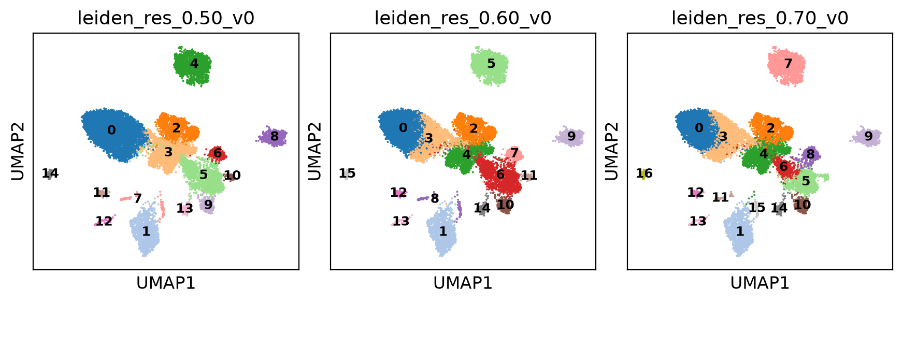

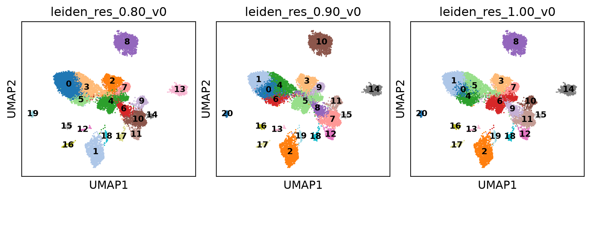

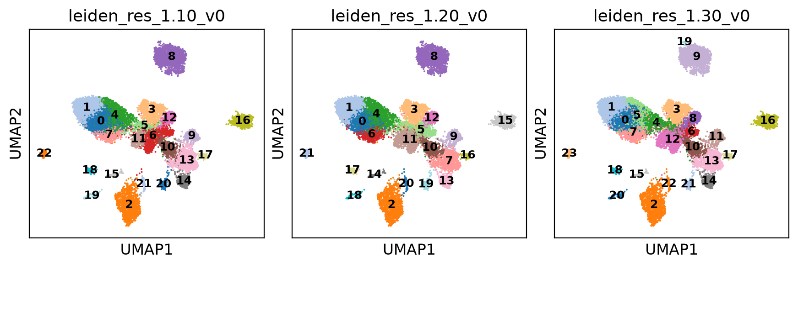

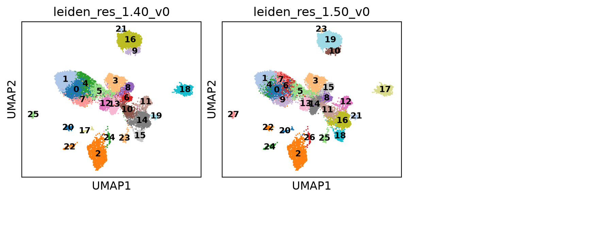

## Chosen resolution

``` python
wr_joyal_resolution = 1.0

leiden_key = f"leiden_res_{wr_joyal_resolution:.2f}_v0"
ranked_key = f"leiden_res_{wr_joyal_resolution:.2f}_v1"

cluster_sizes = wr_joyal.obs[leiden_key].value_counts()
ranked_labels = [str(rank) for rank in range(1, len(cluster_sizes) + 1)]
size_rank = dict(zip(cluster_sizes.index, ranked_labels))

wr_joyal.obs[ranked_key] = (
    wr_joyal.obs[leiden_key]
    .map(size_rank)
    .astype("category")
    .cat.reorder_categories(ranked_labels)
)

wr_joyal.uns[f"{ranked_key}_colors"] = [
    mcolors.to_hex(plt.cm.tab20.colors[(int(label) - 1) % 20]) for label in ranked_labels
]

print(f"{ranked_key}: {wr_joyal.obs[ranked_key].nunique()} clusters")
wr_joyal.obs[ranked_key].value_counts()
```

    leiden_res_1.00_v1: 21 clusters

    leiden_res_1.00_v1
    1     2494
    2     1768
    3     1493
    4     1484
    5     1227
    6      945
    7      911
    8      870
    9      785
    10     702
    11     700
    12     458
    13     362
    14     306
    15     148
    16     106
    17     103
    18      85
    19      76
    20      64
    21      56
    Name: count, dtype: int64

## Clusters on the UMAP

``` python
# scanpy builds the figure here, and takes no figsize argument, so rcParams is where its size
# has to be set
plt.rcParams["figure.figsize"] = (5.0, 4.3)

ax = sc.pl.umap(
    wr_joyal[draw_order],
    color=ranked_key,
    legend_loc="on data",
    legend_fontoutline=2,
    frameon=True,
    show=False,
)
ax.set_aspect("equal", adjustable="datalim")
plt.show()
```

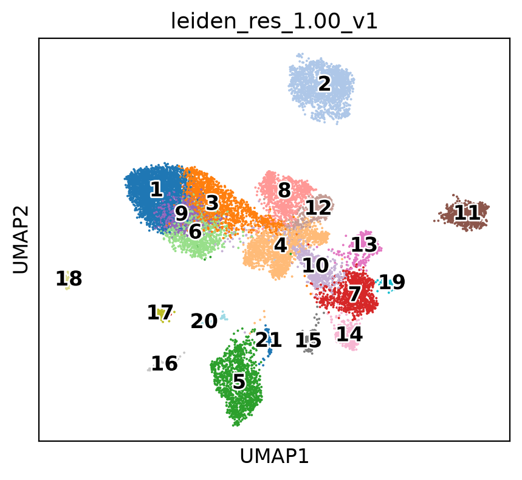

## QC metrics

``` python
qc_metrics = {
    "n_genes_by_log1p": "Genes detected",
    "total_log1p": "Total expression",
    "pct_log1p_mt": "% mitochondrial",
    "pct_log1p_ribo": "% ribosomal",
    "pct_log1p_hb": "% hemoglobin",
}
violin_inner_kws = {"box_width": 2, "whis_width": 1, "marker": "o",
                    "markersize": 3.0, "markeredgecolor": "white"}

qc_df = sc.get.obs_df(wr_joyal, keys=[ranked_key] + list(qc_metrics))
batch_color = wr_joyal.uns["batch_colors"][0]

fig, axes = plt.subplots(1, len(qc_metrics), squeeze=False, figsize=(9, 3.0),
                         constrained_layout=True)
for ax, (qc_key, qc_label) in zip(axes.flat, qc_metrics.items()):
    sns.violinplot(data=qc_df, y=qc_key, color=batch_color, cut=0, density_norm="width",
                   inner="box", inner_kws=violin_inner_kws, linewidth=0.5, ax=ax)
    ax.set_ylabel(qc_label, fontsize=9)
    ax.tick_params(axis="y", labelsize=8)
    ax.grid(axis="y", color="#b0b0b0", linewidth=0.6)
    ax.set_axisbelow(True)

plt.show()
plt.close(fig)
```


## QC metrics by cluster

``` python
# only scanpy reads the _colors entry out of uns, so the palette is handed to seaborn
# explicitly — otherwise a cluster changes color between the UMAP and these violins
cluster_palette = dict(zip(wr_joyal.obs[ranked_key].cat.categories, wr_joyal.uns[f"{ranked_key}_colors"]))

fig, axes = plt.subplots(len(qc_metrics), 1, squeeze=False, sharex=True, figsize=(9, 4.3),
                         constrained_layout=True)
for ax, (qc_key, qc_label) in zip(axes.flat, qc_metrics.items()):
    # dodge=False because hue repeats x: left on, seaborn gives each of the 21 clusters its
    # own sub-slot and every violin is drawn a twentieth of its slot wide, off its tick
    sns.violinplot(data=qc_df, x=ranked_key, y=qc_key, hue=ranked_key, palette=cluster_palette,
                   legend=False, dodge=False, cut=0, density_norm="width", inner="box",
                   inner_kws=violin_inner_kws, linewidth=0.5, saturation=1, ax=ax)

    # seaborn colours the bodies in an order that does not follow the x positions when hue
    # repeats x, so each is recoloured from the cluster it actually sits under. The order
    # comes off the categorical rather than the tick labels, which are empty on a shared axis.
    cluster_order = list(wr_joyal.obs[ranked_key].cat.categories)
    for body in ax.collections:
        extents = body.get_paths()[0].get_extents()
        body.set_facecolor(cluster_palette[cluster_order[round((extents.x0 + extents.x1) / 2)]])

    ax.set_ylabel(qc_label, fontsize=7)
    ax.set_xlabel("")
    ax.tick_params(axis="y", labelsize=6)
    ax.grid(axis="y", color="#b0b0b0", linewidth=0.6)
    ax.set_axisbelow(True)

axes[-1][0].set_xlabel("Cluster", fontsize=9)
axes[-1][0].tick_params(axis="x", labelsize=8)
plt.show()
plt.close(fig)
```

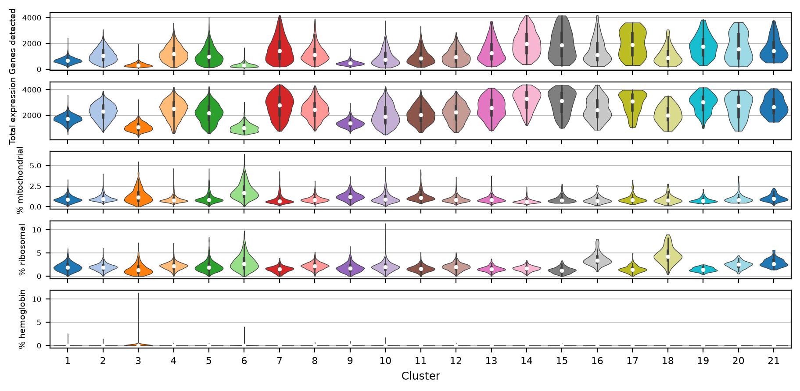

## Correlation with the reference

``` python
# correlated over the query's variable genes rather than everything shared: the
# housekeeping bulk is near-identical in every class and only lifts all twelve correlations
# together, flattening the differences the call is made on
feature_genes = [
    gene for gene in wr_joyal.var_names[wr_joyal.var["highly_variable"]]
    if gene in reference_centroids.var_names
]

cluster_profiles = pd.DataFrame(
    [
        np.asarray(
            wr_joyal[wr_joyal.obs[ranked_key] == cluster, feature_genes].X.mean(axis=0)
        ).ravel()
        for cluster in wr_joyal.obs[ranked_key].cat.categories
    ],
    index=wr_joyal.obs[ranked_key].cat.categories,
    columns=feature_genes,
)
reference_profiles = pd.DataFrame(
    reference_centroids[:, feature_genes].X,
    index=reference_centroids.obs_names,
    columns=feature_genes,
)

# Spearman, so a class is matched on the order it puts the genes in rather than on absolute
# levels — the two datasets were normalized by different pipelines. Ranking the rows and
# taking Pearson is the same thing, and does all 21 x 12 pairs in one call.
ranked_clusters = cluster_profiles.rank(axis=1)
ranked_reference = reference_profiles.rank(axis=1)
reference_correlation = pd.DataFrame(
    np.corrcoef(ranked_clusters, ranked_reference)[:len(ranked_clusters), len(ranked_clusters):],
    index=cluster_profiles.index,
    columns=reference_profiles.index,
)

print(f"{len(feature_genes)} of {int(wr_joyal.var['highly_variable'].sum())} "
      f"variable genes found in the reference")
reference_correlation.round(3)
```

    1618 of 2000 variable genes found in the reference

<div>
<style scoped>
    .dataframe tbody tr th:only-of-type {
        vertical-align: middle;
    }
&#10;    .dataframe tbody tr th {
        vertical-align: top;
    }
&#10;    .dataframe thead th {
        text-align: right;
    }
</style>

|  | AC | Astrocyte | BC | Cone | Endothelial | HC | MG | Microglia | Pericyte | RGC | RPE | Rod |
|----|----|----|----|----|----|----|----|----|----|----|----|----|
| 1 | 0.616 | 0.588 | 0.671 | 0.803 | 0.459 | 0.627 | 0.634 | 0.487 | 0.501 | 0.583 | 0.612 | 0.871 |
| 2 | 0.703 | 0.644 | 0.772 | 0.726 | 0.545 | 0.684 | 0.698 | 0.557 | 0.590 | 0.649 | 0.606 | 0.731 |
| 3 | 0.638 | 0.572 | 0.675 | 0.759 | 0.462 | 0.628 | 0.640 | 0.447 | 0.510 | 0.587 | 0.581 | 0.806 |
| 4 | 0.737 | 0.646 | 0.801 | 0.722 | 0.535 | 0.701 | 0.710 | 0.518 | 0.592 | 0.668 | 0.607 | 0.721 |
| 5 | 0.634 | 0.749 | 0.605 | 0.556 | 0.607 | 0.593 | 0.850 | 0.560 | 0.625 | 0.574 | 0.613 | 0.575 |
| 6 | 0.592 | 0.557 | 0.629 | 0.742 | 0.452 | 0.605 | 0.608 | 0.471 | 0.494 | 0.549 | 0.624 | 0.797 |
| 7 | 0.836 | 0.643 | 0.703 | 0.643 | 0.526 | 0.705 | 0.681 | 0.514 | 0.583 | 0.734 | 0.560 | 0.647 |
| 8 | 0.724 | 0.631 | 0.777 | 0.720 | 0.528 | 0.684 | 0.690 | 0.520 | 0.577 | 0.674 | 0.582 | 0.709 |
| 9 | 0.600 | 0.555 | 0.637 | 0.754 | 0.440 | 0.606 | 0.614 | 0.449 | 0.496 | 0.546 | 0.602 | 0.808 |
| 10 | 0.773 | 0.643 | 0.690 | 0.639 | 0.523 | 0.677 | 0.673 | 0.529 | 0.565 | 0.686 | 0.560 | 0.651 |
| 11 | 0.625 | 0.566 | 0.681 | 0.831 | 0.459 | 0.638 | 0.626 | 0.477 | 0.510 | 0.588 | 0.614 | 0.793 |
| 12 | 0.681 | 0.605 | 0.747 | 0.704 | 0.507 | 0.669 | 0.666 | 0.510 | 0.561 | 0.631 | 0.579 | 0.698 |
| 13 | 0.740 | 0.590 | 0.690 | 0.655 | 0.499 | 0.695 | 0.646 | 0.509 | 0.548 | 0.666 | 0.549 | 0.667 |
| 14 | 0.775 | 0.622 | 0.682 | 0.630 | 0.506 | 0.702 | 0.658 | 0.526 | 0.551 | 0.709 | 0.543 | 0.635 |
| 15 | 0.717 | 0.593 | 0.627 | 0.593 | 0.466 | 0.670 | 0.625 | 0.500 | 0.515 | 0.764 | 0.503 | 0.596 |
| 16 | 0.439 | 0.547 | 0.424 | 0.387 | 0.766 | 0.414 | 0.543 | 0.492 | 0.731 | 0.404 | 0.465 | 0.379 |
| 17 | 0.647 | 0.568 | 0.630 | 0.602 | 0.487 | 0.755 | 0.618 | 0.496 | 0.542 | 0.627 | 0.541 | 0.595 |
| 18 | 0.358 | 0.542 | 0.369 | 0.369 | 0.506 | 0.371 | 0.427 | 0.773 | 0.446 | 0.361 | 0.412 | 0.374 |
| 19 | 0.680 | 0.538 | 0.624 | 0.575 | 0.460 | 0.633 | 0.582 | 0.478 | 0.510 | 0.631 | 0.504 | 0.572 |
| 20 | 0.489 | 0.718 | 0.476 | 0.430 | 0.594 | 0.463 | 0.676 | 0.496 | 0.603 | 0.443 | 0.615 | 0.449 |
| 21 | 0.522 | 0.643 | 0.465 | 0.426 | 0.554 | 0.473 | 0.696 | 0.467 | 0.568 | 0.474 | 0.597 | 0.449 |

</div>

## Correlation with the reference by cluster

``` python
# the same matrix three ways, matching the marker heatmap. The raw correlations sit in a
# narrow band, so the two scaled panels are what can actually be read: down a column asks
# "which cluster is most this class", and across a row asks "which class best fits this
# cluster" — the annotation question, and the one the calls are taken from.
#
# only the row scaling is a call. A column's brightest cell is the best home for that class
# whether or not the class is present at all: RPE peaks on a rod cluster here, which says
# where it would land rather than that it was found.
class_range = reference_correlation.max(axis=0) - reference_correlation.min(axis=0)
scaled_by_class = reference_correlation.sub(
    reference_correlation.min(axis=0), axis=1
).div(class_range, axis=1)

correlation_range = reference_correlation.max(axis=1) - reference_correlation.min(axis=1)
scaled_correlation = reference_correlation.sub(
    reference_correlation.min(axis=1), axis=0
).div(correlation_range, axis=0)

correlation_panels = {
    "Spearman correlation": reference_correlation,
    "Scaled per class": scaled_by_class,
    "Scaled per cluster": scaled_correlation,
}

# walk the clusters in order and take each one's best class; a class already placed is
# skipped, and any class no cluster leads with is appended. The matches then read as a
# diagonal rather than being scattered across the panel.
class_order = []
for cluster in scaled_correlation.index:
    best = scaled_correlation.loc[cluster].idxmax()
    if best not in class_order:
        class_order.append(best)
class_order += [name for name in scaled_correlation.columns if name not in class_order]

fig, axes = plt.subplots(1, len(correlation_panels), squeeze=False, figsize=(9, 4.3),
                         constrained_layout=True)
for ax, (title, matrix) in zip(axes.flat, correlation_panels.items()):
    # xticklabels/yticklabels left at "auto" thins the labels to every other one once a
    # third panel is on the figure, which leaves half the classes unnamed
    sns.heatmap(matrix[class_order], cmap="viridis", linewidths=0.5, linecolor="white",
                xticklabels=True, yticklabels=True,
                cbar_kws={"shrink": 0.6, "pad": 0.02}, ax=ax)
    ax.set_title(title, fontsize=9)
    ax.set_xlabel("Reference class", fontsize=8)
    ax.set_ylabel("Cluster", fontsize=8)
    ax.tick_params(axis="x", labelrotation=45, labelsize=7)
    ax.tick_params(axis="y", labelrotation=0, labelsize=7)
    for label in ax.get_xticklabels():
        label.set_ha("right")

plt.show()
plt.close(fig)
```

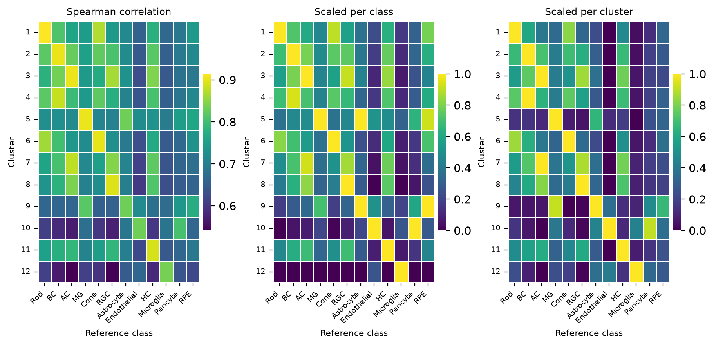

## Marker scores

``` python
retina_markers = {
    "Rods": ["Rho", "Pde6b", "Nrl", "Nr2e3"],
    "Cones": ["Opn1mw", "Opn1sw", "Arr3", "Thrb"],
    "RGC": ["Rbpms", "Sncg", "Pou4f1", "Pou4f2"],
    "Amacrine": ["Tfap2a", "Tfap2b", "Chat", "Vsx1"],
    "Bipolar": ["Vsx2", "Isl1", "Prkca", "Cabp5"],
    "Horizontal": ["Onecut1", "Onecut2", "Lhx1", "Prox1"],
    "Muller_Glia": ["Rlbp1", "Glul", "Sox9", "Slc1a3"],
    "Microglia": ["Cx3cr1", "P2ry12", "Tmem119", "Aif1"],
    "Vascular_Endothelial": ["Cdh5", "Pecam1", "Tek"],
    "Pericytes": ["Pdgfrb", "Acta2", "Des"],
    "Astrocytes": ["Gfap", "Aldh1l1", "Aqp4"],
}

score_keys = []
markers_present = {}
for cell_type, genes in retina_markers.items():
    present = [gene.upper() for gene in genes if gene.upper() in wr_joyal.var_names]
    score_key = f"score_{cell_type}"
    sc.tl.score_genes(wr_joyal, gene_list=present, score_name=score_key)
    score_keys.append(score_key)
    markers_present[cell_type] = present
    print(f"{cell_type}: {len(present)}/{len(genes)} markers")
```

    Rods: 4/4 markers
    Cones: 4/4 markers
    RGC: 4/4 markers
    Amacrine: 4/4 markers
    Bipolar: 4/4 markers
    Horizontal: 4/4 markers
    Muller_Glia: 4/4 markers
    Microglia: 4/4 markers
    Vascular_Endothelial: 3/3 markers
    Pericytes: 3/3 markers
    Astrocytes: 3/3 markers

## Marker scores by cluster

``` python
score_df = sc.get.obs_df(wr_joyal, keys=[ranked_key] + score_keys)

for start in range(0, len(score_keys), 6):
    group = score_keys[start:start + 6]
    group_types = list(retina_markers)[start:start + 6]

    fig, axes = plt.subplots(len(group), 1, squeeze=False, sharex=True, figsize=(9, 4.3),
                             constrained_layout=True)
    for ax, score_key, cell_type in zip(axes.flat, group, group_types):
        sns.violinplot(data=score_df, x=ranked_key, y=score_key, hue=ranked_key,
                       palette=cluster_palette, legend=False, dodge=False, cut=0,
                       density_norm="width", inner="box", inner_kws=violin_inner_kws,
                       linewidth=0.5, saturation=1, ax=ax)

        cluster_order = list(wr_joyal.obs[ranked_key].cat.categories)
        for body in ax.collections:
            extents = body.get_paths()[0].get_extents()
            body.set_facecolor(cluster_palette[cluster_order[round((extents.x0 + extents.x1) / 2)]])

        ax.set_ylabel(f"{cell_type.replace('_', ' ')} score", fontsize=7)
        ax.set_xlabel("")
        ax.tick_params(axis="y", labelsize=6)
        ax.grid(axis="y", color="#b0b0b0", linewidth=0.6)
        ax.set_axisbelow(True)

    axes[-1][0].set_xlabel("Cluster", fontsize=9)
    axes[-1][0].tick_params(axis="x", labelsize=8)
    plt.show()
    plt.close(fig)
```

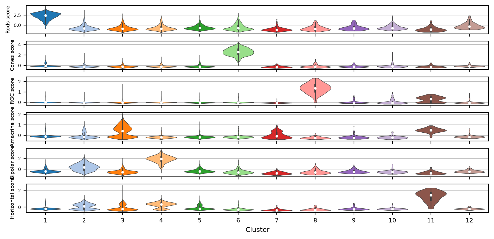

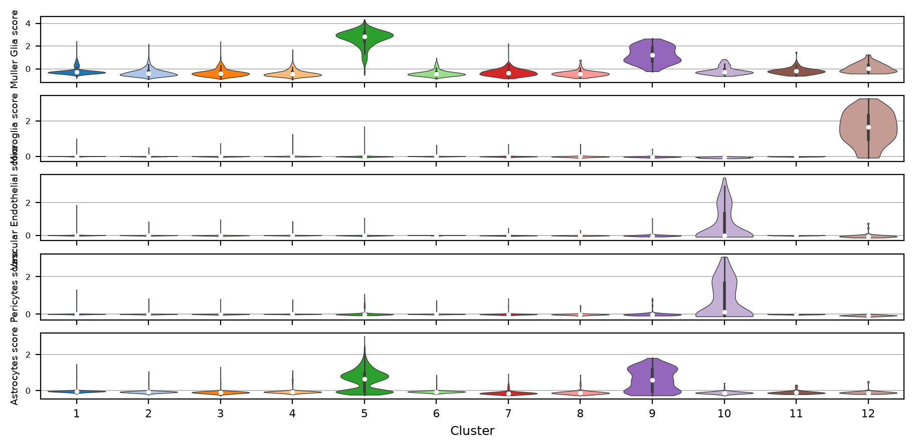

## Marker scores on the UMAP

``` python
for start in range(0, len(score_keys), 3):
    group = score_keys[start:start + 3]

    fig, axs = plt.subplots(2, 3, height_ratios=[1, 0.22], figsize=(8.6, 3.4),
                            constrained_layout=True)
    for ax, bar_ax, score_key in zip(axs[0], axs[1], group):
        sc.pl.umap(
            wr_joyal,
            color=score_key,
            ax=ax,
            frameon=True,
            colorbar_loc=None,
            show=False,
        )
        ax.set_aspect("equal", adjustable="datalim")

        # the strip reserves the space; the colorbar drawn inside it is excluded from the
        # layout so its tick labels cannot push the panel around
        bar_ax.axis("off")
        colorbar_ax = bar_ax.inset_axes([0.325, 0.82, 0.35, 0.18])
        colorbar_ax.set_in_layout(False)
        colorbar = fig.colorbar(ax.collections[0], cax=colorbar_ax, orientation="horizontal")

        # placed explicitly at the ends and middle: the automatic locator picks its own round
        # numbers per score, so the tick count and positions differ from panel to panel
        score_low, score_high = ax.collections[0].get_clim()
        colorbar_ticks = np.linspace(score_low, score_high, 3)
        colorbar.set_ticks(colorbar_ticks, labels=[f"{tick:.2f}" for tick in colorbar_ticks])
        colorbar.ax.tick_params(labelsize=7)

    for empty_ax in axs[0][len(group):]:
        fig.delaxes(empty_ax)
    for empty_bar_ax in axs[1][len(group):]:
        empty_bar_ax.axis("off")

    plt.show()
    plt.close(fig)
```

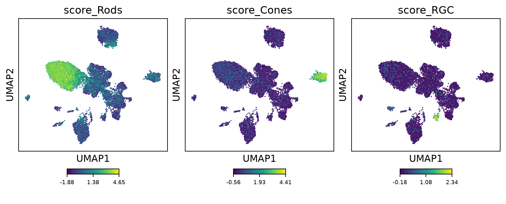

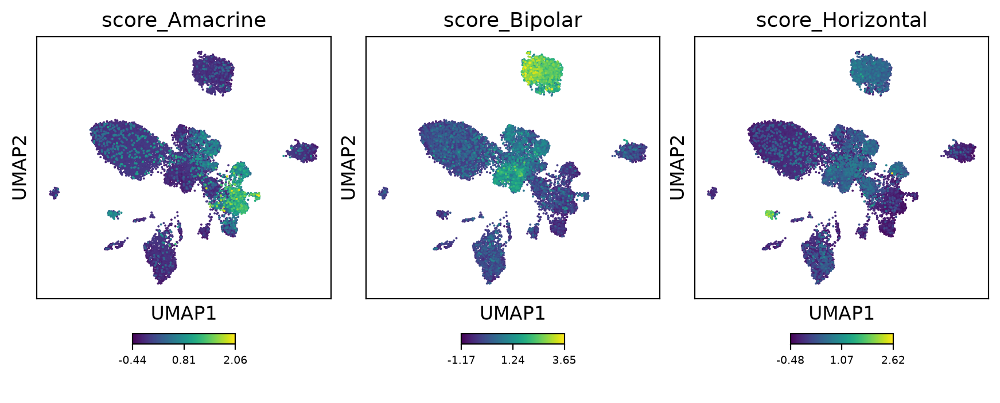

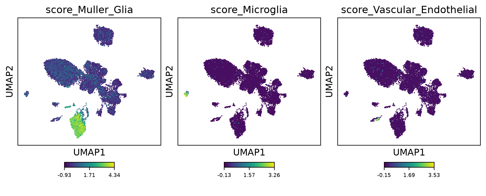

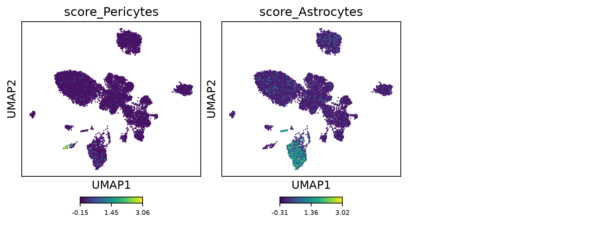

## Marker genes by cluster

``` python
# figsize is deliberately not passed: dotplot derives its own from the gene and cluster counts,
# and forcing it to slide dimensions packs 41 genes across 21 clusters until the dots overlap
sc.pl.dotplot(wr_joyal, markers_present, groupby=ranked_key, standard_scale="var")
```

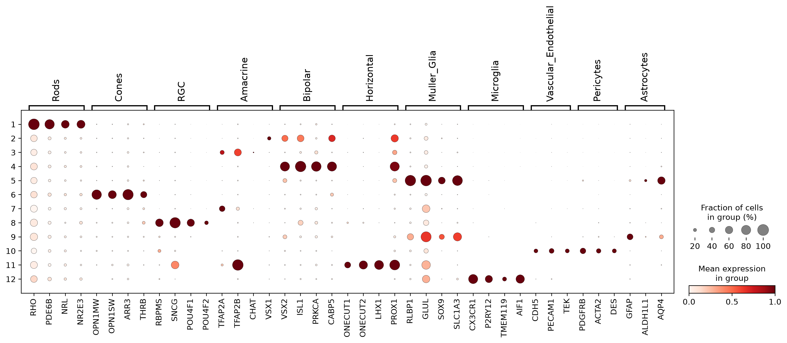

## Marker score heatmap

``` python
mean_scores = score_df.groupby(ranked_key, observed=True)[score_keys].mean()
mean_scores.columns = [cell_type.replace("_", " ") for cell_type in retina_markers]

# the same matrix three ways, because they answer different questions: the raw means show
# magnitude, scaling down a column asks "which cluster is most this cell type", and scaling
# across a row asks "which cell type best fits this cluster" — the annotation question
scaled_by_type = (mean_scores - mean_scores.min()) / (mean_scores.max() - mean_scores.min())
row_range = mean_scores.max(axis=1) - mean_scores.min(axis=1)
scaled_by_cluster = mean_scores.sub(mean_scores.min(axis=1), axis=0).div(row_range, axis=0)

score_normalizations = {
    "Mean score": mean_scores,
    "Scaled per cell type": scaled_by_type,
    "Scaled per cluster": scaled_by_cluster,
}

# walk the clusters in order and take each one's best cell type; a type already placed is
# skipped, and any type no cluster leads with is appended. The matches then read as a
# diagonal rather than being scattered across the panel.
column_order = []
for cluster in scaled_by_cluster.index:
    best = scaled_by_cluster.loc[cluster].idxmax()
    if best not in column_order:
        column_order.append(best)
column_order += [c for c in scaled_by_cluster.columns if c not in column_order]

fig, axes = plt.subplots(1, len(score_normalizations), squeeze=False, figsize=(9, 4.3),
                         constrained_layout=True)
for ax, (title, matrix) in zip(axes.flat, score_normalizations.items()):
    # as on the reference heatmap: left at "auto" the labels thin to every other one across
    # three panels, which leaves half the cell types and half the clusters unnamed
    sns.heatmap(matrix[column_order], cmap="viridis", linewidths=0.5, linecolor="white",
                xticklabels=True, yticklabels=True,
                cbar_kws={"shrink": 0.6, "pad": 0.02}, ax=ax)
    ax.set_title(title, fontsize=9)
    ax.set_xlabel("Cell type", fontsize=8)
    ax.set_ylabel("Cluster", fontsize=8)
    ax.tick_params(axis="x", labelrotation=45, labelsize=7)
    ax.tick_params(axis="y", labelrotation=0, labelsize=7)
    for label in ax.get_xticklabels():
        label.set_ha("right")

plt.show()
plt.close(fig)
```

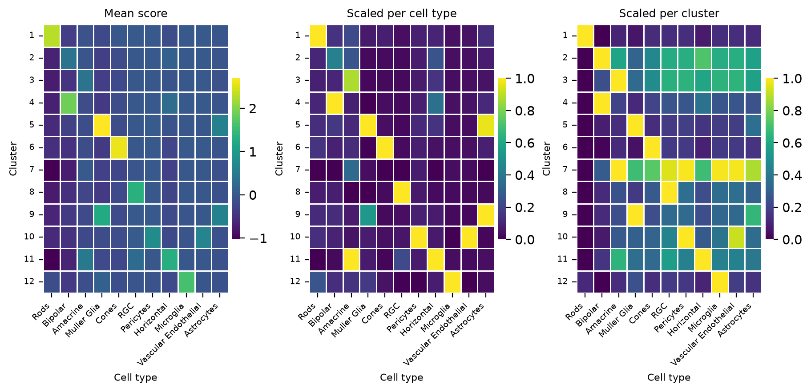

## Preliminary cell types

``` python
# the call is the best-correlating reference class. The marker scores stay in the document
# as an independent read on the same question — where the two disagree, the disagreement is
# the thing to look at before writing an override.
cluster_calls = reference_correlation.idxmax(axis=1)
marker_calls = mean_scores.idxmax(axis=1)

# every cluster called by hand after reading the heatmap and the dotplot above, so the sheet
# is exhaustive rather than a list of exceptions and the argmax above is fully shadowed. As
# written it ratifies the reference on all 21 clusters — including the two the marker panel
# reads differently, 10 (AC, not Horizontal: 702 cells is far too many for HC, and the
# panel's Prox1/Lhx1 are expressed in amacrine subsets) and 20 (Astrocyte, not Muller Glia).
# A cluster left out would fall back to its argmax.
cluster_call_overrides = {
    "1": "Rod",
    "2": "BC",
    "3": "Rod",
    "4": "BC",
    "5": "MG",
    "6": "Rod",
    "7": "AC",
    "8": "BC",
    "9": "Rod",
    "10": "AC",
    "11": "Cone",
    "12": "BC",
    "13": "AC",
    "14": "AC",
    "15": "RGC",
    "16": "Endothelial",
    "17": "HC",
    "18": "Microglia",
    "19": "AC",
    "20": "Astrocyte",
    "21": "MG",
}
cluster_calls.update(pd.Series(cluster_call_overrides))

wr_joyal.obs["cell_type"] = wr_joyal.obs[ranked_key].map(cluster_calls).astype("category")

# keyed on every class in the reference rather than only the ones called, so a cell type
# keeps its colour whatever a given resolution happens to find
cell_type_palette = dict(zip(sorted(reference_centroids.obs_names), sc.pl.palettes.default_20))
wr_joyal.uns["cell_type_colors"] = [
    cell_type_palette[cell_type] for cell_type in wr_joyal.obs["cell_type"].cat.categories
]

# margin is the gap to the runner-up class: a cluster called on a hair's difference is one
# to read the heatmap for, however high its correlation
sorted_correlation = np.sort(reference_correlation.to_numpy(), axis=1)

pd.DataFrame({
    "cell_type": cluster_calls,
    "cells": wr_joyal.obs[ranked_key].value_counts(),
    "correlation": reference_correlation.max(axis=1).round(3),
    "margin": (sorted_correlation[:, -1] - sorted_correlation[:, -2]).round(3),
    "marker call": marker_calls,
})
```

<div>
<style scoped>
    .dataframe tbody tr th:only-of-type {
        vertical-align: middle;
    }
&#10;    .dataframe tbody tr th {
        vertical-align: top;
    }
&#10;    .dataframe thead th {
        text-align: right;
    }
</style>

|     | cell_type   | cells | correlation | margin | marker call |
|-----|-------------|-------|-------------|--------|-------------|
| 1   | Rod         | 2494  | 0.871       | 0.067  | Rods        |
| 2   | BC          | 1768  | 0.772       | 0.040  | Bipolar     |
| 3   | Rod         | 1493  | 0.806       | 0.047  | Rods        |
| 4   | BC          | 1484  | 0.801       | 0.063  | Bipolar     |
| 5   | MG          | 1227  | 0.850       | 0.101  | Muller Glia |
| 6   | Rod         | 945   | 0.797       | 0.055  | Rods        |
| 7   | AC          | 911   | 0.836       | 0.102  | Amacrine    |
| 8   | BC          | 870   | 0.777       | 0.053  | Bipolar     |
| 9   | Rod         | 785   | 0.808       | 0.054  | Rods        |
| 10  | AC          | 702   | 0.773       | 0.083  | Horizontal  |
| 11  | Cone        | 700   | 0.831       | 0.038  | Cones       |
| 12  | BC          | 458   | 0.747       | 0.043  | Bipolar     |
| 13  | AC          | 362   | 0.740       | 0.045  | Amacrine    |
| 14  | AC          | 306   | 0.775       | 0.066  | Amacrine    |
| 15  | RGC         | 148   | 0.764       | 0.047  | RGC         |
| 16  | Endothelial | 106   | 0.766       | 0.035  | Pericytes   |
| 17  | HC          | 103   | 0.755       | 0.108  | Horizontal  |
| 18  | Microglia   | 85    | 0.773       | 0.232  | Microglia   |
| 19  | AC          | 76    | 0.680       | 0.047  | Amacrine    |
| 20  | Astrocyte   | 64    | 0.718       | 0.042  | Muller Glia |
| 21  | MG          | 56    | 0.696       | 0.053  | Muller Glia |

</div>

## Refining a call with the marker scores

``` python
# the reference calls a whole cluster one class, so a population that never forms its own
# cluster cannot be named — the vascular cells here are one cluster of 106 holding both
# endothelium and pericytes. Where the marker panel says a cluster holds two classes, the
# cells are split: each goes to whichever of the two scores is higher, provided that score
# clears zero. score_genes centres a score on a control gene set, so above zero means
# enriched above background; a cell clearing neither keeps the cluster's call rather than
# being sent one way on noise.
#
# the assignment itself has no threshold to choose — the two scores are compared against
# each other — but which clusters get split is gated below, because a disagreement between
# the reference and the panel is not on its own evidence that a cluster holds two things.

# the reference names classes and the marker panel names them differently; the two
# vocabularies have to be joined by hand, and everything else here is derived from the join
marker_to_class = {
    "Rods": "Rod",                          "Cones": "Cone",
    "RGC": "RGC",                           "Amacrine": "AC",
    "Bipolar": "BC",                        "Horizontal": "HC",
    "Muller_Glia": "MG",                    "Microglia": "Microglia",
    "Vascular_Endothelial": "Endothelial",
    "Pericytes": "Pericyte",                "Astrocytes": "Astrocyte",
}

# score_genes wrote score_<panel name>; mean_scores spaced the same names out for its axis
class_scores = {cls: f"score_{panel}" for panel, cls in marker_to_class.items()}
rival_calls = marker_calls.map(
    {panel.replace("_", " "): cls for panel, cls in marker_to_class.items()}
)

# a cluster is a candidate exactly when the reference and the panel name it differently: one
# of them is wrong, or — the case this chunk is for — the cluster holds both. The pair falls
# out of the disagreement, the call above being the parent and the panel's answer the child.
cluster_refinements = {
    cluster: (cluster_calls[cluster], rival_calls[cluster])
    for cluster in cluster_calls.index
    if cluster_calls[cluster] != rival_calls[cluster]
}

# a disagreement says where to look, not what to do: the panels are not on a common scale,
# so a panel of bright genes annexes cells from a dim one wherever the two are compared. The
# split is therefore only applied where the cluster actually looks like two populations.
#
# the test is the L in the scatter below, written as a number. In a mixed cluster the two
# scores trade off — a cell high on one is low on the other — so the rank correlation
# between them across the cluster runs negative. In one population with a depth gradient
# both scores rise and fall together and the correlation runs positive; cutting that at the
# diagonal halves a gradient at an arbitrary place rather than finding a boundary. Requiring
# both arms to be a real fraction of the cluster then throws out splits that shave off a
# handful of cells.
#
# the scores have to actually trade off, not merely fail to correlate: a cluster sitting at
# zero has the two scores independent of each other, which is a cloud rather than an L and
# says nothing about there being two populations in it. The vascular cluster runs -0.75 and
# the next candidate ten times weaker, so the cut is set between them rather than at zero.
max_tradeoff = -0.25
min_arm_cells = 10
min_arm_fraction = 0.05

split_diagnostics = []
for cluster, (parent_class, child_class) in cluster_refinements.items():
    in_cluster = (wr_joyal.obs[ranked_key] == cluster).to_numpy()
    parent_score = wr_joyal.obs[class_scores[parent_class]].to_numpy()
    child_score = wr_joyal.obs[class_scores[child_class]].to_numpy()

    reassigned = in_cluster & (child_score > parent_score) & (child_score > 0)
    n_cluster = int(in_cluster.sum())
    n_child = int(reassigned.sum())

    tradeoff = np.corrcoef(
        pd.Series(parent_score[in_cluster]).rank(),
        pd.Series(child_score[in_cluster]).rank(),
    )[0, 1]
    smallest_arm = min(n_child, n_cluster - n_child)
    applied = bool(
        tradeoff < max_tradeoff
        and smallest_arm >= max(min_arm_cells, min_arm_fraction * n_cluster)
    )

    if applied:
        if child_class not in wr_joyal.obs["cell_type"].cat.categories:
            wr_joyal.obs["cell_type"] = (
                wr_joyal.obs["cell_type"].cat.add_categories([child_class])
            )
        wr_joyal.obs.loc[reassigned, "cell_type"] = child_class

    split_diagnostics.append({
        "cluster": cluster,
        "parent": parent_class,
        "child": child_class,
        "cells": n_cluster,
        "would move": n_child,
        "tradeoff": round(tradeoff, 3),
        "applied": applied,
    })

# a rejected row is not a failure: the cluster keeps its whole-cluster call, and the row is
# the record of the panel having been overruled
print(pd.DataFrame(split_diagnostics).to_string(index=False))
split_applied = {row["cluster"]: row["applied"] for row in split_diagnostics}

# a class added above lands at the end of the categories, which would put it last on every
# axis downstream rather than in with the rest
wr_joyal.obs["cell_type"] = wr_joyal.obs["cell_type"].cat.remove_unused_categories()
wr_joyal.obs["cell_type"] = wr_joyal.obs["cell_type"].cat.reorder_categories(
    sorted(wr_joyal.obs["cell_type"].cat.categories)
)
wr_joyal.uns["cell_type_colors"] = [
    cell_type_palette[cell_type] for cell_type in wr_joyal.obs["cell_type"].cat.categories
]

wr_joyal.obs["cell_type"].value_counts()
```

    cluster      parent    child  cells  would move  tradeoff  applied
         10          AC       HC    702         284    -0.072    False
         16 Endothelial Pericyte    106          52    -0.747     True
         20   Astrocyte       MG     64          56     0.214    False

    cell_type
    Rod            5717
    BC             4580
    AC             2357
    MG             1283
    Cone            700
    RGC             148
    HC              103
    Microglia        85
    Astrocyte        64
    Endothelial      54
    Pericyte         52
    Name: count, dtype: int64

## Cells reassigned by marker score

``` python
# the two scores against each other, one panel per refinement. A cluster worth splitting
# looks like an L — each arm high on one score and flat on the other, with the middle
# empty. A diffuse cloud across the diagonal means the two classes are not separable this
# way, and the cluster should be left alone.
fig, axes = plt.subplots(1, len(cluster_refinements), squeeze=False,
                         figsize=(4.3 * len(cluster_refinements), 3.6),
                         constrained_layout=True)
for ax, (cluster, (parent_class, child_class)) in zip(axes.flat, cluster_refinements.items()):
    in_cluster = (wr_joyal.obs[ranked_key] == cluster).to_numpy()
    cluster_cells = sc.get.obs_df(
        wr_joyal,
        keys=[class_scores[parent_class], class_scores[child_class], "cell_type"],
    )[in_cluster]

    for called_class in [parent_class, child_class]:
        is_called = (cluster_cells["cell_type"] == called_class).to_numpy()
        ax.scatter(
            cluster_cells[class_scores[parent_class]][is_called],
            cluster_cells[class_scores[child_class]][is_called],
            s=14, c=cell_type_palette[called_class], linewidths=0,
            label=f"{called_class} ({is_called.sum()})",
        )

    # the decision boundary is the diagonal, which is the whole point of comparing the two
    # scores rather than cutting one of them at a number
    span = [
        cluster_cells[[class_scores[parent_class], class_scores[child_class]]].min().min(),
        cluster_cells[[class_scores[parent_class], class_scores[child_class]]].max().max(),
    ]
    ax.plot(span, span, color="#b0b0b0", linewidth=1.0, linestyle="--", zorder=0)

    verdict = "split" if split_applied[cluster] else "left whole"
    ax.set_title(f"Cluster {cluster} — {verdict}", fontsize=9)
    ax.set_xlabel(f"{parent_class} score", fontsize=8)
    ax.set_ylabel(f"{child_class} score", fontsize=8)
    ax.tick_params(labelsize=7)
    ax.legend(fontsize=7, frameon=False, loc="upper right")

plt.show()
plt.close(fig)
```

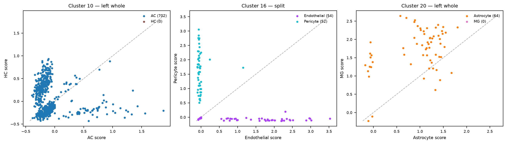

## Preliminary cell types on the UMAP

``` python
plt.rcParams["figure.figsize"] = (6.5, 4.3)

ax = sc.pl.umap(
    wr_joyal[draw_order],
    color="cell_type",
    frameon=True,
    show=False,
)
ax.set_aspect("equal", adjustable="datalim")
plt.show()
```

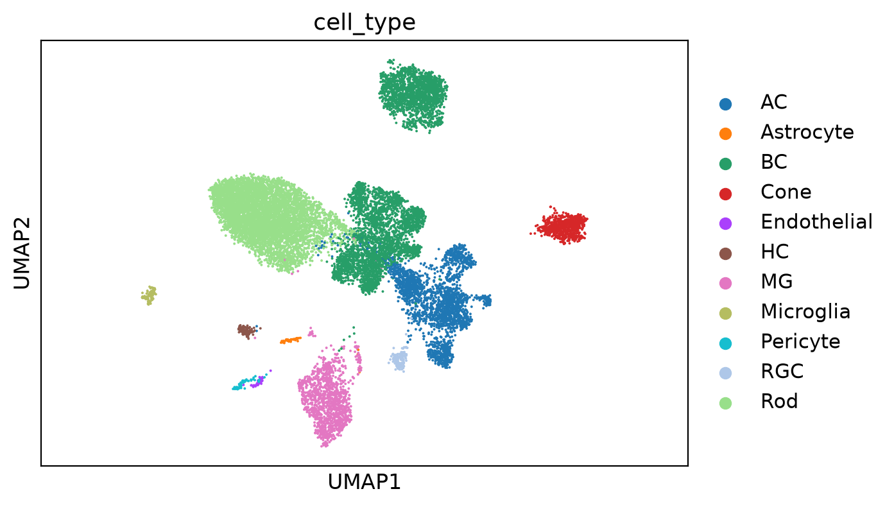

## Txn1 on the UMAP

``` python
fig, axs = plt.subplots(2, 1, height_ratios=[1, 0.22], figsize=(4.3, 3.9),
                        constrained_layout=True)

sc.pl.umap(wr_joyal, color="TXN1", ax=axs[0], frameon=True, colorbar_loc=None, show=False)
axs[0].set_aspect("equal", adjustable="datalim")

axs[1].axis("off")
colorbar_ax = axs[1].inset_axes([0.325, 0.82, 0.35, 0.18])
colorbar_ax.set_in_layout(False)
colorbar = fig.colorbar(axs[0].collections[0], cax=colorbar_ax, orientation="horizontal")

txn1_low, txn1_high = axs[0].collections[0].get_clim()
colorbar_ticks = np.linspace(txn1_low, txn1_high, 3)
colorbar.set_ticks(colorbar_ticks, labels=[f"{tick:.2f}" for tick in colorbar_ticks])
colorbar.ax.tick_params(labelsize=7)

plt.show()
plt.close(fig)
```

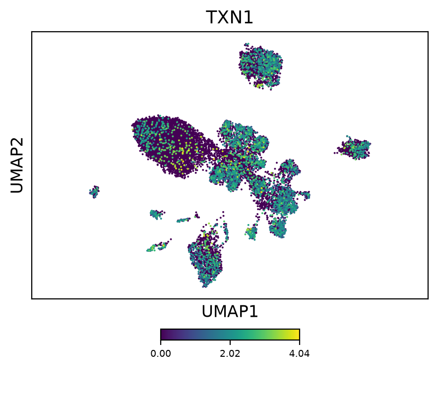

## Txn1 by cell type

``` python
txn1_df = sc.get.obs_df(wr_joyal, keys=["TXN1", "cell_type", "condition", "timepoint"])

fig, ax = plt.subplots(figsize=(9, 3.5), constrained_layout=True)
sns.violinplot(data=txn1_df, x="cell_type", y="TXN1", hue="cell_type",
               palette=cell_type_palette, legend=True, dodge=False, cut=0,
               density_norm="width", inner="box", inner_kws=violin_inner_kws,
               linewidth=0.5, saturation=1, ax=ax)

# with hue repeating x and dodge off, seaborn hands the bodies their colours in an order
# that does not follow the x positions — the legend ends up right and the violins wrong.
# Recolour each body from the cell type it actually sits under.
cell_type_order = list(wr_joyal.obs["cell_type"].cat.categories)
for body in ax.collections:
    extents = body.get_paths()[0].get_extents()
    body.set_facecolor(cell_type_palette[cell_type_order[round((extents.x0 + extents.x1) / 2)]])

ax.set_xlabel("")
ax.set_ylabel("Txn1 (log1p)", fontsize=9)
ax.tick_params(axis="x", labelrotation=45, labelsize=8)
ax.tick_params(axis="y", labelsize=8)
ax.grid(axis="y", color="#b0b0b0", linewidth=0.6)
ax.set_axisbelow(True)
for label in ax.get_xticklabels():
    label.set_ha("right")
ax.legend(title="", fontsize=7, frameon=False, loc="center left", bbox_to_anchor=(1.0, 0.5))

plt.show()
plt.close(fig)
```

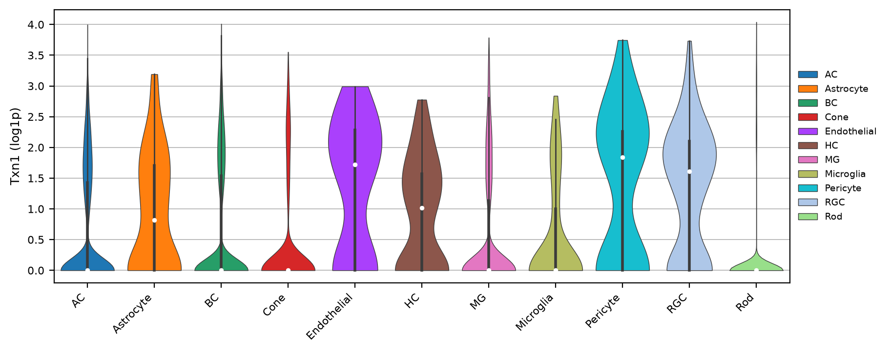

## Txn1 by cell type and condition

``` python
condition_palette = dict(zip(wr_joyal.obs["condition"].cat.categories,
                             wr_joyal.uns["condition_colors"]))

fig, ax = plt.subplots(figsize=(9, 3.5), constrained_layout=True)
sns.violinplot(data=txn1_df, x="cell_type", y="TXN1", hue="condition",
               palette=condition_palette, cut=0, density_norm="width", inner="box",
               inner_kws=violin_inner_kws, linewidth=0.5, ax=ax)
ax.set_xlabel("")
ax.set_ylabel("Txn1 (log1p)", fontsize=9)
ax.tick_params(axis="x", labelrotation=45, labelsize=8)
ax.tick_params(axis="y", labelsize=8)
ax.grid(axis="y", color="#b0b0b0", linewidth=0.6)
ax.set_axisbelow(True)
for label in ax.get_xticklabels():
    label.set_ha("right")
ax.legend(title="", fontsize=7, frameon=False, loc="center left", bbox_to_anchor=(1.0, 0.5))

plt.show()
plt.close(fig)
```

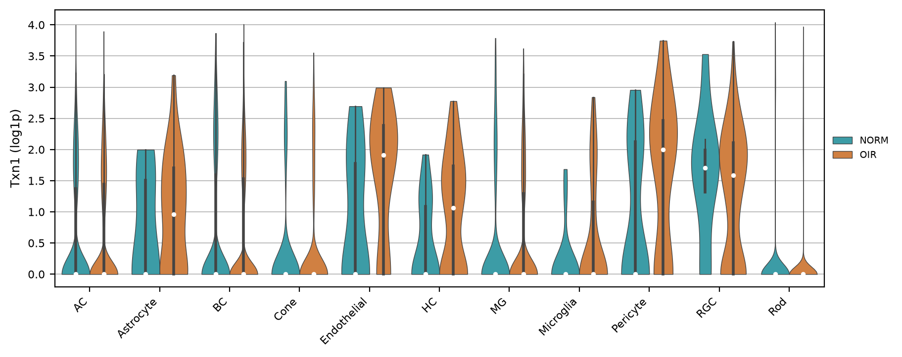

## Txn1 by cell type and timepoint

``` python
timepoint_palette = dict(zip(wr_joyal.obs["timepoint"].cat.categories,
                             wr_joyal.uns["timepoint_colors"]))

fig, ax = plt.subplots(figsize=(9, 3.5), constrained_layout=True)
sns.violinplot(data=txn1_df, x="cell_type", y="TXN1", hue="timepoint",
               palette=timepoint_palette, cut=0, density_norm="width", inner="box",
               inner_kws=violin_inner_kws, linewidth=0.5, ax=ax)
ax.set_xlabel("")
ax.set_ylabel("Txn1 (log1p)", fontsize=9)
ax.tick_params(axis="x", labelrotation=45, labelsize=8)
ax.tick_params(axis="y", labelsize=8)
ax.grid(axis="y", color="#b0b0b0", linewidth=0.6)
ax.set_axisbelow(True)
for label in ax.get_xticklabels():
    label.set_ha("right")
ax.legend(title="", fontsize=7, frameon=False, loc="center left", bbox_to_anchor=(1.0, 0.5))

plt.show()
plt.close(fig)
```

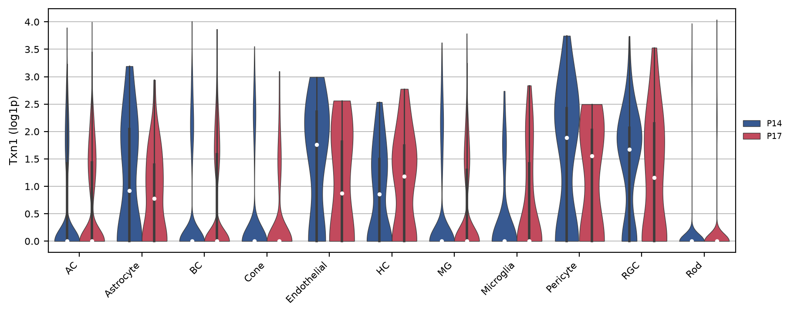

## Txn1 across the design

``` python
# laid out like the violin slides below: timepoint down the rows, condition across the
# columns, so the same comparison sits in the same direction in every Txn1 figure
condition_order = list(wr_joyal.obs["condition"].cat.categories)
timepoints = list(wr_joyal.obs["timepoint"].cat.categories)

umap_coords = wr_joyal.obsm["X_umap"]
txn1 = sc.get.obs_df(wr_joyal, keys=["TXN1"])["TXN1"].to_numpy()
txn1_low, txn1_high = txn1.min(), txn1.max()

# drawn with scatter rather than sc.pl.umap: it puts the whole embedding underneath in grey,
# and it fixes the point size, which scanpy scales by cell count — the sparse panels would
# otherwise carry much larger points than the dense ones.
fig, axes = plt.subplots(len(timepoints), len(condition_order), squeeze=False,
                         figsize=(5.6, 4.4), constrained_layout=True)
fig.get_layout_engine().set(w_pad=0.01, h_pad=0.01, wspace=0.01, hspace=0.02)
for row, timepoint in enumerate(timepoints):
    for column, condition in enumerate(condition_order):
        ax = axes[row][column]
        in_stratum = (
            (wr_joyal.obs["timepoint"] == timepoint) & (wr_joyal.obs["condition"] == condition)
        ).to_numpy()

        # every cell in grey, so each panel is read against the same outline rather than
        # appearing to be a differently-shaped dataset
        ax.scatter(umap_coords[:, 0], umap_coords[:, 1], s=1, c="#bfbfbf", linewidths=0)
        points = ax.scatter(umap_coords[in_stratum, 0], umap_coords[in_stratum, 1], s=1,
                            c=txn1[in_stratum], cmap="viridis",
                            vmin=txn1_low, vmax=txn1_high, linewidths=0)

        ax.set_aspect("equal", adjustable="datalim")
        ax.set_ylabel(f"Txn1 — {timepoint}" if column == 0 else "", fontsize=8)
        ax.set_title(condition if row == 0 else "", fontsize=9)
        ax.text(0.02, 0.98, f"n={in_stratum.sum():,}", transform=ax.transAxes,
                va="top", ha="left", fontsize=7)
        ax.set_xticks([])
        ax.set_yticks([])

colorbar = fig.colorbar(points, ax=axes, location="right", shrink=0.35, pad=0.02, aspect=25)
colorbar_ticks = np.linspace(txn1_low, txn1_high, 3)
colorbar.set_ticks(colorbar_ticks, labels=[f"{tick:.2f}" for tick in colorbar_ticks])
colorbar.ax.tick_params(labelsize=7)

plt.show()
plt.close(fig)
```

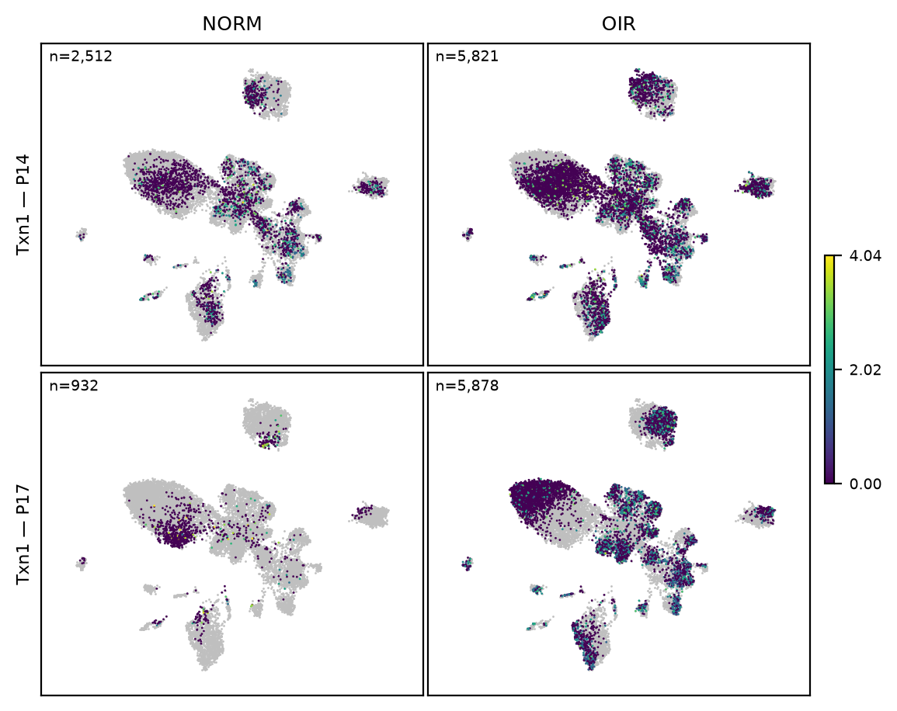

## Txn1 by cell type across the design

``` python
cell_type_order = list(wr_joyal.obs["cell_type"].cat.categories)
condition_order = list(wr_joyal.obs["condition"].cat.categories)
timepoints = list(wr_joyal.obs["timepoint"].cat.categories)

# grouped violins rather than four panels: NORM and OIR sit side by side within each cell
# type's slot, so the comparison is a glance rather than a jump between figures. Timepoint is
# the facet, which leaves the interaction readable down a column.
fig, axes = plt.subplots(len(timepoints), 1, squeeze=False, sharex=True, sharey=True,
                         figsize=(9, 5.0), constrained_layout=True)
for row, (ax, timepoint) in enumerate(zip(axes.flat, timepoints)):
    at_timepoint = txn1_df[txn1_df["timepoint"] == timepoint]
    sns.violinplot(data=at_timepoint, x="cell_type", y="TXN1", order=cell_type_order,
                   hue="condition", hue_order=condition_order, palette=condition_palette,
                   gap=0.1, cut=0, density_norm="width", inner="box",
                   inner_kws=violin_inner_kws, linewidth=0.5, saturation=1,
                   legend=(row == 0), ax=ax)
    ax.set_ylabel(f"Txn1 — {timepoint}", fontsize=8)
    ax.set_xlabel("")
    ax.tick_params(axis="y", labelsize=6)
    ax.grid(axis="y", color="#b0b0b0", linewidth=0.6)
    ax.set_axisbelow(True)
    sns.despine(ax=ax)

axes[0][0].legend(title="", fontsize=7, frameon=False,
                  loc="center left", bbox_to_anchor=(1.0, 0.5))
axes[-1][0].tick_params(axis="x", labelrotation=45, labelsize=8)
for label in axes[-1][0].get_xticklabels():
    label.set_ha("right")

plt.show()
plt.close(fig)
```

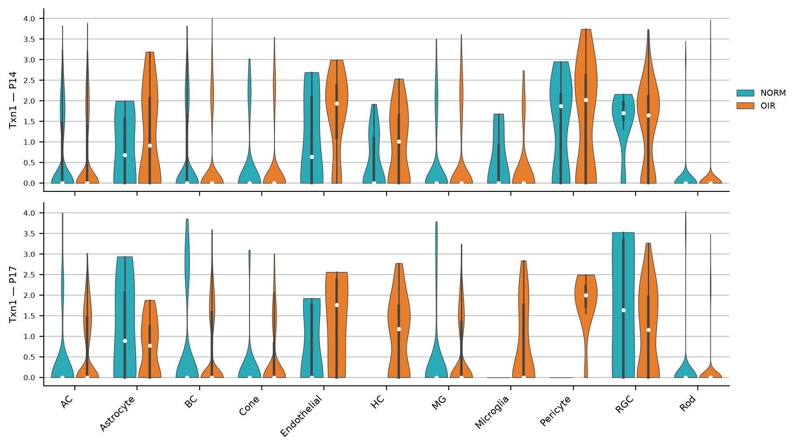

## Txn1 by cell type across the design, grouped by timepoint

``` python
timepoint_palette = dict(zip(wr_joyal.obs["timepoint"].cat.categories,
                             wr_joyal.uns["timepoint_colors"]))

# the same data with the roles swapped: P14 and P17 side by side within each cell type, and
# condition as the facet. Reading down a column here compares the two timepoints within a
# condition, where the plot above compares the two conditions within a timepoint.
fig, axes = plt.subplots(len(condition_order), 1, squeeze=False, sharex=True, sharey=True,
                         figsize=(9, 5.0), constrained_layout=True)
for row, (ax, condition) in enumerate(zip(axes.flat, condition_order)):
    in_condition = txn1_df[txn1_df["condition"] == condition]
    sns.violinplot(data=in_condition, x="cell_type", y="TXN1", order=cell_type_order,
                   hue="timepoint", hue_order=timepoints, palette=timepoint_palette,
                   gap=0.1, cut=0, density_norm="width", inner="box",
                   inner_kws=violin_inner_kws, linewidth=0.5, saturation=1,
                   legend=(row == 0), ax=ax)
    ax.set_ylabel(f"Txn1 — {condition}", fontsize=8)
    ax.set_xlabel("")
    ax.tick_params(axis="y", labelsize=6)
    ax.grid(axis="y", color="#b0b0b0", linewidth=0.6)
    ax.set_axisbelow(True)
    sns.despine(ax=ax)

axes[0][0].legend(title="", fontsize=7, frameon=False,
                  loc="center left", bbox_to_anchor=(1.0, 0.5))
axes[-1][0].tick_params(axis="x", labelrotation=45, labelsize=8)
for label in axes[-1][0].get_xticklabels():
    label.set_ha("right")

plt.show()
plt.close(fig)
```

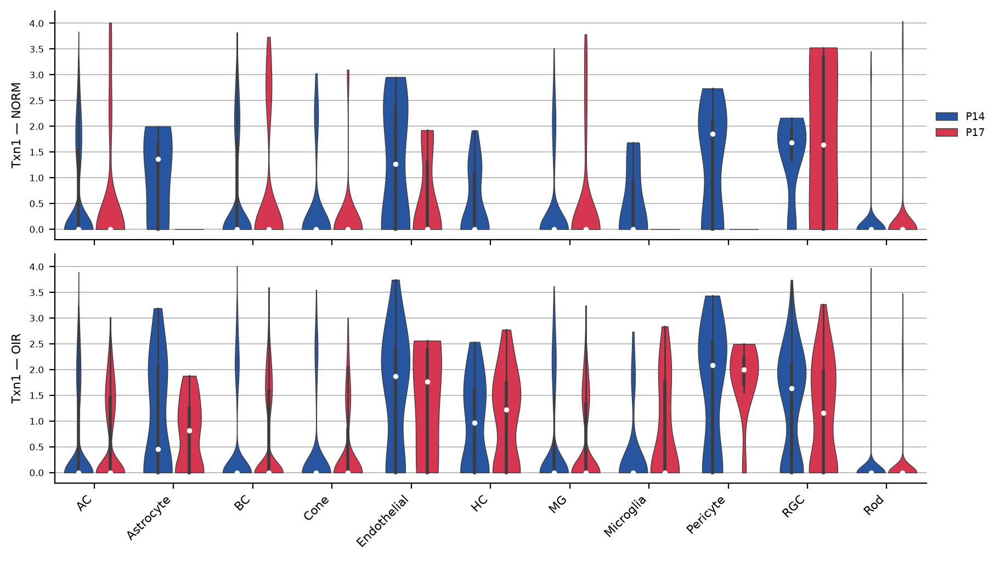

# Cd73ft_Joyal

## Cluster Cd73ft_Joyal

``` python
cd73ft_joyal_clustered_path = Path("data/processed/GSE150703_adata_Cd73ft_Joyal_clustered.h5ad")

if cd73ft_joyal_clustered_path.exists():
    cd73ft_joyal = sc.read_h5ad(cd73ft_joyal_clustered_path)
else:
    cd73ft_joyal = adata[adata.obs["batch"] == "Cd73ft_Joyal"].copy()

    for column in ["condition", "timepoint", "sort", "lab", "replicate", "batch"]:
        cd73ft_joyal.obs[column] = cd73ft_joyal.obs[column].cat.remove_unused_categories()

    cd73ft_joyal.var["mt"] = cd73ft_joyal.var_names.str.startswith("MT-")
    cd73ft_joyal.var["ribo"] = cd73ft_joyal.var_names.str.startswith(("RPS", "RPL"))
    cd73ft_joyal.var["hb"] = cd73ft_joyal.var_names.str.startswith(("HBA-", "HBB-"))
    sc.pp.calculate_qc_metrics(
        cd73ft_joyal,
        qc_vars=["mt", "ribo", "hb"],
        expr_type="log1p",
        percent_top=None,
        log1p=False,
        inplace=True,
    )

    sc.pp.filter_genes(cd73ft_joyal, min_cells=3)
    sc.pp.highly_variable_genes(cd73ft_joyal, n_top_genes=2000, flavor="seurat")
    sc.pp.pca(cd73ft_joyal, svd_solver="arpack")
    sc.pp.neighbors(cd73ft_joyal, n_neighbors=10, n_pcs=40)
    sc.tl.umap(cd73ft_joyal)

    for resolution in [0.5, 0.6, 0.7, 0.8, 0.9, 1.0, 1.1, 1.2, 1.3, 1.4, 1.5]:
        sc.tl.leiden(
            cd73ft_joyal,
            resolution=resolution,
            key_added=f"leiden_res_{resolution:.2f}_v0",
            flavor="igraph",
            random_state=0,
        )

    cd73ft_joyal.write_h5ad(cd73ft_joyal_clustered_path)

cd73ft_joyal
```

    AnnData object with n_obs × n_vars = 10329 × 18098
        obs: 'condition', 'timepoint', 'sort', 'lab', 'replicate', 'batch', 'n_genes_by_log1p', 'total_log1p', 'total_log1p_mt', 'pct_log1p_mt', 'total_log1p_ribo', 'pct_log1p_ribo', 'total_log1p_hb', 'pct_log1p_hb', 'leiden_res_0.50_v0', 'leiden_res_0.60_v0', 'leiden_res_0.70_v0', 'leiden_res_0.80_v0', 'leiden_res_0.90_v0', 'leiden_res_1.00_v0', 'leiden_res_1.10_v0', 'leiden_res_1.20_v0', 'leiden_res_1.30_v0', 'leiden_res_1.40_v0', 'leiden_res_1.50_v0'
        var: 'mt', 'ribo', 'hb', 'n_cells_by_log1p', 'mean_log1p', 'pct_dropout_by_log1p', 'total_log1p', 'n_cells', 'highly_variable', 'means', 'dispersions', 'dispersions_norm'
        uns: 'hvg', 'leiden_res_0.50_v0', 'leiden_res_0.60_v0', 'leiden_res_0.70_v0', 'leiden_res_0.80_v0', 'leiden_res_0.90_v0', 'leiden_res_1.00_v0', 'leiden_res_1.10_v0', 'leiden_res_1.20_v0', 'leiden_res_1.30_v0', 'leiden_res_1.40_v0', 'leiden_res_1.50_v0', 'neighbors', 'pca', 'umap'
        obsm: 'X_pca', 'X_umap'
        varm: 'PCs'
        obsp: 'connectivities', 'distances'
        layers: None (.X)

``` python
obs_palettes = {
    "condition": {"NORM": "#2AABB8", "OIR": "#E87D2A"},
    "timepoint": {"P14": "#2855A0", "P17": "#D63650"},
    "sort":      {"Cd73ft": "#C9A227", "WR": "#5DB85D"},
    "lab":       {"Joyal": "#7B4FB5", "Mccarrol": "#A0522D"},
    "batch":     {"Cd73ft_Joyal": "#C9A227", "WR_Joyal": "#5DB85D", "WR_Mccarrol": "#A0522D"},
}

for obs_key, palette in obs_palettes.items():
    categories = cd73ft_joyal.obs[obs_key].cat.categories
    cd73ft_joyal.uns[f"{obs_key}_colors"] = [palette[category] for category in categories]

# cells are drawn in this order, so whatever comes last sits on top. Shuffled, because the
# matrix order is the order cells came off the sequencer and it buries whole clusters under
# their neighbours. To put particular clusters on top instead, sort by the cluster column:
#   draw_order = cd73ft_joyal.obs[ranked_key].sort_values(ascending=False).index
draw_order = np.random.default_rng(0).permutation(cd73ft_joyal.n_obs)

resolution_keys = [column for column in cd73ft_joyal.obs.columns if column.endswith("_v0")]

for leiden_key_v0 in resolution_keys:
    categories = cd73ft_joyal.obs[leiden_key_v0].cat.categories
    cd73ft_joyal.uns[f"{leiden_key_v0}_colors"] = [
        mcolors.to_hex(plt.cm.tab20.colors[int(category) % 20]) for category in categories
    ]
```

## Leiden sweep

``` python
for start in range(0, len(resolution_keys), 3):
    group = resolution_keys[start:start + 3]

    # the second row is the colorbar strip the score UMAPs use. It is reserved here too,
    # and left empty, so both sets of panels have identical geometry and superimpose.
    fig, axs = plt.subplots(2, 3, height_ratios=[1, 0.22], figsize=(8.6, 3.4),
                            constrained_layout=True)
    for ax, leiden_key_v0 in zip(axs[0], group):
        sc.pl.umap(
            cd73ft_joyal[draw_order],
            color=leiden_key_v0,
            ax=ax,
            legend_loc="on data",
            legend_fontsize=9,
            frameon=True,
            show=False,
        )
        ax.set_aspect("equal", adjustable="datalim")

    for bar_ax in axs[1]:
        bar_ax.axis("off")

    for empty_ax in axs[0][len(group):]:
        fig.delaxes(empty_ax)

    plt.show()
    plt.close(fig)
```

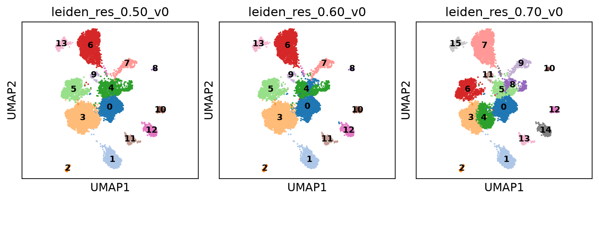

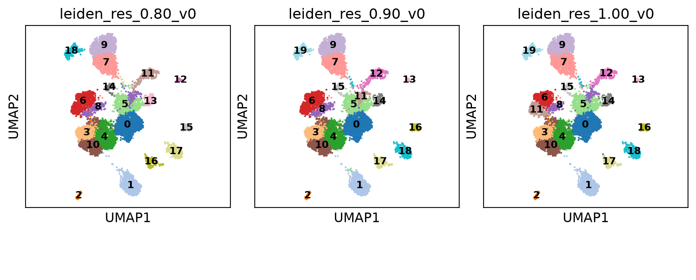

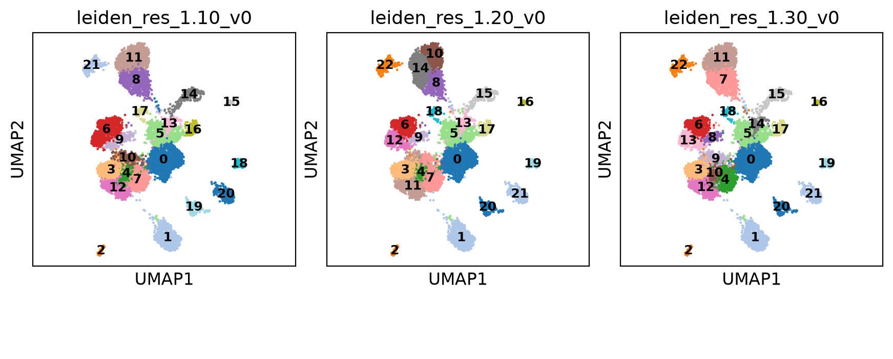

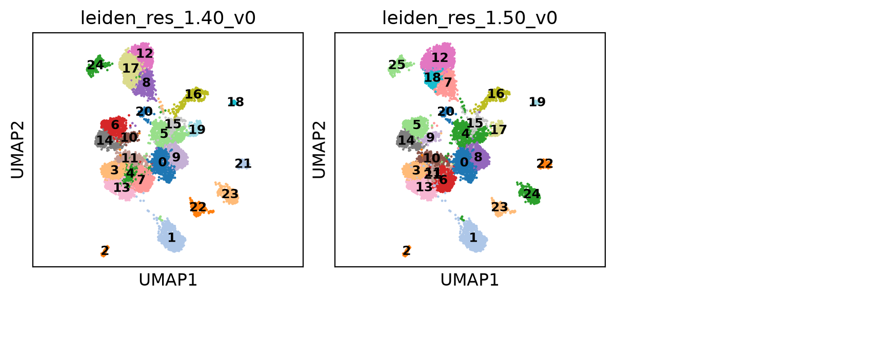

## Chosen resolution

``` python
cd73ft_joyal_resolution = 1.0

leiden_key = f"leiden_res_{cd73ft_joyal_resolution:.2f}_v0"
ranked_key = f"leiden_res_{cd73ft_joyal_resolution:.2f}_v1"

cluster_sizes = cd73ft_joyal.obs[leiden_key].value_counts()
ranked_labels = [str(rank) for rank in range(1, len(cluster_sizes) + 1)]
size_rank = dict(zip(cluster_sizes.index, ranked_labels))

cd73ft_joyal.obs[ranked_key] = (
    cd73ft_joyal.obs[leiden_key]
    .map(size_rank)
    .astype("category")
    .cat.reorder_categories(ranked_labels)
)

cd73ft_joyal.uns[f"{ranked_key}_colors"] = [
    mcolors.to_hex(plt.cm.tab20.colors[(int(label) - 1) % 20]) for label in ranked_labels
]

print(f"{ranked_key}: {cd73ft_joyal.obs[ranked_key].nunique()} clusters")
cd73ft_joyal.obs[ranked_key].value_counts()
```

    leiden_res_1.00_v1: 20 clusters

    leiden_res_1.00_v1
    1     1277
    2     1267
    3      996
    4      908
    5      820
    6      773
    7      742
    8      689
    9      635
    10     439
    11     305
    12     300
    13     285
    14     215
    15     196
    16     125
    17     121
    18     113
    19      80
    20      43
    Name: count, dtype: int64

## Clusters on the UMAP

``` python
# scanpy builds the figure here, and takes no figsize argument, so rcParams is where its size
# has to be set
plt.rcParams["figure.figsize"] = (5.0, 4.3)

ax = sc.pl.umap(
    cd73ft_joyal[draw_order],
    color=ranked_key,
    legend_loc="on data",
    legend_fontoutline=2,
    frameon=True,
    show=False,
)
ax.set_aspect("equal", adjustable="datalim")
plt.show()
```

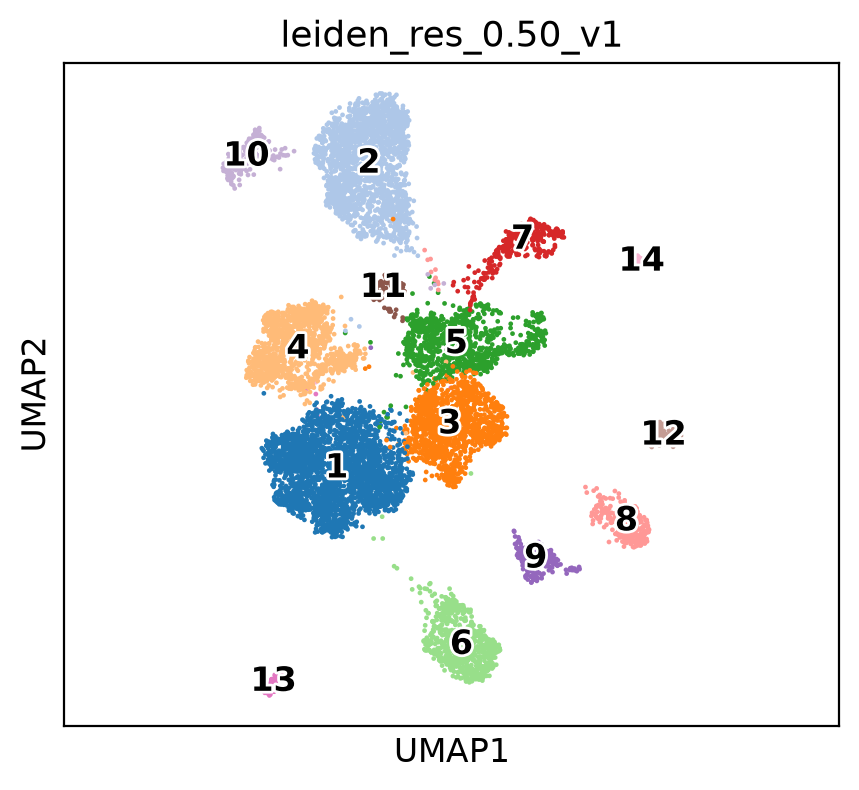

## QC metrics

``` python
qc_metrics = {
    "n_genes_by_log1p": "Genes detected",
    "total_log1p": "Total expression",
    "pct_log1p_mt": "% mitochondrial",
    "pct_log1p_ribo": "% ribosomal",
    "pct_log1p_hb": "% hemoglobin",
}
violin_inner_kws = {"box_width": 2, "whis_width": 1, "marker": "o",
                    "markersize": 3.0, "markeredgecolor": "white"}

qc_df = sc.get.obs_df(cd73ft_joyal, keys=[ranked_key] + list(qc_metrics))
batch_color = cd73ft_joyal.uns["batch_colors"][0]

fig, axes = plt.subplots(1, len(qc_metrics), squeeze=False, figsize=(9, 3.0),
                         constrained_layout=True)
for ax, (qc_key, qc_label) in zip(axes.flat, qc_metrics.items()):
    sns.violinplot(data=qc_df, y=qc_key, color=batch_color, cut=0, density_norm="width",
                   inner="box", inner_kws=violin_inner_kws, linewidth=0.5, ax=ax)
    ax.set_ylabel(qc_label, fontsize=9)
    ax.tick_params(axis="y", labelsize=8)
    ax.grid(axis="y", color="#b0b0b0", linewidth=0.6)
    ax.set_axisbelow(True)

plt.show()
plt.close(fig)
```

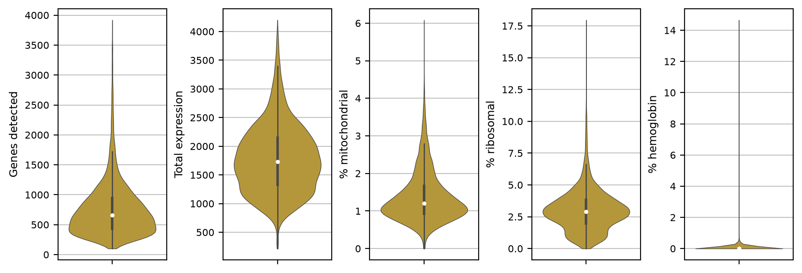

## QC metrics by cluster

``` python
# only scanpy reads the _colors entry out of uns, so the palette is handed to seaborn
# explicitly — otherwise a cluster changes color between the UMAP and these violins
cluster_palette = dict(zip(cd73ft_joyal.obs[ranked_key].cat.categories, cd73ft_joyal.uns[f"{ranked_key}_colors"]))

fig, axes = plt.subplots(len(qc_metrics), 1, squeeze=False, sharex=True, figsize=(9, 4.3),
                         constrained_layout=True)
for ax, (qc_key, qc_label) in zip(axes.flat, qc_metrics.items()):
    # dodge=False because hue repeats x: left on, seaborn gives each of the 21 clusters its
    # own sub-slot and every violin is drawn a twentieth of its slot wide, off its tick
    sns.violinplot(data=qc_df, x=ranked_key, y=qc_key, hue=ranked_key, palette=cluster_palette,
                   legend=False, dodge=False, cut=0, density_norm="width", inner="box",
                   inner_kws=violin_inner_kws, linewidth=0.5, saturation=1, ax=ax)

    # seaborn colours the bodies in an order that does not follow the x positions when hue
    # repeats x, so each is recoloured from the cluster it actually sits under. The order
    # comes off the categorical rather than the tick labels, which are empty on a shared axis.
    cluster_order = list(cd73ft_joyal.obs[ranked_key].cat.categories)
    for body in ax.collections:
        extents = body.get_paths()[0].get_extents()
        body.set_facecolor(cluster_palette[cluster_order[round((extents.x0 + extents.x1) / 2)]])

    ax.set_ylabel(qc_label, fontsize=7)
    ax.set_xlabel("")
    ax.tick_params(axis="y", labelsize=6)
    ax.grid(axis="y", color="#b0b0b0", linewidth=0.6)
    ax.set_axisbelow(True)

axes[-1][0].set_xlabel("Cluster", fontsize=9)
axes[-1][0].tick_params(axis="x", labelsize=8)
plt.show()
plt.close(fig)
```

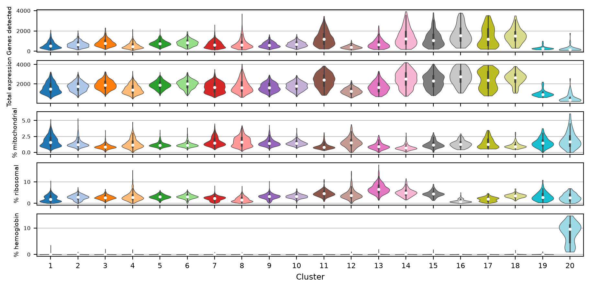

## Correlation with the reference

``` python
# correlated over the query's variable genes rather than everything shared: the
# housekeeping bulk is near-identical in every class and only lifts all twelve correlations
# together, flattening the differences the call is made on
feature_genes = [
    gene for gene in cd73ft_joyal.var_names[cd73ft_joyal.var["highly_variable"]]
    if gene in reference_centroids.var_names
]

cluster_profiles = pd.DataFrame(
    [
        np.asarray(
            cd73ft_joyal[cd73ft_joyal.obs[ranked_key] == cluster, feature_genes].X.mean(axis=0)
        ).ravel()
        for cluster in cd73ft_joyal.obs[ranked_key].cat.categories
    ],
    index=cd73ft_joyal.obs[ranked_key].cat.categories,
    columns=feature_genes,
)
reference_profiles = pd.DataFrame(
    reference_centroids[:, feature_genes].X,
    index=reference_centroids.obs_names,
    columns=feature_genes,
)

# Spearman, so a class is matched on the order it puts the genes in rather than on absolute
# levels — the two datasets were normalized by different pipelines. Ranking the rows and
# taking Pearson is the same thing, and does all 21 x 12 pairs in one call.
ranked_clusters = cluster_profiles.rank(axis=1)
ranked_reference = reference_profiles.rank(axis=1)
reference_correlation = pd.DataFrame(
    np.corrcoef(ranked_clusters, ranked_reference)[:len(ranked_clusters), len(ranked_clusters):],
    index=cluster_profiles.index,
    columns=reference_profiles.index,
)

print(f"{len(feature_genes)} of {int(cd73ft_joyal.var['highly_variable'].sum())} "
      f"variable genes found in the reference")
reference_correlation.round(3)
```

    1736 of 2000 variable genes found in the reference

<div>
<style scoped>
    .dataframe tbody tr th:only-of-type {
        vertical-align: middle;
    }
&#10;    .dataframe tbody tr th {
        vertical-align: top;
    }
&#10;    .dataframe thead th {
        text-align: right;
    }
</style>

|  | AC | Astrocyte | BC | Cone | Endothelial | HC | MG | Microglia | Pericyte | RGC | RPE | Rod |
|----|----|----|----|----|----|----|----|----|----|----|----|----|
| 1 | 0.682 | 0.609 | 0.813 | 0.650 | 0.537 | 0.651 | 0.651 | 0.447 | 0.613 | 0.625 | 0.556 | 0.660 |
| 2 | 0.620 | 0.646 | 0.697 | 0.614 | 0.588 | 0.625 | 0.668 | 0.525 | 0.643 | 0.571 | 0.573 | 0.630 |
| 3 | 0.526 | 0.741 | 0.505 | 0.464 | 0.624 | 0.531 | 0.815 | 0.530 | 0.660 | 0.502 | 0.571 | 0.516 |
| 4 | 0.536 | 0.716 | 0.526 | 0.490 | 0.623 | 0.535 | 0.814 | 0.508 | 0.659 | 0.495 | 0.587 | 0.531 |
| 5 | 0.567 | 0.624 | 0.644 | 0.594 | 0.580 | 0.593 | 0.643 | 0.522 | 0.626 | 0.542 | 0.557 | 0.610 |
| 6 | 0.590 | 0.625 | 0.676 | 0.617 | 0.584 | 0.610 | 0.651 | 0.517 | 0.640 | 0.562 | 0.560 | 0.632 |
| 7 | 0.518 | 0.598 | 0.614 | 0.787 | 0.507 | 0.553 | 0.628 | 0.485 | 0.558 | 0.481 | 0.633 | 0.724 |
| 8 | 0.819 | 0.629 | 0.642 | 0.541 | 0.497 | 0.689 | 0.617 | 0.476 | 0.583 | 0.725 | 0.486 | 0.584 |
| 9 | 0.578 | 0.630 | 0.671 | 0.609 | 0.562 | 0.615 | 0.650 | 0.513 | 0.619 | 0.546 | 0.561 | 0.620 |
| 10 | 0.552 | 0.595 | 0.652 | 0.586 | 0.545 | 0.600 | 0.636 | 0.465 | 0.611 | 0.524 | 0.531 | 0.599 |
| 11 | 0.381 | 0.613 | 0.404 | 0.413 | 0.712 | 0.429 | 0.594 | 0.528 | 0.759 | 0.379 | 0.528 | 0.437 |
| 12 | 0.513 | 0.573 | 0.486 | 0.423 | 0.496 | 0.486 | 0.518 | 0.533 | 0.516 | 0.480 | 0.448 | 0.444 |
| 13 | 0.226 | 0.526 | 0.268 | 0.273 | 0.544 | 0.287 | 0.396 | 0.780 | 0.490 | 0.235 | 0.363 | 0.284 |
| 14 | 0.371 | 0.584 | 0.399 | 0.404 | 0.801 | 0.413 | 0.559 | 0.534 | 0.685 | 0.360 | 0.486 | 0.417 |
| 15 | 0.447 | 0.682 | 0.437 | 0.431 | 0.599 | 0.447 | 0.702 | 0.516 | 0.609 | 0.415 | 0.594 | 0.459 |
| 16 | 0.740 | 0.586 | 0.608 | 0.517 | 0.488 | 0.665 | 0.592 | 0.453 | 0.552 | 0.796 | 0.475 | 0.553 |
| 17 | 0.629 | 0.616 | 0.589 | 0.521 | 0.534 | 0.740 | 0.590 | 0.498 | 0.588 | 0.603 | 0.507 | 0.547 |
| 18 | 0.444 | 0.767 | 0.440 | 0.402 | 0.614 | 0.466 | 0.691 | 0.517 | 0.624 | 0.420 | 0.543 | 0.439 |
| 19 | 0.382 | 0.459 | 0.451 | 0.556 | 0.375 | 0.420 | 0.484 | 0.389 | 0.409 | 0.334 | 0.533 | 0.606 |
| 20 | 0.307 | 0.372 | 0.280 | 0.250 | 0.333 | 0.284 | 0.376 | 0.321 | 0.347 | 0.275 | 0.299 | 0.273 |

</div>

## Correlation with the reference by cluster

``` python
# the same matrix three ways, matching the marker heatmap. The raw correlations sit in a
# narrow band, so the two scaled panels are what can actually be read: down a column asks
# "which cluster is most this class", and across a row asks "which class best fits this
# cluster" — the annotation question, and the one the calls are taken from.
#
# only the row scaling is a call. A column's brightest cell is the best home for that class
# whether or not the class is present at all: RPE peaks on a rod cluster here, which says
# where it would land rather than that it was found.
class_range = reference_correlation.max(axis=0) - reference_correlation.min(axis=0)
scaled_by_class = reference_correlation.sub(
    reference_correlation.min(axis=0), axis=1
).div(class_range, axis=1)

correlation_range = reference_correlation.max(axis=1) - reference_correlation.min(axis=1)
scaled_correlation = reference_correlation.sub(
    reference_correlation.min(axis=1), axis=0
).div(correlation_range, axis=0)

correlation_panels = {
    "Spearman correlation": reference_correlation,
    "Scaled per class": scaled_by_class,
    "Scaled per cluster": scaled_correlation,
}

# walk the clusters in order and take each one's best class; a class already placed is
# skipped, and any class no cluster leads with is appended. The matches then read as a
# diagonal rather than being scattered across the panel.
class_order = []
for cluster in scaled_correlation.index:
    best = scaled_correlation.loc[cluster].idxmax()
    if best not in class_order:
        class_order.append(best)
class_order += [name for name in scaled_correlation.columns if name not in class_order]

fig, axes = plt.subplots(1, len(correlation_panels), squeeze=False, figsize=(9, 4.3),
                         constrained_layout=True)
for ax, (title, matrix) in zip(axes.flat, correlation_panels.items()):
    # xticklabels/yticklabels left at "auto" thins the labels to every other one once a
    # third panel is on the figure, which leaves half the classes unnamed
    sns.heatmap(matrix[class_order], cmap="viridis", linewidths=0.5, linecolor="white",
                xticklabels=True, yticklabels=True,
                cbar_kws={"shrink": 0.6, "pad": 0.02}, ax=ax)
    ax.set_title(title, fontsize=9)
    ax.set_xlabel("Reference class", fontsize=8)
    ax.set_ylabel("Cluster", fontsize=8)
    ax.tick_params(axis="x", labelrotation=45, labelsize=7)
    ax.tick_params(axis="y", labelrotation=0, labelsize=7)
    for label in ax.get_xticklabels():
        label.set_ha("right")

plt.show()
plt.close(fig)
```

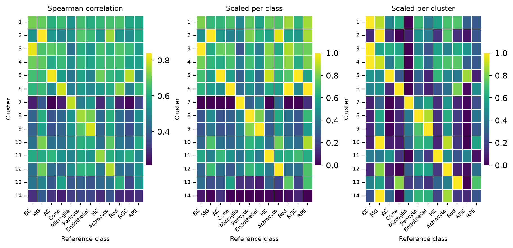

## Marker scores

``` python
retina_markers = {
    "Rods": ["Rho", "Pde6b", "Nrl", "Nr2e3"],
    "Cones": ["Opn1mw", "Opn1sw", "Arr3", "Thrb"],
    "RGC": ["Rbpms", "Sncg", "Pou4f1", "Pou4f2"],
    "Amacrine": ["Tfap2a", "Tfap2b", "Chat", "Vsx1"],
    "Bipolar": ["Vsx2", "Isl1", "Prkca", "Cabp5"],
    "Horizontal": ["Onecut1", "Onecut2", "Lhx1", "Prox1"],
    "Muller_Glia": ["Rlbp1", "Glul", "Sox9", "Slc1a3"],
    "Microglia": ["Cx3cr1", "P2ry12", "Tmem119", "Aif1"],
    "Vascular_Endothelial": ["Cdh5", "Pecam1", "Tek"],
    "Pericytes": ["Pdgfrb", "Acta2", "Des"],
    "Astrocytes": ["Gfap", "Aldh1l1", "Aqp4"],
}

score_keys = []
markers_present = {}
for cell_type, genes in retina_markers.items():
    present = [gene.upper() for gene in genes if gene.upper() in cd73ft_joyal.var_names]
    score_key = f"score_{cell_type}"
    sc.tl.score_genes(cd73ft_joyal, gene_list=present, score_name=score_key)
    score_keys.append(score_key)
    markers_present[cell_type] = present
    print(f"{cell_type}: {len(present)}/{len(genes)} markers")
```

    Rods: 4/4 markers
    Cones: 4/4 markers
    RGC: 4/4 markers
    Amacrine: 4/4 markers
    Bipolar: 4/4 markers
    Horizontal: 4/4 markers
    Muller_Glia: 4/4 markers
    Microglia: 4/4 markers
    Vascular_Endothelial: 3/3 markers
    Pericytes: 3/3 markers
    Astrocytes: 3/3 markers

## Marker scores by cluster

``` python
score_df = sc.get.obs_df(cd73ft_joyal, keys=[ranked_key] + score_keys)

for start in range(0, len(score_keys), 6):
    group = score_keys[start:start + 6]
    group_types = list(retina_markers)[start:start + 6]

    fig, axes = plt.subplots(len(group), 1, squeeze=False, sharex=True, figsize=(9, 4.3),
                             constrained_layout=True)
    for ax, score_key, cell_type in zip(axes.flat, group, group_types):
        sns.violinplot(data=score_df, x=ranked_key, y=score_key, hue=ranked_key,
                       palette=cluster_palette, legend=False, dodge=False, cut=0,
                       density_norm="width", inner="box", inner_kws=violin_inner_kws,
                       linewidth=0.5, saturation=1, ax=ax)

        cluster_order = list(cd73ft_joyal.obs[ranked_key].cat.categories)
        for body in ax.collections:
            extents = body.get_paths()[0].get_extents()
            body.set_facecolor(cluster_palette[cluster_order[round((extents.x0 + extents.x1) / 2)]])

        ax.set_ylabel(f"{cell_type.replace('_', ' ')} score", fontsize=7)
        ax.set_xlabel("")
        ax.tick_params(axis="y", labelsize=6)
        ax.grid(axis="y", color="#b0b0b0", linewidth=0.6)
        ax.set_axisbelow(True)

    axes[-1][0].set_xlabel("Cluster", fontsize=9)
    axes[-1][0].tick_params(axis="x", labelsize=8)
    plt.show()
    plt.close(fig)
```

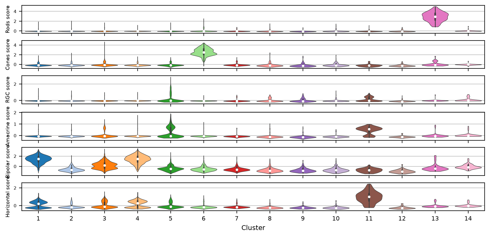

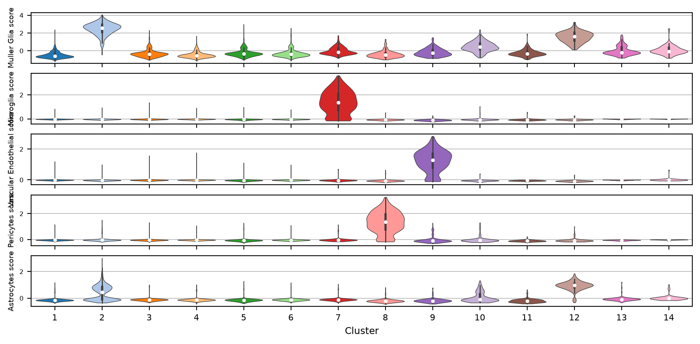

## Marker scores on the UMAP

``` python
for start in range(0, len(score_keys), 3):
    group = score_keys[start:start + 3]

    fig, axs = plt.subplots(2, 3, height_ratios=[1, 0.22], figsize=(8.6, 3.4),
                            constrained_layout=True)
    for ax, bar_ax, score_key in zip(axs[0], axs[1], group):
        sc.pl.umap(
            cd73ft_joyal,
            color=score_key,
            ax=ax,
            frameon=True,
            colorbar_loc=None,
            show=False,
        )
        ax.set_aspect("equal", adjustable="datalim")

        # the strip reserves the space; the colorbar drawn inside it is excluded from the
        # layout so its tick labels cannot push the panel around
        bar_ax.axis("off")
        colorbar_ax = bar_ax.inset_axes([0.325, 0.82, 0.35, 0.18])
        colorbar_ax.set_in_layout(False)
        colorbar = fig.colorbar(ax.collections[0], cax=colorbar_ax, orientation="horizontal")

        # placed explicitly at the ends and middle: the automatic locator picks its own round
        # numbers per score, so the tick count and positions differ from panel to panel
        score_low, score_high = ax.collections[0].get_clim()
        colorbar_ticks = np.linspace(score_low, score_high, 3)
        colorbar.set_ticks(colorbar_ticks, labels=[f"{tick:.2f}" for tick in colorbar_ticks])
        colorbar.ax.tick_params(labelsize=7)

    for empty_ax in axs[0][len(group):]:
        fig.delaxes(empty_ax)
    for empty_bar_ax in axs[1][len(group):]:
        empty_bar_ax.axis("off")

    plt.show()
    plt.close(fig)
```

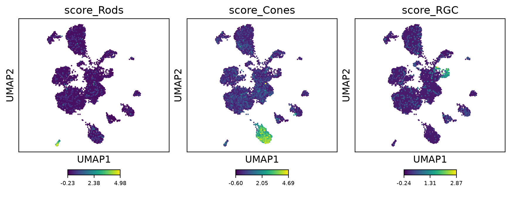

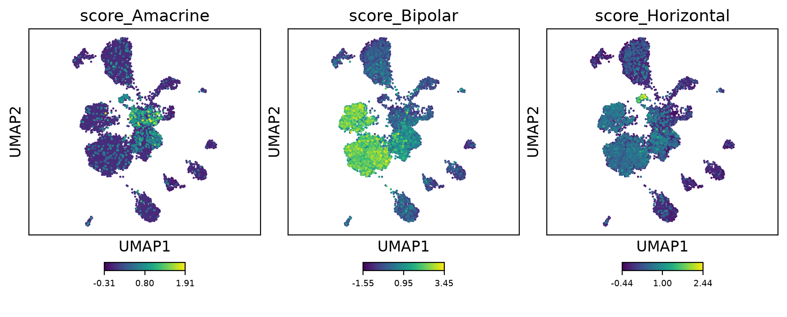

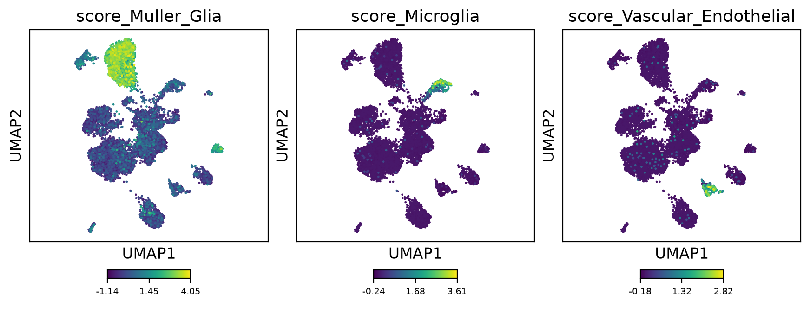

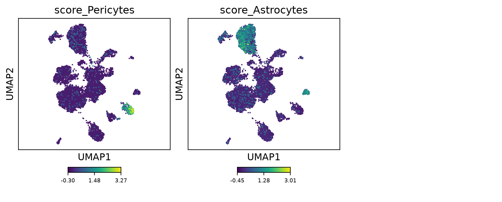

## Marker genes by cluster

``` python
# figsize is deliberately not passed: dotplot derives its own from the gene and cluster counts,
# and forcing it to slide dimensions packs 41 genes across 21 clusters until the dots overlap
sc.pl.dotplot(cd73ft_joyal, markers_present, groupby=ranked_key, standard_scale="var")
```

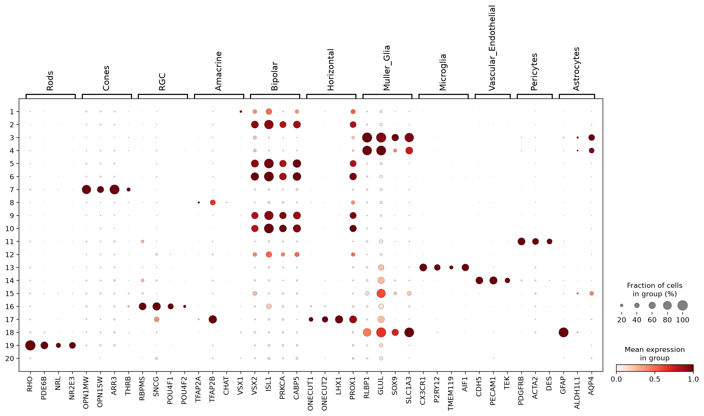

## Marker score heatmap

``` python
mean_scores = score_df.groupby(ranked_key, observed=True)[score_keys].mean()
mean_scores.columns = [cell_type.replace("_", " ") for cell_type in retina_markers]

# the same matrix three ways, because they answer different questions: the raw means show
# magnitude, scaling down a column asks "which cluster is most this cell type", and scaling
# across a row asks "which cell type best fits this cluster" — the annotation question
scaled_by_type = (mean_scores - mean_scores.min()) / (mean_scores.max() - mean_scores.min())
row_range = mean_scores.max(axis=1) - mean_scores.min(axis=1)
scaled_by_cluster = mean_scores.sub(mean_scores.min(axis=1), axis=0).div(row_range, axis=0)

score_normalizations = {
    "Mean score": mean_scores,
    "Scaled per cell type": scaled_by_type,
    "Scaled per cluster": scaled_by_cluster,
}

# walk the clusters in order and take each one's best cell type; a type already placed is
# skipped, and any type no cluster leads with is appended. The matches then read as a
# diagonal rather than being scattered across the panel.
column_order = []
for cluster in scaled_by_cluster.index:
    best = scaled_by_cluster.loc[cluster].idxmax()
    if best not in column_order:
        column_order.append(best)
column_order += [c for c in scaled_by_cluster.columns if c not in column_order]

fig, axes = plt.subplots(1, len(score_normalizations), squeeze=False, figsize=(9, 4.3),
                         constrained_layout=True)
for ax, (title, matrix) in zip(axes.flat, score_normalizations.items()):
    # as on the reference heatmap: left at "auto" the labels thin to every other one across
    # three panels, which leaves half the cell types and half the clusters unnamed
    sns.heatmap(matrix[column_order], cmap="viridis", linewidths=0.5, linecolor="white",
                xticklabels=True, yticklabels=True,
                cbar_kws={"shrink": 0.6, "pad": 0.02}, ax=ax)
    ax.set_title(title, fontsize=9)
    ax.set_xlabel("Cell type", fontsize=8)
    ax.set_ylabel("Cluster", fontsize=8)
    ax.tick_params(axis="x", labelrotation=45, labelsize=7)
    ax.tick_params(axis="y", labelrotation=0, labelsize=7)
    for label in ax.get_xticklabels():
        label.set_ha("right")

plt.show()
plt.close(fig)
```

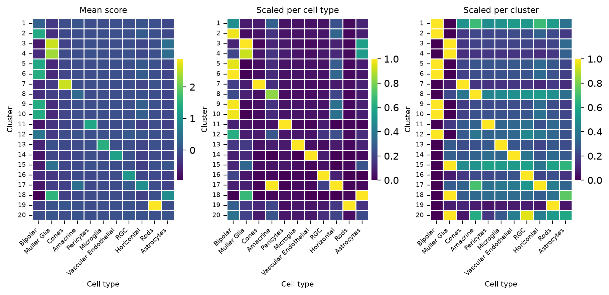

## Preliminary cell types

``` python
# the call is the best-correlating reference class. The marker scores stay in the document
# as an independent read on the same question — where the two disagree, the disagreement is
# the thing to look at before writing an override.
cluster_calls = reference_correlation.idxmax(axis=1)
marker_calls = mean_scores.idxmax(axis=1)

# the calls a human made rather than the reference; everything not listed keeps its argmax.
# Empty because this batch has not been read yet, so every call below is still the argmax.
# The WR_Joyal sheet above does not transfer: its cluster numbers are that batch's own
# Leiden run ranked by size and name nothing in common with these. Fill this in from the
# table below once the heatmap and the dotplot have been looked at, e.g. {"7": "Pericyte"}.
cluster_call_overrides = {}
cluster_calls.update(pd.Series(cluster_call_overrides))

cd73ft_joyal.obs["cell_type"] = cd73ft_joyal.obs[ranked_key].map(cluster_calls).astype("category")

# keyed on every class in the reference rather than only the ones called, so a cell type
# keeps its colour whatever a given resolution happens to find
cell_type_palette = dict(zip(sorted(reference_centroids.obs_names), sc.pl.palettes.default_20))
cd73ft_joyal.uns["cell_type_colors"] = [
    cell_type_palette[cell_type] for cell_type in cd73ft_joyal.obs["cell_type"].cat.categories
]

# margin is the gap to the runner-up class: a cluster called on a hair's difference is one
# to read the heatmap for, however high its correlation
sorted_correlation = np.sort(reference_correlation.to_numpy(), axis=1)

pd.DataFrame({
    "cell_type": cluster_calls,
    "cells": cd73ft_joyal.obs[ranked_key].value_counts(),
    "correlation": reference_correlation.max(axis=1).round(3),
    "margin": (sorted_correlation[:, -1] - sorted_correlation[:, -2]).round(3),
    "marker call": marker_calls,
})
```

<div>
<style scoped>
    .dataframe tbody tr th:only-of-type {
        vertical-align: middle;
    }
&#10;    .dataframe tbody tr th {
        vertical-align: top;
    }
&#10;    .dataframe thead th {
        text-align: right;
    }
</style>

|     | cell_type   | cells | correlation | margin | marker call          |
|-----|-------------|-------|-------------|--------|----------------------|
| 1   | BC          | 1277  | 0.813       | 0.131  | Bipolar              |
| 2   | BC          | 1267  | 0.697       | 0.029  | Bipolar              |
| 3   | MG          | 996   | 0.815       | 0.074  | Muller Glia          |
| 4   | MG          | 908   | 0.814       | 0.098  | Muller Glia          |
| 5   | BC          | 820   | 0.644       | 0.001  | Bipolar              |
| 6   | BC          | 773   | 0.676       | 0.024  | Bipolar              |
| 7   | Cone        | 742   | 0.787       | 0.063  | Cones                |
| 8   | AC          | 689   | 0.819       | 0.094  | Amacrine             |
| 9   | BC          | 635   | 0.671       | 0.020  | Bipolar              |
| 10  | BC          | 439   | 0.652       | 0.016  | Bipolar              |
| 11  | Pericyte    | 305   | 0.759       | 0.047  | Pericytes            |
| 12  | Astrocyte   | 300   | 0.573       | 0.041  | Bipolar              |
| 13  | Microglia   | 285   | 0.780       | 0.236  | Microglia            |
| 14  | Endothelial | 215   | 0.801       | 0.116  | Vascular Endothelial |
| 15  | MG          | 196   | 0.702       | 0.020  | Muller Glia          |
| 16  | RGC         | 125   | 0.796       | 0.056  | RGC                  |
| 17  | HC          | 121   | 0.740       | 0.111  | Horizontal           |
| 18  | Astrocyte   | 113   | 0.767       | 0.076  | Muller Glia          |
| 19  | Rod         | 80    | 0.606       | 0.050  | Rods                 |
| 20  | MG          | 43    | 0.376       | 0.004  | Muller Glia          |

</div>

## Refining a call with the marker scores

``` python
# the reference calls a whole cluster one class, so a population that never forms its own
# cluster cannot be named. That is not this batch's problem: endothelium (cluster 14, 215
# cells) and pericytes (cluster 11, 305) each come out on their own here, where in WR_Joyal
# they share one cluster of 106. The screen runs anyway — a mixed cluster is something to
# find rather than assume — and the two candidates it turns up are both rejected below.
#
# where the marker panel says a cluster holds two classes, the cells are split: each goes to
# whichever of the two scores is higher, provided that score clears zero. score_genes centres
# a score on a control gene set, so above zero means enriched above background; a cell
# clearing neither keeps the cluster's call rather than being sent one way on noise.
#
# the assignment itself has no threshold to choose — the two scores are compared against
# each other — but which clusters get split is gated below, because a disagreement between
# the reference and the panel is not on its own evidence that a cluster holds two things.

# the reference names classes and the marker panel names them differently; the two
# vocabularies have to be joined by hand, and everything else here is derived from the join
marker_to_class = {
    "Rods": "Rod",                          "Cones": "Cone",
    "RGC": "RGC",                           "Amacrine": "AC",
    "Bipolar": "BC",                        "Horizontal": "HC",
    "Muller_Glia": "MG",                    "Microglia": "Microglia",
    "Vascular_Endothelial": "Endothelial",
    "Pericytes": "Pericyte",                "Astrocytes": "Astrocyte",
}

# score_genes wrote score_<panel name>; mean_scores spaced the same names out for its axis
class_scores = {cls: f"score_{panel}" for panel, cls in marker_to_class.items()}
rival_calls = marker_calls.map(
    {panel.replace("_", " "): cls for panel, cls in marker_to_class.items()}
)

# a cluster is a candidate exactly when the reference and the panel name it differently: one
# of them is wrong, or — the case this chunk is for — the cluster holds both. The pair falls
# out of the disagreement, the call above being the parent and the panel's answer the child.
cluster_refinements = {
    cluster: (cluster_calls[cluster], rival_calls[cluster])
    for cluster in cluster_calls.index
    if cluster_calls[cluster] != rival_calls[cluster]
}

# a disagreement says where to look, not what to do: the panels are not on a common scale,
# so a panel of bright genes annexes cells from a dim one wherever the two are compared. The
# split is therefore only applied where the cluster actually looks like two populations.
#
# the test is the L in the scatter below, written as a number. In a mixed cluster the two
# scores trade off — a cell high on one is low on the other — so the rank correlation
# between them across the cluster runs negative. In one population with a depth gradient
# both scores rise and fall together and the correlation runs positive; cutting that at the
# diagonal halves a gradient at an arbitrary place rather than finding a boundary. Requiring
# both arms to be a real fraction of the cluster then throws out splits that shave off a
# handful of cells.
#
# the scores have to actually trade off, not merely fail to correlate: a cluster sitting at
# zero has the two scores independent of each other, which is a cloud rather than an L and
# says nothing about there being two populations in it.
#
# the cut is the one WR_Joyal's split was set on, kept here rather than retuned per batch —
# a threshold moved until this batch's candidates fall the right side of it would not be a
# test any more. Both land well short of it: cluster 12 at -0.14 and cluster 18 at -0.22 are
# nearer the cloud than the L, and both keep their whole-cluster call.
max_tradeoff = -0.25
min_arm_cells = 10
min_arm_fraction = 0.05

split_diagnostics = []
for cluster, (parent_class, child_class) in cluster_refinements.items():
    in_cluster = (cd73ft_joyal.obs[ranked_key] == cluster).to_numpy()
    parent_score = cd73ft_joyal.obs[class_scores[parent_class]].to_numpy()
    child_score = cd73ft_joyal.obs[class_scores[child_class]].to_numpy()

    reassigned = in_cluster & (child_score > parent_score) & (child_score > 0)
    n_cluster = int(in_cluster.sum())
    n_child = int(reassigned.sum())

    tradeoff = np.corrcoef(
        pd.Series(parent_score[in_cluster]).rank(),
        pd.Series(child_score[in_cluster]).rank(),
    )[0, 1]
    smallest_arm = min(n_child, n_cluster - n_child)
    applied = bool(
        tradeoff < max_tradeoff
        and smallest_arm >= max(min_arm_cells, min_arm_fraction * n_cluster)
    )

    if applied:
        if child_class not in cd73ft_joyal.obs["cell_type"].cat.categories:
            cd73ft_joyal.obs["cell_type"] = (
                cd73ft_joyal.obs["cell_type"].cat.add_categories([child_class])
            )
        cd73ft_joyal.obs.loc[reassigned, "cell_type"] = child_class

    split_diagnostics.append({
        "cluster": cluster,
        "parent": parent_class,
        "child": child_class,
        "cells": n_cluster,
        "would move": n_child,
        "tradeoff": round(tradeoff, 3),
        "applied": applied,
    })

# a rejected row is not a failure: the cluster keeps its whole-cluster call, and the row is
# the record of the panel having been overruled
print(pd.DataFrame(split_diagnostics).to_string(index=False))
split_applied = {row["cluster"]: row["applied"] for row in split_diagnostics}

# a class added above lands at the end of the categories, which would put it last on every
# axis downstream rather than in with the rest
cd73ft_joyal.obs["cell_type"] = cd73ft_joyal.obs["cell_type"].cat.remove_unused_categories()
cd73ft_joyal.obs["cell_type"] = cd73ft_joyal.obs["cell_type"].cat.reorder_categories(
    sorted(cd73ft_joyal.obs["cell_type"].cat.categories)
)
cd73ft_joyal.uns["cell_type_colors"] = [
    cell_type_palette[cell_type] for cell_type in cd73ft_joyal.obs["cell_type"].cat.categories
]

cd73ft_joyal.obs["cell_type"].value_counts()
```

    cluster    parent child  cells  would move  tradeoff  applied
         12 Astrocyte    BC    300         176    -0.140    False
         18 Astrocyte    MG    113          91    -0.222    False

    cell_type
    BC             5211
    MG             2143
    Cone            742
    AC              689
    Astrocyte       413
    Pericyte        305
    Microglia       285
    Endothelial     215
    RGC             125
    HC              121
    Rod              80
    Name: count, dtype: int64

## Cells reassigned by marker score

``` python
# the two scores against each other, one panel per refinement. A cluster worth splitting
# looks like an L — each arm high on one score and flat on the other, with the middle
# empty. A diffuse cloud across the diagonal means the two classes are not separable this
# way, and the cluster should be left alone.
fig, axes = plt.subplots(1, len(cluster_refinements), squeeze=False,
                         figsize=(4.3 * len(cluster_refinements), 3.6),
                         constrained_layout=True)
for ax, (cluster, (parent_class, child_class)) in zip(axes.flat, cluster_refinements.items()):
    in_cluster = (cd73ft_joyal.obs[ranked_key] == cluster).to_numpy()
    cluster_cells = sc.get.obs_df(
        cd73ft_joyal,
        keys=[class_scores[parent_class], class_scores[child_class], "cell_type"],
    )[in_cluster]

    for called_class in [parent_class, child_class]:
        is_called = (cluster_cells["cell_type"] == called_class).to_numpy()
        ax.scatter(
            cluster_cells[class_scores[parent_class]][is_called],
            cluster_cells[class_scores[child_class]][is_called],
            s=14, c=cell_type_palette[called_class], linewidths=0,
            label=f"{called_class} ({is_called.sum()})",
        )

    # the decision boundary is the diagonal, which is the whole point of comparing the two
    # scores rather than cutting one of them at a number
    span = [
        cluster_cells[[class_scores[parent_class], class_scores[child_class]]].min().min(),
        cluster_cells[[class_scores[parent_class], class_scores[child_class]]].max().max(),
    ]
    ax.plot(span, span, color="#b0b0b0", linewidth=1.0, linestyle="--", zorder=0)

    verdict = "split" if split_applied[cluster] else "left whole"
    ax.set_title(f"Cluster {cluster} — {verdict}", fontsize=9)
    ax.set_xlabel(f"{parent_class} score", fontsize=8)
    ax.set_ylabel(f"{child_class} score", fontsize=8)
    ax.tick_params(labelsize=7)
    ax.legend(fontsize=7, frameon=False, loc="upper right")

plt.show()
plt.close(fig)
```

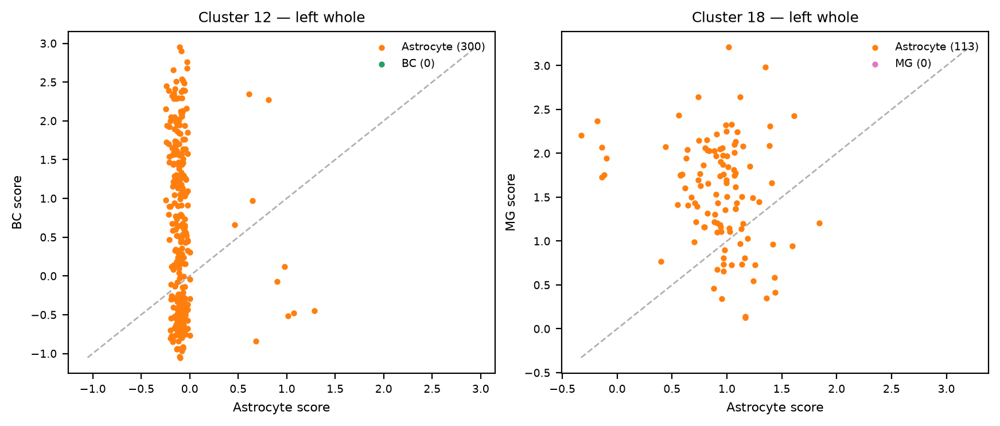

## Preliminary cell types on the UMAP

``` python
plt.rcParams["figure.figsize"] = (6.5, 4.3)

ax = sc.pl.umap(
    cd73ft_joyal[draw_order],
    color="cell_type",
    frameon=True,
    show=False,
)
ax.set_aspect("equal", adjustable="datalim")
plt.show()
```

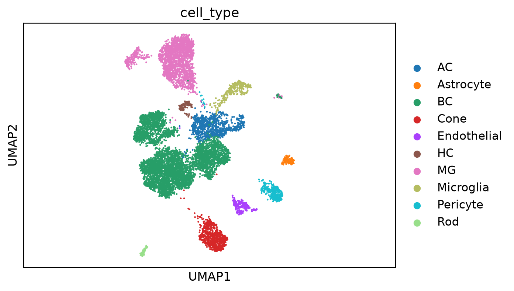

## Txn1 on the UMAP

``` python
fig, axs = plt.subplots(2, 1, height_ratios=[1, 0.22], figsize=(4.3, 3.9),
                        constrained_layout=True)

sc.pl.umap(cd73ft_joyal, color="TXN1", ax=axs[0], frameon=True, colorbar_loc=None, show=False)
axs[0].set_aspect("equal", adjustable="datalim")

axs[1].axis("off")
colorbar_ax = axs[1].inset_axes([0.325, 0.82, 0.35, 0.18])
colorbar_ax.set_in_layout(False)
colorbar = fig.colorbar(axs[0].collections[0], cax=colorbar_ax, orientation="horizontal")

txn1_low, txn1_high = axs[0].collections[0].get_clim()
colorbar_ticks = np.linspace(txn1_low, txn1_high, 3)
colorbar.set_ticks(colorbar_ticks, labels=[f"{tick:.2f}" for tick in colorbar_ticks])
colorbar.ax.tick_params(labelsize=7)

plt.show()
plt.close(fig)
```

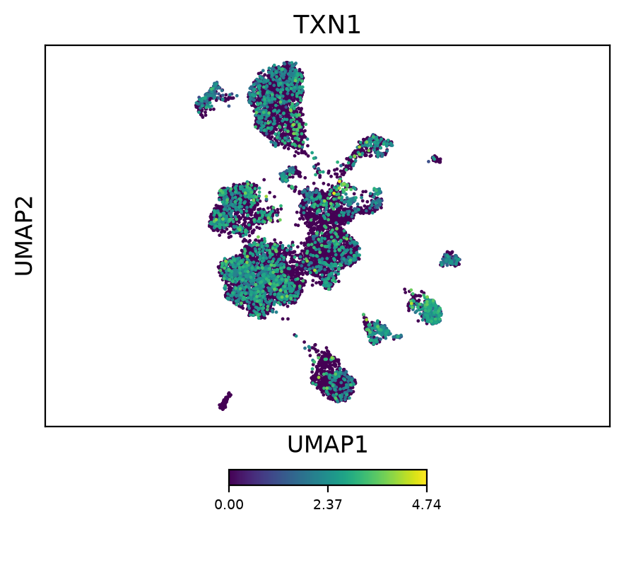

## Txn1 by cell type

``` python
txn1_df = sc.get.obs_df(cd73ft_joyal, keys=["TXN1", "cell_type", "condition", "timepoint"])

fig, ax = plt.subplots(figsize=(9, 3.5), constrained_layout=True)
sns.violinplot(data=txn1_df, x="cell_type", y="TXN1", hue="cell_type",
               palette=cell_type_palette, legend=True, dodge=False, cut=0,
               density_norm="width", inner="box", inner_kws=violin_inner_kws,
               linewidth=0.5, saturation=1, ax=ax)

# with hue repeating x and dodge off, seaborn hands the bodies their colours in an order
# that does not follow the x positions — the legend ends up right and the violins wrong.
# Recolour each body from the cell type it actually sits under.
cell_type_order = list(cd73ft_joyal.obs["cell_type"].cat.categories)
for body in ax.collections:
    extents = body.get_paths()[0].get_extents()
    body.set_facecolor(cell_type_palette[cell_type_order[round((extents.x0 + extents.x1) / 2)]])

ax.set_xlabel("")
ax.set_ylabel("Txn1 (log1p)", fontsize=9)
ax.tick_params(axis="x", labelrotation=45, labelsize=8)
ax.tick_params(axis="y", labelsize=8)
ax.grid(axis="y", color="#b0b0b0", linewidth=0.6)
ax.set_axisbelow(True)
for label in ax.get_xticklabels():
    label.set_ha("right")
ax.legend(title="", fontsize=7, frameon=False, loc="center left", bbox_to_anchor=(1.0, 0.5))

plt.show()
plt.close(fig)
```

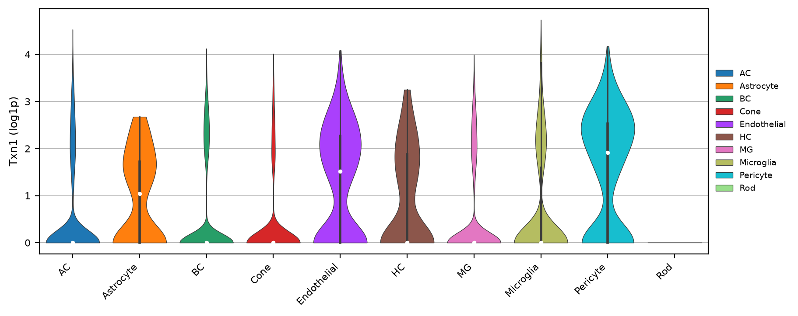

## Txn1 by cell type and condition

``` python
condition_palette = dict(zip(cd73ft_joyal.obs["condition"].cat.categories,
                             cd73ft_joyal.uns["condition_colors"]))

fig, ax = plt.subplots(figsize=(9, 3.5), constrained_layout=True)
sns.violinplot(data=txn1_df, x="cell_type", y="TXN1", hue="condition",
               palette=condition_palette, cut=0, density_norm="width", inner="box",
               inner_kws=violin_inner_kws, linewidth=0.5, ax=ax)
ax.set_xlabel("")
ax.set_ylabel("Txn1 (log1p)", fontsize=9)
ax.tick_params(axis="x", labelrotation=45, labelsize=8)
ax.tick_params(axis="y", labelsize=8)
ax.grid(axis="y", color="#b0b0b0", linewidth=0.6)
ax.set_axisbelow(True)
for label in ax.get_xticklabels():
    label.set_ha("right")
ax.legend(title="", fontsize=7, frameon=False, loc="center left", bbox_to_anchor=(1.0, 0.5))

plt.show()
plt.close(fig)
```

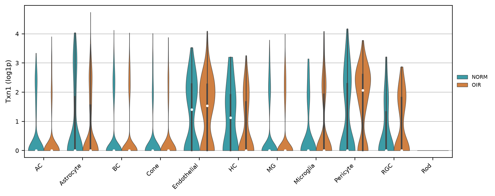

## Txn1 by cell type and timepoint

``` python
timepoint_palette = dict(zip(cd73ft_joyal.obs["timepoint"].cat.categories,
                             cd73ft_joyal.uns["timepoint_colors"]))

fig, ax = plt.subplots(figsize=(9, 3.5), constrained_layout=True)
sns.violinplot(data=txn1_df, x="cell_type", y="TXN1", hue="timepoint",
               palette=timepoint_palette, cut=0, density_norm="width", inner="box",
               inner_kws=violin_inner_kws, linewidth=0.5, ax=ax)
ax.set_xlabel("")
ax.set_ylabel("Txn1 (log1p)", fontsize=9)
ax.tick_params(axis="x", labelrotation=45, labelsize=8)
ax.tick_params(axis="y", labelsize=8)
ax.grid(axis="y", color="#b0b0b0", linewidth=0.6)
ax.set_axisbelow(True)
for label in ax.get_xticklabels():
    label.set_ha("right")
ax.legend(title="", fontsize=7, frameon=False, loc="center left", bbox_to_anchor=(1.0, 0.5))

plt.show()
plt.close(fig)
```

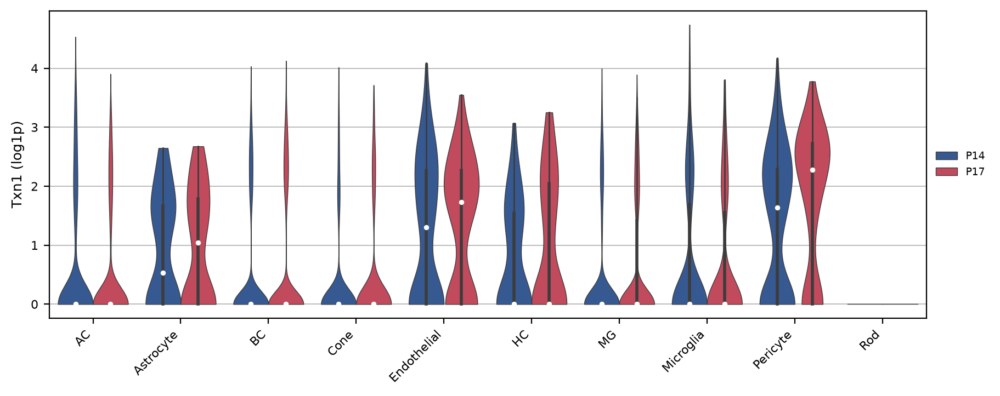

## Txn1 across the design

``` python
# laid out like the violin slides below: timepoint down the rows, condition across the
# columns, so the same comparison sits in the same direction in every Txn1 figure
condition_order = list(cd73ft_joyal.obs["condition"].cat.categories)
timepoints = list(cd73ft_joyal.obs["timepoint"].cat.categories)

umap_coords = cd73ft_joyal.obsm["X_umap"]
txn1 = sc.get.obs_df(cd73ft_joyal, keys=["TXN1"])["TXN1"].to_numpy()
txn1_low, txn1_high = txn1.min(), txn1.max()

# drawn with scatter rather than sc.pl.umap: it puts the whole embedding underneath in grey,
# and it fixes the point size, which scanpy scales by cell count — the sparse panels would
# otherwise carry much larger points than the dense ones.
fig, axes = plt.subplots(len(timepoints), len(condition_order), squeeze=False,
                         figsize=(5.6, 4.4), constrained_layout=True)
fig.get_layout_engine().set(w_pad=0.01, h_pad=0.01, wspace=0.01, hspace=0.02)
for row, timepoint in enumerate(timepoints):
    for column, condition in enumerate(condition_order):
        ax = axes[row][column]
        in_stratum = (
            (cd73ft_joyal.obs["timepoint"] == timepoint) & (cd73ft_joyal.obs["condition"] == condition)
        ).to_numpy()

        # every cell in grey, so each panel is read against the same outline rather than
        # appearing to be a differently-shaped dataset
        ax.scatter(umap_coords[:, 0], umap_coords[:, 1], s=1, c="#bfbfbf", linewidths=0)
        points = ax.scatter(umap_coords[in_stratum, 0], umap_coords[in_stratum, 1], s=1,
                            c=txn1[in_stratum], cmap="viridis",
                            vmin=txn1_low, vmax=txn1_high, linewidths=0)

        ax.set_aspect("equal", adjustable="datalim")
        ax.set_ylabel(f"Txn1 — {timepoint}" if column == 0 else "", fontsize=8)
        ax.set_title(condition if row == 0 else "", fontsize=9)
        ax.text(0.02, 0.98, f"n={in_stratum.sum():,}", transform=ax.transAxes,
                va="top", ha="left", fontsize=7)
        ax.set_xticks([])
        ax.set_yticks([])

colorbar = fig.colorbar(points, ax=axes, location="right", shrink=0.35, pad=0.02, aspect=25)
colorbar_ticks = np.linspace(txn1_low, txn1_high, 3)
colorbar.set_ticks(colorbar_ticks, labels=[f"{tick:.2f}" for tick in colorbar_ticks])
colorbar.ax.tick_params(labelsize=7)

plt.show()
plt.close(fig)
```


## Txn1 by cell type across the design

``` python
cell_type_order = list(cd73ft_joyal.obs["cell_type"].cat.categories)
condition_order = list(cd73ft_joyal.obs["condition"].cat.categories)
timepoints = list(cd73ft_joyal.obs["timepoint"].cat.categories)

# grouped violins rather than four panels: NORM and OIR sit side by side within each cell
# type's slot, so the comparison is a glance rather than a jump between figures. Timepoint is
# the facet, which leaves the interaction readable down a column.
fig, axes = plt.subplots(len(timepoints), 1, squeeze=False, sharex=True, sharey=True,
                         figsize=(9, 5.0), constrained_layout=True)
for row, (ax, timepoint) in enumerate(zip(axes.flat, timepoints)):
    at_timepoint = txn1_df[txn1_df["timepoint"] == timepoint]
    sns.violinplot(data=at_timepoint, x="cell_type", y="TXN1", order=cell_type_order,
                   hue="condition", hue_order=condition_order, palette=condition_palette,
                   gap=0.1, cut=0, density_norm="width", inner="box",
                   inner_kws=violin_inner_kws, linewidth=0.5, saturation=1,
                   legend=(row == 0), ax=ax)
    ax.set_ylabel(f"Txn1 — {timepoint}", fontsize=8)
    ax.set_xlabel("")
    ax.tick_params(axis="y", labelsize=6)
    ax.grid(axis="y", color="#b0b0b0", linewidth=0.6)
    ax.set_axisbelow(True)
    sns.despine(ax=ax)

axes[0][0].legend(title="", fontsize=7, frameon=False,
                  loc="center left", bbox_to_anchor=(1.0, 0.5))
axes[-1][0].tick_params(axis="x", labelrotation=45, labelsize=8)
for label in axes[-1][0].get_xticklabels():
    label.set_ha("right")

plt.show()
plt.close(fig)
```

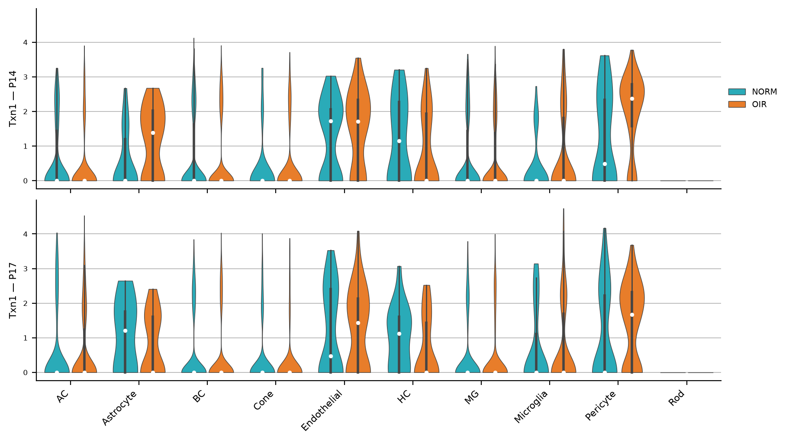

## Txn1 by cell type across the design, grouped by timepoint

``` python
timepoint_palette = dict(zip(cd73ft_joyal.obs["timepoint"].cat.categories,
                             cd73ft_joyal.uns["timepoint_colors"]))

# the same data with the roles swapped: P14 and P17 side by side within each cell type, and
# condition as the facet. Reading down a column here compares the two timepoints within a
# condition, where the plot above compares the two conditions within a timepoint.
fig, axes = plt.subplots(len(condition_order), 1, squeeze=False, sharex=True, sharey=True,
                         figsize=(9, 5.0), constrained_layout=True)
for row, (ax, condition) in enumerate(zip(axes.flat, condition_order)):
    in_condition = txn1_df[txn1_df["condition"] == condition]
    sns.violinplot(data=in_condition, x="cell_type", y="TXN1", order=cell_type_order,
                   hue="timepoint", hue_order=timepoints, palette=timepoint_palette,
                   gap=0.1, cut=0, density_norm="width", inner="box",
                   inner_kws=violin_inner_kws, linewidth=0.5, saturation=1,
                   legend=(row == 0), ax=ax)
    ax.set_ylabel(f"Txn1 — {condition}", fontsize=8)
    ax.set_xlabel("")
    ax.tick_params(axis="y", labelsize=6)
    ax.grid(axis="y", color="#b0b0b0", linewidth=0.6)
    ax.set_axisbelow(True)
    sns.despine(ax=ax)

axes[0][0].legend(title="", fontsize=7, frameon=False,
                  loc="center left", bbox_to_anchor=(1.0, 0.5))
axes[-1][0].tick_params(axis="x", labelrotation=45, labelsize=8)
for label in axes[-1][0].get_xticklabels():
    label.set_ha("right")

plt.show()
plt.close(fig)
```

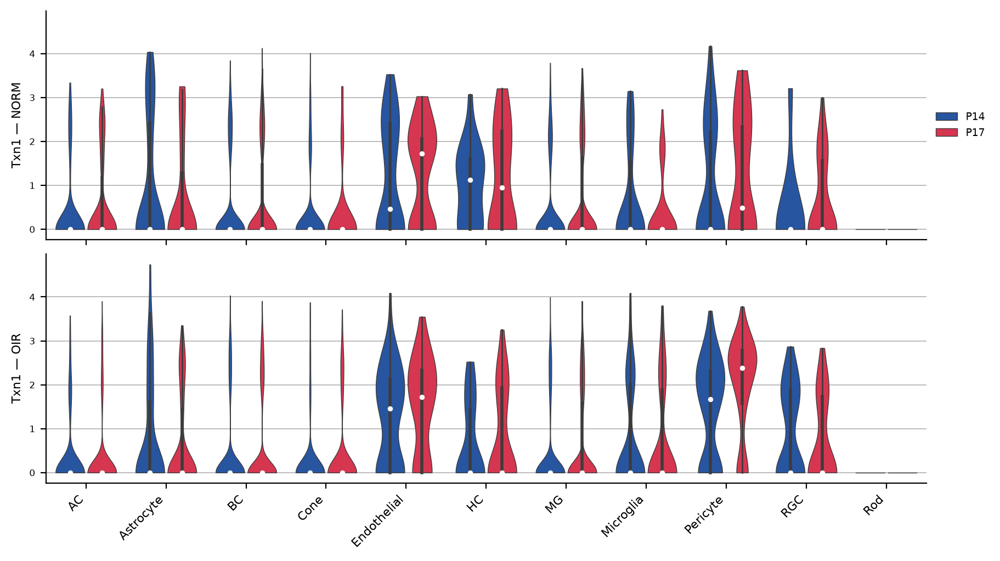
