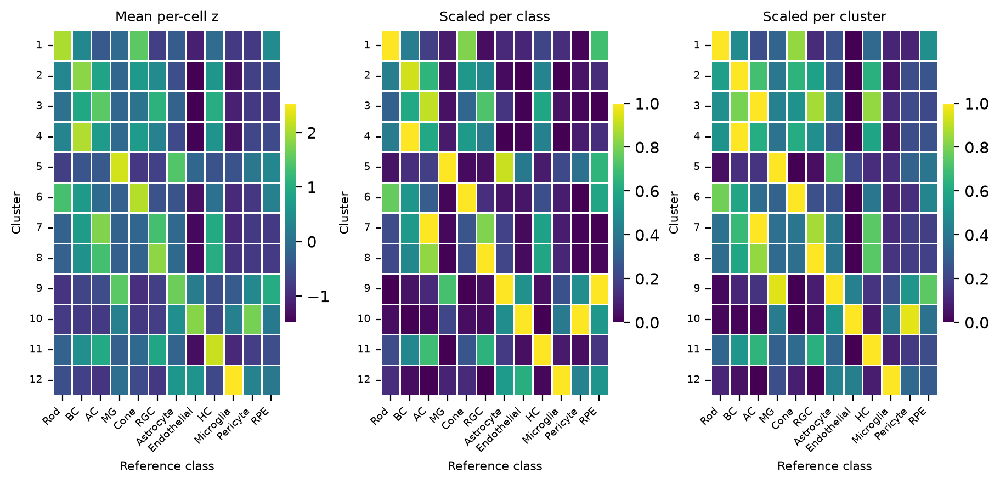
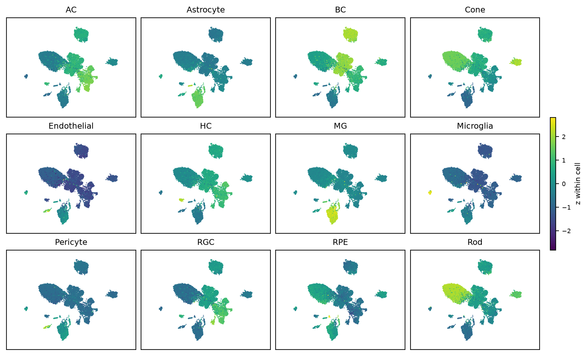
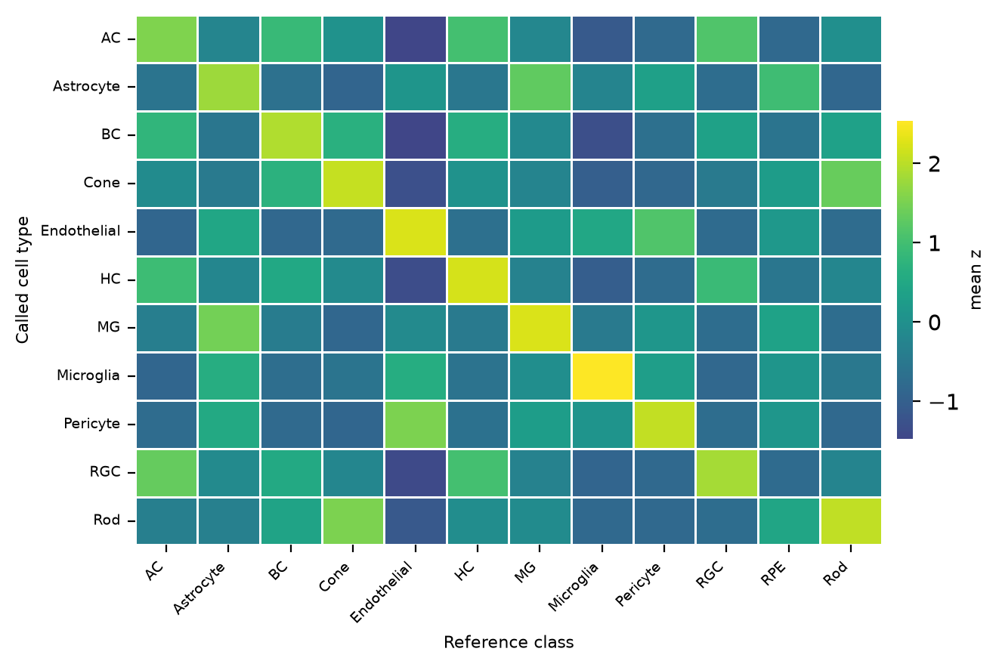
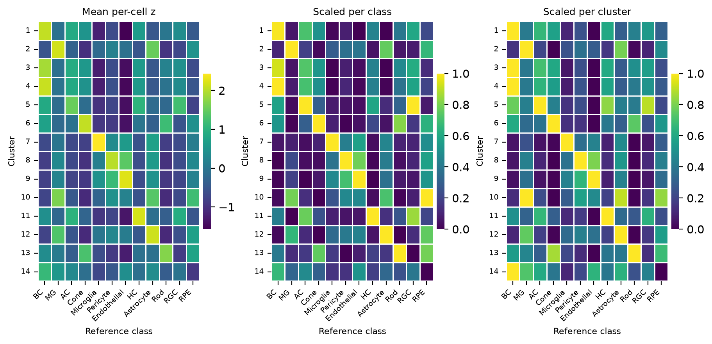
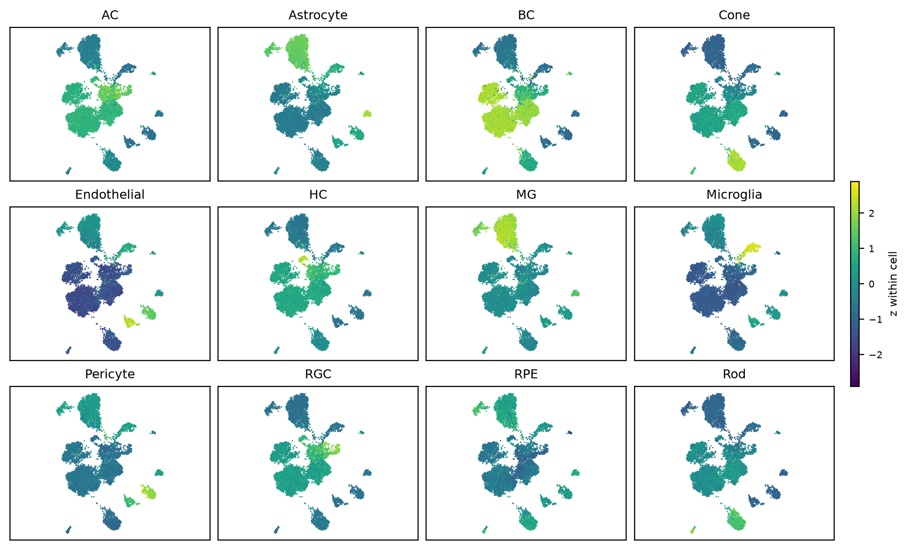
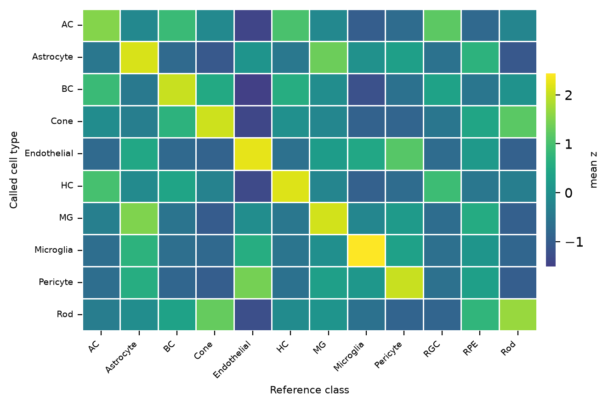

# OIR retina scRNA-seq
Brent Biddy
2026-08-20

- [Setup](#setup)
- [Whole Retina](#whole-retina)
- [Rod-depleted Retina](#rod-depleted-retina)

# Setup

## Load Libraries

First, let’s load the libraries we need. We’ll also set a few default
plotting parameters here, so the figures stay consistent throughout the
document.

``` python
from pathlib import Path                    # used to construct file paths
from urllib.request import urlretrieve      # used to download query and reference data

import anndata as ad                        # used to load data
import matplotlib.colors as mcolors         # used to convert palette colours to hex
import matplotlib.pyplot as plt
import numpy as np
import pandas as pd
import scanpy as sc
import seaborn as sns
from scipy.sparse import csr_matrix         # used to store the counts sparsely

plt.rcParams.update({
    "figure.dpi": 200,        # resolution of the figures as drawn
    "savefig.dpi": 200,       # resolution of the figures as written out
    "font.size": 12,          # font size of the on-data cluster numbers, and of dotplot text
    "axes.labelsize": 12,     # font size of scanpy's UMAP axis labels
    "axes.titlesize": 13,     # font size of scanpy's panel titles
    "ytick.labelsize": 10.5,  # font size of the heatmap colorbar ticks
    "legend.fontsize": 11,    # font size of scanpy's UMAP legends
})
```

## Download Data

Now let’s download the two datasets we need: the OIR and normoxia retina
counts from GEO, and the mouse retina cell atlas we’ll use as an
annotation reference. Both are saved to `data/raw/`, and later renders
re-use them rather than downloading again.

The query counts are already normalized, so we’ll use them as they are
rather than normalizing them ourselves.

- **Query** —
  [GSE150703](https://www.ncbi.nlm.nih.gov/geo/query/acc.cgi?acc=GSE150703).
  Binet *et al.*, Neutrophil extracellular traps target senescent
  vasculature for tissue remodeling in retinopathy. *Science* **369**,
  eaay5356 (2020).
  [doi:10.1126/science.aay5356](https://doi.org/10.1126/science.aay5356)
- **Reference** — the mouse retina cell atlas (MRCA), via CELLxGENE. Li
  *et al.*, Comprehensive single-cell atlas of the mouse retina.
  *iScience* **27**, 109916 (2024).
  [doi:10.1016/j.isci.2024.109916](https://doi.org/10.1016/j.isci.2024.109916)

``` python
source_urls = {
    "query": (
        "https://ftp.ncbi.nlm.nih.gov/geo/series/GSE150nnn/GSE150703/suppl/"
        "GSE150703_retina_NORM_OIR_P14_P17_C57_WR_CD73FT_noamg_normalizedUMI_Count_DGEmatrix.txt.gz"
    ),
    "reference": (
        "https://datasets.cellxgene.cziscience.com/"
        "a420c2bf-feeb-48db-a6c7-71f492f23131.h5ad"
    ),
}

raw_dir = Path("data/raw")
raw_dir.mkdir(parents=True, exist_ok=True)

source_paths = {}
for source_name, source_url in source_urls.items():
    source_path = raw_dir / Path(source_url).name
    if not source_path.exists():               # downloaded once, then re-used on later renders
        urlretrieve(source_url, source_path)
    source_paths[source_name] = source_path
    print(f"{source_name}: {source_path.name}  ({source_path.stat().st_size / 1e6:.0f} MB)")

query_path = source_paths["query"]
reference_path = source_paths["reference"]
```

    query: GSE150703_retina_NORM_OIR_P14_P17_C57_WR_CD73FT_noamg_normalizedUMI_Count_DGEmatrix.txt.gz  (236 MB)
    reference: a420c2bf-feeb-48db-a6c7-71f492f23131.h5ad  (3690 MB)

## Build Query AnnData

Next, let’s build an AnnData object from the query counts. The matrix
comes as genes by cells, so we’ll transpose it and store it sparsely.

Each barcode also encodes the experimental design, so we’ll split it
into columns:

    OIR_P17_WR_Joyal_r1_AGCTATCAATTT
    │   │   │  │     │  └── droplet barcode
    │   │   │  │     └───── replicate
    │   │   │  └─────────── lab
    │   │   └────────────── prep
    │   └────────────────── timepoint
    └────────────────────── condition

We’ll also combine prep and lab into a batch column, since that pairing
is what we’ll cluster on.

``` python
adata_path = Path("data/processed/GSE150703_adata.h5ad")
adata_path.parent.mkdir(parents=True, exist_ok=True)

if adata_path.exists():                        # built once, then read back on later renders
    adata = sc.read_h5ad(adata_path)
else:
    counts = pd.read_csv(query_path, sep="\t", index_col=0).T   # genes x cells, so transposed

    adata = ad.AnnData(X=csr_matrix(counts.values))
    adata.obs_names = counts.index.astype(str)
    adata.var_names = counts.columns.astype(str)

    fields = pd.Series(adata.obs_names).str.split("_", expand=True)  # split barcode into parts
    adata.obs["condition"] = pd.Categorical(fields[0].values)
    adata.obs["timepoint"] = pd.Categorical(fields[1].values)
    adata.obs["prep"] = pd.Categorical(fields[2].values)
    adata.obs["lab"] = pd.Categorical(fields[3].values)
    adata.obs["replicate"] = pd.Categorical(fields[4].values)
    adata.obs["batch"] = pd.Categorical(fields[2].str.cat(fields[3], sep="_").values)  # prep x lab

    adata.write_h5ad(adata_path)

# outside the guard, so a colour can be changed and re-rendered without rebuilding anything
obs_palettes = {
    "condition": {"NORM": "#2AABB8", "OIR": "#E87D2A"},
    "timepoint": {"P14": "#2855A0", "P17": "#D63650"},
    "prep":      {"Cd73ft": "#C9A227", "WR": "#5DB85D"},
    "lab":       {"Joyal": "#7B4FB5", "Mccarrol": "#A0522D"},
    "batch":     {"Cd73ft_Joyal": "#C9A227", "WR_Joyal": "#5DB85D", "WR_Mccarrol": "#A0522D"},
}

for obs_key, palette in obs_palettes.items():
    adata.uns[f"{obs_key}_colors"] = [palette[c] for c in adata.obs[obs_key].cat.categories]

adata
```

    AnnData object with n_obs × n_vars = 31271 × 21408
        obs: 'condition', 'timepoint', 'prep', 'lab', 'replicate', 'batch'
        uns: 'condition_colors', 'timepoint_colors', 'prep_colors', 'lab_colors', 'batch_colors'
        layers: None (.X)

The object is saved to `data/processed/` and re-used on later renders.

## Build Reference Centroids

Now let’s build the reference we’ll annotate against. The mouse retina
cell atlas holds 330,930 cells across twelve major cell types, all of it
healthy retina.

To make the centroids we’ll sum the UMI counts for each gene across the
cells of each cell type, and do the same for CP10K normalized counts.
We’ll keep both as layers, along with the number of cells in each type,
so we can calculate the mean later.

``` python
centroid_path = Path("data/processed/MRCA_majorclass_centroids.h5ad")

if centroid_path.exists():                     # built once, then read back on later renders
    reference_centroids = sc.read_h5ad(centroid_path)
else:
    backed = sc.read_h5ad(reference_path, backed="r")   # nothing read into memory yet
    reference = ad.AnnData(
        X=backed.raw.X.to_memory(),            # the atlas keeps its raw counts in .raw
        obs=backed.obs[["majorclass"]],
        var=backed.raw.var[["feature_name"]],
    )

    reference.var["ensembl_id"] = reference.var_names   # kept before the index becomes symbols
    reference.var_names = reference.var.pop("feature_name").str.upper()  # the query uses symbols
    reference.var_names_make_unique(join="_v")  # nine symbols answer to more than one Ensembl id

    counts_sum = sc.get.aggregate(reference, by="majorclass", func="sum")
    sc.pp.normalize_total(reference, target_sum=1e4)   # counts -> CP10K, in place
    cp10k_sum = sc.get.aggregate(reference, by="majorclass", func="sum")
    del reference

    reference_centroids = ad.AnnData(
        X=cp10k_sum.layers["sum"],
        obs=pd.DataFrame(index=cp10k_sum.obs_names),
        var=cp10k_sum.var,
        layers={"counts": counts_sum.layers["sum"]},
    )
    reference_centroids.obs["n_cells"] = cp10k_sum.obs["n_obs_aggregated"].to_numpy()

    reference_centroids.write_h5ad(centroid_path)

reference_centroids
```

    AnnData object with n_obs × n_vars = 12 × 31671
        obs: 'n_cells'
        var: 'ensembl_id'
        layers: 'counts', None (.X)

# Whole Retina

Now let’s work through the whole retina prep, the `WR_Joyal` batch. It
holds 15,143 cells across both conditions and both timepoints, though
not evenly:

``` python
wr_joyal_obs = adata.obs[adata.obs["batch"] == "WR_Joyal"]
design = pd.crosstab(wr_joyal_obs["condition"], wr_joyal_obs["timepoint"])
print(design.rename_axis(index=None, columns=None).to_markdown())   # a real table, not a repr
```

|      |  P14 |  P17 |
|:-----|-----:|-----:|
| NORM | 2512 |  932 |
| OIR  | 5821 | 5878 |

## Cluster Cells

First we’ll subset the query data down to the `WR_Joyal` batch, and
analyze the batch’s cells in isolation.

Then we’ll compute QC metrics, filter out rarely detected genes, keep
the most variable genes, and embed. Rather than commit to one resolution
up front, we’ll cluster across a sweep of resolutions and choose from it
in the next step.

``` python
wr_joyal_resolution = 0.40   # chosen in oir-analysis and oir-analysis-2
leiden_key = f"leiden_res_{wr_joyal_resolution:.2f}_v0"
ranked_key = f"leiden_res_{wr_joyal_resolution:.2f}_v1"

wr_joyal_clustered_path = Path("data/processed/GSE150703_adata_WR_Joyal_clustered.h5ad")

if wr_joyal_clustered_path.exists():           # clustered once, then read back on later renders
    wr_joyal = sc.read_h5ad(wr_joyal_clustered_path)
else:
    wr_joyal = adata[adata.obs["batch"] == "WR_Joyal"].copy()   # this batch only

    for column in ["condition", "timepoint", "prep", "lab", "replicate", "batch"]:
        wr_joyal.obs[column] = wr_joyal.obs[column].cat.remove_unused_categories()  # drop empty levels

    wr_joyal.var["mt"] = wr_joyal.var_names.str.startswith("MT-")
    wr_joyal.var["ribo"] = wr_joyal.var_names.str.startswith(("RPS", "RPL"))
    wr_joyal.var["hb"] = wr_joyal.var_names.str.startswith(("HBA-", "HBB-"))
    sc.pp.calculate_qc_metrics(
        wr_joyal,
        qc_vars=["mt", "ribo", "hb"],
        expr_type="log1p",                     # X is normalized, so these are not UMI fractions
        percent_top=None,
        log1p=False,
        inplace=True,
    )

    sc.pp.filter_genes(wr_joyal, min_cells=3)  # rarely detected genes distort the variable set
    sc.pp.highly_variable_genes(wr_joyal, n_top_genes=2000, flavor="seurat")
    sc.pp.pca(wr_joyal, svd_solver="arpack")
    sc.pp.neighbors(wr_joyal, n_neighbors=10, n_pcs=40)
    sc.tl.umap(wr_joyal)

    sc.tl.leiden(
        wr_joyal,
        resolution=wr_joyal_resolution,
        key_added=leiden_key,
        flavor="igraph",
        random_state=0,                        # the one argument here that decides the output
    )

    # renumbered by size, so cluster 1 is always the largest
    cluster_sizes = wr_joyal.obs[leiden_key].value_counts()
    ranked_labels = [str(rank) for rank in range(1, len(cluster_sizes) + 1)]
    wr_joyal.obs[ranked_key] = (
        wr_joyal.obs[leiden_key]
        .map(dict(zip(cluster_sizes.index, ranked_labels)))
        .astype("category")
        .cat.reorder_categories(ranked_labels)
    )

    for obs_key, palette in obs_palettes.items():
        categories = wr_joyal.obs[obs_key].cat.categories
        wr_joyal.uns[f"{obs_key}_colors"] = [palette[category] for category in categories]

    wr_joyal.uns[f"{ranked_key}_colors"] = [               # tab20, cycled once past 20 clusters
        mcolors.to_hex(plt.cm.tab20.colors[(int(label) - 1) % 20]) for label in ranked_labels
    ]

    wr_joyal.write_h5ad(wr_joyal_clustered_path)

wr_joyal
```

    AnnData object with n_obs × n_vars = 15143 × 19084
        obs: 'condition', 'timepoint', 'prep', 'lab', 'replicate', 'batch', 'n_genes_by_log1p', 'total_log1p', 'total_log1p_mt', 'pct_log1p_mt', 'total_log1p_ribo', 'pct_log1p_ribo', 'total_log1p_hb', 'pct_log1p_hb', 'leiden_res_0.40_v0', 'leiden_res_0.40_v1'
        var: 'mt', 'ribo', 'hb', 'n_cells_by_log1p', 'mean_log1p', 'pct_dropout_by_log1p', 'total_log1p', 'n_cells', 'highly_variable', 'means', 'dispersions', 'dispersions_norm'
        uns: 'batch_colors', 'condition_colors', 'hvg', 'lab_colors', 'leiden_res_0.40_v0', 'leiden_res_0.40_v1_colors', 'neighbors', 'pca', 'prep_colors', 'timepoint_colors', 'umap'
        obsm: 'X_pca', 'X_umap'
        varm: 'PCs'
        obsp: 'connectivities', 'distances'
        layers: None (.X)

The clustered object is saved to `data/processed/`, so later renders
read it back and skip the clustering entirely. To re-run any of it,
delete that file first.

## Clusters on the UMAP

``` python
# scanpy builds the figure here, and takes no figsize argument, so rcParams is where its size
# has to be set
plt.rcParams["figure.figsize"] = (5.0, 4.3)

ax = sc.pl.umap(
    wr_joyal,
    color=ranked_key,
    legend_loc="on data",
    legend_fontoutline=2,
    frameon=True,
    show=False,
)
ax.set_aspect("equal", adjustable="datalim")
plt.show()
```


## QC metrics

``` python
qc_metrics = {
    "n_genes_by_log1p": "Genes detected",
    "total_log1p": "Total expression",
    "pct_log1p_mt": "% mitochondrial",
    "pct_log1p_ribo": "% ribosomal",
    "pct_log1p_hb": "% hemoglobin",
}
violin_inner_kws = {"box_width": 2, "whis_width": 1, "marker": "o",
                    "markersize": 3.0, "markeredgecolor": "white"}

qc_df = sc.get.obs_df(wr_joyal, keys=[ranked_key] + list(qc_metrics))
batch_color = wr_joyal.uns["batch_colors"][0]

fig, axes = plt.subplots(1, len(qc_metrics), squeeze=False, figsize=(9, 3.0),
                         constrained_layout=True)
for ax, (qc_key, qc_label) in zip(axes.flat, qc_metrics.items()):
    sns.violinplot(data=qc_df, y=qc_key, color=batch_color, cut=0, density_norm="width",
                   inner="box", inner_kws=violin_inner_kws, linewidth=0.5, ax=ax)
    ax.set_ylabel(qc_label, fontsize=9)
    ax.tick_params(axis="y", labelsize=8)
    ax.grid(axis="y", color="#b0b0b0", linewidth=0.6)
    ax.set_axisbelow(True)

plt.show()
plt.close(fig)
```


## QC metrics by cluster

``` python
# only scanpy reads the _colors entry out of uns, so the palette is handed to seaborn
# explicitly — otherwise a cluster changes color between the UMAP and these violins
cluster_palette = dict(zip(wr_joyal.obs[ranked_key].cat.categories, wr_joyal.uns[f"{ranked_key}_colors"]))

fig, axes = plt.subplots(len(qc_metrics), 1, squeeze=False, sharex=True, figsize=(9, 4.3),
                         constrained_layout=True)
for ax, (qc_key, qc_label) in zip(axes.flat, qc_metrics.items()):
    # dodge=False because hue repeats x: left on, seaborn gives each of the 21 clusters its
    # own sub-slot and every violin is drawn a twentieth of its slot wide, off its tick
    sns.violinplot(data=qc_df, x=ranked_key, y=qc_key, hue=ranked_key, palette=cluster_palette,
                   legend=False, dodge=False, cut=0, density_norm="width", inner="box",
                   inner_kws=violin_inner_kws, linewidth=0.5, saturation=1, ax=ax)

    # seaborn colours the bodies in an order that does not follow the x positions when hue
    # repeats x, so each is recoloured from the cluster it actually sits under. The order
    # comes off the categorical rather than the tick labels, which are empty on a shared axis.
    cluster_order = list(wr_joyal.obs[ranked_key].cat.categories)
    for body in ax.collections:
        extents = body.get_paths()[0].get_extents()
        body.set_facecolor(cluster_palette[cluster_order[round((extents.x0 + extents.x1) / 2)]])

    ax.set_ylabel(qc_label, fontsize=7)
    ax.set_xlabel("")
    ax.tick_params(axis="y", labelsize=6)
    ax.grid(axis="y", color="#b0b0b0", linewidth=0.6)
    ax.set_axisbelow(True)

axes[-1][0].set_xlabel("Cluster", fontsize=9)
axes[-1][0].tick_params(axis="x", labelsize=8)
plt.show()
plt.close(fig)
```


## Correlation with the reference

``` python
# every gene the two share, matching the per-cell correlation below. Restricting to variable
# genes was tried and does what its own rationale claims — the housekeeping bulk lifts all
# twelve correlations together, so dropping it widens the mean margin from 0.061 to 0.080.
# It also loses the astrocyte cluster: on variable genes cluster 9 is called MG by 0.028, and
# on all of them it is Astrocyte, which is what its Pax2, Gfap and Rlbp1 say it is. Wider
# margins mean the classes look more separable, not that the call is more often right.
feature_genes = [gene for gene in wr_joyal.var_names if gene in reference_centroids.var_names]

cluster_profiles = pd.DataFrame(
    [
        np.asarray(
            wr_joyal[wr_joyal.obs[ranked_key] == cluster, feature_genes].X.mean(axis=0)
        ).ravel()
        for cluster in wr_joyal.obs[ranked_key].cat.categories
    ],
    index=wr_joyal.obs[ranked_key].cat.categories,
    columns=feature_genes,
)
reference_profiles = pd.DataFrame(
    reference_centroids[:, feature_genes].X,
    index=reference_centroids.obs_names,
    columns=feature_genes,
)

# Spearman, so a class is matched on the order it puts the genes in rather than on absolute
# levels — the two datasets were normalized by different pipelines. Ranking the rows and
# taking Pearson is the same thing, and does all 21 x 12 pairs in one call.
ranked_clusters = cluster_profiles.rank(axis=1)
ranked_reference = reference_profiles.rank(axis=1)
reference_correlation = pd.DataFrame(
    np.corrcoef(ranked_clusters, ranked_reference)[:len(ranked_clusters), len(ranked_clusters):],
    index=cluster_profiles.index,
    columns=reference_profiles.index,
)

print(f"{len(feature_genes):,} of {wr_joyal.n_vars:,} genes shared with the reference")
reference_correlation.round(3)
```

    16,155 of 19,084 genes shared with the reference

<div>
<style scoped>
    .dataframe tbody tr th:only-of-type {
        vertical-align: middle;
    }
&#10;    .dataframe tbody tr th {
        vertical-align: top;
    }
&#10;    .dataframe thead th {
        text-align: right;
    }
</style>

|  | AC | Astrocyte | BC | Cone | Endothelial | HC | MG | Microglia | Pericyte | RGC | RPE | Rod |
|----|----|----|----|----|----|----|----|----|----|----|----|----|
| 1 | 0.759 | 0.716 | 0.810 | 0.869 | 0.657 | 0.778 | 0.746 | 0.665 | 0.691 | 0.741 | 0.742 | 0.914 |
| 2 | 0.828 | 0.722 | 0.902 | 0.823 | 0.645 | 0.818 | 0.752 | 0.654 | 0.694 | 0.806 | 0.717 | 0.818 |
| 3 | 0.903 | 0.730 | 0.834 | 0.770 | 0.629 | 0.842 | 0.743 | 0.644 | 0.682 | 0.864 | 0.689 | 0.779 |
| 4 | 0.796 | 0.708 | 0.882 | 0.822 | 0.641 | 0.806 | 0.742 | 0.654 | 0.688 | 0.777 | 0.715 | 0.819 |
| 5 | 0.719 | 0.831 | 0.726 | 0.711 | 0.721 | 0.732 | 0.904 | 0.695 | 0.747 | 0.706 | 0.762 | 0.725 |
| 6 | 0.738 | 0.693 | 0.801 | 0.900 | 0.633 | 0.766 | 0.719 | 0.647 | 0.666 | 0.725 | 0.730 | 0.860 |
| 7 | 0.877 | 0.709 | 0.805 | 0.752 | 0.615 | 0.821 | 0.717 | 0.640 | 0.662 | 0.845 | 0.676 | 0.759 |
| 8 | 0.841 | 0.700 | 0.780 | 0.724 | 0.604 | 0.812 | 0.704 | 0.630 | 0.649 | 0.894 | 0.660 | 0.735 |
| 9 | 0.664 | 0.832 | 0.663 | 0.654 | 0.718 | 0.677 | 0.817 | 0.672 | 0.739 | 0.655 | 0.773 | 0.664 |
| 10 | 0.570 | 0.687 | 0.586 | 0.600 | 0.831 | 0.599 | 0.674 | 0.684 | 0.806 | 0.575 | 0.664 | 0.611 |
| 11 | 0.787 | 0.699 | 0.776 | 0.748 | 0.624 | 0.890 | 0.707 | 0.644 | 0.665 | 0.786 | 0.691 | 0.752 |
| 12 | 0.541 | 0.648 | 0.568 | 0.597 | 0.663 | 0.583 | 0.612 | 0.837 | 0.639 | 0.544 | 0.622 | 0.612 |

</div>

## Correlation with the reference by cluster

``` python
# the same matrix three ways, matching the marker heatmap. The raw correlations sit in a
# narrow band, so the two scaled panels are what can actually be read: down a column asks
# "which cluster is most this class", and across a row asks "which class best fits this
# cluster" — the annotation question, and the one the calls are taken from.
#
# only the row scaling is a call. A column's brightest cell is the best home for that class
# whether or not the class is present at all: RPE peaks on a rod cluster here, which says
# where it would land rather than that it was found.
class_range = reference_correlation.max(axis=0) - reference_correlation.min(axis=0)
scaled_by_class = reference_correlation.sub(
    reference_correlation.min(axis=0), axis=1
).div(class_range, axis=1)

correlation_range = reference_correlation.max(axis=1) - reference_correlation.min(axis=1)
scaled_correlation = reference_correlation.sub(
    reference_correlation.min(axis=1), axis=0
).div(correlation_range, axis=0)

correlation_panels = {
    "Spearman correlation": reference_correlation,
    "Scaled per class": scaled_by_class,
    "Scaled per cluster": scaled_correlation,
}

# walk the clusters in order and take each one's best class; a class already placed is
# skipped, and any class no cluster leads with is appended. The matches then read as a
# diagonal rather than being scattered across the panel.
class_order = []
for cluster in scaled_correlation.index:
    best = scaled_correlation.loc[cluster].idxmax()
    if best not in class_order:
        class_order.append(best)
class_order += [name for name in scaled_correlation.columns if name not in class_order]

fig, axes = plt.subplots(1, len(correlation_panels), squeeze=False, figsize=(9, 4.3),
                         constrained_layout=True)
for ax, (title, matrix) in zip(axes.flat, correlation_panels.items()):
    # xticklabels/yticklabels left at "auto" thins the labels to every other one once a
    # third panel is on the figure, which leaves half the classes unnamed
    sns.heatmap(matrix[class_order], cmap="viridis", linewidths=0.5, linecolor="white",
                xticklabels=True, yticklabels=True,
                cbar_kws={"shrink": 0.6, "pad": 0.02}, ax=ax)
    ax.set_title(title, fontsize=9)
    ax.set_xlabel("Reference class", fontsize=8)
    ax.set_ylabel("Cluster", fontsize=8)
    ax.tick_params(axis="x", labelrotation=45, labelsize=7)
    ax.tick_params(axis="y", labelrotation=0, labelsize=7)
    for label in ax.get_xticklabels():
        label.set_ha("right")

plt.show()
plt.close(fig)
```


## Correlation with the reference by cell

Correlating each cell against the same centroids says which clusters
hold more than one cell type, without needing a marker panel to name the
second one.

``` python
# every shared gene here, where the cluster-level correlation above uses variable genes only.
# A centroid is dense, so its housekeeping bulk lifts all twelve classes together and flattens
# the differences; a single cell is 97% zero over those same variable genes and needs every
# gene it can get. Widening to all of them moves agreement with the cluster call from 90% to 95%.
shared_genes = [gene for gene in wr_joyal.var_names if gene in reference_centroids.var_names]

ranked_cells = pd.DataFrame(np.asarray(wr_joyal[:, shared_genes].X.todense())).rank(axis=1).to_numpy()
ranked_classes = pd.DataFrame(
    reference_centroids[:, shared_genes].X, index=reference_centroids.obs_names
).rank(axis=1).to_numpy()

# Spearman again, written out rather than looped so all twelve classes come out of one product
ranked_cells = ranked_cells - ranked_cells.mean(axis=1, keepdims=True)
ranked_classes = ranked_classes - ranked_classes.mean(axis=1, keepdims=True)
cell_correlation = pd.DataFrame(
    (ranked_cells @ ranked_classes.T) / np.sqrt(
        (ranked_cells ** 2).sum(axis=1)[:, None] * (ranked_classes ** 2).sum(axis=1)[None, :]
    ),
    index=wr_joyal.obs_names,
    columns=reference_centroids.obs_names,
)

wr_joyal.obs["cell_call"] = pd.Categorical(
    cell_correlation.idxmax(axis=1),
    categories=sorted(reference_centroids.obs_names),
)

cell_composition = pd.crosstab(wr_joyal.obs[ranked_key], wr_joyal.obs["cell_call"])
(cell_composition.loc[:, cell_composition.sum() > 0]
 .div(cell_composition.sum(axis=1), axis=0).mul(100).round().astype(int))
```

<div>
<style scoped>
    .dataframe tbody tr th:only-of-type {
        vertical-align: middle;
    }
&#10;    .dataframe tbody tr th {
        vertical-align: top;
    }
&#10;    .dataframe thead th {
        text-align: right;
    }
</style>

| cell_call | AC | Astrocyte | BC | Cone | Endothelial | HC | MG | Microglia | Pericyte | RGC | RPE | Rod |
|----|----|----|----|----|----|----|----|----|----|----|----|----|
| leiden_res_0.40_v1 |  |  |  |  |  |  |  |  |  |  |  |  |
| 1 | 1 | 0 | 1 | 0 | 0 | 0 | 0 | 0 | 0 | 0 | 0 | 97 |
| 2 | 1 | 0 | 96 | 0 | 0 | 0 | 0 | 0 | 0 | 0 | 0 | 2 |
| 3 | 90 | 0 | 4 | 0 | 0 | 2 | 0 | 0 | 0 | 1 | 0 | 3 |
| 4 | 0 | 0 | 99 | 0 | 0 | 0 | 0 | 0 | 0 | 0 | 0 | 0 |
| 5 | 0 | 1 | 1 | 0 | 0 | 0 | 97 | 0 | 0 | 0 | 0 | 0 |
| 6 | 0 | 0 | 1 | 99 | 0 | 0 | 0 | 0 | 0 | 0 | 0 | 0 |
| 7 | 100 | 0 | 0 | 0 | 0 | 0 | 0 | 0 | 0 | 0 | 0 | 0 |
| 8 | 0 | 0 | 0 | 0 | 0 | 0 | 0 | 0 | 0 | 100 | 0 | 0 |
| 9 | 0 | 47 | 0 | 0 | 0 | 0 | 39 | 0 | 0 | 0 | 14 | 0 |
| 10 | 0 | 0 | 0 | 0 | 39 | 0 | 0 | 0 | 60 | 0 | 1 | 0 |
| 11 | 0 | 0 | 0 | 0 | 0 | 100 | 0 | 0 | 0 | 0 | 0 | 0 |
| 12 | 0 | 0 | 0 | 0 | 0 | 0 | 0 | 99 | 0 | 0 | 0 | 1 |

</div>

## Per-cell correlation by cluster

The per-cell correlations averaged over each cluster, shown the same
three ways as the centroid heatmap. Where a cluster holds one cell type
it has one bright class; where it holds two, the brightness is shared.

``` python
# the same matrix three ways, matching the centroid heatmap above so the two can be read
# against each other.
#
# standardized within each cell before averaging, which matters more than it looks. A cell's
# correlation to every class rises with how many genes it captured: across these clusters the
# mean gene count and the mean correlation to all twelve classes correlate at 0.96. Averaging
# the raw numbers therefore draws a map of sequencing depth, on which the deepest clusters look
# well matched to everything. Subtracting each cell's own mean and dividing by its own spread
# leaves only which classes that cell preferred, which is the question.
standardized = cell_correlation.sub(cell_correlation.mean(axis=1), axis=0).div(
    cell_correlation.std(axis=1), axis=0
)
mean_cell_correlation = standardized.groupby(wr_joyal.obs[ranked_key], observed=True).mean()

cell_class_range = mean_cell_correlation.max(axis=0) - mean_cell_correlation.min(axis=0)
cell_scaled_by_class = mean_cell_correlation.sub(
    mean_cell_correlation.min(axis=0), axis=1
).div(cell_class_range, axis=1)

cell_cluster_range = mean_cell_correlation.max(axis=1) - mean_cell_correlation.min(axis=1)
cell_scaled_by_cluster = mean_cell_correlation.sub(
    mean_cell_correlation.min(axis=1), axis=0
).div(cell_cluster_range, axis=0)

cell_correlation_panels = {
    "Mean per-cell z": mean_cell_correlation,
    "Scaled per class": cell_scaled_by_class,
    "Scaled per cluster": cell_scaled_by_cluster,
}

# the diagonal ordering the centroid heatmap uses, derived the same way
cell_class_order = []
for cluster in cell_scaled_by_cluster.index:
    best = cell_scaled_by_cluster.loc[cluster].idxmax()
    if best not in cell_class_order:
        cell_class_order.append(best)
cell_class_order += [n for n in cell_scaled_by_cluster.columns if n not in cell_class_order]

fig, axes = plt.subplots(1, len(cell_correlation_panels), squeeze=False, figsize=(9, 4.3),
                         constrained_layout=True)
for ax, (title, matrix) in zip(axes.flat, cell_correlation_panels.items()):
    sns.heatmap(matrix[cell_class_order], cmap="viridis", linewidths=0.5, linecolor="white",
                xticklabels=True, yticklabels=True,
                cbar_kws={"shrink": 0.6, "pad": 0.02}, ax=ax)
    ax.set_title(title, fontsize=9)
    ax.set_xlabel("Reference class", fontsize=8)
    ax.set_ylabel("Cluster", fontsize=8)
    ax.tick_params(axis="x", labelrotation=45, labelsize=7)
    ax.tick_params(axis="y", labelrotation=0, labelsize=7)
    for label in ax.get_xticklabels():
        label.set_ha("right")

plt.show()
plt.close(fig)
```



## Per-cell correlation on the UMAP

The same standardized correlations, one panel per reference class. A
class with a population in this batch lights up somewhere; a class
without one has nowhere bright to sit.

``` python
# one colour scale across all twelve panels, which the marker scores could never have: those
# were each centred on their own control set, so a bright panel meant a bright gene list. A
# standardized correlation is the same quantity in every panel, so the panels are comparable.
umap_coords = wr_joyal.obsm["X_umap"]
z_limit = float(np.abs(standardized.to_numpy()).max())

fig, axes = plt.subplots(3, 4, figsize=(9, 5.4), constrained_layout=True)
for ax, reference_class in zip(axes.flat, standardized.columns):
    points = ax.scatter(umap_coords[:, 0], umap_coords[:, 1], s=1, linewidths=0,
                        c=standardized[reference_class].to_numpy(), cmap="viridis",
                        vmin=-z_limit, vmax=z_limit)
    ax.set_title(reference_class, fontsize=9)
    ax.set_aspect("equal", adjustable="datalim")
    ax.set_xticks([])
    ax.set_yticks([])

for empty_ax in axes.flat[len(standardized.columns):]:
    empty_ax.axis("off")

colorbar = fig.colorbar(points, ax=axes, location="right", shrink=0.4, pad=0.02, aspect=25)
colorbar.set_label("z within cell", fontsize=8)
colorbar.ax.tick_params(labelsize=7)

plt.show()
plt.close(fig)
```



## Preliminary cell types

``` python
# the call is the best-correlating reference class. The marker scores stay in the document
# as an independent read on the same question — where the two disagree, the disagreement is
# the thing to look at before writing an override.
cluster_calls = reference_correlation.idxmax(axis=1)

# no calls made by hand yet, so every cluster below is the reference argmax
cluster_call_overrides = {}
cluster_calls.update(pd.Series(cluster_call_overrides))

wr_joyal.obs["cell_type"] = wr_joyal.obs[ranked_key].map(cluster_calls).astype("category")

# keyed on every class in the reference rather than only the ones called, so a cell type
# keeps its colour whatever a given resolution happens to find
cell_type_palette = dict(zip(sorted(reference_centroids.obs_names), sc.pl.palettes.default_20))
wr_joyal.uns["cell_type_colors"] = [
    cell_type_palette[cell_type] for cell_type in wr_joyal.obs["cell_type"].cat.categories
]

# margin is the gap to the runner-up class: a cluster called on a hair's difference is one
# to read the heatmap for, however high its correlation
sorted_correlation = np.sort(reference_correlation.to_numpy(), axis=1)

pd.DataFrame({
    "cell_type": cluster_calls,
    "cells": wr_joyal.obs[ranked_key].value_counts(),
    "correlation": reference_correlation.max(axis=1).round(3),
    "margin": (sorted_correlation[:, -1] - sorted_correlation[:, -2]).round(3),
})
```

<div>
<style scoped>
    .dataframe tbody tr th:only-of-type {
        vertical-align: middle;
    }
&#10;    .dataframe tbody tr th {
        vertical-align: top;
    }
&#10;    .dataframe thead th {
        text-align: right;
    }
</style>

|     | cell_type   | cells | correlation | margin |
|-----|-------------|-------|-------------|--------|
| 1   | Rod         | 5613  | 0.914       | 0.045  |
| 2   | BC          | 2952  | 0.902       | 0.074  |
| 3   | AC          | 2029  | 0.903       | 0.039  |
| 4   | BC          | 1768  | 0.882       | 0.060  |
| 5   | MG          | 1230  | 0.904       | 0.072  |
| 6   | Cone        | 700   | 0.900       | 0.039  |
| 7   | AC          | 299   | 0.877       | 0.032  |
| 8   | RGC         | 140   | 0.894       | 0.053  |
| 9   | Astrocyte   | 120   | 0.832       | 0.016  |
| 10  | Endothelial | 106   | 0.831       | 0.025  |
| 11  | HC          | 101   | 0.890       | 0.103  |
| 12  | Microglia   | 85    | 0.837       | 0.174  |

</div>

## Refining a call with the per-cell correlations

``` python
# the reference calls a whole cluster one class, so a population that never forms its own
# cluster cannot be named from the cluster call alone. The per-cell correlations above say
# where that happened: a class a real share of a cluster's cells correlate best with is a
# population inside it, and those cells take that class instead of the cluster's.
#
# a share rather than a count, because a handful of cells favouring a class is what dropout
# does to every cluster; and a count as well, so a small cluster cannot qualify a class on
# three cells. RPE takes 14% of one cluster here and is excluded by the share, which is the
# right answer for a class with no business in a neural retina prep.
min_share = 0.25
min_cells = 10

refinements = []
for cluster in cell_composition.index:
    counts = cell_composition.loc[cluster]
    populations = counts[(counts >= min_cells) & (counts / counts.sum() >= min_share)]
    in_cluster = (wr_joyal.obs[ranked_key] == cluster).to_numpy()

    for population in populations.index:
        if population not in wr_joyal.obs["cell_type"].cat.categories:
            wr_joyal.obs["cell_type"] = wr_joyal.obs["cell_type"].cat.add_categories([population])
        # a cell keeps the cluster's call unless its own best class is one that qualified
        takes = in_cluster & (wr_joyal.obs["cell_call"] == population).to_numpy()
        wr_joyal.obs.loc[takes, "cell_type"] = population

    refinements.append({
        "cluster": cluster,
        "call": cluster_calls[cluster],
        "cells": int(in_cluster.sum()),
        # the share held by the cluster's commonest per-cell call. A cluster near 1.0 is one
        # cell type and needs nothing; the low ones are where to look.
        "purity": round(counts.max() / counts.sum(), 2),
        "populations": ", ".join(f"{name} {n}" for name, n in populations.items()),
        "refined": bool(len(populations) > 1 or populations.index[0] != cluster_calls[cluster]),
    })

# a cluster with one qualifying population that is already its call is left exactly as it was
print(pd.DataFrame(refinements).to_string(index=False))

# a class added above lands at the end of the categories, which would put it last on every
# axis downstream rather than in with the rest
wr_joyal.obs["cell_type"] = wr_joyal.obs["cell_type"].cat.remove_unused_categories()
wr_joyal.obs["cell_type"] = wr_joyal.obs["cell_type"].cat.reorder_categories(
    sorted(wr_joyal.obs["cell_type"].cat.categories)
)
wr_joyal.uns["cell_type_colors"] = [
    cell_type_palette[cell_type] for cell_type in wr_joyal.obs["cell_type"].cat.categories
]
```

    cluster        call  cells  purity                 populations  refined
          1         Rod   5613    0.97                    Rod 5440    False
          2          BC   2952    0.96                     BC 2837    False
          3          AC   2029    0.90                     AC 1819    False
          4          BC   1768    0.99                     BC 1759    False
          5          MG   1230    0.97                     MG 1194    False
          6        Cone    700    0.99                    Cone 692    False
          7          AC    299    1.00                      AC 299    False
          8         RGC    140    1.00                     RGC 140    False
          9   Astrocyte    120    0.47         Astrocyte 56, MG 47     True
         10 Endothelial    106    0.60 Endothelial 41, Pericyte 64     True
         11          HC    101    1.00                      HC 101    False
         12   Microglia     85    0.99                Microglia 84    False

## Per-cell correlation by cell type

The same correlations grouped by the calls the refinement settled on. A
diagonal here is the check that the refinement worked: each cell type
should correlate best with its own class.

``` python
# the same standardized correlations, grouped by the call the refinement settled on rather
# than by cluster. A diagonal is the check that it worked.
mean_by_type = standardized.groupby(wr_joyal.obs["cell_type"], observed=True).mean()

fig, ax = plt.subplots(figsize=(6.5, 4.3), constrained_layout=True)
sns.heatmap(mean_by_type, cmap="viridis", linewidths=0.5, linecolor="white",
            xticklabels=True, yticklabels=True, center=0,
            cbar_kws={"shrink": 0.6, "pad": 0.02, "label": "mean z"}, ax=ax)
ax.set_xlabel("Reference class", fontsize=8)
ax.set_ylabel("Called cell type", fontsize=8)
ax.tick_params(axis="x", labelrotation=45, labelsize=7)
ax.tick_params(axis="y", labelrotation=0, labelsize=7)
ax.figure.axes[-1].yaxis.label.set_size(8)
for label in ax.get_xticklabels():
    label.set_ha("right")

plt.show()
plt.close(fig)
```



## Preliminary cell types on the UMAP

``` python
plt.rcParams["figure.figsize"] = (6.5, 4.3)

ax = sc.pl.umap(
    wr_joyal,
    color="cell_type",
    frameon=True,
    show=False,
)
ax.set_aspect("equal", adjustable="datalim")
plt.show()
```


## Txn1 on the UMAP

``` python
fig, axs = plt.subplots(2, 1, height_ratios=[1, 0.22], figsize=(4.3, 3.9),
                        constrained_layout=True)

sc.pl.umap(wr_joyal, color="TXN1", ax=axs[0], frameon=True, colorbar_loc=None, show=False)
axs[0].set_aspect("equal", adjustable="datalim")

axs[1].axis("off")
colorbar_ax = axs[1].inset_axes([0.325, 0.82, 0.35, 0.18])
colorbar_ax.set_in_layout(False)
colorbar = fig.colorbar(axs[0].collections[0], cax=colorbar_ax, orientation="horizontal")

txn1_low, txn1_high = axs[0].collections[0].get_clim()
colorbar_ticks = np.linspace(txn1_low, txn1_high, 3)
colorbar.set_ticks(colorbar_ticks, labels=[f"{tick:.2f}" for tick in colorbar_ticks])
colorbar.ax.tick_params(labelsize=7)

plt.show()
plt.close(fig)
```


## Txn1 by cell type

``` python
txn1_df = sc.get.obs_df(wr_joyal, keys=["TXN1", "cell_type", "condition", "timepoint"])

fig, ax = plt.subplots(figsize=(9, 3.5), constrained_layout=True)
sns.violinplot(data=txn1_df, x="cell_type", y="TXN1", hue="cell_type",
               palette=cell_type_palette, legend=True, dodge=False, cut=0,
               density_norm="width", inner="box", inner_kws=violin_inner_kws,
               linewidth=0.5, saturation=1, ax=ax)

# with hue repeating x and dodge off, seaborn hands the bodies their colours in an order
# that does not follow the x positions — the legend ends up right and the violins wrong.
# Recolour each body from the cell type it actually sits under.
cell_type_order = list(wr_joyal.obs["cell_type"].cat.categories)
for body in ax.collections:
    extents = body.get_paths()[0].get_extents()
    body.set_facecolor(cell_type_palette[cell_type_order[round((extents.x0 + extents.x1) / 2)]])

ax.set_xlabel("")
ax.set_ylabel("Txn1 (log1p)", fontsize=9)
ax.tick_params(axis="x", labelrotation=45, labelsize=8)
ax.tick_params(axis="y", labelsize=8)
ax.grid(axis="y", color="#b0b0b0", linewidth=0.6)
ax.set_axisbelow(True)
for label in ax.get_xticklabels():
    label.set_ha("right")
ax.legend(title="", fontsize=7, frameon=False, loc="center left", bbox_to_anchor=(1.0, 0.5))

plt.show()
plt.close(fig)
```


## Txn1 by cell type and condition

``` python
condition_palette = dict(zip(wr_joyal.obs["condition"].cat.categories,
                             wr_joyal.uns["condition_colors"]))

fig, ax = plt.subplots(figsize=(9, 3.5), constrained_layout=True)
sns.violinplot(data=txn1_df, x="cell_type", y="TXN1", hue="condition",
               palette=condition_palette, cut=0, density_norm="width", inner="box",
               inner_kws=violin_inner_kws, linewidth=0.5, ax=ax)
ax.set_xlabel("")
ax.set_ylabel("Txn1 (log1p)", fontsize=9)
ax.tick_params(axis="x", labelrotation=45, labelsize=8)
ax.tick_params(axis="y", labelsize=8)
ax.grid(axis="y", color="#b0b0b0", linewidth=0.6)
ax.set_axisbelow(True)
for label in ax.get_xticklabels():
    label.set_ha("right")
ax.legend(title="", fontsize=7, frameon=False, loc="center left", bbox_to_anchor=(1.0, 0.5))

plt.show()
plt.close(fig)
```


## Txn1 by cell type and timepoint

``` python
timepoint_palette = dict(zip(wr_joyal.obs["timepoint"].cat.categories,
                             wr_joyal.uns["timepoint_colors"]))

fig, ax = plt.subplots(figsize=(9, 3.5), constrained_layout=True)
sns.violinplot(data=txn1_df, x="cell_type", y="TXN1", hue="timepoint",
               palette=timepoint_palette, cut=0, density_norm="width", inner="box",
               inner_kws=violin_inner_kws, linewidth=0.5, ax=ax)
ax.set_xlabel("")
ax.set_ylabel("Txn1 (log1p)", fontsize=9)
ax.tick_params(axis="x", labelrotation=45, labelsize=8)
ax.tick_params(axis="y", labelsize=8)
ax.grid(axis="y", color="#b0b0b0", linewidth=0.6)
ax.set_axisbelow(True)
for label in ax.get_xticklabels():
    label.set_ha("right")
ax.legend(title="", fontsize=7, frameon=False, loc="center left", bbox_to_anchor=(1.0, 0.5))

plt.show()
plt.close(fig)
```


## Txn1 across the design

``` python
# laid out like the violin slides below: timepoint down the rows, condition across the
# columns, so the same comparison sits in the same direction in every Txn1 figure
condition_order = list(wr_joyal.obs["condition"].cat.categories)
timepoints = list(wr_joyal.obs["timepoint"].cat.categories)

umap_coords = wr_joyal.obsm["X_umap"]
txn1 = sc.get.obs_df(wr_joyal, keys=["TXN1"])["TXN1"].to_numpy()
txn1_low, txn1_high = txn1.min(), txn1.max()

# drawn with scatter rather than sc.pl.umap: it puts the whole embedding underneath in grey,
# and it fixes the point size, which scanpy scales by cell count — the sparse panels would
# otherwise carry much larger points than the dense ones.
fig, axes = plt.subplots(len(timepoints), len(condition_order), squeeze=False,
                         figsize=(5.6, 4.4), constrained_layout=True)
fig.get_layout_engine().set(w_pad=0.01, h_pad=0.01, wspace=0.01, hspace=0.02)
for row, timepoint in enumerate(timepoints):
    for column, condition in enumerate(condition_order):
        ax = axes[row][column]
        in_stratum = (
            (wr_joyal.obs["timepoint"] == timepoint) & (wr_joyal.obs["condition"] == condition)
        ).to_numpy()

        # every cell in grey, so each panel is read against the same outline rather than
        # appearing to be a differently-shaped dataset
        ax.scatter(umap_coords[:, 0], umap_coords[:, 1], s=1, c="#bfbfbf", linewidths=0)
        points = ax.scatter(umap_coords[in_stratum, 0], umap_coords[in_stratum, 1], s=1,
                            c=txn1[in_stratum], cmap="viridis",
                            vmin=txn1_low, vmax=txn1_high, linewidths=0)

        ax.set_aspect("equal", adjustable="datalim")
        ax.set_ylabel(f"Txn1 — {timepoint}" if column == 0 else "", fontsize=8)
        ax.set_title(condition if row == 0 else "", fontsize=9)
        ax.text(0.02, 0.98, f"n={in_stratum.sum():,}", transform=ax.transAxes,
                va="top", ha="left", fontsize=7)
        ax.set_xticks([])
        ax.set_yticks([])

colorbar = fig.colorbar(points, ax=axes, location="right", shrink=0.35, pad=0.02, aspect=25)
colorbar_ticks = np.linspace(txn1_low, txn1_high, 3)
colorbar.set_ticks(colorbar_ticks, labels=[f"{tick:.2f}" for tick in colorbar_ticks])
colorbar.ax.tick_params(labelsize=7)

plt.show()
plt.close(fig)
```


## Txn1 by cell type across the design

``` python
cell_type_order = list(wr_joyal.obs["cell_type"].cat.categories)
condition_order = list(wr_joyal.obs["condition"].cat.categories)
timepoints = list(wr_joyal.obs["timepoint"].cat.categories)

# grouped violins rather than four panels: NORM and OIR sit side by side within each cell
# type's slot, so the comparison is a glance rather than a jump between figures. Timepoint is
# the facet, which leaves the interaction readable down a column.
fig, axes = plt.subplots(len(timepoints), 1, squeeze=False, sharex=True, sharey=True,
                         figsize=(9, 5.0), constrained_layout=True)
for row, (ax, timepoint) in enumerate(zip(axes.flat, timepoints)):
    at_timepoint = txn1_df[txn1_df["timepoint"] == timepoint]
    sns.violinplot(data=at_timepoint, x="cell_type", y="TXN1", order=cell_type_order,
                   hue="condition", hue_order=condition_order, palette=condition_palette,
                   gap=0.1, cut=0, density_norm="width", inner="box",
                   inner_kws=violin_inner_kws, linewidth=0.5, saturation=1,
                   legend=(row == 0), ax=ax)
    ax.set_ylabel(f"Txn1 — {timepoint}", fontsize=8)
    ax.set_xlabel("")
    ax.tick_params(axis="y", labelsize=6)
    ax.grid(axis="y", color="#b0b0b0", linewidth=0.6)
    ax.set_axisbelow(True)
    sns.despine(ax=ax)

axes[0][0].legend(title="", fontsize=7, frameon=False,
                  loc="center left", bbox_to_anchor=(1.0, 0.5))
axes[-1][0].tick_params(axis="x", labelrotation=45, labelsize=8)
for label in axes[-1][0].get_xticklabels():
    label.set_ha("right")

plt.show()
plt.close(fig)
```


## Txn1 by cell type across the design, grouped by timepoint

``` python
timepoint_palette = dict(zip(wr_joyal.obs["timepoint"].cat.categories,
                             wr_joyal.uns["timepoint_colors"]))

# the same data with the roles swapped: P14 and P17 side by side within each cell type, and
# condition as the facet. Reading down a column here compares the two timepoints within a
# condition, where the plot above compares the two conditions within a timepoint.
fig, axes = plt.subplots(len(condition_order), 1, squeeze=False, sharex=True, sharey=True,
                         figsize=(9, 5.0), constrained_layout=True)
for row, (ax, condition) in enumerate(zip(axes.flat, condition_order)):
    in_condition = txn1_df[txn1_df["condition"] == condition]
    sns.violinplot(data=in_condition, x="cell_type", y="TXN1", order=cell_type_order,
                   hue="timepoint", hue_order=timepoints, palette=timepoint_palette,
                   gap=0.1, cut=0, density_norm="width", inner="box",
                   inner_kws=violin_inner_kws, linewidth=0.5, saturation=1,
                   legend=(row == 0), ax=ax)
    ax.set_ylabel(f"Txn1 — {condition}", fontsize=8)
    ax.set_xlabel("")
    ax.tick_params(axis="y", labelsize=6)
    ax.grid(axis="y", color="#b0b0b0", linewidth=0.6)
    ax.set_axisbelow(True)
    sns.despine(ax=ax)

axes[0][0].legend(title="", fontsize=7, frameon=False,
                  loc="center left", bbox_to_anchor=(1.0, 0.5))
axes[-1][0].tick_params(axis="x", labelrotation=45, labelsize=8)
for label in axes[-1][0].get_xticklabels():
    label.set_ha("right")

plt.show()
plt.close(fig)
```


# Rod-depleted Retina

## Cluster Cells

``` python
cd73ft_joyal_resolution = 0.50   # chosen in oir-analysis and oir-analysis-2
leiden_key = f"leiden_res_{cd73ft_joyal_resolution:.2f}_v0"
ranked_key = f"leiden_res_{cd73ft_joyal_resolution:.2f}_v1"

cd73ft_joyal_clustered_path = Path("data/processed/GSE150703_adata_Cd73ft_Joyal_clustered.h5ad")

if cd73ft_joyal_clustered_path.exists():        # clustered once, then read back on later renders
    cd73ft_joyal = sc.read_h5ad(cd73ft_joyal_clustered_path)
else:
    cd73ft_joyal = adata[adata.obs["batch"] == "Cd73ft_Joyal"].copy()   # this batch only

    for column in ["condition", "timepoint", "prep", "lab", "replicate", "batch"]:
        cd73ft_joyal.obs[column] = cd73ft_joyal.obs[column].cat.remove_unused_categories()  # drop empty levels

    cd73ft_joyal.var["mt"] = cd73ft_joyal.var_names.str.startswith("MT-")
    cd73ft_joyal.var["ribo"] = cd73ft_joyal.var_names.str.startswith(("RPS", "RPL"))
    cd73ft_joyal.var["hb"] = cd73ft_joyal.var_names.str.startswith(("HBA-", "HBB-"))
    sc.pp.calculate_qc_metrics(
        cd73ft_joyal,
        qc_vars=["mt", "ribo", "hb"],
        expr_type="log1p",                     # X is normalized, so these are not UMI fractions
        percent_top=None,
        log1p=False,
        inplace=True,
    )

    sc.pp.filter_genes(cd73ft_joyal, min_cells=3)  # rarely detected genes distort the variable set
    sc.pp.highly_variable_genes(cd73ft_joyal, n_top_genes=2000, flavor="seurat")
    sc.pp.pca(cd73ft_joyal, svd_solver="arpack")
    sc.pp.neighbors(cd73ft_joyal, n_neighbors=10, n_pcs=40)
    sc.tl.umap(cd73ft_joyal)

    sc.tl.leiden(
        cd73ft_joyal,
        resolution=cd73ft_joyal_resolution,
        key_added=leiden_key,
        flavor="igraph",
        random_state=0,                        # the one argument here that decides the output
    )

    # renumbered by size, so cluster 1 is always the largest
    cluster_sizes = cd73ft_joyal.obs[leiden_key].value_counts()
    ranked_labels = [str(rank) for rank in range(1, len(cluster_sizes) + 1)]
    cd73ft_joyal.obs[ranked_key] = (
        cd73ft_joyal.obs[leiden_key]
        .map(dict(zip(cluster_sizes.index, ranked_labels)))
        .astype("category")
        .cat.reorder_categories(ranked_labels)
    )

    for obs_key, palette in obs_palettes.items():
        categories = cd73ft_joyal.obs[obs_key].cat.categories
        cd73ft_joyal.uns[f"{obs_key}_colors"] = [palette[category] for category in categories]

    cd73ft_joyal.uns[f"{ranked_key}_colors"] = [               # tab20, cycled once past 20 clusters
        mcolors.to_hex(plt.cm.tab20.colors[(int(label) - 1) % 20]) for label in ranked_labels
    ]

    cd73ft_joyal.write_h5ad(cd73ft_joyal_clustered_path)

cd73ft_joyal
```

    AnnData object with n_obs × n_vars = 10329 × 18098
        obs: 'condition', 'timepoint', 'prep', 'lab', 'replicate', 'batch', 'n_genes_by_log1p', 'total_log1p', 'total_log1p_mt', 'pct_log1p_mt', 'total_log1p_ribo', 'pct_log1p_ribo', 'total_log1p_hb', 'pct_log1p_hb', 'leiden_res_0.50_v0', 'leiden_res_0.50_v1'
        var: 'mt', 'ribo', 'hb', 'n_cells_by_log1p', 'mean_log1p', 'pct_dropout_by_log1p', 'total_log1p', 'n_cells', 'highly_variable', 'means', 'dispersions', 'dispersions_norm'
        uns: 'batch_colors', 'condition_colors', 'hvg', 'lab_colors', 'leiden_res_0.50_v0', 'leiden_res_0.50_v1_colors', 'neighbors', 'pca', 'prep_colors', 'timepoint_colors', 'umap'
        obsm: 'X_pca', 'X_umap'
        varm: 'PCs'
        obsp: 'connectivities', 'distances'
        layers: None (.X)

## Clusters on the UMAP

``` python
# scanpy builds the figure here, and takes no figsize argument, so rcParams is where its size
# has to be set
plt.rcParams["figure.figsize"] = (5.0, 4.3)

ax = sc.pl.umap(
    cd73ft_joyal,
    color=ranked_key,
    legend_loc="on data",
    legend_fontoutline=2,
    frameon=True,
    show=False,
)
ax.set_aspect("equal", adjustable="datalim")
plt.show()
```


## QC metrics

``` python
qc_metrics = {
    "n_genes_by_log1p": "Genes detected",
    "total_log1p": "Total expression",
    "pct_log1p_mt": "% mitochondrial",
    "pct_log1p_ribo": "% ribosomal",
    "pct_log1p_hb": "% hemoglobin",
}
violin_inner_kws = {"box_width": 2, "whis_width": 1, "marker": "o",
                    "markersize": 3.0, "markeredgecolor": "white"}

qc_df = sc.get.obs_df(cd73ft_joyal, keys=[ranked_key] + list(qc_metrics))
batch_color = cd73ft_joyal.uns["batch_colors"][0]

fig, axes = plt.subplots(1, len(qc_metrics), squeeze=False, figsize=(9, 3.0),
                         constrained_layout=True)
for ax, (qc_key, qc_label) in zip(axes.flat, qc_metrics.items()):
    sns.violinplot(data=qc_df, y=qc_key, color=batch_color, cut=0, density_norm="width",
                   inner="box", inner_kws=violin_inner_kws, linewidth=0.5, ax=ax)
    ax.set_ylabel(qc_label, fontsize=9)
    ax.tick_params(axis="y", labelsize=8)
    ax.grid(axis="y", color="#b0b0b0", linewidth=0.6)
    ax.set_axisbelow(True)

plt.show()
plt.close(fig)
```


## QC metrics by cluster

``` python
# only scanpy reads the _colors entry out of uns, so the palette is handed to seaborn
# explicitly — otherwise a cluster changes color between the UMAP and these violins
cluster_palette = dict(zip(cd73ft_joyal.obs[ranked_key].cat.categories, cd73ft_joyal.uns[f"{ranked_key}_colors"]))

fig, axes = plt.subplots(len(qc_metrics), 1, squeeze=False, sharex=True, figsize=(9, 4.3),
                         constrained_layout=True)
for ax, (qc_key, qc_label) in zip(axes.flat, qc_metrics.items()):
    # dodge=False because hue repeats x: left on, seaborn gives each of the 21 clusters its
    # own sub-slot and every violin is drawn a twentieth of its slot wide, off its tick
    sns.violinplot(data=qc_df, x=ranked_key, y=qc_key, hue=ranked_key, palette=cluster_palette,
                   legend=False, dodge=False, cut=0, density_norm="width", inner="box",
                   inner_kws=violin_inner_kws, linewidth=0.5, saturation=1, ax=ax)

    # seaborn colours the bodies in an order that does not follow the x positions when hue
    # repeats x, so each is recoloured from the cluster it actually sits under. The order
    # comes off the categorical rather than the tick labels, which are empty on a shared axis.
    cluster_order = list(cd73ft_joyal.obs[ranked_key].cat.categories)
    for body in ax.collections:
        extents = body.get_paths()[0].get_extents()
        body.set_facecolor(cluster_palette[cluster_order[round((extents.x0 + extents.x1) / 2)]])

    ax.set_ylabel(qc_label, fontsize=7)
    ax.set_xlabel("")
    ax.tick_params(axis="y", labelsize=6)
    ax.grid(axis="y", color="#b0b0b0", linewidth=0.6)
    ax.set_axisbelow(True)

axes[-1][0].set_xlabel("Cluster", fontsize=9)
axes[-1][0].tick_params(axis="x", labelsize=8)
plt.show()
plt.close(fig)
```


## Correlation with the reference

``` python
# every gene the two share, matching the per-cell correlation below. Restricting to variable
# genes was tried and does what its own rationale claims — the housekeeping bulk lifts all
# twelve correlations together, so dropping it widens the mean margin from 0.061 to 0.080.
# It also loses the astrocyte cluster: on variable genes cluster 9 is called MG by 0.028, and
# on all of them it is Astrocyte, which is what its Pax2, Gfap and Rlbp1 say it is. Wider
# margins mean the classes look more separable, not that the call is more often right.
feature_genes = [gene for gene in cd73ft_joyal.var_names if gene in reference_centroids.var_names]

cluster_profiles = pd.DataFrame(
    [
        np.asarray(
            cd73ft_joyal[cd73ft_joyal.obs[ranked_key] == cluster, feature_genes].X.mean(axis=0)
        ).ravel()
        for cluster in cd73ft_joyal.obs[ranked_key].cat.categories
    ],
    index=cd73ft_joyal.obs[ranked_key].cat.categories,
    columns=feature_genes,
)
reference_profiles = pd.DataFrame(
    reference_centroids[:, feature_genes].X,
    index=reference_centroids.obs_names,
    columns=feature_genes,
)

# Spearman, so a class is matched on the order it puts the genes in rather than on absolute
# levels — the two datasets were normalized by different pipelines. Ranking the rows and
# taking Pearson is the same thing, and does all 21 x 12 pairs in one call.
ranked_clusters = cluster_profiles.rank(axis=1)
ranked_reference = reference_profiles.rank(axis=1)
reference_correlation = pd.DataFrame(
    np.corrcoef(ranked_clusters, ranked_reference)[:len(ranked_clusters), len(ranked_clusters):],
    index=cluster_profiles.index,
    columns=reference_profiles.index,
)

print(f"{len(feature_genes):,} of {cd73ft_joyal.n_vars:,} genes shared with the reference")
reference_correlation.round(3)
```

    15,585 of 18,098 genes shared with the reference

<div>
<style scoped>
    .dataframe tbody tr th:only-of-type {
        vertical-align: middle;
    }
&#10;    .dataframe tbody tr th {
        vertical-align: top;
    }
&#10;    .dataframe thead th {
        text-align: right;
    }
</style>

|  | AC | Astrocyte | BC | Cone | Endothelial | HC | MG | Microglia | Pericyte | RGC | RPE | Rod |
|----|----|----|----|----|----|----|----|----|----|----|----|----|
| 1 | 0.782 | 0.701 | 0.860 | 0.787 | 0.634 | 0.790 | 0.727 | 0.645 | 0.679 | 0.763 | 0.705 | 0.779 |
| 2 | 0.697 | 0.814 | 0.694 | 0.670 | 0.693 | 0.706 | 0.885 | 0.672 | 0.722 | 0.682 | 0.744 | 0.681 |
| 3 | 0.812 | 0.704 | 0.885 | 0.791 | 0.628 | 0.797 | 0.733 | 0.632 | 0.676 | 0.786 | 0.695 | 0.782 |
| 4 | 0.778 | 0.698 | 0.863 | 0.789 | 0.630 | 0.788 | 0.728 | 0.638 | 0.678 | 0.757 | 0.700 | 0.778 |
| 5 | 0.881 | 0.714 | 0.808 | 0.730 | 0.612 | 0.824 | 0.721 | 0.626 | 0.664 | 0.866 | 0.666 | 0.736 |
| 6 | 0.722 | 0.687 | 0.784 | 0.878 | 0.615 | 0.744 | 0.710 | 0.633 | 0.652 | 0.706 | 0.728 | 0.832 |
| 7 | 0.545 | 0.655 | 0.564 | 0.565 | 0.669 | 0.581 | 0.614 | 0.855 | 0.643 | 0.547 | 0.619 | 0.570 |
| 8 | 0.591 | 0.702 | 0.595 | 0.598 | 0.776 | 0.617 | 0.685 | 0.681 | 0.837 | 0.596 | 0.678 | 0.606 |
| 9 | 0.579 | 0.688 | 0.592 | 0.602 | 0.856 | 0.609 | 0.672 | 0.701 | 0.759 | 0.581 | 0.667 | 0.606 |
| 10 | 0.636 | 0.761 | 0.629 | 0.622 | 0.682 | 0.649 | 0.783 | 0.647 | 0.704 | 0.627 | 0.752 | 0.629 |
| 11 | 0.773 | 0.685 | 0.749 | 0.713 | 0.603 | 0.874 | 0.687 | 0.629 | 0.644 | 0.770 | 0.674 | 0.714 |
| 12 | 0.634 | 0.841 | 0.630 | 0.621 | 0.676 | 0.658 | 0.777 | 0.663 | 0.697 | 0.631 | 0.722 | 0.626 |
| 13 | 0.575 | 0.547 | 0.627 | 0.650 | 0.491 | 0.585 | 0.566 | 0.508 | 0.522 | 0.556 | 0.580 | 0.666 |
| 14 | 0.495 | 0.462 | 0.497 | 0.448 | 0.424 | 0.486 | 0.465 | 0.425 | 0.437 | 0.482 | 0.435 | 0.441 |

</div>

## Correlation with the reference by cluster

``` python
# the same matrix three ways, matching the marker heatmap. The raw correlations sit in a
# narrow band, so the two scaled panels are what can actually be read: down a column asks
# "which cluster is most this class", and across a row asks "which class best fits this
# cluster" — the annotation question, and the one the calls are taken from.
#
# only the row scaling is a call. A column's brightest cell is the best home for that class
# whether or not the class is present at all: RPE peaks on a rod cluster here, which says
# where it would land rather than that it was found.
class_range = reference_correlation.max(axis=0) - reference_correlation.min(axis=0)
scaled_by_class = reference_correlation.sub(
    reference_correlation.min(axis=0), axis=1
).div(class_range, axis=1)

correlation_range = reference_correlation.max(axis=1) - reference_correlation.min(axis=1)
scaled_correlation = reference_correlation.sub(
    reference_correlation.min(axis=1), axis=0
).div(correlation_range, axis=0)

correlation_panels = {
    "Spearman correlation": reference_correlation,
    "Scaled per class": scaled_by_class,
    "Scaled per cluster": scaled_correlation,
}

# walk the clusters in order and take each one's best class; a class already placed is
# skipped, and any class no cluster leads with is appended. The matches then read as a
# diagonal rather than being scattered across the panel.
class_order = []
for cluster in scaled_correlation.index:
    best = scaled_correlation.loc[cluster].idxmax()
    if best not in class_order:
        class_order.append(best)
class_order += [name for name in scaled_correlation.columns if name not in class_order]

fig, axes = plt.subplots(1, len(correlation_panels), squeeze=False, figsize=(9, 4.3),
                         constrained_layout=True)
for ax, (title, matrix) in zip(axes.flat, correlation_panels.items()):
    # xticklabels/yticklabels left at "auto" thins the labels to every other one once a
    # third panel is on the figure, which leaves half the classes unnamed
    sns.heatmap(matrix[class_order], cmap="viridis", linewidths=0.5, linecolor="white",
                xticklabels=True, yticklabels=True,
                cbar_kws={"shrink": 0.6, "pad": 0.02}, ax=ax)
    ax.set_title(title, fontsize=9)
    ax.set_xlabel("Reference class", fontsize=8)
    ax.set_ylabel("Cluster", fontsize=8)
    ax.tick_params(axis="x", labelrotation=45, labelsize=7)
    ax.tick_params(axis="y", labelrotation=0, labelsize=7)
    for label in ax.get_xticklabels():
        label.set_ha("right")

plt.show()
plt.close(fig)
```


## Correlation with the reference by cell

Correlating each cell against the same centroids says which clusters
hold more than one cell type, without needing a marker panel to name the
second one.

``` python
# every shared gene here, where the cluster-level correlation above uses variable genes only.
# A centroid is dense, so its housekeeping bulk lifts all twelve classes together and flattens
# the differences; a single cell is 97% zero over those same variable genes and needs every
# gene it can get. Widening to all of them moves agreement with the cluster call from 90% to 95%.
shared_genes = [gene for gene in cd73ft_joyal.var_names if gene in reference_centroids.var_names]

ranked_cells = pd.DataFrame(np.asarray(cd73ft_joyal[:, shared_genes].X.todense())).rank(axis=1).to_numpy()
ranked_classes = pd.DataFrame(
    reference_centroids[:, shared_genes].X, index=reference_centroids.obs_names
).rank(axis=1).to_numpy()

# Spearman again, written out rather than looped so all twelve classes come out of one product
ranked_cells = ranked_cells - ranked_cells.mean(axis=1, keepdims=True)
ranked_classes = ranked_classes - ranked_classes.mean(axis=1, keepdims=True)
cell_correlation = pd.DataFrame(
    (ranked_cells @ ranked_classes.T) / np.sqrt(
        (ranked_cells ** 2).sum(axis=1)[:, None] * (ranked_classes ** 2).sum(axis=1)[None, :]
    ),
    index=cd73ft_joyal.obs_names,
    columns=reference_centroids.obs_names,
)

cd73ft_joyal.obs["cell_call"] = pd.Categorical(
    cell_correlation.idxmax(axis=1),
    categories=sorted(reference_centroids.obs_names),
)

cell_composition = pd.crosstab(cd73ft_joyal.obs[ranked_key], cd73ft_joyal.obs["cell_call"])
(cell_composition.loc[:, cell_composition.sum() > 0]
 .div(cell_composition.sum(axis=1), axis=0).mul(100).round().astype(int))
```

<div>
<style scoped>
    .dataframe tbody tr th:only-of-type {
        vertical-align: middle;
    }
&#10;    .dataframe tbody tr th {
        vertical-align: top;
    }
&#10;    .dataframe thead th {
        text-align: right;
    }
</style>

| cell_call | AC | Astrocyte | BC | Cone | Endothelial | HC | MG | Microglia | Pericyte | RGC | RPE | Rod |
|----|----|----|----|----|----|----|----|----|----|----|----|----|
| leiden_res_0.50_v1 |  |  |  |  |  |  |  |  |  |  |  |  |
| 1 | 0 | 0 | 99 | 0 | 0 | 0 | 0 | 0 | 0 | 0 | 0 | 0 |
| 2 | 0 | 1 | 0 | 0 | 0 | 0 | 98 | 0 | 0 | 0 | 0 | 0 |
| 3 | 3 | 0 | 95 | 0 | 0 | 0 | 1 | 0 | 0 | 0 | 0 | 0 |
| 4 | 1 | 0 | 98 | 0 | 0 | 0 | 0 | 0 | 0 | 0 | 0 | 0 |
| 5 | 72 | 0 | 6 | 0 | 0 | 1 | 1 | 0 | 0 | 18 | 0 | 0 |
| 6 | 0 | 0 | 3 | 96 | 0 | 0 | 1 | 0 | 0 | 0 | 0 | 0 |
| 7 | 0 | 1 | 2 | 0 | 0 | 0 | 0 | 97 | 0 | 0 | 0 | 0 |
| 8 | 0 | 0 | 1 | 0 | 0 | 0 | 0 | 0 | 99 | 0 | 0 | 0 |
| 9 | 0 | 0 | 0 | 0 | 100 | 0 | 0 | 0 | 0 | 0 | 0 | 0 |
| 10 | 1 | 5 | 0 | 0 | 0 | 0 | 78 | 1 | 0 | 0 | 15 | 0 |
| 11 | 0 | 0 | 0 | 0 | 0 | 100 | 0 | 0 | 0 | 0 | 0 | 0 |
| 12 | 0 | 100 | 0 | 0 | 0 | 0 | 0 | 0 | 0 | 0 | 0 | 0 |
| 13 | 2 | 0 | 9 | 1 | 0 | 0 | 1 | 1 | 0 | 0 | 1 | 84 |
| 14 | 7 | 5 | 49 | 2 | 19 | 0 | 14 | 0 | 0 | 5 | 0 | 0 |

</div>

## Per-cell correlation by cluster

The per-cell correlations averaged over each cluster, shown the same
three ways as the centroid heatmap. Where a cluster holds one cell type
it has one bright class; where it holds two, the brightness is shared.

``` python
# the same matrix three ways, matching the centroid heatmap above so the two can be read
# against each other.
#
# standardized within each cell before averaging, which matters more than it looks. A cell's
# correlation to every class rises with how many genes it captured: across these clusters the
# mean gene count and the mean correlation to all twelve classes correlate at 0.96. Averaging
# the raw numbers therefore draws a map of sequencing depth, on which the deepest clusters look
# well matched to everything. Subtracting each cell's own mean and dividing by its own spread
# leaves only which classes that cell preferred, which is the question.
standardized = cell_correlation.sub(cell_correlation.mean(axis=1), axis=0).div(
    cell_correlation.std(axis=1), axis=0
)
mean_cell_correlation = standardized.groupby(cd73ft_joyal.obs[ranked_key], observed=True).mean()

cell_class_range = mean_cell_correlation.max(axis=0) - mean_cell_correlation.min(axis=0)
cell_scaled_by_class = mean_cell_correlation.sub(
    mean_cell_correlation.min(axis=0), axis=1
).div(cell_class_range, axis=1)

cell_cluster_range = mean_cell_correlation.max(axis=1) - mean_cell_correlation.min(axis=1)
cell_scaled_by_cluster = mean_cell_correlation.sub(
    mean_cell_correlation.min(axis=1), axis=0
).div(cell_cluster_range, axis=0)

cell_correlation_panels = {
    "Mean per-cell z": mean_cell_correlation,
    "Scaled per class": cell_scaled_by_class,
    "Scaled per cluster": cell_scaled_by_cluster,
}

# the diagonal ordering the centroid heatmap uses, derived the same way
cell_class_order = []
for cluster in cell_scaled_by_cluster.index:
    best = cell_scaled_by_cluster.loc[cluster].idxmax()
    if best not in cell_class_order:
        cell_class_order.append(best)
cell_class_order += [n for n in cell_scaled_by_cluster.columns if n not in cell_class_order]

fig, axes = plt.subplots(1, len(cell_correlation_panels), squeeze=False, figsize=(9, 4.3),
                         constrained_layout=True)
for ax, (title, matrix) in zip(axes.flat, cell_correlation_panels.items()):
    sns.heatmap(matrix[cell_class_order], cmap="viridis", linewidths=0.5, linecolor="white",
                xticklabels=True, yticklabels=True,
                cbar_kws={"shrink": 0.6, "pad": 0.02}, ax=ax)
    ax.set_title(title, fontsize=9)
    ax.set_xlabel("Reference class", fontsize=8)
    ax.set_ylabel("Cluster", fontsize=8)
    ax.tick_params(axis="x", labelrotation=45, labelsize=7)
    ax.tick_params(axis="y", labelrotation=0, labelsize=7)
    for label in ax.get_xticklabels():
        label.set_ha("right")

plt.show()
plt.close(fig)
```



## Per-cell correlation on the UMAP

The same standardized correlations, one panel per reference class. A
class with a population in this batch lights up somewhere; a class
without one has nowhere bright to sit.

``` python
# one colour scale across all twelve panels, which the marker scores could never have: those
# were each centred on their own control set, so a bright panel meant a bright gene list. A
# standardized correlation is the same quantity in every panel, so the panels are comparable.
umap_coords = cd73ft_joyal.obsm["X_umap"]
z_limit = float(np.abs(standardized.to_numpy()).max())

fig, axes = plt.subplots(3, 4, figsize=(9, 5.4), constrained_layout=True)
for ax, reference_class in zip(axes.flat, standardized.columns):
    points = ax.scatter(umap_coords[:, 0], umap_coords[:, 1], s=1, linewidths=0,
                        c=standardized[reference_class].to_numpy(), cmap="viridis",
                        vmin=-z_limit, vmax=z_limit)
    ax.set_title(reference_class, fontsize=9)
    ax.set_aspect("equal", adjustable="datalim")
    ax.set_xticks([])
    ax.set_yticks([])

for empty_ax in axes.flat[len(standardized.columns):]:
    empty_ax.axis("off")

colorbar = fig.colorbar(points, ax=axes, location="right", shrink=0.4, pad=0.02, aspect=25)
colorbar.set_label("z within cell", fontsize=8)
colorbar.ax.tick_params(labelsize=7)

plt.show()
plt.close(fig)
```



## Preliminary cell types

``` python
# the call is the best-correlating reference class. The marker scores stay in the document
# as an independent read on the same question — where the two disagree, the disagreement is
# the thing to look at before writing an override.
cluster_calls = reference_correlation.idxmax(axis=1)

# no calls made by hand yet, so every cluster below is the reference argmax
cluster_call_overrides = {}
cluster_calls.update(pd.Series(cluster_call_overrides))

cd73ft_joyal.obs["cell_type"] = cd73ft_joyal.obs[ranked_key].map(cluster_calls).astype("category")

# keyed on every class in the reference rather than only the ones called, so a cell type
# keeps its colour whatever a given resolution happens to find
cell_type_palette = dict(zip(sorted(reference_centroids.obs_names), sc.pl.palettes.default_20))
cd73ft_joyal.uns["cell_type_colors"] = [
    cell_type_palette[cell_type] for cell_type in cd73ft_joyal.obs["cell_type"].cat.categories
]

# margin is the gap to the runner-up class: a cluster called on a hair's difference is one
# to read the heatmap for, however high its correlation
sorted_correlation = np.sort(reference_correlation.to_numpy(), axis=1)

pd.DataFrame({
    "cell_type": cluster_calls,
    "cells": cd73ft_joyal.obs[ranked_key].value_counts(),
    "correlation": reference_correlation.max(axis=1).round(3),
    "margin": (sorted_correlation[:, -1] - sorted_correlation[:, -2]).round(3),
})
```

<div>
<style scoped>
    .dataframe tbody tr th:only-of-type {
        vertical-align: middle;
    }
&#10;    .dataframe tbody tr th {
        vertical-align: top;
    }
&#10;    .dataframe thead th {
        text-align: right;
    }
</style>

|     | cell_type   | cells | correlation | margin |
|-----|-------------|-------|-------------|--------|
| 1   | BC          | 2860  | 0.860       | 0.071  |
| 2   | MG          | 1899  | 0.885       | 0.071  |
| 3   | BC          | 1287  | 0.885       | 0.073  |
| 4   | BC          | 1244  | 0.863       | 0.074  |
| 5   | AC          | 916   | 0.881       | 0.016  |
| 6   | Cone        | 742   | 0.878       | 0.046  |
| 7   | Microglia   | 305   | 0.855       | 0.186  |
| 8   | Pericyte    | 305   | 0.837       | 0.060  |
| 9   | Endothelial | 218   | 0.856       | 0.098  |
| 10  | MG          | 197   | 0.783       | 0.022  |
| 11  | HC          | 120   | 0.874       | 0.101  |
| 12  | Astrocyte   | 113   | 0.841       | 0.063  |
| 13  | Rod         | 80    | 0.666       | 0.016  |
| 14  | BC          | 43    | 0.497       | 0.002  |

</div>

## Refining a call with the per-cell correlations

``` python
# the reference calls a whole cluster one class, so a population that never forms its own
# cluster cannot be named from the cluster call alone. The per-cell correlations above say
# where that happened: a class a real share of a cluster's cells correlate best with is a
# population inside it, and those cells take that class instead of the cluster's.
#
# a share rather than a count, because a handful of cells favouring a class is what dropout
# does to every cluster; and a count as well, so a small cluster cannot qualify a class on
# three cells. RPE takes 14% of one cluster here and is excluded by the share, which is the
# right answer for a class with no business in a neural retina prep.
min_share = 0.25
min_cells = 10

refinements = []
for cluster in cell_composition.index:
    counts = cell_composition.loc[cluster]
    populations = counts[(counts >= min_cells) & (counts / counts.sum() >= min_share)]
    in_cluster = (cd73ft_joyal.obs[ranked_key] == cluster).to_numpy()

    for population in populations.index:
        if population not in cd73ft_joyal.obs["cell_type"].cat.categories:
            cd73ft_joyal.obs["cell_type"] = cd73ft_joyal.obs["cell_type"].cat.add_categories([population])
        # a cell keeps the cluster's call unless its own best class is one that qualified
        takes = in_cluster & (cd73ft_joyal.obs["cell_call"] == population).to_numpy()
        cd73ft_joyal.obs.loc[takes, "cell_type"] = population

    refinements.append({
        "cluster": cluster,
        "call": cluster_calls[cluster],
        "cells": int(in_cluster.sum()),
        # the share held by the cluster's commonest per-cell call. A cluster near 1.0 is one
        # cell type and needs nothing; the low ones are where to look.
        "purity": round(counts.max() / counts.sum(), 2),
        "populations": ", ".join(f"{name} {n}" for name, n in populations.items()),
        "refined": bool(len(populations) > 1 or populations.index[0] != cluster_calls[cluster]),
    })

# a cluster with one qualifying population that is already its call is left exactly as it was
print(pd.DataFrame(refinements).to_string(index=False))

# a class added above lands at the end of the categories, which would put it last on every
# axis downstream rather than in with the rest
cd73ft_joyal.obs["cell_type"] = cd73ft_joyal.obs["cell_type"].cat.remove_unused_categories()
cd73ft_joyal.obs["cell_type"] = cd73ft_joyal.obs["cell_type"].cat.reorder_categories(
    sorted(cd73ft_joyal.obs["cell_type"].cat.categories)
)
cd73ft_joyal.uns["cell_type_colors"] = [
    cell_type_palette[cell_type] for cell_type in cd73ft_joyal.obs["cell_type"].cat.categories
]
```

    cluster        call  cells  purity     populations  refined
          1          BC   2860    0.99         BC 2842    False
          2          MG   1899    0.98         MG 1869    False
          3          BC   1287    0.95         BC 1228    False
          4          BC   1244    0.98         BC 1225    False
          5          AC    916    0.72          AC 662    False
          6        Cone    742    0.96        Cone 710    False
          7   Microglia    305    0.97   Microglia 296    False
          8    Pericyte    305    0.99    Pericyte 303    False
          9 Endothelial    218    1.00 Endothelial 218    False
         10          MG    197    0.78          MG 154    False
         11          HC    120    1.00          HC 120    False
         12   Astrocyte    113    1.00   Astrocyte 113    False
         13         Rod     80    0.84          Rod 67    False
         14          BC     43    0.49           BC 21    False

## Per-cell correlation by cell type

The same correlations grouped by the calls the refinement settled on. A
diagonal here is the check that the refinement worked: each cell type
should correlate best with its own class.

``` python
# the same standardized correlations, grouped by the call the refinement settled on rather
# than by cluster. A diagonal is the check that it worked.
mean_by_type = standardized.groupby(cd73ft_joyal.obs["cell_type"], observed=True).mean()

fig, ax = plt.subplots(figsize=(6.5, 4.3), constrained_layout=True)
sns.heatmap(mean_by_type, cmap="viridis", linewidths=0.5, linecolor="white",
            xticklabels=True, yticklabels=True, center=0,
            cbar_kws={"shrink": 0.6, "pad": 0.02, "label": "mean z"}, ax=ax)
ax.set_xlabel("Reference class", fontsize=8)
ax.set_ylabel("Called cell type", fontsize=8)
ax.tick_params(axis="x", labelrotation=45, labelsize=7)
ax.tick_params(axis="y", labelrotation=0, labelsize=7)
ax.figure.axes[-1].yaxis.label.set_size(8)
for label in ax.get_xticklabels():
    label.set_ha("right")

plt.show()
plt.close(fig)
```



## Preliminary cell types on the UMAP

``` python
plt.rcParams["figure.figsize"] = (6.5, 4.3)

ax = sc.pl.umap(
    cd73ft_joyal,
    color="cell_type",
    frameon=True,
    show=False,
)
ax.set_aspect("equal", adjustable="datalim")
plt.show()
```


## Txn1 on the UMAP

``` python
fig, axs = plt.subplots(2, 1, height_ratios=[1, 0.22], figsize=(4.3, 3.9),
                        constrained_layout=True)

sc.pl.umap(cd73ft_joyal, color="TXN1", ax=axs[0], frameon=True, colorbar_loc=None, show=False)
axs[0].set_aspect("equal", adjustable="datalim")

axs[1].axis("off")
colorbar_ax = axs[1].inset_axes([0.325, 0.82, 0.35, 0.18])
colorbar_ax.set_in_layout(False)
colorbar = fig.colorbar(axs[0].collections[0], cax=colorbar_ax, orientation="horizontal")

txn1_low, txn1_high = axs[0].collections[0].get_clim()
colorbar_ticks = np.linspace(txn1_low, txn1_high, 3)
colorbar.set_ticks(colorbar_ticks, labels=[f"{tick:.2f}" for tick in colorbar_ticks])
colorbar.ax.tick_params(labelsize=7)

plt.show()
plt.close(fig)
```


## Txn1 by cell type

``` python
txn1_df = sc.get.obs_df(cd73ft_joyal, keys=["TXN1", "cell_type", "condition", "timepoint"])

fig, ax = plt.subplots(figsize=(9, 3.5), constrained_layout=True)
sns.violinplot(data=txn1_df, x="cell_type", y="TXN1", hue="cell_type",
               palette=cell_type_palette, legend=True, dodge=False, cut=0,
               density_norm="width", inner="box", inner_kws=violin_inner_kws,
               linewidth=0.5, saturation=1, ax=ax)

# with hue repeating x and dodge off, seaborn hands the bodies their colours in an order
# that does not follow the x positions — the legend ends up right and the violins wrong.
# Recolour each body from the cell type it actually sits under.
cell_type_order = list(cd73ft_joyal.obs["cell_type"].cat.categories)
for body in ax.collections:
    extents = body.get_paths()[0].get_extents()
    body.set_facecolor(cell_type_palette[cell_type_order[round((extents.x0 + extents.x1) / 2)]])

ax.set_xlabel("")
ax.set_ylabel("Txn1 (log1p)", fontsize=9)
ax.tick_params(axis="x", labelrotation=45, labelsize=8)
ax.tick_params(axis="y", labelsize=8)
ax.grid(axis="y", color="#b0b0b0", linewidth=0.6)
ax.set_axisbelow(True)
for label in ax.get_xticklabels():
    label.set_ha("right")
ax.legend(title="", fontsize=7, frameon=False, loc="center left", bbox_to_anchor=(1.0, 0.5))

plt.show()
plt.close(fig)
```


## Txn1 by cell type and condition

``` python
condition_palette = dict(zip(cd73ft_joyal.obs["condition"].cat.categories,
                             cd73ft_joyal.uns["condition_colors"]))

fig, ax = plt.subplots(figsize=(9, 3.5), constrained_layout=True)
sns.violinplot(data=txn1_df, x="cell_type", y="TXN1", hue="condition",
               palette=condition_palette, cut=0, density_norm="width", inner="box",
               inner_kws=violin_inner_kws, linewidth=0.5, ax=ax)
ax.set_xlabel("")
ax.set_ylabel("Txn1 (log1p)", fontsize=9)
ax.tick_params(axis="x", labelrotation=45, labelsize=8)
ax.tick_params(axis="y", labelsize=8)
ax.grid(axis="y", color="#b0b0b0", linewidth=0.6)
ax.set_axisbelow(True)
for label in ax.get_xticklabels():
    label.set_ha("right")
ax.legend(title="", fontsize=7, frameon=False, loc="center left", bbox_to_anchor=(1.0, 0.5))

plt.show()
plt.close(fig)
```


## Txn1 by cell type and timepoint

``` python
timepoint_palette = dict(zip(cd73ft_joyal.obs["timepoint"].cat.categories,
                             cd73ft_joyal.uns["timepoint_colors"]))

fig, ax = plt.subplots(figsize=(9, 3.5), constrained_layout=True)
sns.violinplot(data=txn1_df, x="cell_type", y="TXN1", hue="timepoint",
               palette=timepoint_palette, cut=0, density_norm="width", inner="box",
               inner_kws=violin_inner_kws, linewidth=0.5, ax=ax)
ax.set_xlabel("")
ax.set_ylabel("Txn1 (log1p)", fontsize=9)
ax.tick_params(axis="x", labelrotation=45, labelsize=8)
ax.tick_params(axis="y", labelsize=8)
ax.grid(axis="y", color="#b0b0b0", linewidth=0.6)
ax.set_axisbelow(True)
for label in ax.get_xticklabels():
    label.set_ha("right")
ax.legend(title="", fontsize=7, frameon=False, loc="center left", bbox_to_anchor=(1.0, 0.5))

plt.show()
plt.close(fig)
```


## Txn1 across the design

``` python
# laid out like the violin slides below: timepoint down the rows, condition across the
# columns, so the same comparison sits in the same direction in every Txn1 figure
condition_order = list(cd73ft_joyal.obs["condition"].cat.categories)
timepoints = list(cd73ft_joyal.obs["timepoint"].cat.categories)

umap_coords = cd73ft_joyal.obsm["X_umap"]
txn1 = sc.get.obs_df(cd73ft_joyal, keys=["TXN1"])["TXN1"].to_numpy()
txn1_low, txn1_high = txn1.min(), txn1.max()

# drawn with scatter rather than sc.pl.umap: it puts the whole embedding underneath in grey,
# and it fixes the point size, which scanpy scales by cell count — the sparse panels would
# otherwise carry much larger points than the dense ones.
fig, axes = plt.subplots(len(timepoints), len(condition_order), squeeze=False,
                         figsize=(5.6, 4.4), constrained_layout=True)
fig.get_layout_engine().set(w_pad=0.01, h_pad=0.01, wspace=0.01, hspace=0.02)
for row, timepoint in enumerate(timepoints):
    for column, condition in enumerate(condition_order):
        ax = axes[row][column]
        in_stratum = (
            (cd73ft_joyal.obs["timepoint"] == timepoint) & (cd73ft_joyal.obs["condition"] == condition)
        ).to_numpy()

        # every cell in grey, so each panel is read against the same outline rather than
        # appearing to be a differently-shaped dataset
        ax.scatter(umap_coords[:, 0], umap_coords[:, 1], s=1, c="#bfbfbf", linewidths=0)
        points = ax.scatter(umap_coords[in_stratum, 0], umap_coords[in_stratum, 1], s=1,
                            c=txn1[in_stratum], cmap="viridis",
                            vmin=txn1_low, vmax=txn1_high, linewidths=0)

        ax.set_aspect("equal", adjustable="datalim")
        ax.set_ylabel(f"Txn1 — {timepoint}" if column == 0 else "", fontsize=8)
        ax.set_title(condition if row == 0 else "", fontsize=9)
        ax.text(0.02, 0.98, f"n={in_stratum.sum():,}", transform=ax.transAxes,
                va="top", ha="left", fontsize=7)
        ax.set_xticks([])
        ax.set_yticks([])

colorbar = fig.colorbar(points, ax=axes, location="right", shrink=0.35, pad=0.02, aspect=25)
colorbar_ticks = np.linspace(txn1_low, txn1_high, 3)
colorbar.set_ticks(colorbar_ticks, labels=[f"{tick:.2f}" for tick in colorbar_ticks])
colorbar.ax.tick_params(labelsize=7)

plt.show()
plt.close(fig)
```


## Txn1 by cell type across the design

``` python
cell_type_order = list(cd73ft_joyal.obs["cell_type"].cat.categories)
condition_order = list(cd73ft_joyal.obs["condition"].cat.categories)
timepoints = list(cd73ft_joyal.obs["timepoint"].cat.categories)

# grouped violins rather than four panels: NORM and OIR sit side by side within each cell
# type's slot, so the comparison is a glance rather than a jump between figures. Timepoint is
# the facet, which leaves the interaction readable down a column.
fig, axes = plt.subplots(len(timepoints), 1, squeeze=False, sharex=True, sharey=True,
                         figsize=(9, 5.0), constrained_layout=True)
for row, (ax, timepoint) in enumerate(zip(axes.flat, timepoints)):
    at_timepoint = txn1_df[txn1_df["timepoint"] == timepoint]
    sns.violinplot(data=at_timepoint, x="cell_type", y="TXN1", order=cell_type_order,
                   hue="condition", hue_order=condition_order, palette=condition_palette,
                   gap=0.1, cut=0, density_norm="width", inner="box",
                   inner_kws=violin_inner_kws, linewidth=0.5, saturation=1,
                   legend=(row == 0), ax=ax)
    ax.set_ylabel(f"Txn1 — {timepoint}", fontsize=8)
    ax.set_xlabel("")
    ax.tick_params(axis="y", labelsize=6)
    ax.grid(axis="y", color="#b0b0b0", linewidth=0.6)
    ax.set_axisbelow(True)
    sns.despine(ax=ax)

axes[0][0].legend(title="", fontsize=7, frameon=False,
                  loc="center left", bbox_to_anchor=(1.0, 0.5))
axes[-1][0].tick_params(axis="x", labelrotation=45, labelsize=8)
for label in axes[-1][0].get_xticklabels():
    label.set_ha("right")

plt.show()
plt.close(fig)
```


## Txn1 by cell type across the design, grouped by timepoint

``` python
timepoint_palette = dict(zip(cd73ft_joyal.obs["timepoint"].cat.categories,
                             cd73ft_joyal.uns["timepoint_colors"]))

# the same data with the roles swapped: P14 and P17 side by side within each cell type, and
# condition as the facet. Reading down a column here compares the two timepoints within a
# condition, where the plot above compares the two conditions within a timepoint.
fig, axes = plt.subplots(len(condition_order), 1, squeeze=False, sharex=True, sharey=True,
                         figsize=(9, 5.0), constrained_layout=True)
for row, (ax, condition) in enumerate(zip(axes.flat, condition_order)):
    in_condition = txn1_df[txn1_df["condition"] == condition]
    sns.violinplot(data=in_condition, x="cell_type", y="TXN1", order=cell_type_order,
                   hue="timepoint", hue_order=timepoints, palette=timepoint_palette,
                   gap=0.1, cut=0, density_norm="width", inner="box",
                   inner_kws=violin_inner_kws, linewidth=0.5, saturation=1,
                   legend=(row == 0), ax=ax)
    ax.set_ylabel(f"Txn1 — {condition}", fontsize=8)
    ax.set_xlabel("")
    ax.tick_params(axis="y", labelsize=6)
    ax.grid(axis="y", color="#b0b0b0", linewidth=0.6)
    ax.set_axisbelow(True)
    sns.despine(ax=ax)

axes[0][0].legend(title="", fontsize=7, frameon=False,
                  loc="center left", bbox_to_anchor=(1.0, 0.5))
axes[-1][0].tick_params(axis="x", labelrotation=45, labelsize=8)
for label in axes[-1][0].get_xticklabels():
    label.set_ha("right")

plt.show()
plt.close(fig)
```


