# OIR retina scRNA-seq
Brent Biddy
2026-08-21

- [Setup](#setup)
- [Whole Retina](#whole-retina)
- [Rod-depleted Retina](#rod-depleted-retina)

# Setup

## Load Libraries

First, let’s load the libraries we need. We’ll also set a few default
plotting parameters here, so the figures stay consistent throughout the
document.

<details>
<summary>Code</summary>

``` python
from pathlib import Path                    # used to construct file paths
from urllib.request import urlretrieve      # used to download query and reference data

import anndata as ad                        # used to load data
import matplotlib.colors as mcolors         # used to convert palette colours to hex
import matplotlib.pyplot as plt
from matplotlib.patches import Rectangle      # used to box the settled clusters
import numpy as np
import pandas as pd
import scanpy as sc
import seaborn as sns
from scipy.cluster.hierarchy import leaves_list, linkage   # used to order the cluster heatmap
from scipy.sparse import csr_matrix         # used to store the counts sparsely
from scipy.spatial.distance import squareform              # used to feed linkage its distances

plt.rcParams.update({
    "figure.dpi": 200,        # resolution of the figures as drawn
    "savefig.dpi": 200,       # resolution of the figures as written out
    "font.size": 12,          # font size of the on-data cluster numbers, and of dotplot text
    "axes.labelsize": 12,     # font size of scanpy's UMAP axis labels
    "axes.titlesize": 13,     # font size of scanpy's panel titles
    "ytick.labelsize": 10.5,  # font size of the heatmap colorbar ticks
    "legend.fontsize": 11,    # font size of scanpy's UMAP legends
})
```

</details>

## Download Data

Now let’s download the two datasets we need: the OIR and normoxia retina
counts from GEO, and the mouse retina cell atlas we’ll use as an
annotation reference. Both are saved to `data/raw/`, and later renders
re-use them rather than downloading again.

The query counts are already normalized, so we’ll use them as they are
rather than normalizing them ourselves.

- **Query** —
  [GSE150703](https://www.ncbi.nlm.nih.gov/geo/query/acc.cgi?acc=GSE150703).
  Binet *et al.*, Neutrophil extracellular traps target senescent
  vasculature for tissue remodeling in retinopathy. *Science* **369**,
  eaay5356 (2020).
  [doi:10.1126/science.aay5356](https://doi.org/10.1126/science.aay5356)
- **Reference** — the mouse retina cell atlas (MRCA), via CELLxGENE. Li
  *et al.*, Comprehensive single-cell atlas of the mouse retina.
  *iScience* **27**, 109916 (2024).
  [doi:10.1016/j.isci.2024.109916](https://doi.org/10.1016/j.isci.2024.109916)

<details>
<summary>Code</summary>

``` python
source_urls = {
    "query": (
        "https://ftp.ncbi.nlm.nih.gov/geo/series/GSE150nnn/GSE150703/suppl/"
        "GSE150703_retina_NORM_OIR_P14_P17_C57_WR_CD73FT_noamg_normalizedUMI_Count_DGEmatrix.txt.gz"
    ),
    "reference": (
        "https://datasets.cellxgene.cziscience.com/"
        "a420c2bf-feeb-48db-a6c7-71f492f23131.h5ad"
    ),
}

raw_dir = Path("data/raw")
raw_dir.mkdir(parents=True, exist_ok=True)

source_paths = {}
for source_name, source_url in source_urls.items():
    source_path = raw_dir / Path(source_url).name
    if not source_path.exists():               # downloaded once, then re-used on later renders
        urlretrieve(source_url, source_path)
    source_paths[source_name] = source_path
    print(f"{source_name}: {source_path.name}  ({source_path.stat().st_size / 1e6:.0f} MB)")

query_path = source_paths["query"]
reference_path = source_paths["reference"]
```

</details>

    query: GSE150703_retina_NORM_OIR_P14_P17_C57_WR_CD73FT_noamg_normalizedUMI_Count_DGEmatrix.txt.gz  (236 MB)
    reference: a420c2bf-feeb-48db-a6c7-71f492f23131.h5ad  (3690 MB)

## Build Query AnnData

Next, let’s build an AnnData object from the query counts. The matrix
comes as genes by cells, so we’ll transpose it and store it sparsely.

Each barcode also encodes the experimental design, so we’ll split it
into columns:

    OIR_P17_WR_Joyal_r1_AGCTATCAATTT
    │   │   │  │     │  └── droplet barcode
    │   │   │  │     └───── replicate
    │   │   │  └─────────── lab
    │   │   └────────────── prep
    │   └────────────────── timepoint
    └────────────────────── condition

We’ll also combine prep and lab into a batch column, since that pairing
is what we’ll cluster on.

<details>
<summary>Code</summary>

``` python
adata_path = Path("data/processed/GSE150703_adata.h5ad")
adata_path.parent.mkdir(parents=True, exist_ok=True)

if adata_path.exists():                        # built once, then read back on later renders
    adata = sc.read_h5ad(adata_path)
else:
    counts = pd.read_csv(query_path, sep="\t", index_col=0).T   # genes x cells, so transposed

    adata = ad.AnnData(X=csr_matrix(counts.values))
    adata.obs_names = counts.index.astype(str)
    adata.var_names = counts.columns.astype(str)

    fields = pd.Series(adata.obs_names).str.split("_", expand=True)  # split barcode into parts
    adata.obs["condition"] = pd.Categorical(fields[0].values)
    adata.obs["timepoint"] = pd.Categorical(fields[1].values)
    adata.obs["prep"] = pd.Categorical(fields[2].values)
    adata.obs["lab"] = pd.Categorical(fields[3].values)
    adata.obs["replicate"] = pd.Categorical(fields[4].values)
    adata.obs["batch"] = pd.Categorical(fields[2].str.cat(fields[3], sep="_").values)  # prep x lab

    adata.write_h5ad(adata_path)

# outside the guard, so a colour can be changed and re-rendered without rebuilding anything
obs_palettes = {
    "condition": {"NORM": "#2AABB8", "OIR": "#E87D2A"},
    "timepoint": {"P14": "#2855A0", "P17": "#D63650"},
    "prep":      {"Cd73ft": "#C9A227", "WR": "#5DB85D"},
    "lab":       {"Joyal": "#7B4FB5", "Mccarrol": "#A0522D"},
    "batch":     {"Cd73ft_Joyal": "#C9A227", "WR_Joyal": "#5DB85D", "WR_Mccarrol": "#A0522D"},
}

for obs_key, palette in obs_palettes.items():
    adata.uns[f"{obs_key}_colors"] = [palette[c] for c in adata.obs[obs_key].cat.categories]

adata
```

</details>

    AnnData object with n_obs × n_vars = 31271 × 21408
        obs: 'condition', 'timepoint', 'prep', 'lab', 'replicate', 'batch'
        uns: 'condition_colors', 'timepoint_colors', 'prep_colors', 'lab_colors', 'batch_colors'
        layers: None (.X)

The object is saved to `data/processed/` and re-used on later renders.

## Build Reference Centroids

Now let’s build the reference we’ll annotate against. The mouse retina
cell atlas holds 330,930 cells across twelve major cell types, all of it
healthy retina.

To make the centroids we’ll sum the UMI counts for each gene across the
cells of each cell type, and do the same for CP10K normalized counts.
We’ll keep both as layers, along with the number of cells in each type,
so we can calculate the mean later.

<details>
<summary>Code</summary>

``` python
centroid_path = Path("data/processed/MRCA_majorclass_centroids.h5ad")

if centroid_path.exists():                     # built once, then read back on later renders
    reference_centroids = sc.read_h5ad(centroid_path)
else:
    backed = sc.read_h5ad(reference_path, backed="r")   # nothing read into memory yet
    reference = ad.AnnData(
        X=backed.raw.X.to_memory(),            # the atlas keeps its raw counts in .raw
        obs=backed.obs[["majorclass"]],
        var=backed.raw.var[["feature_name"]],
    )

    reference.var["ensembl_id"] = reference.var_names   # kept before the index becomes symbols
    reference.var_names = reference.var.pop("feature_name").str.upper()  # the query uses symbols
    reference.var_names_make_unique(join="_v")  # nine symbols answer to more than one Ensembl id

    counts_sum = sc.get.aggregate(reference, by="majorclass", func="sum")
    sc.pp.normalize_total(reference, target_sum=1e4)   # counts -> CP10K, in place
    cp10k_sum = sc.get.aggregate(reference, by="majorclass", func="sum")
    del reference

    reference_centroids = ad.AnnData(
        X=cp10k_sum.layers["sum"],
        obs=pd.DataFrame(index=cp10k_sum.obs_names),
        var=cp10k_sum.var,
        layers={"counts": counts_sum.layers["sum"]},
    )
    reference_centroids.obs["n_cells"] = cp10k_sum.obs["n_obs_aggregated"].to_numpy()

    reference_centroids.write_h5ad(centroid_path)

reference_centroids
```

</details>

    AnnData object with n_obs × n_vars = 12 × 31671
        obs: 'n_cells'
        var: 'ensembl_id'
        layers: 'counts', None (.X)

# Whole Retina

## Cells across the design

Now let’s work through the whole retina prep, the `WR_Joyal` batch. It
holds 15,143 cells across both conditions and both timepoints, though
not evenly:

<details>
<summary>Code</summary>

``` python
wr_joyal_obs = adata.obs[adata.obs["batch"] == "WR_Joyal"]
design = pd.crosstab(wr_joyal_obs["condition"], wr_joyal_obs["timepoint"])
print(design.rename_axis(index=None, columns=None).to_markdown())   # a real table, not a repr
```

</details>

|      |  P14 |  P17 |
|:-----|-----:|-----:|
| NORM | 2512 |  932 |
| OIR  | 5821 | 5878 |

## Cluster Cells

First we’ll subset the query data down to the `WR_Joyal` batch, and
analyze the batch’s cells in isolation.

Then we’ll compute QC metrics, filter out rarely detected genes, keep
the most variable genes, and embed, and cluster at the resolution chosen
for this batch.

<details>
<summary>Code</summary>

``` python
wr_joyal_resolution = 0.40   # chosen in oir-analysis and oir-analysis-2
leiden_key = f"leiden_res_{wr_joyal_resolution:.2f}_v0"
ranked_key = f"leiden_res_{wr_joyal_resolution:.2f}_v1"

wr_joyal_clustered_path = Path("data/processed/GSE150703_adata_WR_Joyal_clustered.h5ad")

if wr_joyal_clustered_path.exists():           # clustered once, then read back on later renders
    wr_joyal = sc.read_h5ad(wr_joyal_clustered_path)
else:
    wr_joyal = adata[adata.obs["batch"] == "WR_Joyal"].copy()   # this batch only

    for column in ["condition", "timepoint", "prep", "lab", "replicate", "batch"]:
        wr_joyal.obs[column] = wr_joyal.obs[column].cat.remove_unused_categories()  # drop empty levels

    wr_joyal.var["mt"] = wr_joyal.var_names.str.startswith("MT-")
    wr_joyal.var["ribo"] = wr_joyal.var_names.str.startswith(("RPS", "RPL"))
    wr_joyal.var["hb"] = wr_joyal.var_names.str.startswith(("HBA-", "HBB-"))
    sc.pp.calculate_qc_metrics(
        wr_joyal,
        qc_vars=["mt", "ribo", "hb"],
        expr_type="log1p",                     # X is normalized, so these are not UMI fractions
        percent_top=None,
        log1p=False,
        inplace=True,
    )

    sc.pp.filter_genes(wr_joyal, min_cells=3)  # rarely detected genes distort the variable set
    sc.pp.highly_variable_genes(wr_joyal, n_top_genes=2000, flavor="seurat")
    sc.pp.pca(wr_joyal, svd_solver="arpack")
    sc.pp.neighbors(wr_joyal, n_neighbors=10, n_pcs=40)
    sc.tl.umap(wr_joyal)

    sc.tl.leiden(
        wr_joyal,
        resolution=wr_joyal_resolution,
        key_added=leiden_key,
        flavor="igraph",
        random_state=0,                        # the one argument here that decides the output
    )

    # renumbered by size, so cluster 1 is always the largest
    cluster_sizes = wr_joyal.obs[leiden_key].value_counts()
    ranked_labels = [str(rank) for rank in range(1, len(cluster_sizes) + 1)]
    wr_joyal.obs[ranked_key] = (
        wr_joyal.obs[leiden_key]
        .map(dict(zip(cluster_sizes.index, ranked_labels)))
        .astype("category")
        .cat.reorder_categories(ranked_labels)
    )

    for obs_key, palette in obs_palettes.items():
        categories = wr_joyal.obs[obs_key].cat.categories
        wr_joyal.uns[f"{obs_key}_colors"] = [palette[category] for category in categories]

    wr_joyal.uns[f"{ranked_key}_colors"] = [               # tab20, cycled once past 20 clusters
        mcolors.to_hex(plt.cm.tab20.colors[(int(label) - 1) % 20]) for label in ranked_labels
    ]


    # correlated against the reference here rather than further down, so it is saved with the
    # object and later renders read it back instead of ranking the matrix again. It belongs to
    # these cells and these genes, which is what this guard already decides.
    #
    # every shared gene, where the cluster-level correlation uses variable genes only. A
    # centroid is dense, so its housekeeping bulk lifts all twelve classes together and flattens
    # the differences; a single cell is 97% zero over those same variable genes and needs every
    # gene it can get. Widening to all of them moves agreement with the cluster call from 90%
    # to 95%.
    shared_genes = [gene for gene in wr_joyal.var_names if gene in reference_centroids.var_names]

    ranked_cells = pd.DataFrame(
        np.asarray(wr_joyal[:, shared_genes].X.todense())
    ).rank(axis=1).to_numpy()
    ranked_classes = pd.DataFrame(
        reference_centroids[:, shared_genes].X, index=reference_centroids.obs_names
    ).rank(axis=1).to_numpy()

    # Spearman, written out rather than looped so all twelve classes come out of one product
    ranked_cells = ranked_cells - ranked_cells.mean(axis=1, keepdims=True)
    ranked_classes = ranked_classes - ranked_classes.mean(axis=1, keepdims=True)
    cell_correlation = pd.DataFrame(
        (ranked_cells @ ranked_classes.T) / np.sqrt(
            (ranked_cells ** 2).sum(axis=1)[:, None] * (ranked_classes ** 2).sum(axis=1)[None, :]
        ),
        index=wr_joyal.obs_names,
        columns=reference_centroids.obs_names,
    )

    # standardized within each cell, once, because everything below compares cells with each
    # other. A cell's correlation to every class rises with how many genes it captured, at 0.89
    # to 0.96 across all twelve, so the raw numbers are comparable within a cell and not between
    # two. One shallow rod cell here runs 0.056 to 0.100 across the twelve and one deep Muller
    # cell runs 0.360 to 0.459: the first cell's best match is below the second cell's worst.
    # Subtracting each cell's own mean and dividing by its own spread leaves which classes it
    # preferred, which is the comparable part. It cannot change which class is largest, so the
    # calls are the same either way. Stored standardized, because that is what every figure
    # downstream reads.
    cell_correlation = cell_correlation.sub(
        cell_correlation.mean(axis=1), axis=0
    ).div(cell_correlation.std(axis=1), axis=0)

    # one obs column per reference class, prefixed so the twelve read as a family and can be
    # handed to sc.pl.umap by name
    for cell_class in cell_correlation.columns:
        wr_joyal.obs[f"corr_{cell_class}"] = cell_correlation[cell_class].to_numpy()

    wr_joyal.write_h5ad(wr_joyal_clustered_path)

wr_joyal
```

</details>

    AnnData object with n_obs × n_vars = 15143 × 19084
        obs: 'condition', 'timepoint', 'prep', 'lab', 'replicate', 'batch', 'n_genes_by_log1p', 'total_log1p', 'total_log1p_mt', 'pct_log1p_mt', 'total_log1p_ribo', 'pct_log1p_ribo', 'total_log1p_hb', 'pct_log1p_hb', 'leiden_res_0.40_v0', 'leiden_res_0.40_v1', 'corr_AC', 'corr_Astrocyte', 'corr_BC', 'corr_Cone', 'corr_Endothelial', 'corr_HC', 'corr_MG', 'corr_Microglia', 'corr_Pericyte', 'corr_RGC', 'corr_RPE', 'corr_Rod'
        var: 'mt', 'ribo', 'hb', 'n_cells_by_log1p', 'mean_log1p', 'pct_dropout_by_log1p', 'total_log1p', 'n_cells', 'highly_variable', 'means', 'dispersions', 'dispersions_norm'
        uns: 'batch_colors', 'condition_colors', 'hvg', 'lab_colors', 'leiden_res_0.40_v0', 'leiden_res_0.40_v1_colors', 'neighbors', 'pca', 'prep_colors', 'timepoint_colors', 'umap'
        obsm: 'X_pca', 'X_umap'
        varm: 'PCs'
        obsp: 'connectivities', 'distances'
        layers: None (.X)

The clustered object is saved to `data/processed/`, so later renders
read it back and skip the clustering entirely. To re-run any of it,
delete that file first.

## Clusters on the UMAP

Let’s draw the clustering scanpy just built onto the UMAP embedding.
Each point is a cell, placed by its two UMAP coordinates and coloured by
the cluster it was assigned, and each cluster’s number is drawn on top
of the cells that carry it. The clusters were renumbered by size, so
cluster 1 is the batch’s largest.

<details>
<summary>Code</summary>

``` python
# scanpy builds the figure here, and takes no figsize argument, so rcParams is where its size
# has to be set
plt.rcParams["figure.figsize"] = (5.0, 4.3)

ax = sc.pl.umap(
    wr_joyal,
    color=ranked_key,
    legend_loc="on data",
    legend_fontoutline=2,
    frameon=True,
    show=False,
)
ax.set_aspect("equal", adjustable="datalim")
plt.show()
```

</details>

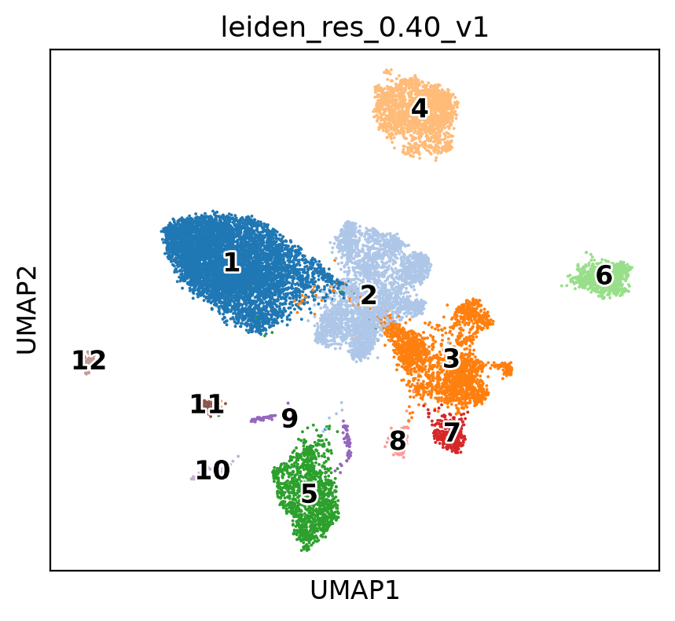

## Cluster similarity

Each cluster’s expression profile correlated against every other
cluster’s. A profile is the mean normalized expression of the cells in
the cluster, and the correlation is Spearman over this preparation’s
most variable genes.

The same matrix is drawn twice, both panels ordered down the dendrogram
it defines. On the left the clusters carry their size-rank numbers,
which that ordering leaves out of sequence; on the right the same
clusters are renumbered 1 to k along the order they now sit in. A
position means the same cluster in both panels, so reading one against
the other gives the mapping.

<details>
<summary>Code</summary>

``` python
# the variable genes rather than all of them: these are the axes the batch was clustered on,
# where the correlation below needs every gene it can get because a single cell is mostly
# zero. A centroid is dense, so the housekeeping bulk of the full gene set would lift every
# pair together and flatten the contrast this figure is made of.
variable_genes = wr_joyal.var_names[wr_joyal.var["highly_variable"]]
cluster_centroids = pd.DataFrame(
    np.asarray(wr_joyal[:, variable_genes].X.todense()),
    index=wr_joyal.obs[ranked_key],
    columns=variable_genes,
).groupby(level=0, observed=True).mean()

# Spearman, written out the same way as the reference correlation below
ranked_centroids = cluster_centroids.rank(axis=1).to_numpy()
ranked_centroids = ranked_centroids - ranked_centroids.mean(axis=1, keepdims=True)
centroid_norms = np.sqrt((ranked_centroids ** 2).sum(axis=1))
self_correlation = pd.DataFrame(
    (ranked_centroids @ ranked_centroids.T) / (centroid_norms[:, None] * centroid_norms[None, :]),
    index=cluster_centroids.index,
    columns=cluster_centroids.index,
)

# squareform first, and this is the easy part to lose: linkage picks its input by shape, so a
# square matrix handed over directly is read as observations x features rather than as
# distances — no error, and a different question answered. 1 - r is the correlation distance.
# checks=False because floating point can leave the diagonal a hair off zero.
leaf_order = leaves_list(linkage(squareform(1.0 - self_correlation.to_numpy(), checks=False),
                                 method="average", optimal_ordering=True))

# the new numbering: position down the dendrogram, so 1 is the leftmost leaf and neighbouring
# numbers are transcriptionally adjacent. Size rank says only how many cells a cluster holds,
# which orders the axes of every figure downstream by nothing in particular.
dendrogram_key = f"leiden_res_{wr_joyal_resolution:.2f}_v2"
dendrogram_labels = [str(position) for position in range(1, len(leaf_order) + 1)]
dendrogram_calls = dict(zip(self_correlation.index[leaf_order], dendrogram_labels))

wr_joyal.obs[dendrogram_key] = (
    wr_joyal.obs[ranked_key]
    .map(dendrogram_calls)
    .astype("category")
    .cat.reorder_categories(dendrogram_labels)
)
wr_joyal.uns[f"{dendrogram_key}_colors"] = [        # tab20 again, cycled once past 20 clusters
    mcolors.to_hex(plt.cm.tab20.colors[(int(label) - 1) % 20]) for label in dendrogram_labels
]

# both panels are the same matrix in the same dendrogram order — only the labels differ, which
# is the point: the left says which size rank each leaf is, the right renumbers those leaves
# 1 to k, and reading a position across the two panels gives the mapping between them.
ordered_correlation = self_correlation.iloc[leaf_order, leaf_order]
correlation_panels = {
    "Size rank (v1)": (ordered_correlation, list(self_correlation.index[leaf_order])),
    "Dendrogram order (v2)": (ordered_correlation, dendrogram_labels),
}

# vmin at the matrix minimum rather than 0, because the values sit in a narrow band well above
# zero that a fixed floor would flatten.
values = self_correlation.to_numpy()
low, high = values.min(), values.max()

fig, axes = plt.subplots(1, len(correlation_panels), squeeze=False, figsize=(9, 4.3),
                         constrained_layout=True)
for ax, (title, (matrix, labels)) in zip(axes.flat, correlation_panels.items()):
    panel = matrix.to_numpy()
    image = ax.imshow(panel, cmap="viridis", aspect="auto", vmin=low, vmax=high)
    ax.set_title(title, fontsize=9)
    ax.set_xticks(range(len(labels)), labels, rotation=45, ha="right", fontsize=6)
    ax.set_yticks(range(len(labels)), labels, fontsize=6)
    ax.set_xlabel("Cluster", fontsize=8)
    ax.set_ylabel("Cluster", fontsize=8)

    # annotated only while the grid is coarse enough for the numbers to be legible
    if panel.size <= 240:
        threshold = low + (high - low) * 0.6
        for row in range(panel.shape[0]):
            for column in range(panel.shape[1]):
                ax.text(column, row, f"{panel[row, column]:.2f}", ha="center", va="center",
                        fontsize=5, color="black" if panel[row, column] > threshold else "white")

fig.colorbar(image, ax=axes, shrink=0.6, pad=0.02, aspect=25, label="Spearman r")
plt.show()
plt.close(fig)
```

</details>

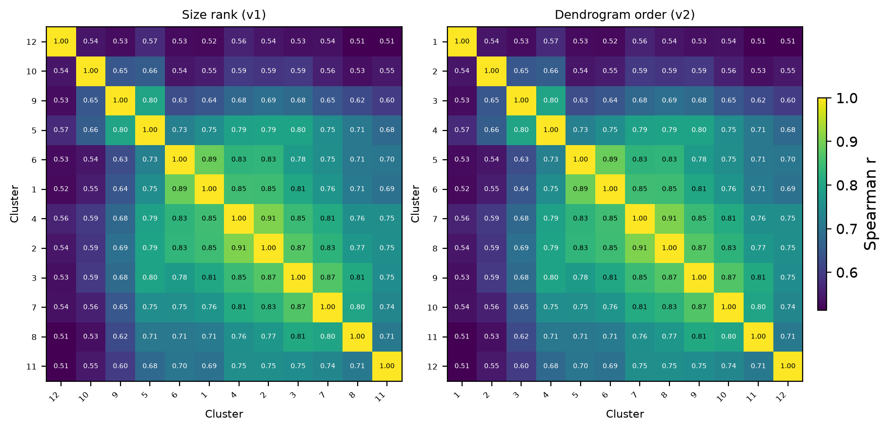

## Renumbered clusters on the UMAP

The same embedding as before, coloured and labelled by the dendrogram
numbering rather than by size rank. Each point is a cell, and each
cluster’s v2 number is drawn on top of the cells that carry it. This is
the numbering every figure below uses.

<details>
<summary>Code</summary>

``` python
plt.rcParams["figure.figsize"] = (5.0, 4.3)

ax = sc.pl.umap(
    wr_joyal,
    color=dendrogram_key,
    legend_loc="on data",
    legend_fontoutline=2,
    frameon=True,
    show=False,
)
ax.set_aspect("equal", adjustable="datalim")
plt.show()
```

</details>

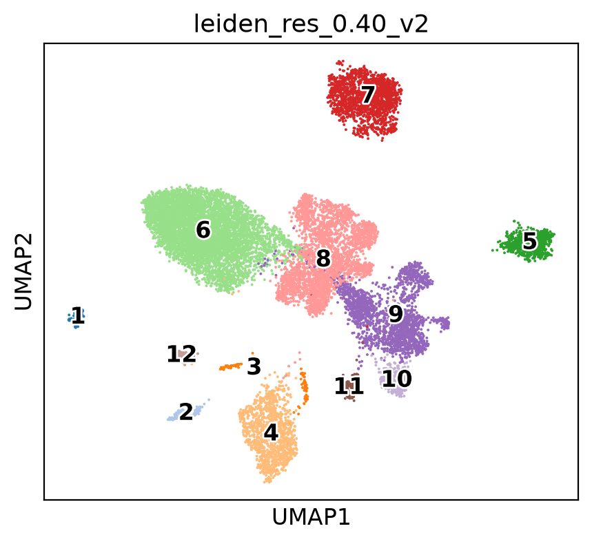

## QC metrics

Let’s look at the QC metrics for the batch as a whole. Each panel is one
metric — genes detected, total expression, and the mitochondrial,
ribosomal and hemoglobin percentages — drawn as a violin over every cell
in the batch, with the box inside it marking the quartiles and the
median. The metrics were computed on the normalized matrix, so they are
log1p sums rather than UMI fractions.

<details>
<summary>Code</summary>

``` python
qc_metrics = {
    "n_genes_by_log1p": "Genes detected",
    "total_log1p": "Total expression",
    "pct_log1p_mt": "% mitochondrial",
    "pct_log1p_ribo": "% ribosomal",
    "pct_log1p_hb": "% hemoglobin",
}
violin_inner_kws = {"box_width": 2, "whis_width": 1, "marker": "o",
                    "markersize": 3.0, "markeredgecolor": "white"}

qc_df = sc.get.obs_df(wr_joyal, keys=[dendrogram_key] + list(qc_metrics))
batch_color = wr_joyal.uns["batch_colors"][0]

fig, axes = plt.subplots(1, len(qc_metrics), squeeze=False, figsize=(9, 3.0),
                         constrained_layout=True)
for ax, (qc_key, qc_label) in zip(axes.flat, qc_metrics.items()):
    sns.violinplot(data=qc_df, y=qc_key, color=batch_color, cut=0, density_norm="width",
                   inner="box", inner_kws=violin_inner_kws, linewidth=0.5, ax=ax)
    ax.set_ylabel(qc_label, fontsize=9)
    ax.tick_params(axis="y", labelsize=8)
    ax.grid(axis="y", color="#b0b0b0", linewidth=0.6)
    ax.set_axisbelow(True)

plt.show()
plt.close(fig)
```

</details>

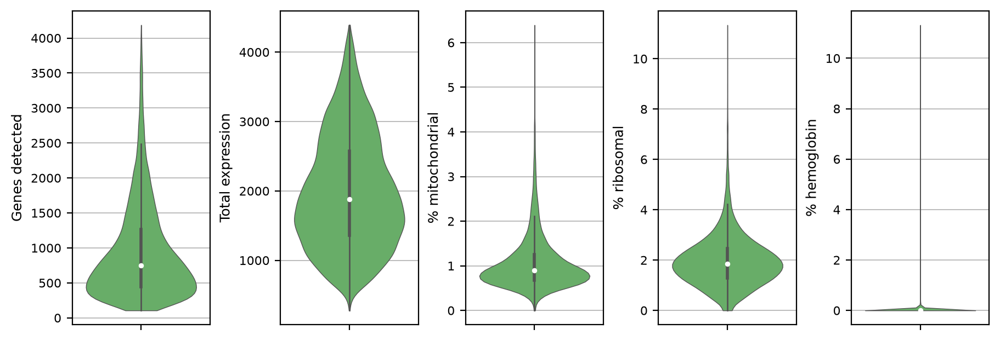

## QC metrics by cluster

Three of those metrics again, one per row, with the cells split along
the x axis by cluster. Each violin takes its colour from the cluster
palette the UMAP above uses, so a cluster is the same colour in both
figures.

<details>
<summary>Code</summary>

``` python
# only scanpy reads the _colors entry out of uns, so the palette is handed to seaborn
# explicitly — otherwise a cluster changes color between the UMAP and these violins
cluster_palette = dict(zip(wr_joyal.obs[dendrogram_key].cat.categories, wr_joyal.uns[f"{dendrogram_key}_colors"]))

# the ribosomal and hemoglobin fractions are dropped here. Split across every cluster they are
# a flat line and a row of spikes, and the three that are left carry the figure. Both are still
# on the batch-level violins above, and on the slides that inspect one cluster at a time — the
# hemoglobin fraction is the whole story on one of them.
cluster_qc_metrics = {
    qc_key: qc_label for qc_key, qc_label in qc_metrics.items()
    if qc_key not in ("pct_log1p_ribo", "pct_log1p_hb")
}

fig, axes = plt.subplots(len(cluster_qc_metrics), 1, squeeze=False, sharex=True, figsize=(9, 4.3),
                         constrained_layout=True)
for ax, (qc_key, qc_label) in zip(axes.flat, cluster_qc_metrics.items()):
    # dodge=False because hue repeats x: left on, seaborn gives each of the 21 clusters its
    # own sub-slot and every violin is drawn a twentieth of its slot wide, off its tick
    sns.violinplot(data=qc_df, x=dendrogram_key, y=qc_key, hue=dendrogram_key, palette=cluster_palette,
                   legend=False, dodge=False, cut=0, density_norm="width", inner="box",
                   inner_kws=violin_inner_kws, linewidth=0.5, saturation=1, ax=ax)

    # seaborn colours the bodies in an order that does not follow the x positions when hue
    # repeats x, so each is recoloured from the cluster it actually sits under. The order
    # comes off the categorical rather than the tick labels, which are empty on a shared axis.
    cluster_order = list(wr_joyal.obs[dendrogram_key].cat.categories)
    for body in ax.collections:
        extents = body.get_paths()[0].get_extents()
        body.set_facecolor(cluster_palette[cluster_order[round((extents.x0 + extents.x1) / 2)]])

    ax.set_ylabel(qc_label, fontsize=7)
    ax.set_xlabel("")
    ax.tick_params(axis="y", labelsize=6)
    ax.grid(axis="y", color="#b0b0b0", linewidth=0.6)
    ax.set_axisbelow(True)

axes[-1][0].set_xlabel("Cluster", fontsize=9)
axes[-1][0].tick_params(axis="x", labelsize=8)
plt.show()
plt.close(fig)
```

</details>

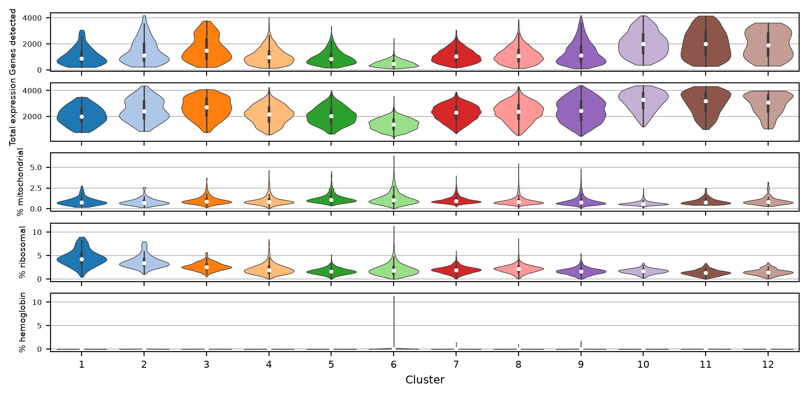

## Correlation with the reference

Each cell correlated against the same centroids, over every gene the
query and the reference share. The values are standardized within each
cell.

<details>
<summary>Code</summary>

``` python
# computed in the clustering step and saved with the object, so this reads it back. The
# columns lose their prefix here, so a call is the class name rather than the column name
reference_classes = sorted(reference_centroids.obs_names)
correlation_keys = [f"corr_{cell_class}" for cell_class in reference_classes]
cell_correlation = wr_joyal.obs[correlation_keys].rename(
    columns=dict(zip(correlation_keys, reference_classes))
)

wr_joyal.obs["cell_type_per_cell"] = pd.Categorical(
    cell_correlation.idxmax(axis=1),
    categories=sorted(reference_centroids.obs_names),
)

cell_composition = pd.crosstab(wr_joyal.obs[dendrogram_key], wr_joyal.obs["cell_type_per_cell"])
```

</details>

## Per-cell calls on the UMAP

The same embedding, coloured by each cell’s own best-correlating
reference class rather than by the cluster it fell in. Every cell
carries a call, made from that one cell’s correlations and independent
of its neighbours.

<details>
<summary>Code</summary>

``` python
# keyed on every class in the reference rather than only the ones called, so a class keeps its
# colour here, on the cell type UMAP below, and in every violin after it
call_palette = dict(zip(sorted(reference_centroids.obs_names), sc.pl.palettes.default_20))
wr_joyal.uns["cell_type_per_cell_colors"] = [
    call_palette[cell_class] for cell_class in wr_joyal.obs["cell_type_per_cell"].cat.categories
]

plt.rcParams["figure.figsize"] = (6.5, 4.3)

ax = sc.pl.umap(
    wr_joyal,
    color="cell_type_per_cell",
    frameon=True,
    show=False,
)
ax.set_aspect("equal", adjustable="datalim")
plt.show()
```

</details>

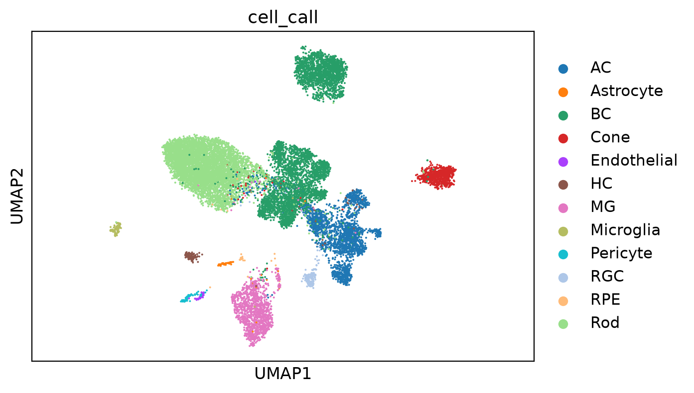

## Correlation on the UMAP

The same correlations, one panel per reference class. Each panel colours
every cell by its standardized correlation with that class, on its own
scale.

<details>
<summary>Code</summary>

``` python
# one panel per class, straight off the obs columns the clustering step wrote. Standardizing
# is what makes a panel about preference rather than depth, and it happens once up there rather
# than here, so each panel scales to its own values.
reference_classes = sorted(reference_centroids.obs_names)
correlation_keys = [f"corr_{cell_class}" for cell_class in reference_classes]

# a class listed here is clipped to the limits given instead, for when one panel's range is set
# by a handful of cells and buries the rest:
#   correlation_clips = {"RPE": (-1, 2), "Rod": (0, 3)}
# passed only when something is in it, because scanpy reads the two lists positionally and has
# no entry that means "leave this panel alone"
correlation_clips = {}
clip_arguments = {}
if correlation_clips:
    clip_arguments = {
        "vmin": [correlation_clips.get(c, (None, None))[0] for c in reference_classes],
        "vmax": [correlation_clips.get(c, (None, None))[1] for c in reference_classes],
    }

plt.rcParams["figure.figsize"] = (2.3, 2.0)      # per panel, so four across come to about 9

axes = sc.pl.umap(
    wr_joyal,
    color=correlation_keys,
    title=reference_classes,                     # the prefix is for obs, not for the reader
    ncols=4,
    size=1,                                      # fixed, rather than scaled by cell count
    frameon=True,
    show=False,
    **clip_arguments,
)

# scanpy labels the axes of every panel, and UMAP1 lands on the title of the panel below it.
# The frame is worth keeping, the labels are not — the whole figure is one embedding
for panel in axes:
    panel.set_xlabel("")
    panel.set_ylabel("")

plt.show()
```

</details>

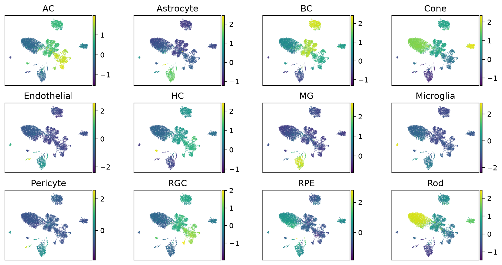

## Correlation by cluster

The per-cell correlations averaged over each cluster, drawn three ways:
the mean as it stands, scaled across each row, and scaled down each
column.

<details>
<summary>Code</summary>

``` python
# the matrix three ways. The values are standardized per cell upstream, so the first panel is
# a mean z rather than a mean correlation, and is comparable down a column as well as across a
# row. The row-scaled panel is the annotation question: which class best fits this cluster.
#
# only the row scaling is a call. A column's brightest cell is the best home for that class
# whether or not the class is present at all: RPE peaks somewhere in every batch, which says
# where it would land rather than that it was found.
mean_cell_correlation = cell_correlation.groupby(wr_joyal.obs[dendrogram_key], observed=True).mean()

cluster_range = mean_cell_correlation.max(axis=1) - mean_cell_correlation.min(axis=1)
cells_scaled_by_cluster = mean_cell_correlation.sub(
    mean_cell_correlation.min(axis=1), axis=0
).div(cluster_range, axis=0)

class_range = mean_cell_correlation.max(axis=0) - mean_cell_correlation.min(axis=0)
cells_scaled_by_class = mean_cell_correlation.sub(
    mean_cell_correlation.min(axis=0), axis=1
).div(class_range, axis=1)

cell_correlation_panels = {
    "Mean per-cell z": mean_cell_correlation,
    "Scaled per cluster": cells_scaled_by_cluster,
    "Scaled per class": cells_scaled_by_class,
}

# walk the clusters in order and take each one's best class; a class already placed is
# skipped, and any class no cluster leads with is appended, so the matches read as a diagonal
cell_class_order = []
for cluster in cells_scaled_by_cluster.index:
    best = cells_scaled_by_cluster.loc[cluster].idxmax()
    if best not in cell_class_order:
        cell_class_order.append(best)
cell_class_order += [n for n in cells_scaled_by_cluster.columns if n not in cell_class_order]

fig, axes = plt.subplots(1, len(cell_correlation_panels), squeeze=False, figsize=(9, 4.3),
                         constrained_layout=True)
for ax, (title, matrix) in zip(axes.flat, cell_correlation_panels.items()):
    sns.heatmap(matrix[cell_class_order], cmap="viridis", linewidths=0.5, linecolor="white",
                xticklabels=True, yticklabels=True,
                cbar_kws={"shrink": 0.6, "pad": 0.02}, ax=ax)
    ax.set_title(title, fontsize=9)
    ax.set_xlabel("Reference class", fontsize=8)
    ax.set_ylabel("Cluster", fontsize=8)
    ax.tick_params(axis="x", labelrotation=45, labelsize=7)
    ax.tick_params(axis="y", labelrotation=0, labelsize=7)
    for label in ax.get_xticklabels():
        label.set_ha("right")

plt.show()
plt.close(fig)
```

</details>


## Call composition by cluster

The same per-cell calls counted up inside each cluster. Every row is a
cluster and every column a reference class, and a square is the share of
that cluster’s cells whose own best match was that class — so a row sums
to one. The columns are ordered by which class each cluster leads with,
which puts the matches on the diagonal. A boxed square is a class that
took at least the threshold share of its cluster’s cells; a cluster with
no boxed square did not concentrate on any one class, and its number is
starred on the axis.

<details>
<summary>Code</summary>

``` python
# a share of the cluster rather than a count, so a small cluster is read on the same scale as
# a large one and a row sums to one
composition = cell_composition.div(cell_composition.sum(axis=1), axis=0)

composition = composition.reindex(columns=sorted(reference_centroids.obs_names), fill_value=0.0)

# walk the clusters in order and take each one's largest class; a class already placed is
# skipped, and any class no cluster leads with is appended, so the matches read as a diagonal.
# The columns are this batch's own order, so the two preparations no longer line up column for
# column — the labels are what to read across, not the position.
class_order = []
for cluster in composition.index:
    largest = composition.loc[cluster].idxmax()
    if largest not in class_order:
        class_order.append(largest)
class_order += [c for c in composition.columns if c not in class_order]
composition = composition[class_order]

# the share one class has to take for the cluster to be settled on it. Nothing here reads it:
# the box is a flag to look at, and the annotation below still calls every cluster by the
# correlation argmax.
purity_threshold = 0.9

values = composition.to_numpy()
settled = values.max(axis=1) >= purity_threshold      # a cluster with no boxed class is flagged

# the call this figure implies: a settled cluster takes its majority class, and a flagged one
# is named Ambiguous rather than guessed at. This is the document's cell type — every figure
# below reads it.
cluster_calls = {
    cluster: (composition.loc[cluster].idxmax() if is_settled else "Ambiguous")
    for cluster, is_settled in zip(composition.index, settled)
}

# a cluster the figures further down settled, named here by hand and keyed on its v2 number.
# This is the one place a call is made by a person rather than by the threshold, and it is why
# the threshold can stay strict: a large cluster that misses it is resolved by looking rather
# than by moving the line. Empty means nothing has been resolved yet.
resolved_clusters = {}
cluster_calls.update(resolved_clusters)

cluster_types = sorted({call for call in cluster_calls.values() if call != "Ambiguous"})
if "Ambiguous" in cluster_calls.values():
    cluster_types.append("Ambiguous")             # last, so it sits at the end of the legend

wr_joyal.obs["cell_type"] = (
    wr_joyal.obs[dendrogram_key]
    .map(cluster_calls)
    .astype("category")
    .cat.reorder_categories(cluster_types)
)
# the reference classes keep the colours they carry on the call UMAP above; Ambiguous is grey,
# being the absence of a call rather than a class of its own
cell_type_palette = dict(zip(sorted(reference_centroids.obs_names), sc.pl.palettes.default_20))
cell_type_palette["Ambiguous"] = "#cccccc"
wr_joyal.uns["cell_type_colors"] = [
    cell_type_palette[cell_type] for cell_type in wr_joyal.obs["cell_type"].cat.categories
]

fig, ax = plt.subplots(figsize=(9, 4.3), constrained_layout=True)
image = ax.imshow(values, cmap="viridis", aspect="auto", vmin=0.0, vmax=1.0)
ax.set_xticks(range(composition.shape[1]), composition.columns, rotation=45, ha="right",
              fontsize=7)
# the flagged clusters called out on the axis as well, so they read down the edge without
# having to find the row that is missing a box. The star goes on at tick time: a tick label's
# text is regenerated from the formatter, so setting it on the label object afterwards is lost
cluster_labels = [
    str(cluster) if is_settled else f"{cluster} *"
    for cluster, is_settled in zip(composition.index, settled)
]
ax.set_yticks(range(composition.shape[0]), cluster_labels, fontsize=7)
for tick, is_settled in zip(ax.get_yticklabels(), settled):
    if not is_settled:
        tick.set_color("#d62728")
        tick.set_fontweight("bold")

ax.set_xlabel("Reference class", fontsize=9)
ax.set_ylabel("Cluster", fontsize=9)

for row in range(values.shape[0]):
    for column in range(values.shape[1]):
        share = values[row, column]
        # three decimals, so a share just under the threshold does not round to it and read as
        # a square that should have been boxed
        ax.text(column, row, f"{share:.3f}", ha="center", va="center", fontsize=5,
                color="black" if share > 0.6 else "white")
        if share >= purity_threshold:
            ax.add_patch(Rectangle((column - 0.5, row - 0.5), 1, 1, fill=False,
                                   edgecolor="#d62728", linewidth=1.8))

fig.colorbar(image, ax=ax, shrink=0.6, pad=0.02, aspect=25, label="Share of cluster")
plt.show()
plt.close(fig)
```

</details>

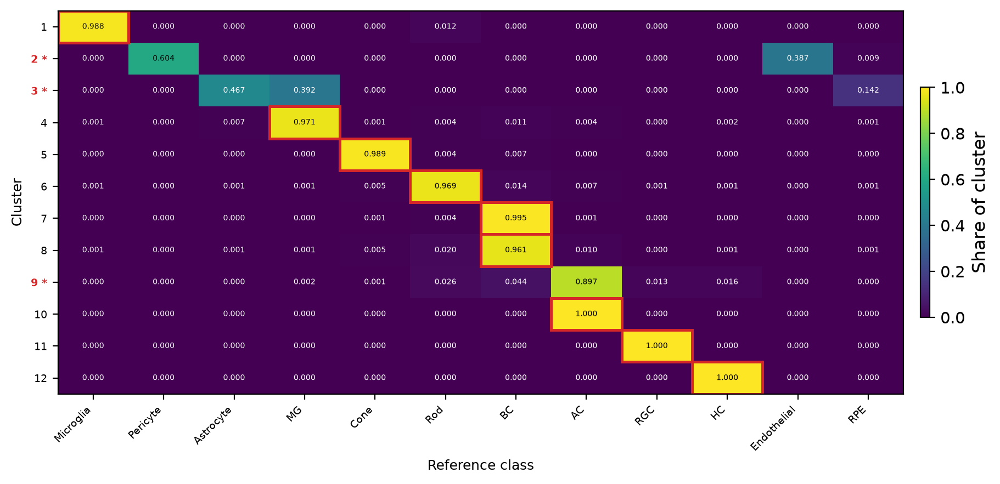

## Cell type calls on the UMAP

The calls the heatmap above implies, drawn on the embedding. A cluster
whose cells concentrated on one reference class takes that class, and a
flagged cluster is left Ambiguous in grey rather than named on a split
vote. This is the cell type every figure below reads, so a cluster stays
grey in all of them until it is resolved.

<details>
<summary>Code</summary>

``` python
plt.rcParams["figure.figsize"] = (6.5, 4.3)

ax = sc.pl.umap(
    wr_joyal,
    color="cell_type",
    frameon=True,
    show=False,
)
ax.set_aspect("equal", adjustable="datalim")
plt.show()
```

</details>

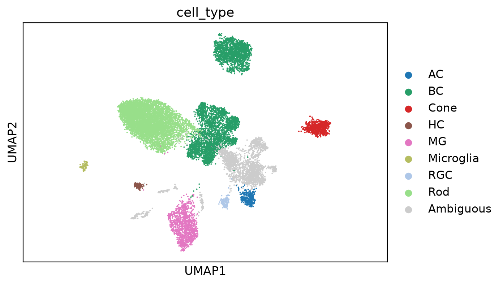

## Flagged clusters on the UMAP

One panel per cluster the composition left ambiguous. Each panel draws
the whole embedding in grey and then that cluster’s own cells coloured
by their per-cell call, on the palette the call UMAP uses.

<details>
<summary>Code</summary>

``` python
# the clusters the composition could not settle, taken off the call column rather than
# recomputed, so this figure and the heatmap above can never disagree about which they are
per_cluster_call = wr_joyal.obs.groupby(dendrogram_key, observed=True)["cell_type"].first()
flagged_clusters = per_cluster_call.index[per_cluster_call == "Ambiguous"].tolist()

call_palette = dict(zip(sorted(reference_centroids.obs_names), sc.pl.palettes.default_20))
umap_coords = wr_joyal.obsm["X_umap"]

# drawn with scatter rather than sc.pl.umap, for the grey underlay and a fixed point size —
# scanpy scales its points by cell count, so a panel of 43 cells would carry much larger
# points than one of 2,000
columns = min(len(flagged_clusters), 3)
rows = int(np.ceil(len(flagged_clusters) / columns))
fig, axes = plt.subplots(rows, columns, squeeze=False, figsize=(9, 3.2 * rows),
                         constrained_layout=True)

handles = {}
for ax, cluster in zip(axes.flat, flagged_clusters):
    in_cluster = (wr_joyal.obs[dendrogram_key] == cluster).to_numpy()
    ax.scatter(umap_coords[:, 0], umap_coords[:, 1], s=1, c="#e0e0e0", linewidths=0)

    # each class drawn on its own, so the legend can carry one entry per class across panels
    calls = wr_joyal.obs["cell_type_per_cell"]
    for cell_class in calls[in_cluster].value_counts().index:
        selected = in_cluster & (calls == cell_class).to_numpy()
        if not selected.any():
            continue
        points = ax.scatter(umap_coords[selected, 0], umap_coords[selected, 1], s=2.5,
                            c=call_palette[cell_class], linewidths=0)
        handles.setdefault(cell_class, points)

    ax.set_title(f"Cluster {cluster}  (n={in_cluster.sum():,})", fontsize=9)
    ax.set_aspect("equal", adjustable="datalim")
    ax.set_xticks([])
    ax.set_yticks([])

for ax in axes.flat[len(flagged_clusters):]:
    ax.axis("off")

fig.legend(handles.values(), handles.keys(), title="", fontsize=7, frameon=False,
           loc="center left", bbox_to_anchor=(1.0, 0.5), markerscale=4)
plt.show()
plt.close(fig)
```

</details>

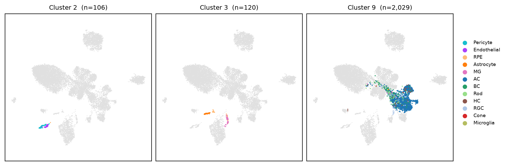

## Resolving cluster 2

One flagged cluster on a single slide. On the left its cells sit on the
embedding, coloured by their own per-cell call, against the rest of the
batch in grey. On the right the same cells are placed by their
correlation with the two classes most of them call, with the diagonal
marking where a cell correlates equally with both. Along the bottom each
QC metric compares the cluster’s cells with every other cell in the
batch.

<details>
<summary>Code</summary>

``` python
cluster_of_interest = "2"        # the v2 number, changed to look at another flagged cluster

in_cluster = (wr_joyal.obs[dendrogram_key] == cluster_of_interest).to_numpy()
calls = wr_joyal.obs["cell_type_per_cell"]
call_palette = dict(zip(sorted(reference_centroids.obs_names), sc.pl.palettes.default_20))

qc_df = sc.get.obs_df(wr_joyal, keys=list(qc_metrics))
qc_df["group"] = np.where(in_cluster, f"Cluster {cluster_of_interest}", "Other cells")
group_order = [f"Cluster {cluster_of_interest}", "Other cells"]
group_palette = dict(zip(group_order, ["#d62728", "#bfbfbf"]))

# the embedding and the two contested correlations across the top, the QC metrics along the
# bottom, so one slide carries the whole case for a cluster. Ten columns, because the five QC
# panels each span two of them
fig, axes = plt.subplot_mosaic(
    [["umap"] * 5 + ["scatter"] * 5,
     [qc_key for qc_key in qc_metrics for _ in range(2)]],
    figsize=(9, 6.2), height_ratios=[1.5, 1], constrained_layout=True,
)

umap_coords = wr_joyal.obsm["X_umap"]
axes["umap"].scatter(umap_coords[:, 0], umap_coords[:, 1], s=1, c="#e0e0e0", linewidths=0)
for cell_class, count in calls[in_cluster].value_counts().items():
    if count == 0:
        continue
    selected = in_cluster & (calls == cell_class).to_numpy()
    share = count / in_cluster.sum()
    axes["umap"].scatter(umap_coords[selected, 0], umap_coords[selected, 1], s=6,
                         c=call_palette[cell_class], linewidths=0,
                         label=f"{cell_class}  {share:.0%}")

axes["umap"].set_title(f"Cluster {cluster_of_interest}  (n={in_cluster.sum():,})", fontsize=10)
axes["umap"].set_aspect("equal", adjustable="datalim")
axes["umap"].set_xticks([])
axes["umap"].set_yticks([])
axes["umap"].legend(title="", fontsize=7, frameon=False, loc="upper left", markerscale=3)

# the two classes most of the cluster's cells call, which is the choice the slide is about.
# Every cell of the cluster placed by how well it correlates with each — two arms off the
# diagonal is two populations, one cloud straddling it is one.
contested = calls[in_cluster].value_counts().index[:2].tolist()
for cell_class, count in calls[in_cluster].value_counts().items():
    if count == 0:
        continue
    selected = in_cluster & (calls == cell_class).to_numpy()
    axes["scatter"].scatter(wr_joyal.obs.loc[selected, f"corr_{contested[0]}"],
                            wr_joyal.obs.loc[selected, f"corr_{contested[1]}"],
                            s=14, c=call_palette[cell_class], linewidths=0)

# the diagonal, where a cell correlates equally with both
span = [
    min(wr_joyal.obs.loc[in_cluster, f"corr_{cell_class}"].min() for cell_class in contested),
    max(wr_joyal.obs.loc[in_cluster, f"corr_{cell_class}"].max() for cell_class in contested),
]
axes["scatter"].plot(span, span, color="#888888", linewidth=0.8, linestyle="--", zorder=0)
axes["scatter"].set_title("Correlation, the two contested classes", fontsize=10)
axes["scatter"].set_xlabel(contested[0], fontsize=8)
axes["scatter"].set_ylabel(contested[1], fontsize=8)
axes["scatter"].tick_params(labelsize=6)
sns.despine(ax=axes["scatter"])

for qc_key, qc_label in qc_metrics.items():
    ax = axes[qc_key]
    sns.violinplot(data=qc_df, x="group", y=qc_key, order=group_order, hue="group",
                   hue_order=group_order, palette=group_palette, legend=False, cut=0,
                   density_norm="width", inner="box", inner_kws=violin_inner_kws,
                   linewidth=0.5, saturation=1, ax=ax)
    ax.set_title(qc_label, fontsize=8)
    ax.set_xlabel("")
    ax.set_ylabel("")
    ax.tick_params(axis="x", labelsize=6)
    ax.tick_params(axis="y", labelsize=6)
    ax.grid(axis="y", color="#b0b0b0", linewidth=0.6)
    ax.set_axisbelow(True)
    sns.despine(ax=ax)

plt.show()
plt.close(fig)
```

</details>

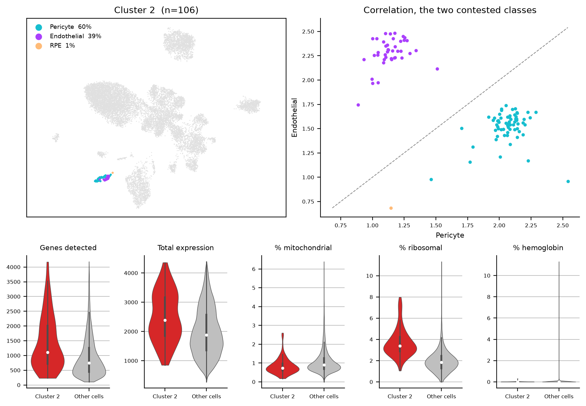

Pericyte takes 60% of this cluster and endothelial 39%. On the embedding
the two sit at opposite ends of the island; on the scatter they form two
clouds with nothing between them. Genes detected and total expression
both run above the rest of the batch.

One cell calls RPE, at RPE 1.20, Pericyte 1.14 and Astrocyte 1.11.

<details>
<summary>Code</summary>

``` python
# the call, written here rather than collected somewhere else, so it sits with the figure it
# was read off. A string column while the resolutions are being made; the section below turns
# it back into a categorical once they are all in.
#
# a mixture, so the cells take their own calls. Naming the classes by hand would mean deciding
# in advance what the cluster is allowed to contain, and cluster 3 below is the argument against
# that: its minority call turned out to be a real population.
cell_type = wr_joyal.obs["cell_type"].astype(str)
cell_type[in_cluster] = wr_joyal.obs["cell_type_per_cell"].astype(str)[in_cluster]
wr_joyal.obs["cell_type"] = cell_type
```

</details>

## Resolving cluster 3

One flagged cluster on a single slide. On the left its cells sit on the
embedding, coloured by their own per-cell call, against the rest of the
batch in grey. On the right the same cells are placed by their
correlation with the two classes most of them call, with the diagonal
marking where a cell correlates equally with both. Along the bottom each
QC metric compares the cluster’s cells with every other cell in the
batch.

<details>
<summary>Code</summary>

``` python
cluster_of_interest = "3"        # the v2 number, changed to look at another flagged cluster

in_cluster = (wr_joyal.obs[dendrogram_key] == cluster_of_interest).to_numpy()
calls = wr_joyal.obs["cell_type_per_cell"]
call_palette = dict(zip(sorted(reference_centroids.obs_names), sc.pl.palettes.default_20))

qc_df = sc.get.obs_df(wr_joyal, keys=list(qc_metrics))
qc_df["group"] = np.where(in_cluster, f"Cluster {cluster_of_interest}", "Other cells")
group_order = [f"Cluster {cluster_of_interest}", "Other cells"]
group_palette = dict(zip(group_order, ["#d62728", "#bfbfbf"]))

# the embedding and the two contested correlations across the top, the QC metrics along the
# bottom, so one slide carries the whole case for a cluster. Ten columns, because the five QC
# panels each span two of them
fig, axes = plt.subplot_mosaic(
    [["umap"] * 5 + ["scatter"] * 5,
     [qc_key for qc_key in qc_metrics for _ in range(2)]],
    figsize=(9, 6.2), height_ratios=[1.5, 1], constrained_layout=True,
)

umap_coords = wr_joyal.obsm["X_umap"]
axes["umap"].scatter(umap_coords[:, 0], umap_coords[:, 1], s=1, c="#e0e0e0", linewidths=0)
for cell_class, count in calls[in_cluster].value_counts().items():
    if count == 0:
        continue
    selected = in_cluster & (calls == cell_class).to_numpy()
    share = count / in_cluster.sum()
    axes["umap"].scatter(umap_coords[selected, 0], umap_coords[selected, 1], s=6,
                         c=call_palette[cell_class], linewidths=0,
                         label=f"{cell_class}  {share:.0%}")

axes["umap"].set_title(f"Cluster {cluster_of_interest}  (n={in_cluster.sum():,})", fontsize=10)
axes["umap"].set_aspect("equal", adjustable="datalim")
axes["umap"].set_xticks([])
axes["umap"].set_yticks([])
axes["umap"].legend(title="", fontsize=7, frameon=False, loc="upper left", markerscale=3)

# the two classes most of the cluster's cells call, which is the choice the slide is about.
# Every cell of the cluster placed by how well it correlates with each — two arms off the
# diagonal is two populations, one cloud straddling it is one.
contested = calls[in_cluster].value_counts().index[:2].tolist()
for cell_class, count in calls[in_cluster].value_counts().items():
    if count == 0:
        continue
    selected = in_cluster & (calls == cell_class).to_numpy()
    axes["scatter"].scatter(wr_joyal.obs.loc[selected, f"corr_{contested[0]}"],
                            wr_joyal.obs.loc[selected, f"corr_{contested[1]}"],
                            s=14, c=call_palette[cell_class], linewidths=0)

# the diagonal, where a cell correlates equally with both
span = [
    min(wr_joyal.obs.loc[in_cluster, f"corr_{cell_class}"].min() for cell_class in contested),
    max(wr_joyal.obs.loc[in_cluster, f"corr_{cell_class}"].max() for cell_class in contested),
]
axes["scatter"].plot(span, span, color="#888888", linewidth=0.8, linestyle="--", zorder=0)
axes["scatter"].set_title("Correlation, the two contested classes", fontsize=10)
axes["scatter"].set_xlabel(contested[0], fontsize=8)
axes["scatter"].set_ylabel(contested[1], fontsize=8)
axes["scatter"].tick_params(labelsize=6)
sns.despine(ax=axes["scatter"])

for qc_key, qc_label in qc_metrics.items():
    ax = axes[qc_key]
    sns.violinplot(data=qc_df, x="group", y=qc_key, order=group_order, hue="group",
                   hue_order=group_order, palette=group_palette, legend=False, cut=0,
                   density_norm="width", inner="box", inner_kws=violin_inner_kws,
                   linewidth=0.5, saturation=1, ax=ax)
    ax.set_title(qc_label, fontsize=8)
    ax.set_xlabel("")
    ax.set_ylabel("")
    ax.tick_params(axis="x", labelsize=6)
    ax.tick_params(axis="y", labelsize=6)
    ax.grid(axis="y", color="#b0b0b0", linewidth=0.6)
    ax.set_axisbelow(True)
    sns.despine(ax=ax)

plt.show()
plt.close(fig)
```

</details>

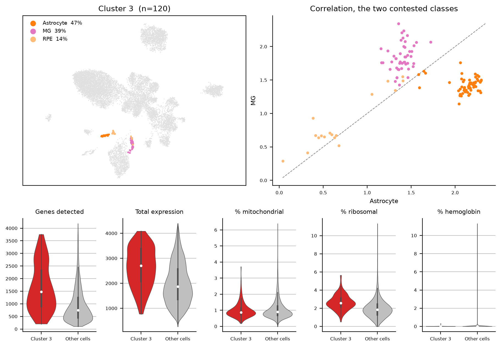

Astrocyte takes 47% of this cluster, Müller glia 39% and RPE 14%.
Astrocyte and Müller glia sit in separate places on the embedding and in
two clouds on the scatter.

The RPE-called cells are low on both axes of that scatter. Their mean
standardized correlation to RPE is 2.34, against 0.76 for the rest of
the cluster and -0.10 across the batch, and the weakest of them sits
above the batch’s 99th percentile. On the embedding they sit apart from
the rest of the cluster, in a tighter group. They carry a median 614
genes against the cluster’s 1,591.

<details>
<summary>Code</summary>

``` python
# a mixture of three, so the cells take their own calls. The RPE cells are specifically high on
# RPE rather than uniformly low, which is what makes them a population rather than a tail.
cell_type = wr_joyal.obs["cell_type"].astype(str)
cell_type[in_cluster] = wr_joyal.obs["cell_type_per_cell"].astype(str)[in_cluster]
wr_joyal.obs["cell_type"] = cell_type
```

</details>

## Resolving cluster 9

One flagged cluster on a single slide. On the left its cells sit on the
embedding, coloured by their own per-cell call, against the rest of the
batch in grey. On the right the same cells are placed by their
correlation with the two classes most of them call, with the diagonal
marking where a cell correlates equally with both. Along the bottom each
QC metric compares the cluster’s cells with every other cell in the
batch.

<details>
<summary>Code</summary>

``` python
cluster_of_interest = "9"        # the v2 number, changed to look at another flagged cluster

in_cluster = (wr_joyal.obs[dendrogram_key] == cluster_of_interest).to_numpy()
calls = wr_joyal.obs["cell_type_per_cell"]
call_palette = dict(zip(sorted(reference_centroids.obs_names), sc.pl.palettes.default_20))

qc_df = sc.get.obs_df(wr_joyal, keys=list(qc_metrics))
qc_df["group"] = np.where(in_cluster, f"Cluster {cluster_of_interest}", "Other cells")
group_order = [f"Cluster {cluster_of_interest}", "Other cells"]
group_palette = dict(zip(group_order, ["#d62728", "#bfbfbf"]))

# the embedding and the two contested correlations across the top, the QC metrics along the
# bottom, so one slide carries the whole case for a cluster. Ten columns, because the five QC
# panels each span two of them
fig, axes = plt.subplot_mosaic(
    [["umap"] * 5 + ["scatter"] * 5,
     [qc_key for qc_key in qc_metrics for _ in range(2)]],
    figsize=(9, 6.2), height_ratios=[1.5, 1], constrained_layout=True,
)

umap_coords = wr_joyal.obsm["X_umap"]
axes["umap"].scatter(umap_coords[:, 0], umap_coords[:, 1], s=1, c="#e0e0e0", linewidths=0)
for cell_class, count in calls[in_cluster].value_counts().items():
    if count == 0:
        continue
    selected = in_cluster & (calls == cell_class).to_numpy()
    share = count / in_cluster.sum()
    axes["umap"].scatter(umap_coords[selected, 0], umap_coords[selected, 1], s=6,
                         c=call_palette[cell_class], linewidths=0,
                         label=f"{cell_class}  {share:.0%}")

axes["umap"].set_title(f"Cluster {cluster_of_interest}  (n={in_cluster.sum():,})", fontsize=10)
axes["umap"].set_aspect("equal", adjustable="datalim")
axes["umap"].set_xticks([])
axes["umap"].set_yticks([])
axes["umap"].legend(title="", fontsize=7, frameon=False, loc="upper left", markerscale=3)

# the two classes most of the cluster's cells call, which is the choice the slide is about.
# Every cell of the cluster placed by how well it correlates with each — two arms off the
# diagonal is two populations, one cloud straddling it is one.
contested = calls[in_cluster].value_counts().index[:2].tolist()
for cell_class, count in calls[in_cluster].value_counts().items():
    if count == 0:
        continue
    selected = in_cluster & (calls == cell_class).to_numpy()
    axes["scatter"].scatter(wr_joyal.obs.loc[selected, f"corr_{contested[0]}"],
                            wr_joyal.obs.loc[selected, f"corr_{contested[1]}"],
                            s=14, c=call_palette[cell_class], linewidths=0)

# the diagonal, where a cell correlates equally with both
span = [
    min(wr_joyal.obs.loc[in_cluster, f"corr_{cell_class}"].min() for cell_class in contested),
    max(wr_joyal.obs.loc[in_cluster, f"corr_{cell_class}"].max() for cell_class in contested),
]
axes["scatter"].plot(span, span, color="#888888", linewidth=0.8, linestyle="--", zorder=0)
axes["scatter"].set_title("Correlation, the two contested classes", fontsize=10)
axes["scatter"].set_xlabel(contested[0], fontsize=8)
axes["scatter"].set_ylabel(contested[1], fontsize=8)
axes["scatter"].tick_params(labelsize=6)
sns.despine(ax=axes["scatter"])

for qc_key, qc_label in qc_metrics.items():
    ax = axes[qc_key]
    sns.violinplot(data=qc_df, x="group", y=qc_key, order=group_order, hue="group",
                   hue_order=group_order, palette=group_palette, legend=False, cut=0,
                   density_norm="width", inner="box", inner_kws=violin_inner_kws,
                   linewidth=0.5, saturation=1, ax=ax)
    ax.set_title(qc_label, fontsize=8)
    ax.set_xlabel("")
    ax.set_ylabel("")
    ax.tick_params(axis="x", labelsize=6)
    ax.tick_params(axis="y", labelsize=6)
    ax.grid(axis="y", color="#b0b0b0", linewidth=0.6)
    ax.set_axisbelow(True)
    sns.despine(ax=ax)

plt.show()
plt.close(fig)
```

</details>

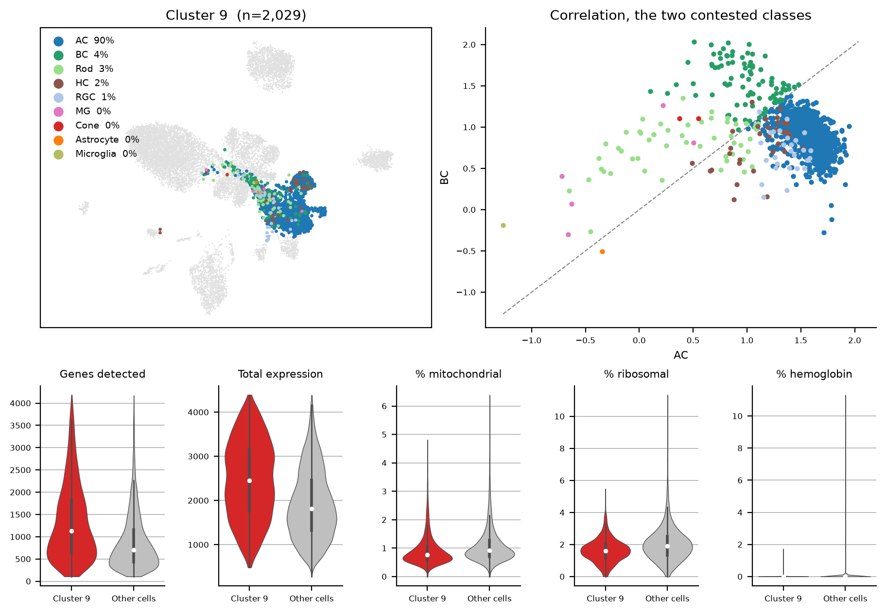

AC takes 90% of this cluster, BC 4% and Rod 3%. On the scatter the AC
cells are one dense cloud and the BC-called cells continue off its edge;
on the embedding they sit along the boundary between this cluster and
the bipolar territory. Genes detected runs above the rest of the batch.

<details>
<summary>Code</summary>

``` python
# not a mixture, so no split: one class for the whole cluster. Taking the per-cell calls here
# would scatter ninety BC and sixty Rod cells through the middle of the amacrine territory, and
# the scatter above says those are the fringe of one cloud rather than clouds of their own
cell_type = wr_joyal.obs["cell_type"].astype(str)
cell_type[in_cluster] = "AC"
wr_joyal.obs["cell_type"] = cell_type
```

</details>

## Cell types on the UMAP

The cell types after the resolutions above, which is the annotation
every figure below reads. A cluster nobody has resolved yet is still
Ambiguous, in grey.

<details>
<summary>Code</summary>

``` python
# Ambiguous last, so it sits at the end of the legend rather than alphabetically among the
# classes; a class that no longer has any cells drops out on its own
cell_types = sorted(set(wr_joyal.obs["cell_type"]) - {"Ambiguous"})
if "Ambiguous" in set(wr_joyal.obs["cell_type"]):
    cell_types.append("Ambiguous")

wr_joyal.obs["cell_type"] = pd.Categorical(wr_joyal.obs["cell_type"], categories=cell_types)

cell_type_palette = dict(zip(sorted(reference_centroids.obs_names), sc.pl.palettes.default_20))
cell_type_palette["Ambiguous"] = "#cccccc"
wr_joyal.uns["cell_type_colors"] = [cell_type_palette[cell_type] for cell_type in cell_types]

plt.rcParams["figure.figsize"] = (6.5, 4.3)

ax = sc.pl.umap(
    wr_joyal,
    color="cell_type",
    frameon=True,
    show=False,
)
ax.set_aspect("equal", adjustable="datalim")
plt.show()
```

</details>


## Txn1 across the design

Txn1 on the UMAP once per group in the design, with timepoint down the
rows and condition across the columns. Each panel draws every cell in
the batch in grey and then its own group’s cells in colour, on a log1p
Txn1 scale shared by all four panels and given in the colourbar on the
right. The number in each panel’s corner is how many cells that group
has.

<details>
<summary>Code</summary>

``` python
# laid out like the violin slides below: timepoint down the rows, condition across the
# columns, so the same comparison sits in the same direction in every Txn1 figure
condition_order = list(wr_joyal.obs["condition"].cat.categories)
timepoints = list(wr_joyal.obs["timepoint"].cat.categories)

umap_coords = wr_joyal.obsm["X_umap"]
txn1 = sc.get.obs_df(wr_joyal, keys=["TXN1"])["TXN1"].to_numpy()
txn1_low, txn1_high = txn1.min(), txn1.max()

# drawn with scatter rather than sc.pl.umap: it puts the whole embedding underneath in grey,
# and it fixes the point size, which scanpy scales by cell count — the sparse panels would
# otherwise carry much larger points than the dense ones.
fig, axes = plt.subplots(len(timepoints), len(condition_order), squeeze=False,
                         figsize=(5.6, 4.4), constrained_layout=True)
fig.get_layout_engine().set(w_pad=0.01, h_pad=0.01, wspace=0.01, hspace=0.02)
for row, timepoint in enumerate(timepoints):
    for column, condition in enumerate(condition_order):
        ax = axes[row][column]
        in_stratum = (
            (wr_joyal.obs["timepoint"] == timepoint) & (wr_joyal.obs["condition"] == condition)
        ).to_numpy()

        # every cell in grey, so each panel is read against the same outline rather than
        # appearing to be a differently-shaped dataset
        ax.scatter(umap_coords[:, 0], umap_coords[:, 1], s=1, c="#bfbfbf", linewidths=0)
        points = ax.scatter(umap_coords[in_stratum, 0], umap_coords[in_stratum, 1], s=1,
                            c=txn1[in_stratum], cmap="viridis",
                            vmin=txn1_low, vmax=txn1_high, linewidths=0)

        ax.set_aspect("equal", adjustable="datalim")
        ax.set_ylabel(f"Txn1 — {timepoint}" if column == 0 else "", fontsize=8)
        ax.set_title(condition if row == 0 else "", fontsize=9)
        ax.text(0.02, 0.98, f"n={in_stratum.sum():,}", transform=ax.transAxes,
                va="top", ha="left", fontsize=7)
        ax.set_xticks([])
        ax.set_yticks([])

colorbar = fig.colorbar(points, ax=axes, location="right", shrink=0.35, pad=0.02, aspect=25)
colorbar_ticks = np.linspace(txn1_low, txn1_high, 3)
colorbar.set_ticks(colorbar_ticks, labels=[f"{tick:.2f}" for tick in colorbar_ticks])
colorbar.ax.tick_params(labelsize=7)

plt.show()
plt.close(fig)
```

</details>


## Txn1 by cell type across the design

Txn1 by cell type across the whole design. Each cell type’s slot holds
NORM and OIR side by side, coloured by condition, and the two rows are
the two timepoints, drawn on a shared y axis.

<details>
<summary>Code</summary>

``` python
txn1_df = sc.get.obs_df(
    wr_joyal, keys=["TXN1", "cell_type", "condition", "timepoint"]
)

# the low quality cluster is contamination and debris rather than a cell type, so it is left
# out of the expression figures instead of standing beside the real classes as though it were
# one. Whole retina has no such cluster, and the filter does nothing there.
txn1_df = txn1_df[txn1_df["cell_type"] != "Low quality"]

# the reference classes on the colours they carry throughout, and Ambiguous grey —
# those cells are drawn rather than dropped, so a figure never quietly loses them
cell_type_palette = dict(
    zip(sorted(reference_centroids.obs_names), sc.pl.palettes.default_20)
)
cell_type_palette["Ambiguous"] = "#cccccc"
condition_palette = dict(zip(wr_joyal.obs["condition"].cat.categories,
                             wr_joyal.uns["condition_colors"]))

# cell types ordered by their mean Txn1, highest first
cell_type_order = (
    txn1_df.groupby("cell_type", observed=True)["TXN1"]
    .mean()
    .sort_values(ascending=False)
    .index.tolist()
)

condition_order = list(wr_joyal.obs["condition"].cat.categories)
timepoints = list(wr_joyal.obs["timepoint"].cat.categories)

# grouped violins rather than four panels: NORM and OIR sit side by side within each cell
# type's slot, so the comparison is a glance rather than a jump between figures. Timepoint is
# the facet, which leaves the interaction readable down a column.
fig, axes = plt.subplots(len(timepoints), 1, squeeze=False, sharex=True, sharey=True,
                         figsize=(9, 5.0), constrained_layout=True)
for row, (ax, timepoint) in enumerate(zip(axes.flat, timepoints)):
    at_timepoint = txn1_df[txn1_df["timepoint"] == timepoint]
    sns.violinplot(data=at_timepoint, x="cell_type", y="TXN1", order=cell_type_order,
                   hue="condition", hue_order=condition_order, palette=condition_palette,
                   gap=0.1, cut=0, density_norm="width", inner="box",
                   inner_kws=violin_inner_kws, linewidth=0.5, saturation=1,
                   legend=(row == 0), ax=ax)
    ax.set_ylabel(f"Txn1 — {timepoint}", fontsize=8)
    ax.set_xlabel("")
    ax.tick_params(axis="y", labelsize=6)
    ax.grid(axis="y", color="#b0b0b0", linewidth=0.6)
    ax.set_axisbelow(True)
    sns.despine(ax=ax)

axes[0][0].legend(title="", fontsize=7, frameon=False,
                  loc="center left", bbox_to_anchor=(1.0, 0.5))
axes[-1][0].tick_params(axis="x", labelrotation=45, labelsize=8)
for label in axes[-1][0].get_xticklabels():
    label.set_ha("right")

plt.show()
plt.close(fig)
```

</details>

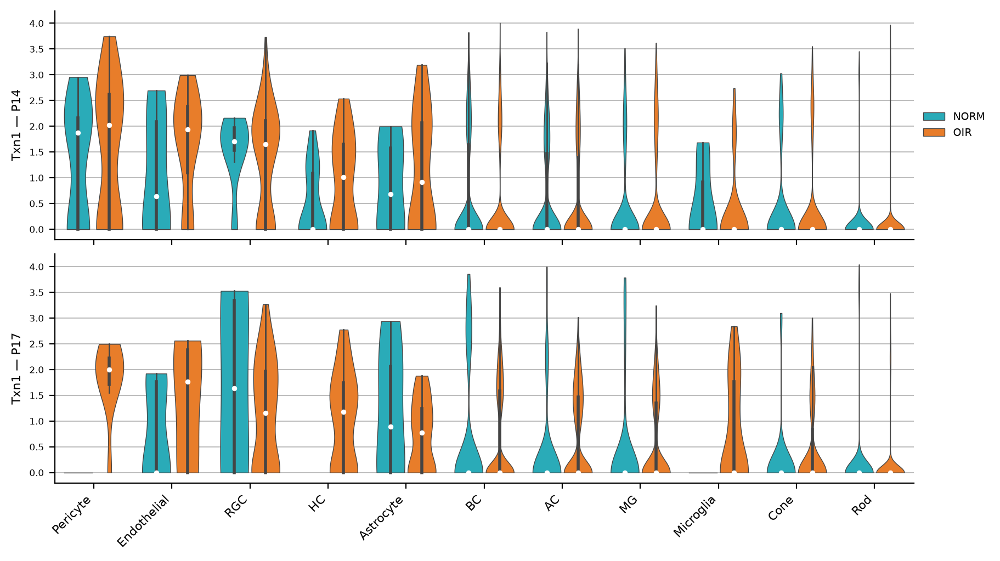

## Txn1 by cell type across the design, grouped by timepoint

The same data with the roles swapped: each cell type’s slot holds P14
and P17 side by side, coloured by timepoint, and the two rows are the
two conditions.

<details>
<summary>Code</summary>

``` python
# cell types ordered by their mean Txn1, highest first
cell_type_order = (
    txn1_df.groupby("cell_type", observed=True)["TXN1"]
    .mean()
    .sort_values(ascending=False)
    .index.tolist()
)

timepoint_palette = dict(zip(wr_joyal.obs["timepoint"].cat.categories,
                             wr_joyal.uns["timepoint_colors"]))

# the same data with the roles swapped: P14 and P17 side by side within each cell type, and
# condition as the facet. Reading down a column here compares the two timepoints within a
# condition, where the plot above compares the two conditions within a timepoint.
fig, axes = plt.subplots(len(condition_order), 1, squeeze=False, sharex=True, sharey=True,
                         figsize=(9, 5.0), constrained_layout=True)
for row, (ax, condition) in enumerate(zip(axes.flat, condition_order)):
    in_condition = txn1_df[txn1_df["condition"] == condition]
    sns.violinplot(data=in_condition, x="cell_type", y="TXN1", order=cell_type_order,
                   hue="timepoint", hue_order=timepoints, palette=timepoint_palette,
                   gap=0.1, cut=0, density_norm="width", inner="box",
                   inner_kws=violin_inner_kws, linewidth=0.5, saturation=1,
                   legend=(row == 0), ax=ax)
    ax.set_ylabel(f"Txn1 — {condition}", fontsize=8)
    ax.set_xlabel("")
    ax.tick_params(axis="y", labelsize=6)
    ax.grid(axis="y", color="#b0b0b0", linewidth=0.6)
    ax.set_axisbelow(True)
    sns.despine(ax=ax)

axes[0][0].legend(title="", fontsize=7, frameon=False,
                  loc="center left", bbox_to_anchor=(1.0, 0.5))
axes[-1][0].tick_params(axis="x", labelrotation=45, labelsize=8)
for label in axes[-1][0].get_xticklabels():
    label.set_ha("right")

plt.show()
plt.close(fig)
```

</details>

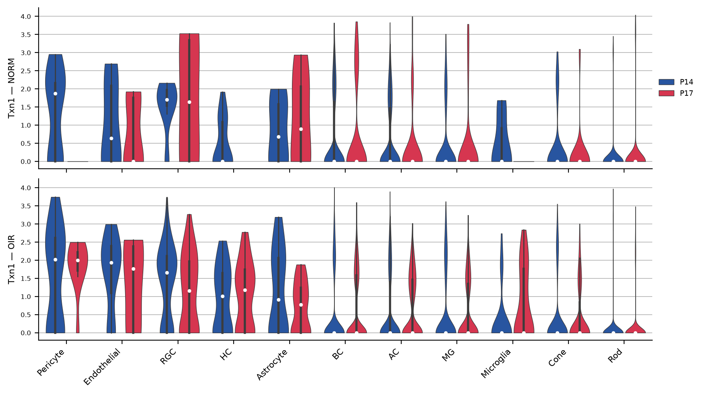

# Rod-depleted Retina

## Cells across the design

Now let’s work through the rod-depleted prep, the `Cd73ft_Joyal` batch.
It holds 10,329 cells across both conditions and both timepoints, though
not evenly:

<details>
<summary>Code</summary>

``` python
cd73ft_joyal_obs = adata.obs[adata.obs["batch"] == "Cd73ft_Joyal"]
design = pd.crosstab(cd73ft_joyal_obs["condition"], cd73ft_joyal_obs["timepoint"])
print(design.rename_axis(index=None, columns=None).to_markdown())   # a real table, not a repr
```

</details>

|      |  P14 |  P17 |
|:-----|-----:|-----:|
| NORM | 2021 | 2518 |
| OIR  | 3769 | 2021 |

## Cluster Cells

First we’ll subset the query data down to the `Cd73ft_Joyal` batch, and
analyze the batch’s cells in isolation.

Then we’ll compute QC metrics, filter out rarely detected genes, keep
the most variable genes, and embed, and cluster at the resolution chosen
for this batch.

<details>
<summary>Code</summary>

``` python
cd73ft_joyal_resolution = 0.50   # chosen in oir-analysis and oir-analysis-2
leiden_key = f"leiden_res_{cd73ft_joyal_resolution:.2f}_v0"
ranked_key = f"leiden_res_{cd73ft_joyal_resolution:.2f}_v1"

cd73ft_joyal_clustered_path = Path("data/processed/GSE150703_adata_Cd73ft_Joyal_clustered.h5ad")

if cd73ft_joyal_clustered_path.exists():        # clustered once, then read back on later renders
    cd73ft_joyal = sc.read_h5ad(cd73ft_joyal_clustered_path)
else:
    cd73ft_joyal = adata[adata.obs["batch"] == "Cd73ft_Joyal"].copy()   # this batch only

    for column in ["condition", "timepoint", "prep", "lab", "replicate", "batch"]:
        cd73ft_joyal.obs[column] = cd73ft_joyal.obs[column].cat.remove_unused_categories()  # drop empty levels

    cd73ft_joyal.var["mt"] = cd73ft_joyal.var_names.str.startswith("MT-")
    cd73ft_joyal.var["ribo"] = cd73ft_joyal.var_names.str.startswith(("RPS", "RPL"))
    cd73ft_joyal.var["hb"] = cd73ft_joyal.var_names.str.startswith(("HBA-", "HBB-"))
    sc.pp.calculate_qc_metrics(
        cd73ft_joyal,
        qc_vars=["mt", "ribo", "hb"],
        expr_type="log1p",                     # X is normalized, so these are not UMI fractions
        percent_top=None,
        log1p=False,
        inplace=True,
    )

    sc.pp.filter_genes(cd73ft_joyal, min_cells=3)  # rarely detected genes distort the variable set
    sc.pp.highly_variable_genes(cd73ft_joyal, n_top_genes=2000, flavor="seurat")
    sc.pp.pca(cd73ft_joyal, svd_solver="arpack")
    sc.pp.neighbors(cd73ft_joyal, n_neighbors=10, n_pcs=40)
    sc.tl.umap(cd73ft_joyal)

    sc.tl.leiden(
        cd73ft_joyal,
        resolution=cd73ft_joyal_resolution,
        key_added=leiden_key,
        flavor="igraph",
        random_state=0,                        # the one argument here that decides the output
    )

    # renumbered by size, so cluster 1 is always the largest
    cluster_sizes = cd73ft_joyal.obs[leiden_key].value_counts()
    ranked_labels = [str(rank) for rank in range(1, len(cluster_sizes) + 1)]
    cd73ft_joyal.obs[ranked_key] = (
        cd73ft_joyal.obs[leiden_key]
        .map(dict(zip(cluster_sizes.index, ranked_labels)))
        .astype("category")
        .cat.reorder_categories(ranked_labels)
    )

    for obs_key, palette in obs_palettes.items():
        categories = cd73ft_joyal.obs[obs_key].cat.categories
        cd73ft_joyal.uns[f"{obs_key}_colors"] = [palette[category] for category in categories]

    cd73ft_joyal.uns[f"{ranked_key}_colors"] = [               # tab20, cycled once past 20 clusters
        mcolors.to_hex(plt.cm.tab20.colors[(int(label) - 1) % 20]) for label in ranked_labels
    ]


    # correlated against the reference here rather than further down, so it is saved with the
    # object and later renders read it back instead of ranking the matrix again. It belongs to
    # these cells and these genes, which is what this guard already decides.
    #
    # every shared gene, where the cluster-level correlation uses variable genes only. A
    # centroid is dense, so its housekeeping bulk lifts all twelve classes together and flattens
    # the differences; a single cell is 97% zero over those same variable genes and needs every
    # gene it can get. Widening to all of them moves agreement with the cluster call from 90%
    # to 95%.
    shared_genes = [gene for gene in cd73ft_joyal.var_names if gene in reference_centroids.var_names]

    ranked_cells = pd.DataFrame(
        np.asarray(cd73ft_joyal[:, shared_genes].X.todense())
    ).rank(axis=1).to_numpy()
    ranked_classes = pd.DataFrame(
        reference_centroids[:, shared_genes].X, index=reference_centroids.obs_names
    ).rank(axis=1).to_numpy()

    # Spearman, written out rather than looped so all twelve classes come out of one product
    ranked_cells = ranked_cells - ranked_cells.mean(axis=1, keepdims=True)
    ranked_classes = ranked_classes - ranked_classes.mean(axis=1, keepdims=True)
    cell_correlation = pd.DataFrame(
        (ranked_cells @ ranked_classes.T) / np.sqrt(
            (ranked_cells ** 2).sum(axis=1)[:, None] * (ranked_classes ** 2).sum(axis=1)[None, :]
        ),
        index=cd73ft_joyal.obs_names,
        columns=reference_centroids.obs_names,
    )

    # standardized within each cell, once, because everything below compares cells with each
    # other. A cell's correlation to every class rises with how many genes it captured, at 0.89
    # to 0.96 across all twelve, so the raw numbers are comparable within a cell and not between
    # two. One shallow rod cell here runs 0.056 to 0.100 across the twelve and one deep Muller
    # cell runs 0.360 to 0.459: the first cell's best match is below the second cell's worst.
    # Subtracting each cell's own mean and dividing by its own spread leaves which classes it
    # preferred, which is the comparable part. It cannot change which class is largest, so the
    # calls are the same either way. Stored standardized, because that is what every figure
    # downstream reads.
    cell_correlation = cell_correlation.sub(
        cell_correlation.mean(axis=1), axis=0
    ).div(cell_correlation.std(axis=1), axis=0)

    # one obs column per reference class, prefixed so the twelve read as a family and can be
    # handed to sc.pl.umap by name
    for cell_class in cell_correlation.columns:
        cd73ft_joyal.obs[f"corr_{cell_class}"] = cell_correlation[cell_class].to_numpy()

    cd73ft_joyal.write_h5ad(cd73ft_joyal_clustered_path)

cd73ft_joyal
```

</details>

    AnnData object with n_obs × n_vars = 10329 × 18098
        obs: 'condition', 'timepoint', 'prep', 'lab', 'replicate', 'batch', 'n_genes_by_log1p', 'total_log1p', 'total_log1p_mt', 'pct_log1p_mt', 'total_log1p_ribo', 'pct_log1p_ribo', 'total_log1p_hb', 'pct_log1p_hb', 'leiden_res_0.50_v0', 'leiden_res_0.50_v1', 'corr_AC', 'corr_Astrocyte', 'corr_BC', 'corr_Cone', 'corr_Endothelial', 'corr_HC', 'corr_MG', 'corr_Microglia', 'corr_Pericyte', 'corr_RGC', 'corr_RPE', 'corr_Rod'
        var: 'mt', 'ribo', 'hb', 'n_cells_by_log1p', 'mean_log1p', 'pct_dropout_by_log1p', 'total_log1p', 'n_cells', 'highly_variable', 'means', 'dispersions', 'dispersions_norm'
        uns: 'batch_colors', 'condition_colors', 'hvg', 'lab_colors', 'leiden_res_0.50_v0', 'leiden_res_0.50_v1_colors', 'neighbors', 'pca', 'prep_colors', 'timepoint_colors', 'umap'
        obsm: 'X_pca', 'X_umap'
        varm: 'PCs'
        obsp: 'connectivities', 'distances'
        layers: None (.X)

The clustered object is saved to `data/processed/`, so later renders
read it back and skip the clustering entirely. To re-run any of it,
delete that file first.

## Clusters on the UMAP

Let’s draw the clustering scanpy just built onto the UMAP embedding.
Each point is a cell, placed by its two UMAP coordinates and coloured by
the cluster it was assigned, and each cluster’s number is drawn on top
of the cells that carry it. The clusters were renumbered by size, so
cluster 1 is the batch’s largest.

<details>
<summary>Code</summary>

``` python
# scanpy builds the figure here, and takes no figsize argument, so rcParams is where its size
# has to be set
plt.rcParams["figure.figsize"] = (5.0, 4.3)

ax = sc.pl.umap(
    cd73ft_joyal,
    color=ranked_key,
    legend_loc="on data",
    legend_fontoutline=2,
    frameon=True,
    show=False,
)
ax.set_aspect("equal", adjustable="datalim")
plt.show()
```

</details>


## Cluster similarity

Each cluster’s expression profile correlated against every other
cluster’s. A profile is the mean normalized expression of the cells in
the cluster, and the correlation is Spearman over this preparation’s
most variable genes.

The same matrix is drawn twice, both panels ordered down the dendrogram
it defines. On the left the clusters carry their size-rank numbers,
which that ordering leaves out of sequence; on the right the same
clusters are renumbered 1 to k along the order they now sit in. A
position means the same cluster in both panels, so reading one against
the other gives the mapping.

<details>
<summary>Code</summary>

``` python
# the variable genes rather than all of them: these are the axes the batch was clustered on,
# where the correlation below needs every gene it can get because a single cell is mostly
# zero. A centroid is dense, so the housekeeping bulk of the full gene set would lift every
# pair together and flatten the contrast this figure is made of.
variable_genes = cd73ft_joyal.var_names[cd73ft_joyal.var["highly_variable"]]
cluster_centroids = pd.DataFrame(
    np.asarray(cd73ft_joyal[:, variable_genes].X.todense()),
    index=cd73ft_joyal.obs[ranked_key],
    columns=variable_genes,
).groupby(level=0, observed=True).mean()

# Spearman, written out the same way as the reference correlation below
ranked_centroids = cluster_centroids.rank(axis=1).to_numpy()
ranked_centroids = ranked_centroids - ranked_centroids.mean(axis=1, keepdims=True)
centroid_norms = np.sqrt((ranked_centroids ** 2).sum(axis=1))
self_correlation = pd.DataFrame(
    (ranked_centroids @ ranked_centroids.T) / (centroid_norms[:, None] * centroid_norms[None, :]),
    index=cluster_centroids.index,
    columns=cluster_centroids.index,
)

# squareform first, and this is the easy part to lose: linkage picks its input by shape, so a
# square matrix handed over directly is read as observations x features rather than as
# distances — no error, and a different question answered. 1 - r is the correlation distance.
# checks=False because floating point can leave the diagonal a hair off zero.
leaf_order = leaves_list(linkage(squareform(1.0 - self_correlation.to_numpy(), checks=False),
                                 method="average", optimal_ordering=True))

# the new numbering: position down the dendrogram, so 1 is the leftmost leaf and neighbouring
# numbers are transcriptionally adjacent. Size rank says only how many cells a cluster holds,
# which orders the axes of every figure downstream by nothing in particular.
dendrogram_key = f"leiden_res_{cd73ft_joyal_resolution:.2f}_v2"
dendrogram_labels = [str(position) for position in range(1, len(leaf_order) + 1)]
dendrogram_calls = dict(zip(self_correlation.index[leaf_order], dendrogram_labels))

cd73ft_joyal.obs[dendrogram_key] = (
    cd73ft_joyal.obs[ranked_key]
    .map(dendrogram_calls)
    .astype("category")
    .cat.reorder_categories(dendrogram_labels)
)
cd73ft_joyal.uns[f"{dendrogram_key}_colors"] = [        # tab20 again, cycled once past 20 clusters
    mcolors.to_hex(plt.cm.tab20.colors[(int(label) - 1) % 20]) for label in dendrogram_labels
]

# both panels are the same matrix in the same dendrogram order — only the labels differ, which
# is the point: the left says which size rank each leaf is, the right renumbers those leaves
# 1 to k, and reading a position across the two panels gives the mapping between them.
ordered_correlation = self_correlation.iloc[leaf_order, leaf_order]
correlation_panels = {
    "Size rank (v1)": (ordered_correlation, list(self_correlation.index[leaf_order])),
    "Dendrogram order (v2)": (ordered_correlation, dendrogram_labels),
}

# vmin at the matrix minimum rather than 0, because the values sit in a narrow band well above
# zero that a fixed floor would flatten.
values = self_correlation.to_numpy()
low, high = values.min(), values.max()

fig, axes = plt.subplots(1, len(correlation_panels), squeeze=False, figsize=(9, 4.3),
                         constrained_layout=True)
for ax, (title, (matrix, labels)) in zip(axes.flat, correlation_panels.items()):
    panel = matrix.to_numpy()
    image = ax.imshow(panel, cmap="viridis", aspect="auto", vmin=low, vmax=high)
    ax.set_title(title, fontsize=9)
    ax.set_xticks(range(len(labels)), labels, rotation=45, ha="right", fontsize=6)
    ax.set_yticks(range(len(labels)), labels, fontsize=6)
    ax.set_xlabel("Cluster", fontsize=8)
    ax.set_ylabel("Cluster", fontsize=8)

    # annotated only while the grid is coarse enough for the numbers to be legible
    if panel.size <= 240:
        threshold = low + (high - low) * 0.6
        for row in range(panel.shape[0]):
            for column in range(panel.shape[1]):
                ax.text(column, row, f"{panel[row, column]:.2f}", ha="center", va="center",
                        fontsize=5, color="black" if panel[row, column] > threshold else "white")

fig.colorbar(image, ax=axes, shrink=0.6, pad=0.02, aspect=25, label="Spearman r")
plt.show()
plt.close(fig)
```

</details>

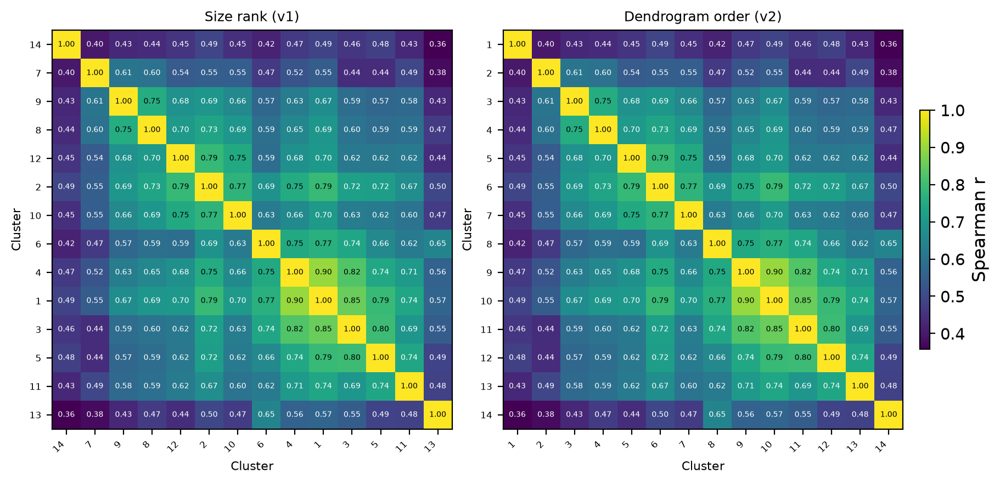

## Renumbered clusters on the UMAP

The same embedding as before, coloured and labelled by the dendrogram
numbering rather than by size rank. Each point is a cell, and each
cluster’s v2 number is drawn on top of the cells that carry it. This is
the numbering every figure below uses.

<details>
<summary>Code</summary>

``` python
plt.rcParams["figure.figsize"] = (5.0, 4.3)

ax = sc.pl.umap(
    cd73ft_joyal,
    color=dendrogram_key,
    legend_loc="on data",
    legend_fontoutline=2,
    frameon=True,
    show=False,
)
ax.set_aspect("equal", adjustable="datalim")
plt.show()
```

</details>

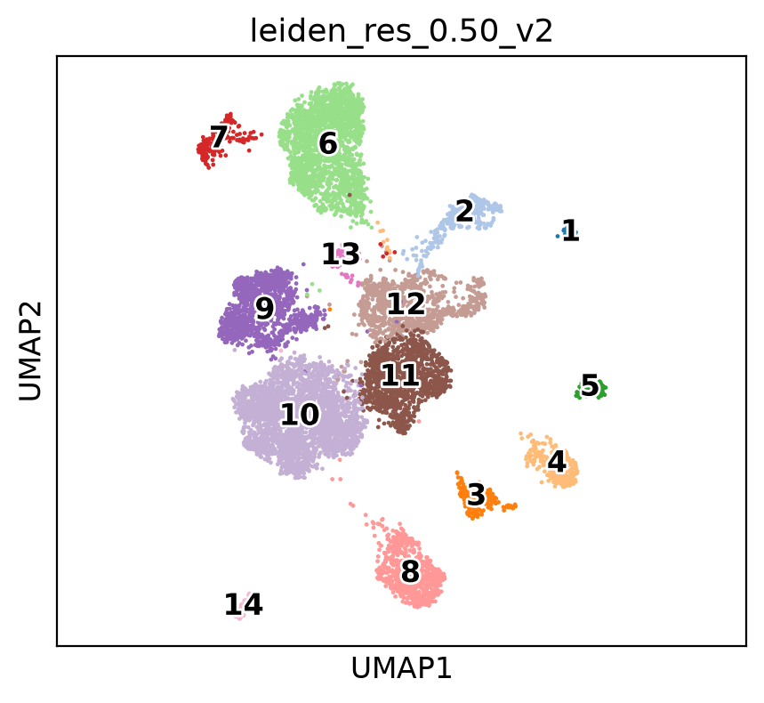

## QC metrics

Let’s look at the QC metrics for the batch as a whole. Each panel is one
metric — genes detected, total expression, and the mitochondrial,
ribosomal and hemoglobin percentages — drawn as a violin over every cell
in the batch, with the box inside it marking the quartiles and the
median. The metrics were computed on the normalized matrix, so they are
log1p sums rather than UMI fractions.

<details>
<summary>Code</summary>

``` python
qc_metrics = {
    "n_genes_by_log1p": "Genes detected",
    "total_log1p": "Total expression",
    "pct_log1p_mt": "% mitochondrial",
    "pct_log1p_ribo": "% ribosomal",
    "pct_log1p_hb": "% hemoglobin",
}
violin_inner_kws = {"box_width": 2, "whis_width": 1, "marker": "o",
                    "markersize": 3.0, "markeredgecolor": "white"}

qc_df = sc.get.obs_df(cd73ft_joyal, keys=[dendrogram_key] + list(qc_metrics))
batch_color = cd73ft_joyal.uns["batch_colors"][0]

fig, axes = plt.subplots(1, len(qc_metrics), squeeze=False, figsize=(9, 3.0),
                         constrained_layout=True)
for ax, (qc_key, qc_label) in zip(axes.flat, qc_metrics.items()):
    sns.violinplot(data=qc_df, y=qc_key, color=batch_color, cut=0, density_norm="width",
                   inner="box", inner_kws=violin_inner_kws, linewidth=0.5, ax=ax)
    ax.set_ylabel(qc_label, fontsize=9)
    ax.tick_params(axis="y", labelsize=8)
    ax.grid(axis="y", color="#b0b0b0", linewidth=0.6)
    ax.set_axisbelow(True)

plt.show()
plt.close(fig)
```

</details>


## QC metrics by cluster

Three of those metrics again, one per row, with the cells split along
the x axis by cluster. Each violin takes its colour from the cluster
palette the UMAP above uses, so a cluster is the same colour in both
figures.

<details>
<summary>Code</summary>

``` python
# only scanpy reads the _colors entry out of uns, so the palette is handed to seaborn
# explicitly — otherwise a cluster changes color between the UMAP and these violins
cluster_palette = dict(zip(cd73ft_joyal.obs[dendrogram_key].cat.categories, cd73ft_joyal.uns[f"{dendrogram_key}_colors"]))

# the ribosomal and hemoglobin fractions are dropped here. Split across every cluster they are
# a flat line and a row of spikes, and the three that are left carry the figure. Both are still
# on the batch-level violins above, and on the slides that inspect one cluster at a time — the
# hemoglobin fraction is the whole story on one of them.
cluster_qc_metrics = {
    qc_key: qc_label for qc_key, qc_label in qc_metrics.items()
    if qc_key not in ("pct_log1p_ribo", "pct_log1p_hb")
}

fig, axes = plt.subplots(len(cluster_qc_metrics), 1, squeeze=False, sharex=True, figsize=(9, 4.3),
                         constrained_layout=True)
for ax, (qc_key, qc_label) in zip(axes.flat, cluster_qc_metrics.items()):
    # dodge=False because hue repeats x: left on, seaborn gives each of the 21 clusters its
    # own sub-slot and every violin is drawn a twentieth of its slot wide, off its tick
    sns.violinplot(data=qc_df, x=dendrogram_key, y=qc_key, hue=dendrogram_key, palette=cluster_palette,
                   legend=False, dodge=False, cut=0, density_norm="width", inner="box",
                   inner_kws=violin_inner_kws, linewidth=0.5, saturation=1, ax=ax)

    # seaborn colours the bodies in an order that does not follow the x positions when hue
    # repeats x, so each is recoloured from the cluster it actually sits under. The order
    # comes off the categorical rather than the tick labels, which are empty on a shared axis.
    cluster_order = list(cd73ft_joyal.obs[dendrogram_key].cat.categories)
    for body in ax.collections:
        extents = body.get_paths()[0].get_extents()
        body.set_facecolor(cluster_palette[cluster_order[round((extents.x0 + extents.x1) / 2)]])

    ax.set_ylabel(qc_label, fontsize=7)
    ax.set_xlabel("")
    ax.tick_params(axis="y", labelsize=6)
    ax.grid(axis="y", color="#b0b0b0", linewidth=0.6)
    ax.set_axisbelow(True)

axes[-1][0].set_xlabel("Cluster", fontsize=9)
axes[-1][0].tick_params(axis="x", labelsize=8)
plt.show()
plt.close(fig)
```

</details>

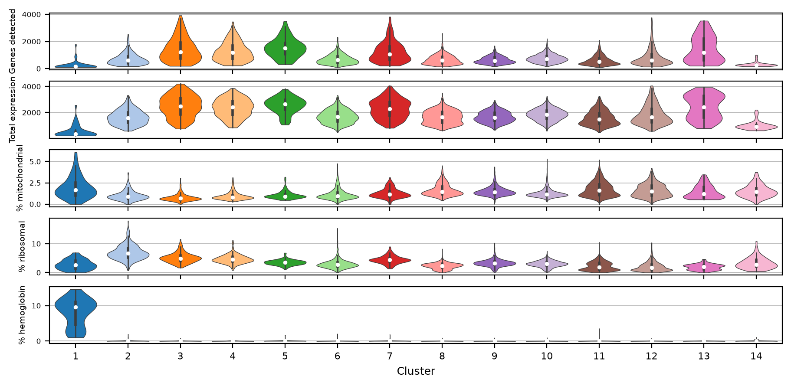

## Correlation with the reference

Each cell correlated against the same centroids, over every gene the
query and the reference share. The values are standardized within each
cell.

<details>
<summary>Code</summary>

``` python
# computed in the clustering step and saved with the object, so this reads it back. The
# columns lose their prefix here, so a call is the class name rather than the column name
reference_classes = sorted(reference_centroids.obs_names)
correlation_keys = [f"corr_{cell_class}" for cell_class in reference_classes]
cell_correlation = cd73ft_joyal.obs[correlation_keys].rename(
    columns=dict(zip(correlation_keys, reference_classes))
)

cd73ft_joyal.obs["cell_type_per_cell"] = pd.Categorical(
    cell_correlation.idxmax(axis=1),
    categories=sorted(reference_centroids.obs_names),
)

cell_composition = pd.crosstab(cd73ft_joyal.obs[dendrogram_key], cd73ft_joyal.obs["cell_type_per_cell"])
```

</details>

## Per-cell calls on the UMAP

The same embedding, coloured by each cell’s own best-correlating
reference class rather than by the cluster it fell in. Every cell
carries a call, made from that one cell’s correlations and independent
of its neighbours.

<details>
<summary>Code</summary>

``` python
# keyed on every class in the reference rather than only the ones called, so a class keeps its
# colour here, on the cell type UMAP below, and in every violin after it
call_palette = dict(zip(sorted(reference_centroids.obs_names), sc.pl.palettes.default_20))
cd73ft_joyal.uns["cell_type_per_cell_colors"] = [
    call_palette[cell_class] for cell_class in cd73ft_joyal.obs["cell_type_per_cell"].cat.categories
]

plt.rcParams["figure.figsize"] = (6.5, 4.3)

ax = sc.pl.umap(
    cd73ft_joyal,
    color="cell_type_per_cell",
    frameon=True,
    show=False,
)
ax.set_aspect("equal", adjustable="datalim")
plt.show()
```

</details>

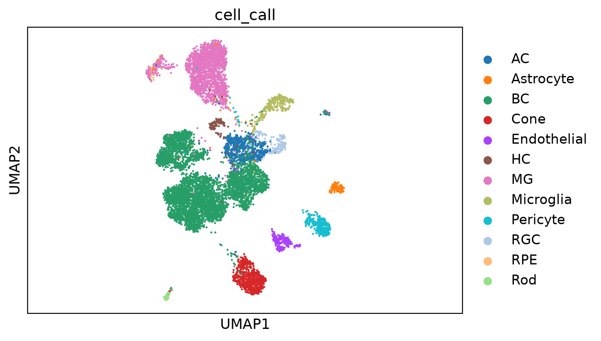

## Correlation on the UMAP

The same correlations, one panel per reference class. Each panel colours
every cell by its standardized correlation with that class, on its own
scale.

<details>
<summary>Code</summary>

``` python
# one panel per class, straight off the obs columns the clustering step wrote. Standardizing
# is what makes a panel about preference rather than depth, and it happens once up there rather
# than here, so each panel scales to its own values.
reference_classes = sorted(reference_centroids.obs_names)
correlation_keys = [f"corr_{cell_class}" for cell_class in reference_classes]

# a class listed here is clipped to the limits given instead, for when one panel's range is set
# by a handful of cells and buries the rest:
#   correlation_clips = {"RPE": (-1, 2), "Rod": (0, 3)}
# passed only when something is in it, because scanpy reads the two lists positionally and has
# no entry that means "leave this panel alone"
correlation_clips = {}
clip_arguments = {}
if correlation_clips:
    clip_arguments = {
        "vmin": [correlation_clips.get(c, (None, None))[0] for c in reference_classes],
        "vmax": [correlation_clips.get(c, (None, None))[1] for c in reference_classes],
    }

plt.rcParams["figure.figsize"] = (2.3, 2.0)      # per panel, so four across come to about 9

axes = sc.pl.umap(
    cd73ft_joyal,
    color=correlation_keys,
    title=reference_classes,                     # the prefix is for obs, not for the reader
    ncols=4,
    size=1,                                      # fixed, rather than scaled by cell count
    frameon=True,
    show=False,
    **clip_arguments,
)

# scanpy labels the axes of every panel, and UMAP1 lands on the title of the panel below it.
# The frame is worth keeping, the labels are not — the whole figure is one embedding
for panel in axes:
    panel.set_xlabel("")
    panel.set_ylabel("")

plt.show()
```

</details>

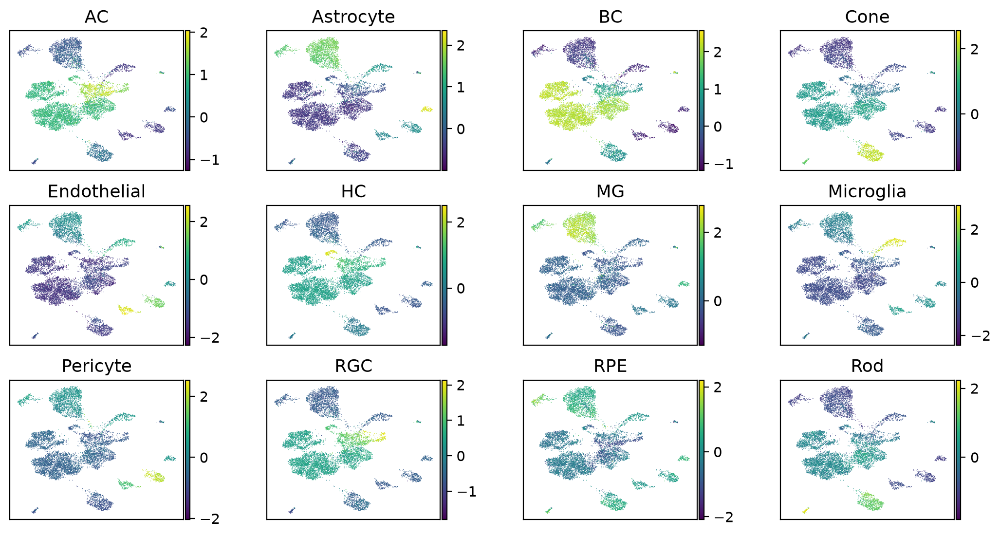

## Correlation by cluster

The per-cell correlations averaged over each cluster, drawn three ways:
the mean as it stands, scaled across each row, and scaled down each
column.

<details>
<summary>Code</summary>

``` python
# the matrix three ways. The values are standardized per cell upstream, so the first panel is
# a mean z rather than a mean correlation, and is comparable down a column as well as across a
# row. The row-scaled panel is the annotation question: which class best fits this cluster.
#
# only the row scaling is a call. A column's brightest cell is the best home for that class
# whether or not the class is present at all: RPE peaks somewhere in every batch, which says
# where it would land rather than that it was found.
mean_cell_correlation = cell_correlation.groupby(cd73ft_joyal.obs[dendrogram_key], observed=True).mean()

cluster_range = mean_cell_correlation.max(axis=1) - mean_cell_correlation.min(axis=1)
cells_scaled_by_cluster = mean_cell_correlation.sub(
    mean_cell_correlation.min(axis=1), axis=0
).div(cluster_range, axis=0)

class_range = mean_cell_correlation.max(axis=0) - mean_cell_correlation.min(axis=0)
cells_scaled_by_class = mean_cell_correlation.sub(
    mean_cell_correlation.min(axis=0), axis=1
).div(class_range, axis=1)

cell_correlation_panels = {
    "Mean per-cell z": mean_cell_correlation,
    "Scaled per cluster": cells_scaled_by_cluster,
    "Scaled per class": cells_scaled_by_class,
}

# walk the clusters in order and take each one's best class; a class already placed is
# skipped, and any class no cluster leads with is appended, so the matches read as a diagonal
cell_class_order = []
for cluster in cells_scaled_by_cluster.index:
    best = cells_scaled_by_cluster.loc[cluster].idxmax()
    if best not in cell_class_order:
        cell_class_order.append(best)
cell_class_order += [n for n in cells_scaled_by_cluster.columns if n not in cell_class_order]

fig, axes = plt.subplots(1, len(cell_correlation_panels), squeeze=False, figsize=(9, 4.3),
                         constrained_layout=True)
for ax, (title, matrix) in zip(axes.flat, cell_correlation_panels.items()):
    sns.heatmap(matrix[cell_class_order], cmap="viridis", linewidths=0.5, linecolor="white",
                xticklabels=True, yticklabels=True,
                cbar_kws={"shrink": 0.6, "pad": 0.02}, ax=ax)
    ax.set_title(title, fontsize=9)
    ax.set_xlabel("Reference class", fontsize=8)
    ax.set_ylabel("Cluster", fontsize=8)
    ax.tick_params(axis="x", labelrotation=45, labelsize=7)
    ax.tick_params(axis="y", labelrotation=0, labelsize=7)
    for label in ax.get_xticklabels():
        label.set_ha("right")

plt.show()
plt.close(fig)
```

</details>

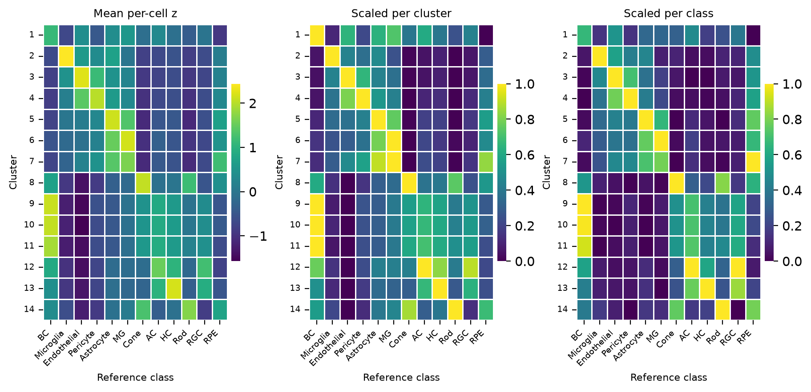

## Call composition by cluster

The same per-cell calls counted up inside each cluster. Every row is a
cluster and every column a reference class, and a square is the share of
that cluster’s cells whose own best match was that class — so a row sums
to one. The columns are ordered by which class each cluster leads with,
which puts the matches on the diagonal. A boxed square is a class that
took at least the threshold share of its cluster’s cells; a cluster with
no boxed square did not concentrate on any one class, and its number is
starred on the axis.

<details>
<summary>Code</summary>

``` python
# a share of the cluster rather than a count, so a small cluster is read on the same scale as
# a large one and a row sums to one
composition = cell_composition.div(cell_composition.sum(axis=1), axis=0)

composition = composition.reindex(columns=sorted(reference_centroids.obs_names), fill_value=0.0)

# walk the clusters in order and take each one's largest class; a class already placed is
# skipped, and any class no cluster leads with is appended, so the matches read as a diagonal.
# The columns are this batch's own order, so the two preparations no longer line up column for
# column — the labels are what to read across, not the position.
class_order = []
for cluster in composition.index:
    largest = composition.loc[cluster].idxmax()
    if largest not in class_order:
        class_order.append(largest)
class_order += [c for c in composition.columns if c not in class_order]
composition = composition[class_order]

# the share one class has to take for the cluster to be settled on it. Nothing here reads it:
# the box is a flag to look at, and the annotation below still calls every cluster by the
# correlation argmax.
purity_threshold = 0.9

values = composition.to_numpy()
settled = values.max(axis=1) >= purity_threshold      # a cluster with no boxed class is flagged

# the call this figure implies: a settled cluster takes its majority class, and a flagged one
# is named Ambiguous rather than guessed at. This is the document's cell type — every figure
# below reads it.
cluster_calls = {
    cluster: (composition.loc[cluster].idxmax() if is_settled else "Ambiguous")
    for cluster, is_settled in zip(composition.index, settled)
}

# a cluster the figures further down settled, named here by hand and keyed on its v2 number.
# This is the one place a call is made by a person rather than by the threshold, and it is why
# the threshold can stay strict: a large cluster that misses it is resolved by looking rather
# than by moving the line. Empty means nothing has been resolved yet.
resolved_clusters = {}
cluster_calls.update(resolved_clusters)

cluster_types = sorted({call for call in cluster_calls.values() if call != "Ambiguous"})
if "Ambiguous" in cluster_calls.values():
    cluster_types.append("Ambiguous")             # last, so it sits at the end of the legend

cd73ft_joyal.obs["cell_type"] = (
    cd73ft_joyal.obs[dendrogram_key]
    .map(cluster_calls)
    .astype("category")
    .cat.reorder_categories(cluster_types)
)
# the reference classes keep the colours they carry on the call UMAP above; Ambiguous is grey,
# being the absence of a call rather than a class of its own
cell_type_palette = dict(zip(sorted(reference_centroids.obs_names), sc.pl.palettes.default_20))
cell_type_palette["Ambiguous"] = "#cccccc"
cd73ft_joyal.uns["cell_type_colors"] = [
    cell_type_palette[cell_type] for cell_type in cd73ft_joyal.obs["cell_type"].cat.categories
]

fig, ax = plt.subplots(figsize=(9, 4.3), constrained_layout=True)
image = ax.imshow(values, cmap="viridis", aspect="auto", vmin=0.0, vmax=1.0)
ax.set_xticks(range(composition.shape[1]), composition.columns, rotation=45, ha="right",
              fontsize=7)
# the flagged clusters called out on the axis as well, so they read down the edge without
# having to find the row that is missing a box. The star goes on at tick time: a tick label's
# text is regenerated from the formatter, so setting it on the label object afterwards is lost
cluster_labels = [
    str(cluster) if is_settled else f"{cluster} *"
    for cluster, is_settled in zip(composition.index, settled)
]
ax.set_yticks(range(composition.shape[0]), cluster_labels, fontsize=7)
for tick, is_settled in zip(ax.get_yticklabels(), settled):
    if not is_settled:
        tick.set_color("#d62728")
        tick.set_fontweight("bold")

ax.set_xlabel("Reference class", fontsize=9)
ax.set_ylabel("Cluster", fontsize=9)

for row in range(values.shape[0]):
    for column in range(values.shape[1]):
        share = values[row, column]
        # three decimals, so a share just under the threshold does not round to it and read as
        # a square that should have been boxed
        ax.text(column, row, f"{share:.3f}", ha="center", va="center", fontsize=5,
                color="black" if share > 0.6 else "white")
        if share >= purity_threshold:
            ax.add_patch(Rectangle((column - 0.5, row - 0.5), 1, 1, fill=False,
                                   edgecolor="#d62728", linewidth=1.8))

fig.colorbar(image, ax=ax, shrink=0.6, pad=0.02, aspect=25, label="Share of cluster")
plt.show()
plt.close(fig)
```

</details>

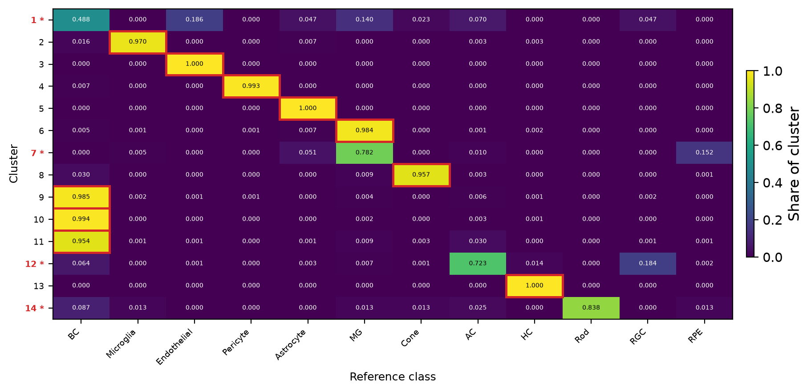

## Cell type calls on the UMAP

The calls the heatmap above implies, drawn on the embedding. A cluster
whose cells concentrated on one reference class takes that class, and a
flagged cluster is left Ambiguous in grey rather than named on a split
vote. This is the cell type every figure below reads, so a cluster stays
grey in all of them until it is resolved.

<details>
<summary>Code</summary>

``` python
plt.rcParams["figure.figsize"] = (6.5, 4.3)

ax = sc.pl.umap(
    cd73ft_joyal,
    color="cell_type",
    frameon=True,
    show=False,
)
ax.set_aspect("equal", adjustable="datalim")
plt.show()
```

</details>

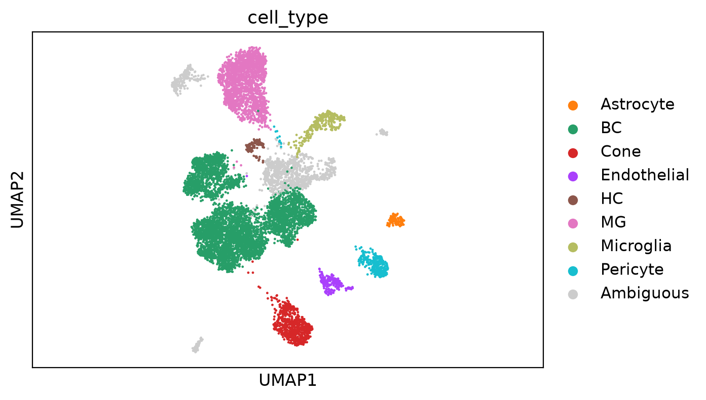

## Flagged clusters on the UMAP

One panel per cluster the composition left ambiguous. Each panel draws
the whole embedding in grey and then that cluster’s own cells coloured
by their per-cell call, on the palette the call UMAP uses.

<details>
<summary>Code</summary>

``` python
# the clusters the composition could not settle, taken off the call column rather than
# recomputed, so this figure and the heatmap above can never disagree about which they are
per_cluster_call = cd73ft_joyal.obs.groupby(dendrogram_key, observed=True)["cell_type"].first()
flagged_clusters = per_cluster_call.index[per_cluster_call == "Ambiguous"].tolist()

call_palette = dict(zip(sorted(reference_centroids.obs_names), sc.pl.palettes.default_20))
umap_coords = cd73ft_joyal.obsm["X_umap"]

# drawn with scatter rather than sc.pl.umap, for the grey underlay and a fixed point size —
# scanpy scales its points by cell count, so a panel of 43 cells would carry much larger
# points than one of 2,000
columns = min(len(flagged_clusters), 3)
rows = int(np.ceil(len(flagged_clusters) / columns))
fig, axes = plt.subplots(rows, columns, squeeze=False, figsize=(9, 3.2 * rows),
                         constrained_layout=True)

handles = {}
for ax, cluster in zip(axes.flat, flagged_clusters):
    in_cluster = (cd73ft_joyal.obs[dendrogram_key] == cluster).to_numpy()
    ax.scatter(umap_coords[:, 0], umap_coords[:, 1], s=1, c="#e0e0e0", linewidths=0)

    # each class drawn on its own, so the legend can carry one entry per class across panels
    calls = cd73ft_joyal.obs["cell_type_per_cell"]
    for cell_class in calls[in_cluster].value_counts().index:
        selected = in_cluster & (calls == cell_class).to_numpy()
        if not selected.any():
            continue
        points = ax.scatter(umap_coords[selected, 0], umap_coords[selected, 1], s=2.5,
                            c=call_palette[cell_class], linewidths=0)
        handles.setdefault(cell_class, points)

    ax.set_title(f"Cluster {cluster}  (n={in_cluster.sum():,})", fontsize=9)
    ax.set_aspect("equal", adjustable="datalim")
    ax.set_xticks([])
    ax.set_yticks([])

for ax in axes.flat[len(flagged_clusters):]:
    ax.axis("off")

fig.legend(handles.values(), handles.keys(), title="", fontsize=7, frameon=False,
           loc="center left", bbox_to_anchor=(1.0, 0.5), markerscale=4)
plt.show()
plt.close(fig)
```

</details>

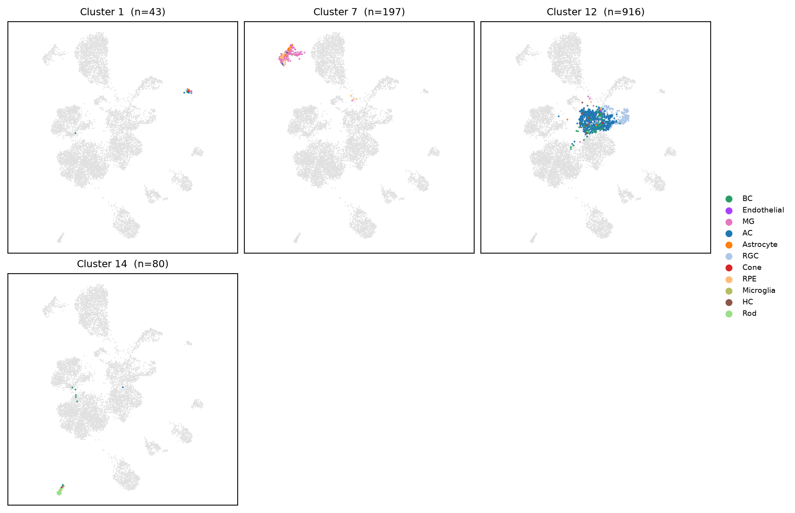

## Resolving cluster 1

One flagged cluster on a single slide. On the left its cells sit on the
embedding, coloured by their own per-cell call, against the rest of the
batch in grey. On the right the same cells are placed by their
correlation with the two classes most of them call, with the diagonal
marking where a cell correlates equally with both. Along the bottom each
QC metric compares the cluster’s cells with every other cell in the
batch.

<details>
<summary>Code</summary>

``` python
cluster_of_interest = "1"        # the v2 number, changed to look at another flagged cluster

in_cluster = (cd73ft_joyal.obs[dendrogram_key] == cluster_of_interest).to_numpy()
calls = cd73ft_joyal.obs["cell_type_per_cell"]
call_palette = dict(zip(sorted(reference_centroids.obs_names), sc.pl.palettes.default_20))

qc_df = sc.get.obs_df(cd73ft_joyal, keys=list(qc_metrics))
qc_df["group"] = np.where(in_cluster, f"Cluster {cluster_of_interest}", "Other cells")
group_order = [f"Cluster {cluster_of_interest}", "Other cells"]
group_palette = dict(zip(group_order, ["#d62728", "#bfbfbf"]))

# the embedding and the two contested correlations across the top, the QC metrics along the
# bottom, so one slide carries the whole case for a cluster. Ten columns, because the five QC
# panels each span two of them
fig, axes = plt.subplot_mosaic(
    [["umap"] * 5 + ["scatter"] * 5,
     [qc_key for qc_key in qc_metrics for _ in range(2)]],
    figsize=(9, 6.2), height_ratios=[1.5, 1], constrained_layout=True,
)

umap_coords = cd73ft_joyal.obsm["X_umap"]
axes["umap"].scatter(umap_coords[:, 0], umap_coords[:, 1], s=1, c="#e0e0e0", linewidths=0)
for cell_class, count in calls[in_cluster].value_counts().items():
    if count == 0:
        continue
    selected = in_cluster & (calls == cell_class).to_numpy()
    share = count / in_cluster.sum()
    axes["umap"].scatter(umap_coords[selected, 0], umap_coords[selected, 1], s=6,
                         c=call_palette[cell_class], linewidths=0,
                         label=f"{cell_class}  {share:.0%}")

axes["umap"].set_title(f"Cluster {cluster_of_interest}  (n={in_cluster.sum():,})", fontsize=10)
axes["umap"].set_aspect("equal", adjustable="datalim")
axes["umap"].set_xticks([])
axes["umap"].set_yticks([])
axes["umap"].legend(title="", fontsize=7, frameon=False, loc="upper left", markerscale=3)

# the two classes most of the cluster's cells call, which is the choice the slide is about.
# Every cell of the cluster placed by how well it correlates with each — two arms off the
# diagonal is two populations, one cloud straddling it is one.
contested = calls[in_cluster].value_counts().index[:2].tolist()
for cell_class, count in calls[in_cluster].value_counts().items():
    if count == 0:
        continue
    selected = in_cluster & (calls == cell_class).to_numpy()
    axes["scatter"].scatter(cd73ft_joyal.obs.loc[selected, f"corr_{contested[0]}"],
                            cd73ft_joyal.obs.loc[selected, f"corr_{contested[1]}"],
                            s=14, c=call_palette[cell_class], linewidths=0)

# the diagonal, where a cell correlates equally with both
span = [
    min(cd73ft_joyal.obs.loc[in_cluster, f"corr_{cell_class}"].min() for cell_class in contested),
    max(cd73ft_joyal.obs.loc[in_cluster, f"corr_{cell_class}"].max() for cell_class in contested),
]
axes["scatter"].plot(span, span, color="#888888", linewidth=0.8, linestyle="--", zorder=0)
axes["scatter"].set_title("Correlation, the two contested classes", fontsize=10)
axes["scatter"].set_xlabel(contested[0], fontsize=8)
axes["scatter"].set_ylabel(contested[1], fontsize=8)
axes["scatter"].tick_params(labelsize=6)
sns.despine(ax=axes["scatter"])

for qc_key, qc_label in qc_metrics.items():
    ax = axes[qc_key]
    sns.violinplot(data=qc_df, x="group", y=qc_key, order=group_order, hue="group",
                   hue_order=group_order, palette=group_palette, legend=False, cut=0,
                   density_norm="width", inner="box", inner_kws=violin_inner_kws,
                   linewidth=0.5, saturation=1, ax=ax)
    ax.set_title(qc_label, fontsize=8)
    ax.set_xlabel("")
    ax.set_ylabel("")
    ax.tick_params(axis="x", labelsize=6)
    ax.tick_params(axis="y", labelsize=6)
    ax.grid(axis="y", color="#b0b0b0", linewidth=0.6)
    ax.set_axisbelow(True)
    sns.despine(ax=ax)

plt.show()
plt.close(fig)
```

</details>

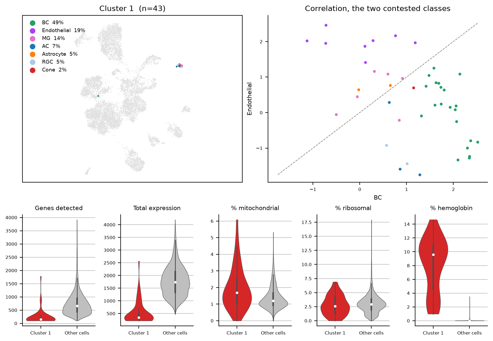

These cells carry a median 9.6% hemoglobin, against effectively none
anywhere else in the batch, on 150 genes detected against 640 and a
third of the total expression. Their per-cell calls divide across BC at
49%, endothelial at 19% and Müller glia at 14%, and on the scatter they
take no particular arrangement. The reference holds twelve neural retina
classes and no erythrocyte.

<details>
<summary>Code</summary>

``` python
# outside the reference on purpose: naming these cells keeps them visible and keeps them out of
# every cell type below, where they would otherwise sit inside whichever class they least
# badly resembled
cell_type = cd73ft_joyal.obs["cell_type"].astype(str)
cell_type[in_cluster] = "Low quality"
cd73ft_joyal.obs["cell_type"] = cell_type
```

</details>

## Resolving cluster 7

One flagged cluster on a single slide. On the left its cells sit on the
embedding, coloured by their own per-cell call, against the rest of the
batch in grey. On the right the same cells are placed by their
correlation with the two classes most of them call, with the diagonal
marking where a cell correlates equally with both. Along the bottom each
QC metric compares the cluster’s cells with every other cell in the
batch.

<details>
<summary>Code</summary>

``` python
cluster_of_interest = "7"        # the v2 number, changed to look at another flagged cluster

in_cluster = (cd73ft_joyal.obs[dendrogram_key] == cluster_of_interest).to_numpy()
calls = cd73ft_joyal.obs["cell_type_per_cell"]
call_palette = dict(zip(sorted(reference_centroids.obs_names), sc.pl.palettes.default_20))

qc_df = sc.get.obs_df(cd73ft_joyal, keys=list(qc_metrics))
qc_df["group"] = np.where(in_cluster, f"Cluster {cluster_of_interest}", "Other cells")
group_order = [f"Cluster {cluster_of_interest}", "Other cells"]
group_palette = dict(zip(group_order, ["#d62728", "#bfbfbf"]))

# the embedding and the two contested correlations across the top, the QC metrics along the
# bottom, so one slide carries the whole case for a cluster. Ten columns, because the five QC
# panels each span two of them
fig, axes = plt.subplot_mosaic(
    [["umap"] * 5 + ["scatter"] * 5,
     [qc_key for qc_key in qc_metrics for _ in range(2)]],
    figsize=(9, 6.2), height_ratios=[1.5, 1], constrained_layout=True,
)

umap_coords = cd73ft_joyal.obsm["X_umap"]
axes["umap"].scatter(umap_coords[:, 0], umap_coords[:, 1], s=1, c="#e0e0e0", linewidths=0)
for cell_class, count in calls[in_cluster].value_counts().items():
    if count == 0:
        continue
    selected = in_cluster & (calls == cell_class).to_numpy()
    share = count / in_cluster.sum()
    axes["umap"].scatter(umap_coords[selected, 0], umap_coords[selected, 1], s=6,
                         c=call_palette[cell_class], linewidths=0,
                         label=f"{cell_class}  {share:.0%}")

axes["umap"].set_title(f"Cluster {cluster_of_interest}  (n={in_cluster.sum():,})", fontsize=10)
axes["umap"].set_aspect("equal", adjustable="datalim")
axes["umap"].set_xticks([])
axes["umap"].set_yticks([])
axes["umap"].legend(title="", fontsize=7, frameon=False, loc="upper left", markerscale=3)

# the two classes most of the cluster's cells call, which is the choice the slide is about.
# Every cell of the cluster placed by how well it correlates with each — two arms off the
# diagonal is two populations, one cloud straddling it is one.
contested = calls[in_cluster].value_counts().index[:2].tolist()
for cell_class, count in calls[in_cluster].value_counts().items():
    if count == 0:
        continue
    selected = in_cluster & (calls == cell_class).to_numpy()
    axes["scatter"].scatter(cd73ft_joyal.obs.loc[selected, f"corr_{contested[0]}"],
                            cd73ft_joyal.obs.loc[selected, f"corr_{contested[1]}"],
                            s=14, c=call_palette[cell_class], linewidths=0)

# the diagonal, where a cell correlates equally with both
span = [
    min(cd73ft_joyal.obs.loc[in_cluster, f"corr_{cell_class}"].min() for cell_class in contested),
    max(cd73ft_joyal.obs.loc[in_cluster, f"corr_{cell_class}"].max() for cell_class in contested),
]
axes["scatter"].plot(span, span, color="#888888", linewidth=0.8, linestyle="--", zorder=0)
axes["scatter"].set_title("Correlation, the two contested classes", fontsize=10)
axes["scatter"].set_xlabel(contested[0], fontsize=8)
axes["scatter"].set_ylabel(contested[1], fontsize=8)
axes["scatter"].tick_params(labelsize=6)
sns.despine(ax=axes["scatter"])

for qc_key, qc_label in qc_metrics.items():
    ax = axes[qc_key]
    sns.violinplot(data=qc_df, x="group", y=qc_key, order=group_order, hue="group",
                   hue_order=group_order, palette=group_palette, legend=False, cut=0,
                   density_norm="width", inner="box", inner_kws=violin_inner_kws,
                   linewidth=0.5, saturation=1, ax=ax)
    ax.set_title(qc_label, fontsize=8)
    ax.set_xlabel("")
    ax.set_ylabel("")
    ax.tick_params(axis="x", labelsize=6)
    ax.tick_params(axis="y", labelsize=6)
    ax.grid(axis="y", color="#b0b0b0", linewidth=0.6)
    ax.set_axisbelow(True)
    sns.despine(ax=ax)

plt.show()
plt.close(fig)
```

</details>

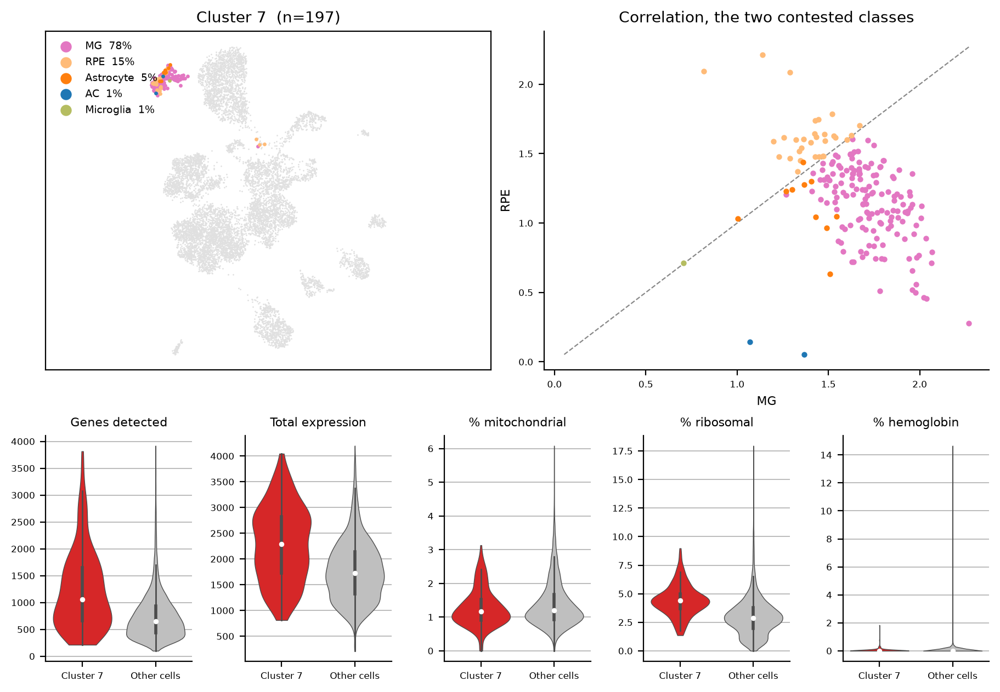

Müller glia take 78% of this cluster and RPE 15%. The RPE-called cells
correlate with RPE at 1.64, against 1.12 for the rest of the cluster,
and with Müller glia at 1.39, against 1.70. On the embedding they are
more spread out than the cells around them, at a standard deviation of
2.55 and 1.60 against 0.89 and 0.72. They carry a median 1,298 genes
against the cluster’s 1,032.

<details>
<summary>Code</summary>

``` python
# not a mixture: the RPE-leaning cells are dispersed through the cluster rather than sitting
# apart from it, and they carry the Muller glia signature as strongly as the RPE one
cell_type = cd73ft_joyal.obs["cell_type"].astype(str)
cell_type[in_cluster] = "MG"
cd73ft_joyal.obs["cell_type"] = cell_type
```

</details>

## Resolving cluster 12

One flagged cluster on a single slide. On the left its cells sit on the
embedding, coloured by their own per-cell call, against the rest of the
batch in grey. On the right the same cells are placed by their
correlation with the two classes most of them call, with the diagonal
marking where a cell correlates equally with both. Along the bottom each
QC metric compares the cluster’s cells with every other cell in the
batch.

<details>
<summary>Code</summary>

``` python
cluster_of_interest = "12"        # the v2 number, changed to look at another flagged cluster

in_cluster = (cd73ft_joyal.obs[dendrogram_key] == cluster_of_interest).to_numpy()
calls = cd73ft_joyal.obs["cell_type_per_cell"]
call_palette = dict(zip(sorted(reference_centroids.obs_names), sc.pl.palettes.default_20))

qc_df = sc.get.obs_df(cd73ft_joyal, keys=list(qc_metrics))
qc_df["group"] = np.where(in_cluster, f"Cluster {cluster_of_interest}", "Other cells")
group_order = [f"Cluster {cluster_of_interest}", "Other cells"]
group_palette = dict(zip(group_order, ["#d62728", "#bfbfbf"]))

# the embedding and the two contested correlations across the top, the QC metrics along the
# bottom, so one slide carries the whole case for a cluster. Ten columns, because the five QC
# panels each span two of them
fig, axes = plt.subplot_mosaic(
    [["umap"] * 5 + ["scatter"] * 5,
     [qc_key for qc_key in qc_metrics for _ in range(2)]],
    figsize=(9, 6.2), height_ratios=[1.5, 1], constrained_layout=True,
)

umap_coords = cd73ft_joyal.obsm["X_umap"]
axes["umap"].scatter(umap_coords[:, 0], umap_coords[:, 1], s=1, c="#e0e0e0", linewidths=0)
for cell_class, count in calls[in_cluster].value_counts().items():
    if count == 0:
        continue
    selected = in_cluster & (calls == cell_class).to_numpy()
    share = count / in_cluster.sum()
    axes["umap"].scatter(umap_coords[selected, 0], umap_coords[selected, 1], s=6,
                         c=call_palette[cell_class], linewidths=0,
                         label=f"{cell_class}  {share:.0%}")

axes["umap"].set_title(f"Cluster {cluster_of_interest}  (n={in_cluster.sum():,})", fontsize=10)
axes["umap"].set_aspect("equal", adjustable="datalim")
axes["umap"].set_xticks([])
axes["umap"].set_yticks([])
axes["umap"].legend(title="", fontsize=7, frameon=False, loc="upper left", markerscale=3)

# the two classes most of the cluster's cells call, which is the choice the slide is about.
# Every cell of the cluster placed by how well it correlates with each — two arms off the
# diagonal is two populations, one cloud straddling it is one.
contested = calls[in_cluster].value_counts().index[:2].tolist()
for cell_class, count in calls[in_cluster].value_counts().items():
    if count == 0:
        continue
    selected = in_cluster & (calls == cell_class).to_numpy()
    axes["scatter"].scatter(cd73ft_joyal.obs.loc[selected, f"corr_{contested[0]}"],
                            cd73ft_joyal.obs.loc[selected, f"corr_{contested[1]}"],
                            s=14, c=call_palette[cell_class], linewidths=0)

# the diagonal, where a cell correlates equally with both
span = [
    min(cd73ft_joyal.obs.loc[in_cluster, f"corr_{cell_class}"].min() for cell_class in contested),
    max(cd73ft_joyal.obs.loc[in_cluster, f"corr_{cell_class}"].max() for cell_class in contested),
]
axes["scatter"].plot(span, span, color="#888888", linewidth=0.8, linestyle="--", zorder=0)
axes["scatter"].set_title("Correlation, the two contested classes", fontsize=10)
axes["scatter"].set_xlabel(contested[0], fontsize=8)
axes["scatter"].set_ylabel(contested[1], fontsize=8)
axes["scatter"].tick_params(labelsize=6)
sns.despine(ax=axes["scatter"])

for qc_key, qc_label in qc_metrics.items():
    ax = axes[qc_key]
    sns.violinplot(data=qc_df, x="group", y=qc_key, order=group_order, hue="group",
                   hue_order=group_order, palette=group_palette, legend=False, cut=0,
                   density_norm="width", inner="box", inner_kws=violin_inner_kws,
                   linewidth=0.5, saturation=1, ax=ax)
    ax.set_title(qc_label, fontsize=8)
    ax.set_xlabel("")
    ax.set_ylabel("")
    ax.tick_params(axis="x", labelsize=6)
    ax.tick_params(axis="y", labelsize=6)
    ax.grid(axis="y", color="#b0b0b0", linewidth=0.6)
    ax.set_axisbelow(True)
    sns.despine(ax=ax)

plt.show()
plt.close(fig)
```

</details>

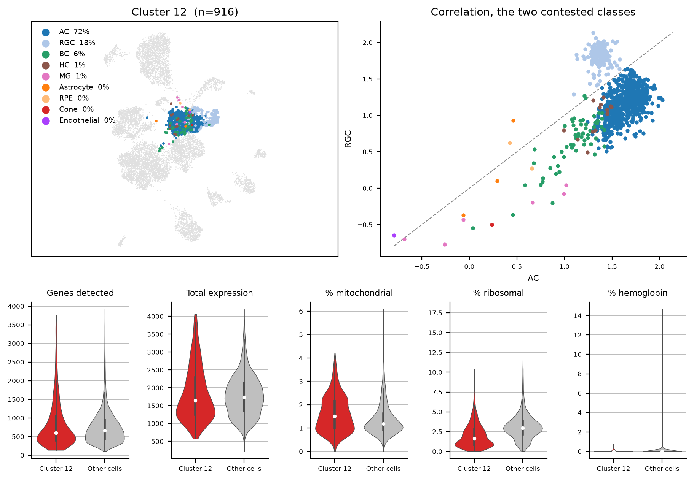

Amacrine cells take 72% of this cluster, retinal ganglion cells 18% and
bipolar cells 6%. The RGC cells sit as their own cloud above the
amacrine mass on the scatter, and as their own lobe on the edge of the
cluster on the embedding. The BC-called cells continue off the other
side of the amacrine cloud.

<details>
<summary>Code</summary>

``` python
# the BC-called cells go with their own call too. They are a fringe rather than a population,
# but there are fifty of them and no reason to prefer this cluster's majority to what each of
# them says about itself
cell_type = cd73ft_joyal.obs["cell_type"].astype(str)
cell_type[in_cluster] = cd73ft_joyal.obs["cell_type_per_cell"].astype(str)[in_cluster]
cd73ft_joyal.obs["cell_type"] = cell_type
```

</details>

## Resolving cluster 14

One flagged cluster on a single slide. On the left its cells sit on the
embedding, coloured by their own per-cell call, against the rest of the
batch in grey. On the right the same cells are placed by their
correlation with the two classes most of them call, with the diagonal
marking where a cell correlates equally with both. Along the bottom each
QC metric compares the cluster’s cells with every other cell in the
batch.

<details>
<summary>Code</summary>

``` python
cluster_of_interest = "14"        # the v2 number, changed to look at another flagged cluster

in_cluster = (cd73ft_joyal.obs[dendrogram_key] == cluster_of_interest).to_numpy()
calls = cd73ft_joyal.obs["cell_type_per_cell"]
call_palette = dict(zip(sorted(reference_centroids.obs_names), sc.pl.palettes.default_20))

qc_df = sc.get.obs_df(cd73ft_joyal, keys=list(qc_metrics))
qc_df["group"] = np.where(in_cluster, f"Cluster {cluster_of_interest}", "Other cells")
group_order = [f"Cluster {cluster_of_interest}", "Other cells"]
group_palette = dict(zip(group_order, ["#d62728", "#bfbfbf"]))

# the embedding and the two contested correlations across the top, the QC metrics along the
# bottom, so one slide carries the whole case for a cluster. Ten columns, because the five QC
# panels each span two of them
fig, axes = plt.subplot_mosaic(
    [["umap"] * 5 + ["scatter"] * 5,
     [qc_key for qc_key in qc_metrics for _ in range(2)]],
    figsize=(9, 6.2), height_ratios=[1.5, 1], constrained_layout=True,
)

umap_coords = cd73ft_joyal.obsm["X_umap"]
axes["umap"].scatter(umap_coords[:, 0], umap_coords[:, 1], s=1, c="#e0e0e0", linewidths=0)
for cell_class, count in calls[in_cluster].value_counts().items():
    if count == 0:
        continue
    selected = in_cluster & (calls == cell_class).to_numpy()
    share = count / in_cluster.sum()
    axes["umap"].scatter(umap_coords[selected, 0], umap_coords[selected, 1], s=6,
                         c=call_palette[cell_class], linewidths=0,
                         label=f"{cell_class}  {share:.0%}")

axes["umap"].set_title(f"Cluster {cluster_of_interest}  (n={in_cluster.sum():,})", fontsize=10)
axes["umap"].set_aspect("equal", adjustable="datalim")
axes["umap"].set_xticks([])
axes["umap"].set_yticks([])
axes["umap"].legend(title="", fontsize=7, frameon=False, loc="upper left", markerscale=3)

# the two classes most of the cluster's cells call, which is the choice the slide is about.
# Every cell of the cluster placed by how well it correlates with each — two arms off the
# diagonal is two populations, one cloud straddling it is one.
contested = calls[in_cluster].value_counts().index[:2].tolist()
for cell_class, count in calls[in_cluster].value_counts().items():
    if count == 0:
        continue
    selected = in_cluster & (calls == cell_class).to_numpy()
    axes["scatter"].scatter(cd73ft_joyal.obs.loc[selected, f"corr_{contested[0]}"],
                            cd73ft_joyal.obs.loc[selected, f"corr_{contested[1]}"],
                            s=14, c=call_palette[cell_class], linewidths=0)

# the diagonal, where a cell correlates equally with both
span = [
    min(cd73ft_joyal.obs.loc[in_cluster, f"corr_{cell_class}"].min() for cell_class in contested),
    max(cd73ft_joyal.obs.loc[in_cluster, f"corr_{cell_class}"].max() for cell_class in contested),
]
axes["scatter"].plot(span, span, color="#888888", linewidth=0.8, linestyle="--", zorder=0)
axes["scatter"].set_title("Correlation, the two contested classes", fontsize=10)
axes["scatter"].set_xlabel(contested[0], fontsize=8)
axes["scatter"].set_ylabel(contested[1], fontsize=8)
axes["scatter"].tick_params(labelsize=6)
sns.despine(ax=axes["scatter"])

for qc_key, qc_label in qc_metrics.items():
    ax = axes[qc_key]
    sns.violinplot(data=qc_df, x="group", y=qc_key, order=group_order, hue="group",
                   hue_order=group_order, palette=group_palette, legend=False, cut=0,
                   density_norm="width", inner="box", inner_kws=violin_inner_kws,
                   linewidth=0.5, saturation=1, ax=ax)
    ax.set_title(qc_label, fontsize=8)
    ax.set_xlabel("")
    ax.set_ylabel("")
    ax.tick_params(axis="x", labelsize=6)
    ax.tick_params(axis="y", labelsize=6)
    ax.grid(axis="y", color="#b0b0b0", linewidth=0.6)
    ax.set_axisbelow(True)
    sns.despine(ax=ax)

plt.show()
plt.close(fig)
```

</details>

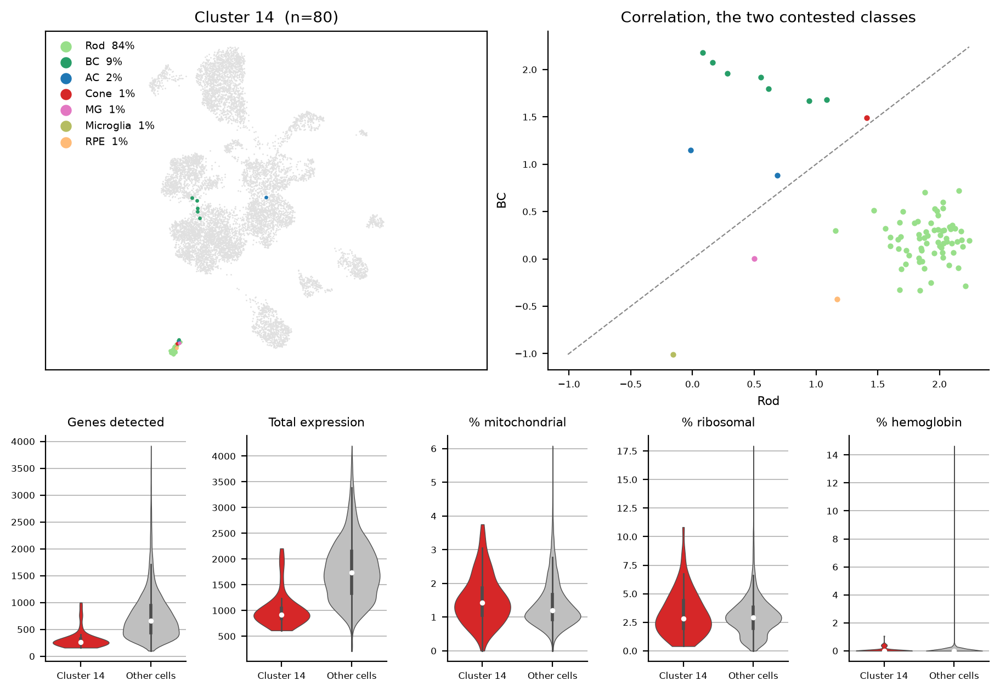

Rods take 84% of this cluster and bipolar cells 9%. The rod-called cells
are one cloud on the scatter. The cluster carries a median 250 genes
against 640 for the batch. The seven BC-called cells sit away from the
rest of the cluster on the embedding, among the bipolar territory.

<details>
<summary>Code</summary>

``` python
# the seven BC-called cells are not with this cluster on the embedding at all, so nothing here
# argues for splitting it — they are stragglers the clustering placed badly
cell_type = cd73ft_joyal.obs["cell_type"].astype(str)
cell_type[in_cluster] = "Rod"
cd73ft_joyal.obs["cell_type"] = cell_type
```

</details>

## Cell types on the UMAP

The cell types after the resolutions above, which is the annotation
every figure below reads. A cluster nobody has resolved yet is still
Ambiguous, in grey.

<details>
<summary>Code</summary>

``` python
# Ambiguous last, so it sits at the end of the legend rather than alphabetically among the
# classes; a class that no longer has any cells drops out on its own
cell_types = sorted(set(cd73ft_joyal.obs["cell_type"]) - {"Ambiguous"})
if "Ambiguous" in set(cd73ft_joyal.obs["cell_type"]):
    cell_types.append("Ambiguous")

cd73ft_joyal.obs["cell_type"] = pd.Categorical(cd73ft_joyal.obs["cell_type"], categories=cell_types)

cell_type_palette = dict(zip(sorted(reference_centroids.obs_names), sc.pl.palettes.default_20))
cell_type_palette["Ambiguous"] = "#cccccc"
cell_type_palette["Low quality"] = "#7f7f7f"   # a hand label, darker than unresolved
cd73ft_joyal.uns["cell_type_colors"] = [cell_type_palette[cell_type] for cell_type in cell_types]

plt.rcParams["figure.figsize"] = (6.5, 4.3)

ax = sc.pl.umap(
    cd73ft_joyal,
    color="cell_type",
    frameon=True,
    show=False,
)
ax.set_aspect("equal", adjustable="datalim")
plt.show()
```

</details>

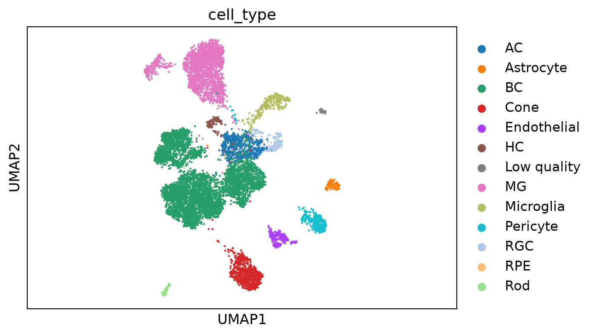

## Txn1 across the design

Txn1 on the UMAP once per group in the design, with timepoint down the
rows and condition across the columns. Each panel draws every cell in
the batch in grey and then its own group’s cells in colour, on a log1p
Txn1 scale shared by all four panels and given in the colourbar on the
right. The number in each panel’s corner is how many cells that group
has.

<details>
<summary>Code</summary>

``` python
# laid out like the violin slides below: timepoint down the rows, condition across the
# columns, so the same comparison sits in the same direction in every Txn1 figure
condition_order = list(cd73ft_joyal.obs["condition"].cat.categories)
timepoints = list(cd73ft_joyal.obs["timepoint"].cat.categories)

umap_coords = cd73ft_joyal.obsm["X_umap"]
txn1 = sc.get.obs_df(cd73ft_joyal, keys=["TXN1"])["TXN1"].to_numpy()
txn1_low, txn1_high = txn1.min(), txn1.max()

# drawn with scatter rather than sc.pl.umap: it puts the whole embedding underneath in grey,
# and it fixes the point size, which scanpy scales by cell count — the sparse panels would
# otherwise carry much larger points than the dense ones.
fig, axes = plt.subplots(len(timepoints), len(condition_order), squeeze=False,
                         figsize=(5.6, 4.4), constrained_layout=True)
fig.get_layout_engine().set(w_pad=0.01, h_pad=0.01, wspace=0.01, hspace=0.02)
for row, timepoint in enumerate(timepoints):
    for column, condition in enumerate(condition_order):
        ax = axes[row][column]
        in_stratum = (
            (cd73ft_joyal.obs["timepoint"] == timepoint) & (cd73ft_joyal.obs["condition"] == condition)
        ).to_numpy()

        # every cell in grey, so each panel is read against the same outline rather than
        # appearing to be a differently-shaped dataset
        ax.scatter(umap_coords[:, 0], umap_coords[:, 1], s=1, c="#bfbfbf", linewidths=0)
        points = ax.scatter(umap_coords[in_stratum, 0], umap_coords[in_stratum, 1], s=1,
                            c=txn1[in_stratum], cmap="viridis",
                            vmin=txn1_low, vmax=txn1_high, linewidths=0)

        ax.set_aspect("equal", adjustable="datalim")
        ax.set_ylabel(f"Txn1 — {timepoint}" if column == 0 else "", fontsize=8)
        ax.set_title(condition if row == 0 else "", fontsize=9)
        ax.text(0.02, 0.98, f"n={in_stratum.sum():,}", transform=ax.transAxes,
                va="top", ha="left", fontsize=7)
        ax.set_xticks([])
        ax.set_yticks([])

colorbar = fig.colorbar(points, ax=axes, location="right", shrink=0.35, pad=0.02, aspect=25)
colorbar_ticks = np.linspace(txn1_low, txn1_high, 3)
colorbar.set_ticks(colorbar_ticks, labels=[f"{tick:.2f}" for tick in colorbar_ticks])
colorbar.ax.tick_params(labelsize=7)

plt.show()
plt.close(fig)
```

</details>

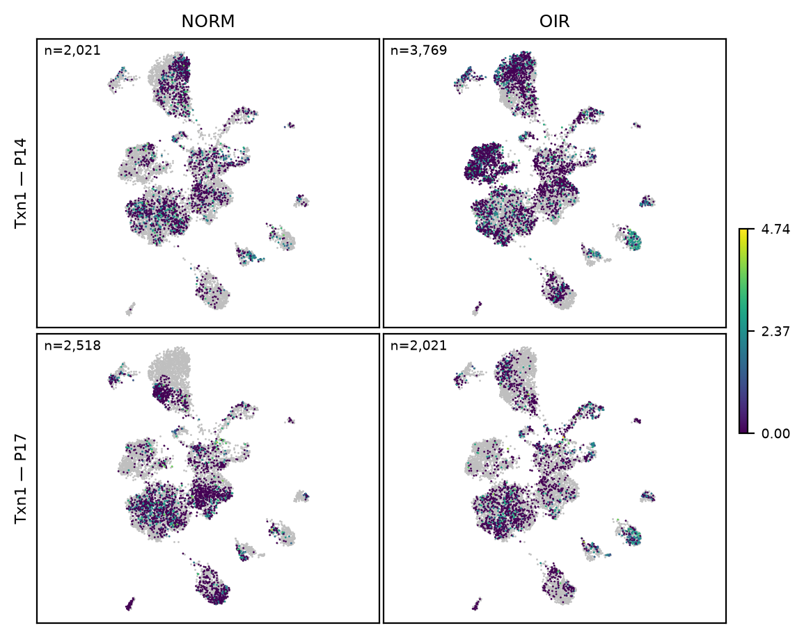

## Txn1 by cell type across the design

Txn1 by cell type across the whole design. Each cell type’s slot holds
NORM and OIR side by side, coloured by condition, and the two rows are
the two timepoints, drawn on a shared y axis.

<details>
<summary>Code</summary>

``` python
txn1_df = sc.get.obs_df(
    cd73ft_joyal, keys=["TXN1", "cell_type", "condition", "timepoint"]
)

# the low quality cluster is contamination and debris rather than a cell type, so it is left
# out of the expression figures instead of standing beside the real classes as though it were
# one. Whole retina has no such cluster, and the filter does nothing there.
txn1_df = txn1_df[txn1_df["cell_type"] != "Low quality"]

# the reference classes on the colours they carry throughout, and Ambiguous grey —
# those cells are drawn rather than dropped, so a figure never quietly loses them
cell_type_palette = dict(
    zip(sorted(reference_centroids.obs_names), sc.pl.palettes.default_20)
)
cell_type_palette["Ambiguous"] = "#cccccc"
condition_palette = dict(zip(cd73ft_joyal.obs["condition"].cat.categories,
                             cd73ft_joyal.uns["condition_colors"]))

# cell types ordered by their mean Txn1, highest first
cell_type_order = (
    txn1_df.groupby("cell_type", observed=True)["TXN1"]
    .mean()
    .sort_values(ascending=False)
    .index.tolist()
)

condition_order = list(cd73ft_joyal.obs["condition"].cat.categories)
timepoints = list(cd73ft_joyal.obs["timepoint"].cat.categories)

# grouped violins rather than four panels: NORM and OIR sit side by side within each cell
# type's slot, so the comparison is a glance rather than a jump between figures. Timepoint is
# the facet, which leaves the interaction readable down a column.
fig, axes = plt.subplots(len(timepoints), 1, squeeze=False, sharex=True, sharey=True,
                         figsize=(9, 5.0), constrained_layout=True)
for row, (ax, timepoint) in enumerate(zip(axes.flat, timepoints)):
    at_timepoint = txn1_df[txn1_df["timepoint"] == timepoint]
    sns.violinplot(data=at_timepoint, x="cell_type", y="TXN1", order=cell_type_order,
                   hue="condition", hue_order=condition_order, palette=condition_palette,
                   gap=0.1, cut=0, density_norm="width", inner="box",
                   inner_kws=violin_inner_kws, linewidth=0.5, saturation=1,
                   legend=(row == 0), ax=ax)
    ax.set_ylabel(f"Txn1 — {timepoint}", fontsize=8)
    ax.set_xlabel("")
    ax.tick_params(axis="y", labelsize=6)
    ax.grid(axis="y", color="#b0b0b0", linewidth=0.6)
    ax.set_axisbelow(True)
    sns.despine(ax=ax)

axes[0][0].legend(title="", fontsize=7, frameon=False,
                  loc="center left", bbox_to_anchor=(1.0, 0.5))
axes[-1][0].tick_params(axis="x", labelrotation=45, labelsize=8)
for label in axes[-1][0].get_xticklabels():
    label.set_ha("right")

plt.show()
plt.close(fig)
```

</details>

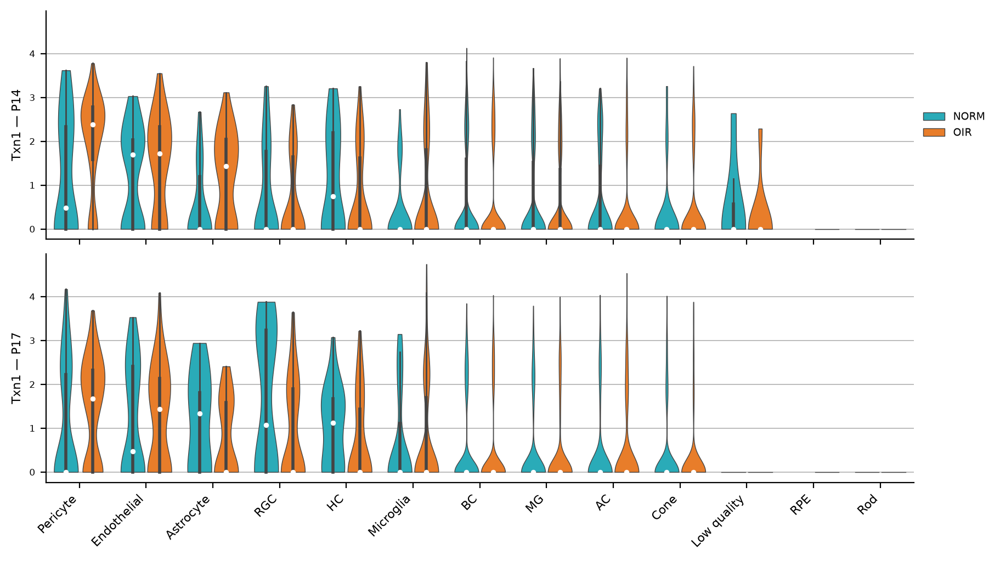

## Txn1 by cell type across the design, grouped by timepoint

The same data with the roles swapped: each cell type’s slot holds P14
and P17 side by side, coloured by timepoint, and the two rows are the
two conditions.

<details>
<summary>Code</summary>

``` python
# cell types ordered by their mean Txn1, highest first
cell_type_order = (
    txn1_df.groupby("cell_type", observed=True)["TXN1"]
    .mean()
    .sort_values(ascending=False)
    .index.tolist()
)

timepoint_palette = dict(zip(cd73ft_joyal.obs["timepoint"].cat.categories,
                             cd73ft_joyal.uns["timepoint_colors"]))

# the same data with the roles swapped: P14 and P17 side by side within each cell type, and
# condition as the facet. Reading down a column here compares the two timepoints within a
# condition, where the plot above compares the two conditions within a timepoint.
fig, axes = plt.subplots(len(condition_order), 1, squeeze=False, sharex=True, sharey=True,
                         figsize=(9, 5.0), constrained_layout=True)
for row, (ax, condition) in enumerate(zip(axes.flat, condition_order)):
    in_condition = txn1_df[txn1_df["condition"] == condition]
    sns.violinplot(data=in_condition, x="cell_type", y="TXN1", order=cell_type_order,
                   hue="timepoint", hue_order=timepoints, palette=timepoint_palette,
                   gap=0.1, cut=0, density_norm="width", inner="box",
                   inner_kws=violin_inner_kws, linewidth=0.5, saturation=1,
                   legend=(row == 0), ax=ax)
    ax.set_ylabel(f"Txn1 — {condition}", fontsize=8)
    ax.set_xlabel("")
    ax.tick_params(axis="y", labelsize=6)
    ax.grid(axis="y", color="#b0b0b0", linewidth=0.6)
    ax.set_axisbelow(True)
    sns.despine(ax=ax)

axes[0][0].legend(title="", fontsize=7, frameon=False,
                  loc="center left", bbox_to_anchor=(1.0, 0.5))
axes[-1][0].tick_params(axis="x", labelrotation=45, labelsize=8)
for label in axes[-1][0].get_xticklabels():
    label.set_ha("right")

plt.show()
plt.close(fig)
```

</details>

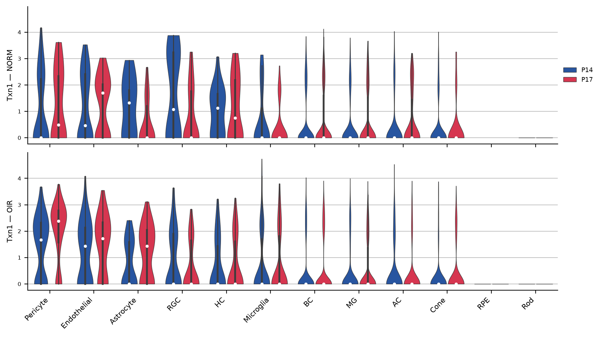
